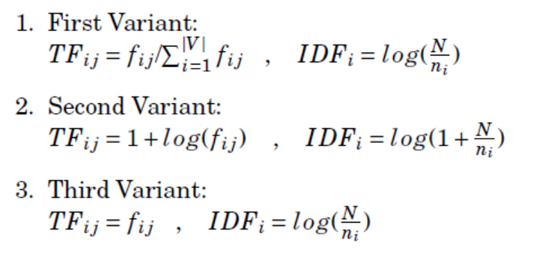
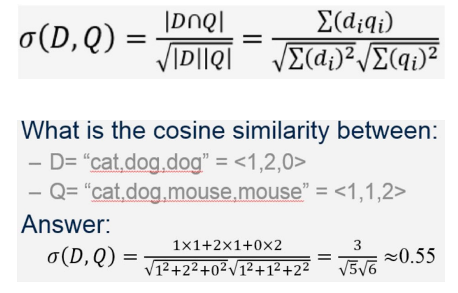

# R - Information Retrieval

[Back](../index.md)

- [R - Information Retrieval](#r---information-retrieval)
  - [Vector Space Model](#vector-space-model)
  - [TF-IDF](#tf-idf)
    - [Computing TF-IDF](#computing-tf-idf)
    - [TF-IDF variants](#tf-idf-variants)
  - [Cosine Similarity](#cosine-similarity)
  - [Text Preprocessing](#text-preprocessing)

---

## Vector Space Model

- `Vector Space Model` / `term vector model`

  - an algebraic model for **representing text documents as vectors** such that the **distance** between vectors represents the relevance between the documents.

- Assume `t` distinct terms,each term `i` in a document or query `j`, is given a weight `wij`.

  - Both documents and queries are expressed as vectors:
  - `dj = (w1j, w2j, …, wtj)`
  - `q = (w1q, w2q, …, wnq)`

- The **document term weight** `wij` is represented based on some variation of the `TF (term frequency)` or `TF-IDF (term frequency-inverse document frequency)` scheme.

---

## TF-IDF

- `Term Frequency-Inverse Document Frequency` / `TF-IDF`

  - a statistical weight measure that is used to **evaluate the importance of a document word** in a collection of documents.

- The idea is that, terms that capture the essence of a document occur frequently in the document (that is, their `TF` is high), but if such a term is good in discriminating the document from others, it must occur in only a few documents in the **general population** (that is, its `IDF` should be high as well).

- `TF`: the essence of a term occur frequently in the document 某个字符在某个文档中出现的频率
- `IDF`: a term must occur in only a few documents in the **general population** 某个字符在少数文档出现的频率

---

### Computing TF-IDF

- `Term Frequency`:

  - TF of a term or word
  - the number of times the term appears in a document compared to the total number of words in the document.

  - `TFij` = `number of times the term i in the doc j` / `total number of terms in doc j`

- `Inverse Document Frequency`:

  - IDF of a term reflects the **proportion of documents** in the corpus that **contain the term**.
  - Words unique to a small percentage of documents (e.g., technical jargon terms) **receive higher importance values than words common** across all documents (e.g., a, the, and).
  - `IDFi` = `log(number of doc / number of doc contain term i)`

- `TF-IDF` = `TF` \* `IDF`
  - importance of a term is **high** when it occurs **a lot in a given document** and **rarely in others**.
  - In short, commonality within a document measured by TF is balanced by rarity between documents measured by IDF.
  - TF-IDF score reflects the **importance of a term for a document in the corpus**.

---

### TF-IDF variants

- 1st:

  - `TFi` = `numi/sum`, `numi`: number of term i; `sum`: number of total term.
  - `IDF` = `log(N/ni)`, `N`: number of doc; `ni`: number of doc contain term i.

- 2nd:

  - `TFi` = `1 + log(numi/sum)`
  - `IDF` = `log(1 + N/ni)`, `N`: number of doc; `ni`: number of doc contain term i.

- 3rd:
  - `TFi` = `numi/sum`
  - `IDF` = `log(N/ni)`

---

## Cosine Similarity

- `Cosine measure`
  - computed as the normalized **dot product of two documents**
  - measures the similarity between two vectors of an inner product space.

---

## Text Preprocessing

1. Word separation, sentence splitting
2. Change terms to a standard form (e.g. lowercase)
3. Eliminate stop words (e.g., a, and, of, to, at, is, the, ...)
4. Stem terms to their base form (e.g., eliminate prefixes, suffixes)
5. Construct mapping between terms and documents (indexing)

---

[TOP](#r---information-retrieval)
