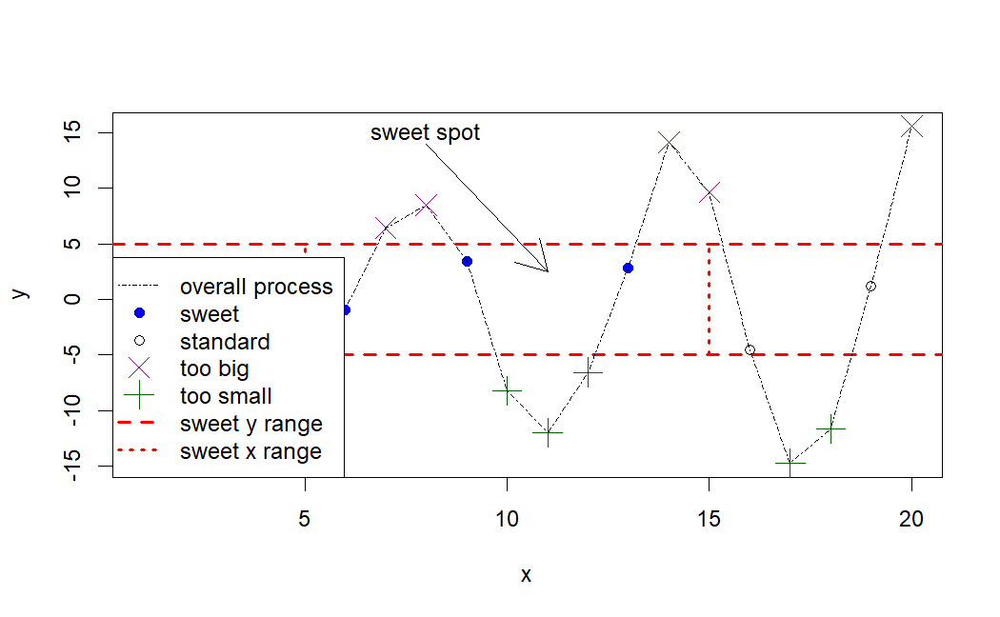

# R - Data Visualization

[Back](../index.md)

- [R - Data Visualization](#r---data-visualization)
  - [Data Visualization](#data-visualization)
  - [Graphics Devices](#graphics-devices)
  - [Plotting Commands](#plotting-commands)
  - [Basic](#basic)
    - [plot()](#plot)
  - [`ggplot2` package](#ggplot2-package)
    - [Bar plot](#bar-plot)
    - [Boxplot](#boxplot)
    - [Pie chart](#pie-chart)
    - [Histogram](#histogram)
    - [Faceting](#faceting)
    - [Density plot](#density-plot)
    - [Customized](#customized)
  - [ggplot2 - Base R](#ggplot2---base-r)
  - [Lattice](#lattice)

---

## Data Visualization

- R graphs can be produced in three ways
  - 1. **base R** graphics (Comes with the installation of R), the original plotting framework
  - 2. `lattice` graphics (Comes with the installation of R but **needs to load it explicitly**)
  - 3. `ggplot2` (Requires installation)

---

## Graphics Devices

- `Graphics Devices`

  - something where we can make a plot to appear.
  - can be
    - a window on your computer (screen device),
    - a PDF file (file device),
    - a Scalable Vector Graphics (SVG) file (file device),
    - or a PNG or JPEG file (file device).

- Several devices can be open at the same time, but there will be only one active device.活跃唯一.

---

- `Graphic parameters`

  - used to **customize almost every aspect of the display**

- A separate list of `graphics parameters` is maintained for **each active device**

  - each device has a **default** set of parameters when initialized

- Graphics parameters can be set in two ways:
  - **Permanently**, affecting **all graphics functions** which access the current device
    - par()
  - **Temporarily**, affecting **only a single graphics** function call
    - Arguments to graphics functions

---

- key elements
  - 1. Data
  - 2. Aesthetic Mappings
    - controls the relation between graphics variables and data variables.
  - 3. Geometric Objects
    - maps two variables in the data set into the x,y variables of the plot.
  - 4. Statistical Transformations
    - calculate the statistical analysis of the data in the plot
  - 5. Scales
    - map the data values into values present in the coordinate system
  - 6. Coordinate system
  - 7. Faceting
    - split the data into subgroups and draw sub-graphs for each group.

---

## Plotting Commands

- Plotting commands are divided into three basic groups:
  - `High-level plotting functions` **create a new plot** on the graphics device, possibly with **axes**, **labels**, **titles** and so on
  - i.e. plot(), hist(), dotchart(), barplot(), pie()...
- `Low-level plotting functions` **add more information** to an existing plot, such as extra points, lines and labels.
  - i.e. legend(), title(), points(), axis(), text(), mtext()...
- `Interactive graphics functions` allow you **interactively add information** to, or **extract information** from, an existing plot, using a pointing device such as a mouse.
  - locator(), identify() …

---

## Basic

### plot()

- `plot()`
  - Generic function for plotting

```r
?plot() # to check the arguments

x <- c(1.1,2,3.5,3.9,4.2)
y <- c(2,2.2,-1.3,0,0.2)
plot(x,y)       # scatterplot散点图

plot(x,y, type = 'l')       # plot type to line
plot(x,y, type = 'b')       # plot type to both line and points
plot(
    x,y,
    type = 'b',
    main = "Plotting both points and line"      # plot title
    )

plot(
    x,y, type = 'b',
    main = "Plotting both points and line",
    xlab = "Vector X",          # labels of x-axis and y-axis
    ylab = "Vector Y"
    )

plot(
    x,y, type = 'b',
    main = "Plotting both points and line",
    xlab = "Vector X",
    ylab = "Vector Y",
    sub = "Plotting Charts with plot() function"        # subtitle
    )

plot(
    x,y, type = 'b',
    main = "Plotting both points and line",
    xlab = "Vector X",
    ylab = "Vector Y",
    sub = "Plotting Charts with plot()function",
    col = 2     # color
    )

plot(
    x,y,
    type="b",
    main="Customized Plot",
    xlab="",        # no x-axis
    ylab="",        # no y-axis
    col=4,          # controls the color
    pch=8,          # controls the character/shape
    lty=2,          # controls the line type
    lwd=3.3,        # lines width: double-thick
    cex=2.3,        # controls the size of the point
    )

```

- Customized

```r
x <- 1:20
y <- c(-1.49,3.37,2.59,-2.78,-3.94,-0.92,6.43,8.51,3.41,-8.23,-12.01,-6.58,2.87,14.12,9.63,-4.58,-14.78,-11.67,1.17,15.62)
plot(x,y, type="n", main="")    # type=n: no plotting
abline(h=c(-5,5),col="red",lty=2,lwd=2)     # Add a styled straight line to a plot
    # h: horizontal, vertical positions for line
    # col: color
    # lty: line type
    # lwd: line width,
segments(               # Draw line segments between pairs of points.
  x0=c(5,15),           # coordinates of points from which to draw.
  y0=c(-5,-5),
  x1=c(5,15),           # coordinates of points to which to draw. At least one must be supplied.
  y1=c(5,5),
  col="red",            # color
  lty=3,
  lwd=2
)

points(                 # Add Points to a Plot
  x[y>=5],              # coordinate vectors of points to plot.
  y[y>=5],
  pch=4,                # plotting ‘character
  col="darkmagenta",
  cex=2                 # character (or symbol) expansion
)
points(x[y<=-5],y[y<=-5],pch=3,col="darkgreen" ,cex=2)
points(x[(x>=5&x<=15)&(y>-5&y<5)],y[(x>=5&x<=15)&(y>-5&y<5)],pch=19, col="blue")
points(x[(x<5|x>15)&(y>-5&y<5)],y[(x<5|x>15)&(y>-5&y<5)])
lines(x,y,lty=4)        # Add Connected Line Segments to a Plot
arrows(                 # Add Arrows to a Plot
    x0=8,y0=14,x1=11,y1=2.5
)
text(                               # Add Text to a Plot
    x=8,y=15,labels="sweet spot"
)
legend(
  "bottomleft",
  # a character or expression vector of length to appear in the legend.
  legend=c("overall process","sweet","standard", "too big","too small","sweet y range","sweet x range"),
  # plotting ‘character’
  pch=c(NA,19,1,4,3,NA,NA),
  # line type
  lty=c(4,NA,NA,NA,NA,2,3),
  col=c("black","blue","black", "darkmagenta","darkgreen","red","red"),
  lwd=c(1,NA,NA,NA,NA,2,2),
  # expansion factor(s) for the points.
  pt.cex=c(NA,1,1,2,2,NA,NA)
)
```



---

## `ggplot2` package

- The gg stands for `grammar of graphics`

  - It is built on the **grammar of graphics framework**, which provides a systematic approach to constructing and customizing visualizations by breaking them down into components like **data**, **aesthetic mappings**, and **geometric objects**

- `ggplot2` follows a **layered** approach to building plots, allowing users to add and modify different components (layers) to create complex and informative visualizations.
- ggplot2 offers extensive customization options

```r
x <- c(1.1,2,3.5,3.9,4.2)
y <- c(2,2.2,-1.3,0,0.2)

# scatterplots
ggplot(                         # # Create a new ggplot
    data = data.frame(x, y),      # Default dataset to use for plot.
    mapping = aes(x, y)           # mapping: Default list of aesthetic mappings to use for plot.
                                  # aes: Construct aesthetic mappings
    ) +
    geom_point()                    # geom_point: create scatterplots

# Line plot
ggplot(data = data.frame(x, y), aes(x, y)) +
    geom_line()


# Both line and points
ggplot(data = data.frame(x, y), aes(x, y)) +
    geom_point() +                          # scatterplots
    geom_line(                              # Line plot
        mapping = aes(group=1),
        color="black",
        lty=1
    )


# color of the points and line
ggplot(data = data.frame(x, y), aes(x, y)) +
    geom_point(
        color="red"
    ) +
geom_line(
    mapping = aes(group=1),
    color="red",
    lty=1                           # line type
)


# plot title
ggplot(data = data.frame(x, y), aes(x, y)) +
    geom_point(color="red") +
    geom_line(aes(group=1),color="red",lty=1) +
    labs(
    title = "Plotting both points and line"      # Title
)


# labels to x-axis and y-axis
ggplot(data = data.frame(x, y), aes(x, y)) +
  geom_point(color="red") +
  geom_line(aes(group=1),color="red",lty=1) +
  labs(title = "Plotting both points and line") +
  scale_x_continuous("Vector X") +               # X label
  scale_y_continuous("Vector Y")                 # Y label


# subtitle
ggplot(data = data.frame(x, y), aes(x, y)) +
  geom_point(color="red") +
  geom_line(aes(group=1),color="red",lty=1) +
  labs(
    title = "Plotting both points and line",                    # title
    subtitle = "Plotting Charts with ggplot() function") +      # subtitle
  scale_x_continuous("Vector X") +
  scale_y_continuous("Vector Y")


# Customizing
ggplot(data = data.frame(x, y), aes(x, y)) +
    geom_point(shape=8, size=2.3, color=4) +          # points
    geom_line(aes(group=1),color=4,lty=2, lwd=1) +    # line
    labs(
        title = "Plotting both points and line",
        subtitle = "Plotting Charts with ggplot() function"
    ) +
    scale_x_continuous("Vector X") +
    scale_y_continuous("Vector Y")

```


---

### Bar plot

```r
str(mtcars)

# $ mpg : num  21 21 22.8 21.4 18.7 18.1 14.3 24.4 22.8 19.2 ...
#  $ cyl : num  6 6 4 6 8 6 8 4 4 6 ...
#  $ disp: num  160 160 108 258 360 ...
#  $ hp  : num  110 110 93 110 175 105 245 62 95 123 ...
#  $ drat: num  3.9 3.9 3.85 3.08 3.15 2.76 3.21 3.69 3.92 3.92 ...
#  $ wt  : num  2.62 2.88 2.32 3.21 3.44 ...
#  $ qsec: num  16.5 17 18.6 19.4 17 ...
#  $ vs  : num  0 0 1 1 0 1 0 1 1 1 ...
#  $ am  : num  1 1 1 0 0 0 0 0 0 0 ...
#  $ gear: num  4 4 4 3 3 3 3 4 4 4 ...
#  $ carb: num  4 4 1 1 2 1 4 2 2 4 ...

ggplot(
    mtcars,
    aes(
        x=as.factor(cyl),       # x-axis: catagories of cyl column
        fill=as.factor(cyl)
    )) +
    geom_bar()              # Bar charts
```


---

### Boxplot

```r
ggplot(
    mpg,
    aes(
        x=class,
        y=hwy,
        fill=class
        )) +
    geom_boxplot()      # A box and whiskers plot (in the style of Tukey)
```


```r
# To highlight the outliers by changing color to red
ggplot(
  mpg, aes(x=class, y=hwy, fill=class)
  ) +
  geom_boxplot() +
  geom_boxplot(
    outlier.colour = "red",     # outlier
    outlier.shape = 2
  )
```


---

### Pie chart

```r
str(mtcars)

# Create a pie chart
df <- mtcars %>% count(cyl)         # 可能有问题
ggplot(df, aes(x="", y=n, fill=cyl)) +
  geom_bar(stat="identity", width=1) +
  coord_polar("y", start=0) +
  theme_void()

# Create a pie chart - Alternative
ggplot(
    data=mtcars,
    aes(
        x=factor(1),
        stat="bin",
        fill=cyl)
    ) +
    geom_bar(position="fill") +
    coord_polar(theta="y") +
    theme_void()
```


---

### Histogram

```r
str(mtcars)

# Create a pie chart
ggplot(mtcars, aes(x=mpg)) +
  geom_histogram()    # Histogram
```


```r
# Histogram with bin width 3
ggplot(mtcars, aes(x=mpg)) +
  geom_histogram(binwidth = 3)
```


---

### Faceting

```r
str(mtcars)

# Create a pie chart
# We store our basic plot in 'p' and thus we can make the additions:

p <- ggplot(mtcars, aes(mpg, disp)) +
  geom_point()
# p
# p + facet_grid(. ~ cyl) # Lay out panels in a grid
# p + facet_grid(cyl ~ .) #row
p + facet_grid(gear ~ cyl,labeller = "label_both") #row and col
```


---

### Density plot

```r
str(iris)

ggplot(iris, aes(x=Sepal.Length, color=Species)) +
    geom_density()      # Smoothed density estimates
```


---

### Customized

```r
x <- 1:20
y <- c(-1.49,3.37,2.59,-2.78,-3.94,-0.92,6.43,8.51,3.41,-8.23,-12.01,-6.58,2.87,14.12,9.63,-4.58,-14.78,-11.67,1.17,15.62)

# R code to generate chart given in the previous slide
ptype <- rep(NA,length(x=x))       # Replicate Elements of NA into a vector
ptype[y>=5] <- "too_big"           # filter and fill with given value.
ptype[y<=-5] <- "too_small"
ptype[(x>=5&x<=15)&(y>-5&y<5)] <- "sweet"
ptype[(x<5|x>15)&(y>-5&y<5)] <- "standard"
ptype <- factor(x=ptype)
ptype

ggplot(
  data.frame(x, y),
  aes(
    x = x,
    y = y,
    color=ptype,shape=ptype
    )) +
  geom_point(size=4) +                                              # create points
  geom_line(aes(group=1),color="black",lty=2) +                     # connects points
  geom_hline(yintercept=c(-5,5),color="red") +                      # lines: horizontal
  geom_segment(aes(x=5,y=-5,xend=5,yend=5),color="red",lty=3) +     # Line segments
  geom_segment(aes(x=15,y=-5,xend=15,yend=5),color="red",lty=3)     # Line segments
```


---

## ggplot2 - Base R

| Graph type         | ggplot2 function                         | Base R function |
| ------------------ | ---------------------------------------- | --------------- |
| Scatterplot        | `ggplot() + geom_point()`                | `plot()`        |
| Histogram          | `ggplot() + geom_bar()`                  | `hist()`        |
| Boxplot            | `ggplot() + geom_boxplot()`              | `boxplot()`     |
| Cleveland dotplot  | `ggplot() + geom_dotplot()`              | `dotchart()`    |
| Scatterplot matrix | `ggpairs()`                              | `pairs()`       |
| Conditioning plot  | `ggplot() + geom_point() + facet_grid()` | `coplot()`      |

---

## Lattice

| Graph type         | Lattice function            | Base R function |
| ------------------ | --------------------------- | --------------- |
| Scatterplot        | `xyplot()`                  | `plot()`        |
| Histogram          | `histogram(type = "count")` | `hist()`        |
| Boxplot            | `bwplot()`                  | `boxplot()`     |
| Cleveland dotplot  | `dotplot()`                 | `dotchart()`    |
| Scatterplot matrix | `splom()`                   | `pairs()`       |
| Conditioning plot  | `xyplot(y ~ x \| z)`        | `coplot()`      |

---

[TOP](#r---visualization)
