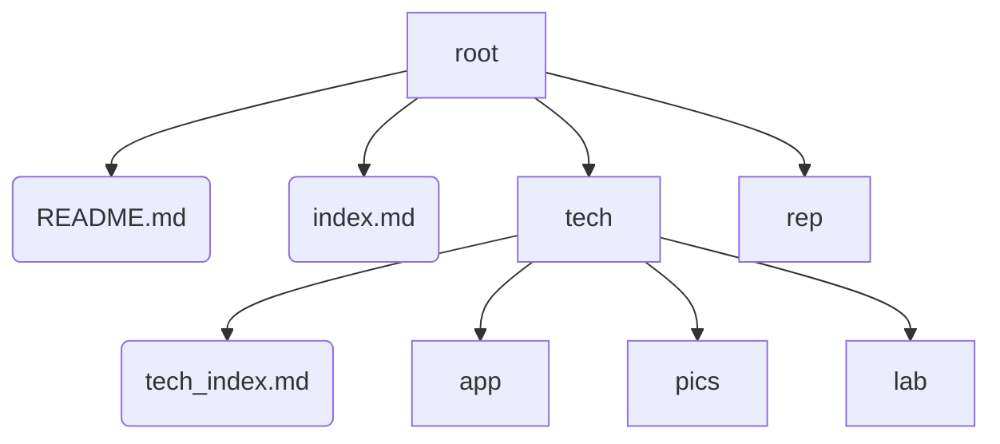

# Tech-Notes

### 目录

- [Tech-Notes](#tech-notes)
    - [目录](#目录)
  - [Introduction 简介](#introduction-简介)
  - [Structure 结构](#structure-结构)

---

## Introduction 简介

All technological notes.

This repository is to store and sort technological notes.
该仓库是为储存、整理技术笔记。

Notes include notes of VBA(excel), C#, Python, CSS, Azure, etc.
技术笔记包括 VBA、C#、Python、CSS、Azure 等。

Github Page:
https://simonangel-fong.github.io/Tech_Notes/

[回到目录](#目录)

---

## Structure 结构

- /root: 根目录
  - README.md: 记录介绍信息
  - index.md: 笔记 page 的首页
  - /rep/: 目录，用于存储所有笔记和实例
  - /tech: 目录，用于存储具体的技术
    - tech_index.md：技术首页
    - /app/: 目录，用于存储技术的子页面
    - /pics/: 目录，用于存储截图
    - /lab/: 目录，用于存储具体的实例

[回到目录](#目录)

---

- Tech:
  - Git
  - Django
  - MySQL
  - Boostrap

[回到目录](#目录)

---
