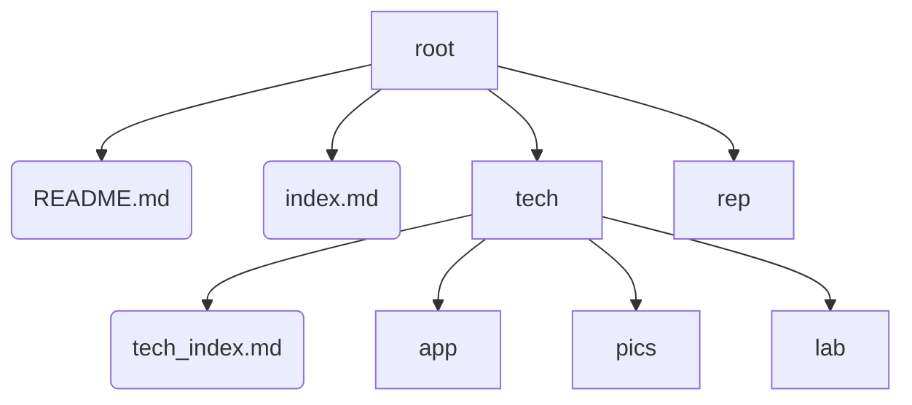

# Tech-Notes

### 目录 
  - [Introduction 简介](#introduction-简介)
  - [Structure 结构](#structure-结构)
  - [Log 日志](#log-日志)

***

## Introduction 简介

All technological notes.

This repository is to store and sort technological notes.
该仓库是为储存、整理技术笔记。

Notes include notes of VBA(excel), C#, Python, CSS, Azure, etc.
技术笔记包括VBA、C#、Python、CSS、Azure等。

Github Page: 
https://simonangel-fong.github.io/Tech_Notes/

[回到目录](#目录)

***

## Structure 结构

- /root: 根目录
  - README.md: 记录介绍信息
  - index.md: 笔记page的首页
  - /rep/: 目录，用于存储所有笔记和实例
  - /tech: 目录，用于存储具体的技术
    - tech_index.md：技术首页
    - /app/: 目录，用于存储技术的子页面
    - /pics/: 目录，用于存储截图
    - /lab/: 目录，用于存储具体的实例

[回到目录](#目录)

***

## Log 日志

[到最新log](#最新log)

- 2022/03/23  
  - [x] 创建远程仓库Tech_Notes
    - [x] 创建Github远程仓库Tech_Notes
    - [x] 创建README_md
    - [x] 创建文件夹结构
  - [x] Log日志  

- 2022/03/24
  - [x] 上存push笔记到rep
    - [x] 在本地整理笔记
    - [x] 上存push笔记到rep
    - [x] Log日志 
  - [x] 删除仓库Note_Git
    - [x] 迁移仓库Note_Git到仓库Tech_Notes;
    - [x] 删除仓库Note_Git;
    - [x] Log日志 
  - [x] 创建Github Page
    - [x] 创建Github Page
    - [x] 设置主题theme
    - [x] 更新link
    - [x] Log日志 
  - [x] Git - 工作区
    - [x] 创建git_workspace.md
    - [x] 更新内容
    - [x] 更新link
    - [x] log日志
  - [x] Git - 缓存区操作 
    - [x] 创建git_stage.md
    - [x] 更新内容
    - [x] 更新link
    - [x] 更新git_index.md
    - [x] log日志
  - [x] Git - 仓库操作
    - [x] 创建git_local_repo.md
    - [x] 更新内容
    - [x] 更新link
    - [x] 更新git_index.md
    - [x] log日志

- 2022/03/25
  - [x] Git - 比较
    - [x] 创建git_diff.md
    - [x] 更新内容
    - [x] 更新link
    - [x] 更新git_index.md
    - [x] log日志
- 2022/03/26  
  - [x] 创建lab文件，截图
    - [x] 创建demo1_md
    - [x] `status`
    - [x] `git add -u`
    - [x] 截图
  - [x] 添加git add -u \@ git_workspace_md 
  - [x] 添加git add -A \@ git_workspace_md 
  - [x] 添加cheat sheet \@git_stage.md, git_workspace.md, git_index.md
  - [x] log日志

- 2022/03/28
  - [x] 更新git_index.md

- 2022/03/31
  - [x] Git - 远程仓库操作
    - [x] 创建git_remote.md
    - [x] 更新内容
    - [x] 更新link
    - [x] 更新git_index.md
  - [x] log日志

- 2022/04/02
  - [x] Django - 安装与设置
    - [x] 创建django结构
    - [x] 创建django_index.md
    - [x] 创建django_setup.md
    - [x] 更新内容
    - [x] 更新link
    - [x] 更新django_index.md
  - [x] log日志

###### 最新log

[回到目录](#目录)

***
