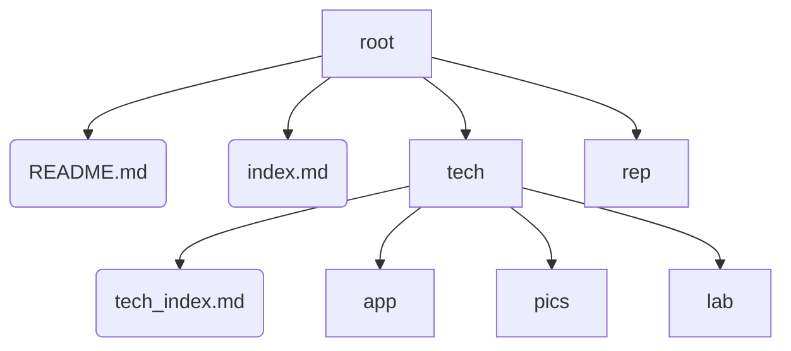

# Tech_Notes
All technological notes.

This repository is to store and sort technological notes.
该仓库是为储存、整理技术笔记。

Notes include notes of VBA(excel), C#, Python, CSS, Azure, etc.
技术笔记包括VBA、C#、Python、CSS、Azure等。

### Structure 结构

- /root: 根目录
  - README.md: 记录介绍信息
  - index.md: 笔记page的首页
  - /rep/: 目录，用于存储所有笔记和实例
  - /tech: 目录，用于存储具体的技术
    - tech_index.md：技术首页
    - /app/: 目录，用于存储技术的子页面
    - /pics/: 目录，用于存储截图
    - /lab/: 目录，用于存储具体的实例

