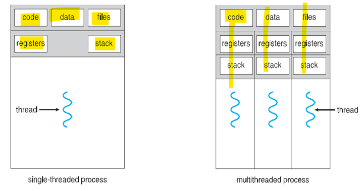

# OS 1: Review

[Back](../OS1.md)

- [OS 1: Review](#os-1-review)
  - [Review](#review)
    - [Threads](#threads)
      - [Single and Multithreaded Processes](#single-and-multithreaded-processes)
      - [User Threads and Kernel Threads](#user-threads-and-kernel-threads)
      - [Multithreading Models](#multithreading-models)
      - [Concurrency and Parallelism](#concurrency-and-parallelism)
    - [Process Synchronization](#process-synchronization)
      - [Critical Sections](#critical-sections)
        - [Rules for Critical Section](#rules-for-critical-section)
    - [CPU Scheduling](#cpu-scheduling)
      - [Types of Scheduling Methods](#types-of-scheduling-methods)
      - [Types of CPU Scheduling Algorithms](#types-of-cpu-scheduling-algorithms)
    - [Multiple Processor Scheduling](#multiple-processor-scheduling)
      - [Techniques](#techniques)
    - [Real-Time CPU Scheduling](#real-time-cpu-scheduling)
      - [Priority Based Scheduling](#priority-based-scheduling)
    - [Deadlock Problem](#deadlock-problem)
      - [Handling Deadlocks](#handling-deadlocks)

---

## Review

### Threads

- `Thread`

  - Lightweight Process(LWP)
  - Flow of execution through process code

- Shares with peer threads **code** segments, **data** segments and open **files**
- Each `thread` belongs to **1** `process`, **cannot exist** outside a `process`

  - Each `thread` represents a **separate flow of control**

- **Advantages**
  - **Responsiveness**
    - Threads minimize the `context switching` time.
  - **Resource Sharing**
    - All threads can share same set of open files, child processes.
  - **Efficient Communication**
  - **Economy**
    - more economical to create and `context switch threads`.
  - **Scalability**
    - utilization of **multiprocessor architectures** to a **greater scale** and efficiency.

---

#### Single and Multithreaded Processes

---

#### User Threads and Kernel Threads

- `User Threads`:
  - management done by **user-level `thread libraries`**
  - `Thread Libraries`: provides programmer with **API** for **creating/managing threads**
- `Kernel Threads`:
  - OS managed `threads` acting on **kernel**

---

#### Multithreading Models

- **Many-to-One**

  - **Many** `user-level threads` mapped to **single** `kernel thread`
  - **Not commonly** used.
    - **1** thread **blocking** causes **all to block**.

- **One-to-One**

  - **Each** `user-level thread` maps to `kernel thread`.
  - More **concurrency**.

- **Many-to-Many**
  - Allows **many** `user level threads` to be mapped to **many** **kernel threads**.
  - OS creates **sufficient number** of `kernel threads`.

---

#### Concurrency and Parallelism

- Modern `multiprocessor system` have **multiple processes or threads** executed in **parallel**.
- **Single processor** systems, this isn’t truly possible but can give the **illusion of parallelism**.

- `Parallelism`
  - simultaneous execution
- `Concurrency`
  - **interleaving of processes** in time to give **appearance of simultaneous execution**

---

### Process Synchronization

- a technique that manages how processes access **shared resources** in a computer system
- Goal: ensure **data integrity**,avoid concurrency, deadlock
- No 2 processes can have access to the same shared data and resources

#### Critical Sections

- `Critical Sections`

  - a portion of **programming code** where a process accesses **shared resources**
  - serves as a protected area
    - When inside `critical section`, **other** processes **can’t** be allowed to **touch shared data**.

- Steps
  - **Entry** section
    - Ask to enter
  - **critical** sections
    - enter and modify shared variable
  - **exit** section
    - Notify exit
    - Allows other to enter critical section
  - **remainder** section
    - Execute cleanup
  - other parts of code

---

##### Rules for Critical Section

- **Mutual Exclusion**互斥

  - **guarantees** that **only one** `process` can access a `critical section` **at a time**
  - Used to **control access** to the **shared resource**
  - **Priority mechanism** to avoid extended **priority inversion problems**

- **Progress**进入不延迟

  - **guarantees** `processes` waiting for critical section to be **able to enter without delay**
  - Used when **no one is in** the `critical section` and one **wants in**

- **Bound Waiting**等待限制
  - **ensuring** that **no** `process` is **left waiting** for an **excessive amount of time**.
  - When a process makes a **request** for getting into `critical section`, specific **limit on number** of processes.
    - When limit is **reached**, system must **allow request** to get **into** `critical section`.

---

### CPU Scheduling

- `CPU Scheduling`

  - **Process** of **determining** which process will **own CPU for execution** while another process is **on hold**
    - Selects 1 `process` **in memory** that is **ready** for execution
    - Whenever cpu is **idle**, assign cpu for ready process.

- `Short-term scheduler`:

  - selects from processes in **ready-queue** and **allocates** CPU to one of them

- States:
  - hold -> ready -> running -> [waiting] -> finish

---

#### Types of Scheduling Methods

- **Preemptive Scheduling**

  - Tasks are usually **assigned** with their **priorities**
  - **Lower priority** task is **on hold** and resumes when **higher priority** task **finishes** executing.

- **Non-preemptive Scheduling**
  - CPU has been allocated to a **specific process**
  - Process that **keeps the CPU busy** will **release** the CPU either by `switching context` or **terminating**.

---

#### Types of CPU Scheduling Algorithms

- There are 6 types of process scheduling algorithms
  - **First Come First Serve (FCFS)**
    - Nonpreemptive
    - Job handled based on **arrival time**
    - **Good** for **batch** systems
    - **Unacceptable** in **interactive** systems
  - **Shortest-Job-First (SJF) Scheduling / shortest job next (SJN)**
    - Nonpreemptive
    - based on **length of CPU** cycle time
    - **Easy** implementation in **batch** environment
    - **not** work well in **interactive** systems
  - **Shortest Remaining Time**
    - Preemptive version of SJF
    - allocated to job **closest to completion**
    - Often used in **batch** environments
    - **Cannot** implement in **interactive** system
    - more overhead than SJF
  - **Priority Scheduling**
    - priority number (**integer**) is associated with each process(smallest integer highest priority)
    - problem:
      - Starvation
      - Aging
  - **Round Robin Scheduling**
    - Preemptive
    - Based on **predetermined time slice** (time quantum)
    - Used extensively in **interactive** systems
    - Job placed on **READY queue**
  - **Multilevel Queue Scheduling**
    - in conjunction with **several other schemes**
    - **Different queues** for each priority level

---

### Multiple Processor Scheduling

- Focuses on designing the **scheduling function** for a system consisting of **‘more than one processor’**
- `Load sharing` becomes **feasible** BUT makes scheduling more **complex**

- Just like single processor scheduling, there is **no best scheduling solution** for a `multiple processor system`.

- `Multiprocessor systems` have **identical** (or homogenous) **processes** in terms of functionality.

---

#### Techniques

- **Asymmetric Multiprocessor Scheduling**

  - **1** `processor` is assigned as the `master processor`
    - handles all **scheduling**, **I/O** processing, other **system activities**
  - `Master processor` runs the **OS code**, **other** processors execute **user code**

- **Symmetric Multiprocessor Scheduling**
  - All `processors` **self-schedule**
  - Each `processor` may have **its own list of processes** to execute or **common list** of processes where processors extract the process to be executed
  - `Ready queue` (most commonly used)

---

### Real-Time CPU Scheduling

- Can present obvious **challenges**
- `Soft real-time systems`
  - **no guarantee** as to **when** critical `real-time process` will be **scheduled**
- `Hard real-time systems`

  - task must be **serviced** by its **deadline**

- Two types of **latencies affect performance**
  - 1. `Interrupt latency`
    - time from **arrival** of interrupt to **start** of routine that **services interrupt**
  - 2. `Dispatch latency`
    - time for schedule to **take current process off** CPU and **switch** to another

---

#### Priority Based Scheduling

- For `real-time scheduling`, scheduler must support `preemptive, priority - based scheduling`
  - But **only** guarantees `soft real-time`
- For `hard real-time` must also provide ability to **meet deadlines**
- Processes have new **characteristics**:

  - **periodic ones** require CPU **at constant intervals**

  - Has processing time t, deadline d, period p
  - 0 ≤ t ≤ d ≤ p
  - Rate of periodic task is 1/ p

---

### Deadlock Problem

- `Deadlock Problem`
  - **Set** of **blocked processes** each **holding a resource** and **waiting to get a resource** held **by another** process in the set.
    - E.g. You have 2 disk drive in the system. Process1 and Process2 each hold 1 disk drive and each needs the other one.
    - E.g. Semaphores A and B, initialized to 1

---

#### Handling Deadlocks

- Ensure that the system will **never enter** a deadlock state:
  - **Deadlock prevention**
    - **Restrain** the ways **requests** can be made
  - **Deadlock avoidance**
    - ensure that a system will never enter an `unsafe state`.
- **Allow** the system to enter a deadlock state and then **recover**
- **Ignore** the problem and **pretend** that deadlocks **never occur** in the system; used by most operating systems, including `UNIX`
