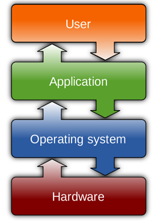
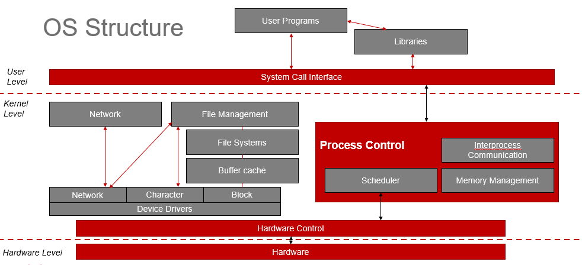

# OS 1 - wk01

[Back](../../OS1.md)

- [OS 1 - wk01](#os-1---wk01)
  - [Operating System](#operating-system)
    - [Computer System Structure](#computer-system-structure)
    - [What Operating Systems Do](#what-operating-systems-do)
    - [Operating System Definition](#operating-system-definition)
  - [Computer Hardware](#computer-hardware)
    - [Computer System Organization](#computer-system-organization)
  - [UNIX History (BSD UNIX)](#unix-history-bsd-unix)

---

## Operating System

- `OS`

  - A program that acts as an **intermediary** between a **user** of a computer and the computer **hardware**

- Operating system goals:
  - **Execute** user programs and make **solving** user problems easier
  - Make the computer system convenient to use
  - Use the computer hardware in an efficient manner

### Computer System Structure

- Computer system can be divided into **four** components:
  - **Hardware**
    - provides basic computing resources
    - CPU, memory, I/O devices
  - **Operating system**
    - **Controls** and **coordinates** use of hardware among various applications and users
  - **Applications**
    - define the ways in which the system resources are used to solve the computing problems of the users
    - Word processors, compilers, web browsers, database systems, video games
  - **Users**
    - People, machines, other computers

---

### What Operating Systems Do

- An `operating system (OS)` **manages a computer's hardware and software resources**, allowing users to interact with the computer by performing tasks like file management, running applications, controlling input/output devices, and allocating memory, essentially acting as the intermediary between the user and the computer's hardware.

- Depends on the point of view
- Users want convenience, **ease of use** and good performance
  - Don’t care about resource utilization
- But **shared computer** such as mainframe or minicomputer must keep all users happy
- Users of dedicate systems such as workstations have dedicated resources but frequently use shared resources from servers
- Handheld computers are resource poor, optimized for usability and battery life
- Some computers have little or no user interface, such as embedded computers in devices and automobiles

---

### Operating System Definition

- OS is a **resource allocator**
  - Manages all resources
  - Decides between conflicting requests for efficient and fair resource use
- OS is a **control program**

  - **Controls execution of programs** to prevent errors and improper use of the computer

- No universally accepted definition
  - “The one program running at all times on the computer ” is the `kernel`.
- Everything else is either a `system program` , or an `application program`.

---

## Computer Hardware

### Computer System Organization

- Computer-system operation
  - One or more CPUs, device controllers connect through common bus providing access to shared memory
  - Concurrent execution of CPUs and devices competing for memory cycles

---

- Computer Startup
  - `bootstrap program`
    - loaded at power-up or reboot
  - Typically stored in ROM or EPROM, generally known as `firmware`
  - Initializes all aspects of system
  - **Loads** operating system `kernel` and starts execution

---

- Device
  - I/O devices and the CPU can execute concurrently
  - Each `device controller` is in charge of a particular **device type**
  - Each device controller has a **local buffer**
  - CPU moves data from/to main memory to/from local buffers I/O is from the device to local buffer of controller
  - Device controller informs CPU that it has finished its operation by causing an interrupt

---

---

## UNIX History (BSD UNIX)
