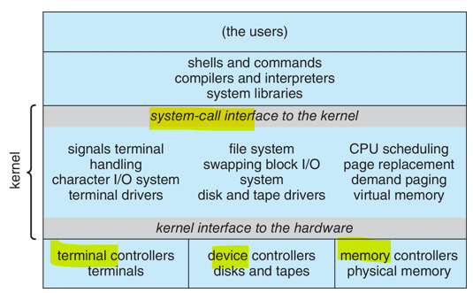
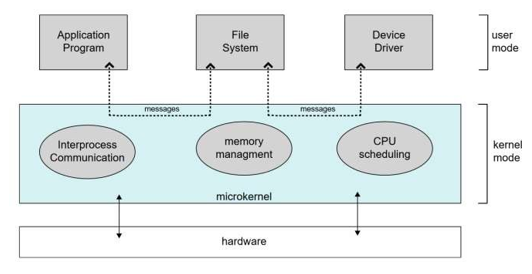
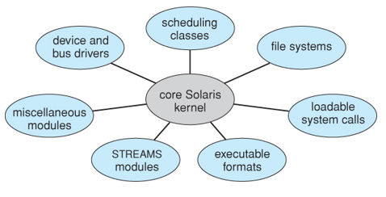
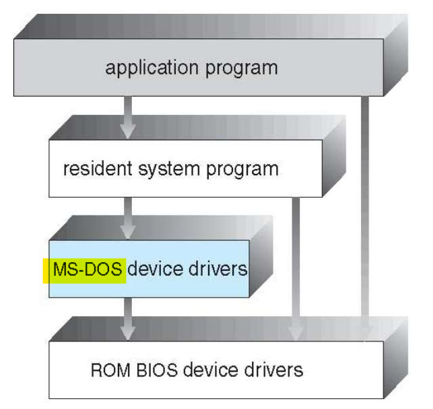
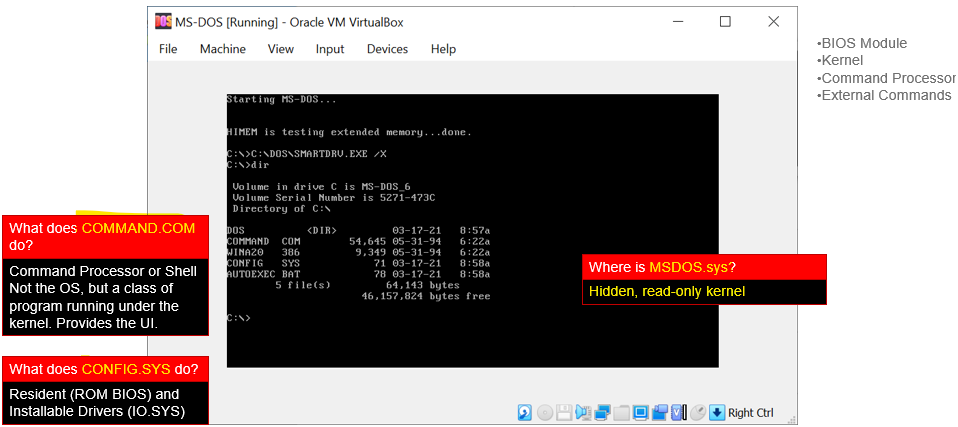
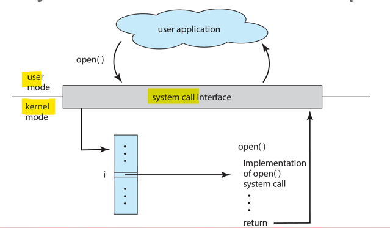
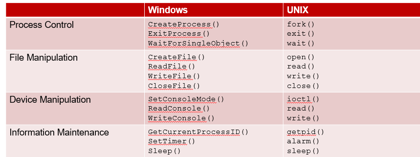

# OS 1: wk02

[Back](../../OS1.md)

- [OS 1: wk02](#os-1-wk02)
  - [System Programs](#system-programs)
  - [Operating System Design](#operating-system-design)
    - [Implementation](#implementation)
  - [OS Structure](#os-structure)
    - [Monolithic Structure](#monolithic-structure)
      - [Linux System Structure](#linux-system-structure)
    - [Layered Approach](#layered-approach)
    - [Microkernel (Mach)](#microkernel-mach)
    - [Modules](#modules)
    - [Hybrid Systems](#hybrid-systems)
    - [MS-DOS Structure](#ms-dos-structure)
    - [iOS](#ios)
    - [Android](#android)
  - [System Boot](#system-boot)
  - [Debugging](#debugging)
    - [OS Debugging](#os-debugging)
    - [Performance Tuning](#performance-tuning)
    - [Tracing](#tracing)
    - [BCC](#bcc)
  - [System Calls](#system-calls)
    - [System Call Implementation](#system-call-implementation)
    - [API – System Call – OS Relationship](#api--system-call--os-relationship)
    - [System Call Types](#system-call-types)

---

- System Programs
- OS Design and Structures
- System Calls

- Why Applications are OS Specific
  - Apps compiled on one system usually not executable on other operating systems
  - **Each operating system** provides its own **unique** `system calls`
    - Own file formats, etc.
  - Apps can be **multi**-operating system
    - Written in **interpreted language** like Python, Ruby, and **interpreter** available on multiple operating systems
    - App written in language that includes a **VM** containing the running app (like Java)
    - Use **standard language** (like C), **compile** separately on each operating system to run on each

---

## System Programs

- Programs that **ship with** your operating system
- Some are interfaces to system calls, others more complex
- Examples
  - File Management (XCOPY, move, etc.)
  - Status (date/time, disk space, registry etc.)
  - File Modification (text editors)
  - Programming Language Support (Compilers)
  - Program Loading & Execution (program loaders)
  - Communications
  - Background Services

---

## Operating System Design

- OS’ are all structured differently
- Design of system **affected by goals**
  - Who will use it?
  - Where will it be used?
  - What hardware will be available?
  - Will there be connections with other PCs?
  - Etc.
- **User goals**:
  - OS should be **convenient**, **easy** to learn, **reliable**, **safe**, and **fast**
- **System**:
  - easy to design, implement & maintain

---

- Important principles: **Policy** vs. **Mechanism**
  - `Policy`: **what** will be done? Which **activities** to perform
  - `Mechanism`: **how** it will be done. **Enforces** the policies. Somewhat dependent on hardware
- Separate these two – maximum flexibility
  - E.g. change policy of CPU usage from fair share to real-time
  - E.g. First come, first server policy for processes to be granted resources. Implemented using a queue of requests. Kernel provides the mechanisms used to implement policies.

---

### Implementation

- Early days: ASM
- Modern: C, C++ with some ASM
- Typical: higher level written in higher level languages
  - Calculator = C++
  - The memory manager = C + ASM
- High level language = slower, but easier to port

---

## OS Structure

- General-purpose OS is very large program
- Various ways to structure ones
  - Simple structure – MS-DOS
  - More complex – UNIX
  - Layered – an abstraction
  - Microkernel – Mach

---

### Monolithic Structure

- UNIX – limited by hardware functionality, the original UNIX operating system had limited structuring.
- The UNIX OS consists of two separable parts
  - Systems programs
  - The kernel
    - Consists of everything **below** the `system-call` interface and **above** the `physical hardware`
    - Provides the file system, CPU scheduling, memory management, and other operating-system functions; a large number of functions for one level

---

Chat:

- Monolithic
  - All OS services (e.g., file system, memory management, device drivers) are **integrated into a single large program**.
  - All components run **in kernel mode**.
- Advantages:
  - **High performance** due to fewer context switches.
  - Simple design.
- Disadvantages:
  - Difficult to debug or modify due to tight coupling.
- Example: Linux, Unix.

---

#### Linux System Structure

- Monolithic plus modular design

---

### Layered Approach

- The operating system is **divided** into a number of `layers (levels)`, each built on top of lower layers.
  - The `bottom layer (layer 0)`, is the **hardware**;
  - the `highest (layer N)` is the **user interface**.
- With modularity, layers are selected such that each **uses functions (operations) and services of only lower-level layers**

---

Chat:

- Layerd architecture:
  - The OS is **divided into layers**, each built on top of the other.
  - Lower layers provide **basic** services, while higher layers provide **advanced** functionalities.
- Advantages:
  - Easy to design and debug.
  - Clear separation of concerns.
- Disadvantages:
  - Performance overhead due to **inter-layer communication**.

---

### Microkernel (Mach)

- Idea: have a **minimal kernel** with many system functions implemented as programs that **communicate** with the kernel
- `Mac OS X (Darwin)` kernel partly based on `Mach`
- Communication done by message passing

- **Near-minimum amount of software** that can provide the mechanisms needed to implement an operating system.
- **Advantages**
  - Easier to extend
  - Easier to port to new platforms
  - More reliable
  - More secure
- **Disadvantages**
  - Slow (message passing to/from kernel is slow)

---

CHat:

- Microkernel Architecture
  - Only essential services (e.g., IPC, basic scheduling, basic memory management) run in kernel mode.
  - Other services run in user mode as separate processes.
- Advantages:
  - Better security and stability (faults in one service don't affect others).
  - Easier to extend and maintain.
- Disadvantages:
  - Can be slower due to user-kernel communication overhead.
- Example:Mac OS X (Darwin).

---

### Modules

- Most modern OS’ use `loadable kernel modules`
- Loaded as needed
- Each core component is **separate**
- Communication through known interfaces
- Object-oriented

---

Chat

- Modular Architecture
  - Combines **monolithic** and **microkernel** approaches.
  - Kernel is modular, allowing **different functionalities** (modules) to be loaded/unloaded **dynamically**.
- Advantages:
  - Flexibility and performance balance.
  - Easier to maintain and extend compared to monolithic systems.
- Example: **Modern Linux kernel**.

---

### Hybrid Systems

- Most modern operating systems are not one pure model
  - `Hybrid` combines multiple approaches to address performance, security, usability needs
  - **Linux and Solaris** kernels in kernel address space, so **monolithic**, plus **modular** for dynamic loading of functionality
  - **Windows** mostly **monolithic**, plus **microkernel** for different subsystem personalities
- **Apple Mac** OS X **hybrid**, **layered**, Aqua UI plus **Cocoa programming environment**
  - Below is kernel consisting of **Mach microkernel** and **BSD Unix** parts, plus I/O kit and dynamically loadable modules (called kernel extensions)

---

Chat

- Hybrid Architecture
  - A mix of monolithic and microkernel architectures.
  - Core services run in the kernel, while others run in user space.
- Advantages:
  - Flexibility and modularity.
  - Improved performance compared to microkernel systems.
- Example: Windows NT, macOS.

---

### MS-DOS Structure

- Original release: 86-DOS (originally named QDOS)
- **Not divided** into modules
- Some structure, but interfaces/functionality **not separated** well

- monolithic structure

---

### iOS

- Apple mobile OS for iPhone, iPad

  - Structured on Mac OS X, added functionality
  - Does not run OS X applications natively
    - Also runs on different CPU architecture (ARM vs. Intel)
  - **Cocoa Touch Objective-C API** for developing apps
  - **Media services layer** for graphics, audio, video
  - **Core services** provides cloud computing, databases
  - Core operating system, **based on Mac OS X kernel**

- hybrid architecture
  - **monolithic** kernel (based on macOS's XNU kernel) and **modular** components for flexibility

---

### Android

- Developed by Open Handset Alliance (mostly Google)
  - Open Source, Similar stack to iOS
- Based on Linux kernel but modified
  - Provides process, memory, device-driver management
  - Adds power management
- Runtime environment includes core set of libraries and Dalvik virtual machine
  - Apps developed in Java plus Android API
  - Java class files compiled to Java bytecode then translated to executable thnn runs in Dalvik VM
- Libraries include frameworks for web browser (webkit), database (SQLite), multimedia, smaller libc

- layered modular architecture
  - modified Linux kernel for device control and resource management, with additional components for mobile-specific functionalities.

---

## System Boot

- PC executes instruction at **memory address** 0xFFFFFFF0
  - This instruction jumps to the **BIOS/UEFI ROM**
- BIOS runs initialization code (POST)
- BIOS attempts to find a **bootable device**
  - Must be readable
  - Must contain 0x55 0xAA at the start of disk
- Loads boot sector to address 0x00007C00
- Jumps to address 0x00007C00

---

- Boot sector stores the bootstrap loader
- Boot loader finds kernel, loads it into RAM, starts it
- Common in Linux: GRUB loader (can select kernel/OS)

---

## Debugging

- `Debugging`
  - **finding and fixing** errors (bugs)
- OS’ generate log files
- Core dump – memory dump of a crashed process
- Crash dump – memory dump of a crashed kernel
- Can profile **applications to analyze** system performance
  - Crucial for making apps that are fast!

---

### OS Debugging

- **Debugging** is finding and fixing errors, or bugs
- Also **performance tuning**
- OS **generate log files** containing error information
- **Failure** of an application can generate **core dump file** capturing memory of the process
- Operating system **failure** can generate **crash dump file** containing kernel memory
- Beyond crashes, **performance tuning** can **optimize** system performance
  - Sometimes using trace listings of activities, recorded for analysis
  - `Profiling` is **periodic sampling** of instruction pointer to look for **statistical trends**

---

### Performance Tuning

- Improve performance **by removing bottlenecks**
- OS must provide means of computing and displaying measures of system behavior
  - For example, “top” program or **Windows Task Manager**

---

### Tracing

- **Collects** data for a **specific event**, such as steps involved in a system call invocation
- Tools include
  - `strace` – trace system calls invoked by a process
  - `gdb` – source-level debugger
  - `perf` – collection of Linux performance tools
  - `tcpdump` – collects network packets

---

### BCC

- Debugging interactions between user-level and kernel code nearly impossible without toolset that understands both and an instrument their actions
- `BCC (BPF Compiler Collection)` is a rich toolkit providing tracing features for Linux
  - See also the original DTrace
- For example, disksnoop.py traces disk I/O activity

---

## System Calls

- `System Call`:
  - method that **allows program to request kernel services**
- `API`:

  - intermediary between programs and operating system

- On modern OS, API may be as simple as a wrapper around the system call, or may wrap many system calls for the user

- `system call`
  - a mechanism that allows user-level **programs** to **request services or resources** from the operating system (OS).
  - It provides an interface between an `application` and the `kernel`, enabling the application to **access hardware** or perform OS-provided operations.

---

### System Call Implementation

- Typically, a **number** is associated with each `system call`
  - **System-call interface** maintains a **table indexed** according to these numbers
- The `system call interface` **invokes** the intended `system call` in OS kernel and **returns** status of the `system call` and any return values
- The caller need know nothing about how the system call is implemented
  - Just needs to **obey** API and understand what OS will do as a result call
  - Most **details** of OS interface **hidden** from programmer by API
    - Managed by run-time support library (set of functions built into libraries included with compiler)

---

### API – System Call – OS Relationship

- **User programs** run in `user mode`, which **restricts direct access to hardware resources** for security and stability.
- The **OS kernel** runs in `kernel mode`, where it **can perform privileged operations** like accessing hardware or managing memory.
- A `system call` **bridges** this gap, allowing user programs to safely request kernel-level operations.

---

### System Call Types

- **Process Control**
  - Create & terminate process, end & abort process, execute process…
- **Device Management**
  - Request device, read from device, get device attributes…
- **File Management**
  - Create, delete, open, close, read, write…
- **Information**
  - Get time/date, set file attributes…
- **Communications**
  - Create connection, send/recv messages, transfer status…
- **Protection**
  - File security, access control lists, etc…

---

- System Call Parameter Passing

  - Remember: limited # of processor registers
  - Most `system calls` pass data via the **stack**
  - **Push** parameters onto the stack
  - OS **pops** parameters off the stack
  - **Stack** is location in **memory**

- Parameter Passing via Table

  

- Example

  
