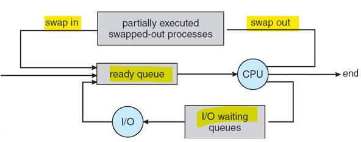

# OS 1: wk03

[Back](../OS1.md)

- [OS 1: wk03](#os-1-wk03)
  - [OS Processes](#os-processes)
    - [vs Program](#vs-program)
    - [Process in Memory](#process-in-memory)
    - [Process States](#process-states)
    - [Process Control Block (PCB)](#process-control-block-pcb)
    - [Process Scheduling](#process-scheduling)
    - [Schedulers](#schedulers)
  - [Operations on Processes](#operations-on-processes)
    - [Process Creation](#process-creation)
    - [Process Termination](#process-termination)
    - [Cygwin](#cygwin)

---

- OS Processes
  - Process Concept
  - Process Scheduling
  - Operations on Processes

## OS Processes

- An operating system executes a variety of programs:
  - **Batch system** – `jobs`( processes jobs in batches, without direct communication between users.)
  - **Time-shared systems** – user `programs` or `tasks`
- `Process`
  - a **program** in execution;
  - process **execution** must progress **in sequential fashion**
- Multiple parts
  - The program **code**, also called `text section`
  - Current activity including **program counter**, processor, registers

---

### vs Program

- `Program` is **passive entity stored on disk** (executable file),
- `process` is **active**
- `Program` becomes `process` when executable file **loaded into memory**

- Execution of program started via GUI mouse clicks, command line entry of its name, etc
- One `program` can be **several** `processes`
  - Consider multiple users executing the same program

---

### Process in Memory

- `Stack`
  - containing **temporary** data
  - e.g., Function parameters, return addresses, local variables
- `Data section`
  - containing **global** variables
- `Heap`
  - containing **memory** **dynamically allocated** during **run time**

---

### Process States

- `New`
  - The process is in the stage of being **created**.
- `Ready`
  - The process has all the resources **available that it needs to run,** but the **CPU is not currently working** on this process's instructions.
- `Running`
  - The **CPU** is **working** on this process' instructions.
- `Waiting`
  - The process **cannot run** at the moment, because it is **waiting for some resource** to become available or for some event to occur.
  - For example the process may be waiting for keyboard input, disk access request, inter-process messages, a timer to go off, or a child process to finish.
- `Terminated`
  - The process has **completed**

---

### Process Control Block (PCB)

- `task control block`

  - **Information** associated with each process

- **Process state**: running, waiting, etc
- **Program counter**: **location** of instruction to next execute
- **CPU registers**: **contents** of all process - centric registers
- **CPU scheduling information**: **priorities**, scheduling queue pointers
- **Memory-management information**: **memory allocated** to the process
- **Accounting information**: **CPU used**, clock time elapsed since start, time limits
- **I/O status information**: **I/O devices** allocated to process, list of open files

---

### Process Scheduling

- `Process scheduling`

  - the process of **assigning CPU time to processes** in an operating system.

- **Maximize** CPU use, quickly **switch** processes onto CPU for time sharing
- `Process scheduler` **selects** among available processes for next execution on CPU
- Maintains scheduling **queues** of processes
  - **Job queue**: set of all processes in the system
  - **Ready queue**: set of all processes **residing** in main memory, **ready and waiting** to execute
  - **Device queues**: set of processes waiting for an **I/O device**
  - Processes migrate among the various queues

---

### Schedulers

- `process scheduler`

  - a component of an operating system that **manages how a computer's CPU allocates time** to different processes

- `Short-term scheduler` (or `CPU scheduler`):

  - selects which process should be **executed next** and allocates CPU
  - Sometimes the only scheduler in a system
  - invoked **frequently** (milliseconds)
  - must be fast

- `Long-term scheduler` (or `job scheduler`):

  - selects which processes should be brought into the **ready queue**
  - invoked **infrequently** (seconds, minutes)
  - may be slow
  - controls the degree of **multiprogramming**

- `Medium-term scheduler`

  - can be **added** if degree of multiple programming needs to **decrease**
  - Remove process from memory, store on disk, bring back in from disk to continue execution: `swapping`

- `Swapping`

  - a **memory management technique** where a process is **temporarily** moved from the m**ain memory (RAM)** to **secondary storage** (like a hard disk) and then brought back when needed

- `Processes` can be described as either:
  - **I/O-bound process**:
    - spends **more time** doing **I/O** than computations
    - many **short** CPU **bursts**
  - **CPU-bound process**:
    - spends more time doing **computations**;
    - few very **long CPU bursts**
    - Long-term scheduler strives for good process mix

---

## Operations on Processes

- System must provide mechanisms for:
  - process creation,
  - process termination,
  - and so on as detailed next

---

### Process Creation

- `Process creation`

  - the process of starting a new process

- `parent process`

  - a process that **creates one or more** `child processes`.

- `child process`

  - a new process that inherits some of its parent's attributes.

- `Parent process` create `children processes`, which, in turn create other processes, forming a **tree of processes**

- `process identifier (pid)`

  - used to identified and managed a process

- **Resource** sharing options
  - Parent and children **share all resources**
  - Children share **subset** of parent ’s resources
  - Parent and child **share no** resources
- **Execution** options
  - Parent and children execute **concurrently**
  - Parent **waits** until children terminate

---

- `Address space`
  - the range of **memory addresses** that a computer can access to store and retrieve data.
  - Child **duplicate** of parent
  - Child has a program loaded into it
  - UNIX examples
    - `fork()` system call creates new process
    - `exec()` system call used after a fork() to **replace** the process’ memory space with a new program

---

### Process Termination

- `Process Termination`

  - the action of ending a running proces
  - Process' resources are deallocated by operating system

- `Parent` may **terminate** the execution of `children` processes using the `abort()` system call.

  - Some reasons for doing so:
    - Child has **exceeded** allocated **resources**
    - Task assigned to child is **no longer required**
    - The **parent is exiting** and the operating systems does not allow a child to continue if its parent terminates

- `cascading termination`
  - a scenario where when a `parent process` **terminates**, all its `child processes` are **automatically terminated** as well。
  - The termination is **initiated** by the **operating system**.
  - do **not allow** `child` to **exist** if its `parent` has **terminated**.
    - If a process terminates, then all its children must also be terminated.
    - All children, grandchildren, etc. are terminated.

---

- `exit()`

  - the system call used to **delete a process** that has completely executed.
  - Returns status data from `child` to parent via `wait()` system call

- `wait()`

  - the system call used by `parent process` to **wait** for termination of a `child process`
  - returns **status** information and the **pid** of the terminated process
    - `pid = wait(&status)`;

- If `parent` **terminated** without invoking wait, `process` is an `orphan`

---

- `Kill` Command
  - kill a single process at a time with the given **process ID**.
  - It will send a `SIGTERM` signal indicating to a process to stop.
  - It **waits** for the program to **run its shutdown routine**.

---

### Cygwin

- Provides a Linux Runtime Environment on the Windows platform.
- Two major parts:

  - **Dynamic link libraries** that **translate** Linux system calls to Windows system calls.
  - A **Linux shell** (bash) that provides the UNIX/Linux console experience.

- Most UNIX/Linux software can be compiled in this environment.
  - Windows programs are accessible in the shell.
  - Linux programs are accessible in a Windows shell (CMD)
