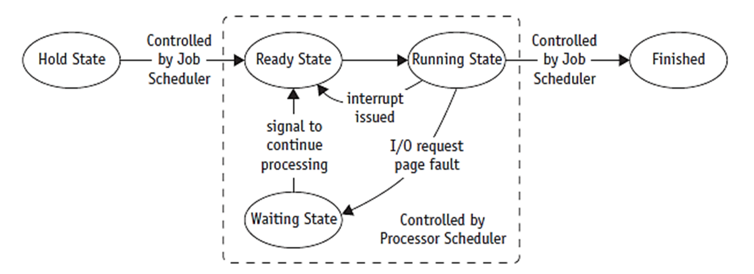
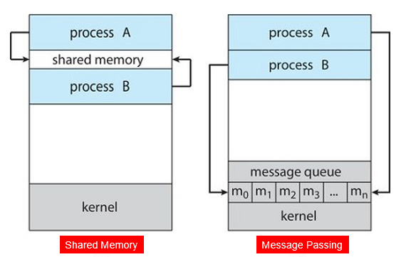
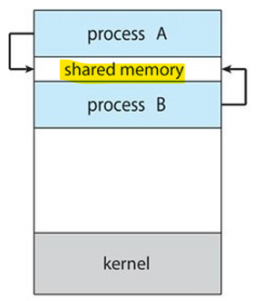
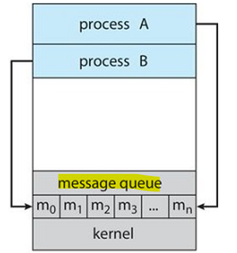
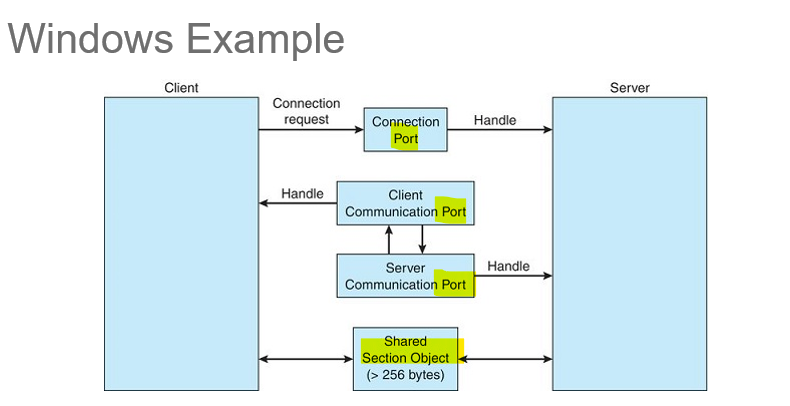

# OS 1: wk04

[Back](../OS1.md)

- [OS 1: wk04](#os-1-wk04)
  - [Interprocess Communication](#interprocess-communication)
    - [Terms](#terms)
    - [Job and Process States](#job-and-process-states)
  - [Interprocess Communication](#interprocess-communication-1)
    - [Cooperating processes](#cooperating-processes)
    - [Shared Memory](#shared-memory)
    - [Message Passing](#message-passing)
      - [Implementation](#implementation)
    - [Direct and Indirect Communication](#direct-and-indirect-communication)
    - [Synchronization](#synchronization)
    - [Approaches to Interprocess Communication](#approaches-to-interprocess-communication)

---

## Interprocess Communication

### Terms

- `Processor (CPU)`
  - Performs **calculations** and **executes** programs
- `Program (job)`
  - **Inactive** unit, e.g., file stored on a disk
  - Unit of **work** submitted by the **user**
- `Process (task)`
  - **Active** entity
  - Requires resources (processor, special registers, etc.) to **perform function**
- Executable program single instance

---

### Job and Process States

- Status changes: as a job or process moves through the system
  - **HOLD**
  - **READY**
  - **WAITING**
  - **RUNNING**
  - **FINISHED**
- Referred to as job status or process status, respectively

- User **submits** job
- Job accepted
  - Put on `HOLD` and placed in **queue**
- Job state changes from `HOLD` to `READY`
  - Indicates job **waiting for CPU**
- Job state changes from `READY` to `RUNNING`
  - When selected for CPU and **processing**
- Job state changes from `RUNNING` to `WAITING`
  - Requires **unavailable resources**
  - moves back to `READY` status
- Job state changes to `FINISHED`
- Job completed (successfully or unsuccessfully)

---

`Job Scheduler` or `Process Scheduler` incurs **state transition** responsibility

- `HOLD` to `READY`
  - Job Scheduler initiates using **predefined policy**
- `READY` to `RUNNING`
  - Process Scheduler initiates using **predefined algorithm**
- `RUNNING` back to `READY`
  - Process Scheduler initiates according to predefined **time limit** or other criterion
- `RUNNING` to `WAITING`

  - Process Scheduler initiates by **instruction in job**

- `WAITING` to `READY`
  - Process Scheduler initiates by **signal from I/O device manager**
  - Signal indicates **I/O request satisfied**; job **continues**
- `RUNNING` to `FINISHED`
  - Process Scheduler or Job Scheduler initiates **upon job completion**
  - Satisfactorily or with error

---

## Interprocess Communication

- `Interprocess Communication`

  - Mechanism provided by the **OS** **allowing processes to communicate** with each other.
  - E.g. P1 wants to let P2 know that an event has occurred or is transferring data from P1 to P2.

- Approaches to Interprocess Communication
  - shared memory
  - message passing

---

### Cooperating processes

- `Independent process` **cannot affect** or be affected by the execution of another process
- `Cooperating process` can **affect** or be affected by the execution of another process
- **Advantages** of process cooperation
  - Information sharing
  - Computation speed-up
  - Modularity
  - Convenience
- Cooperating processes need `interprocess communication (IPC)`

---

### Shared Memory

- An area of **memory shared** among the processes that want to communicate
- **Communication** is under the **control** of the users’ **processes** **not the OS**
- Major **issue** is to provide **mechanism** that will allow the user processes to **synchronize their actions** when they access shared memory.

---

### Message Passing

- Mechanism for processes to **communicate** and **synchronize** their actions
- `Message System` = processes communicate with each other **without resorting to shared variables**.
- IPC facility provides **2 operations** (message is fixed or variable):

  - `send(message)`
  - `receive(message)`

- If processes P1 and P2 wish to communicate, they need to

  - Establish a **communication link** between them
  - Exchange messages via `send/receive`

---

#### Implementation

- Implementation issues:

  - How are **links** established?
  - Can a link be associated with **more than two processes**?
  - How many **links** can there be between every pair of communicating processes?
  - What is the **capacity** of a link?
  - Is the **size** of a message that the link can accommodate fixed or variable?
  - Is a link **unidirectional** or bi-directional?

- Implementation of communication link:
  - **Physical**
    - Shared memory
    - Hardware Bus
    - Network
  - **Logical**
    - Direct or indirect
    - Synchronous or asynchronous
    - Automatic or explicit buffering

---

### Direct and Indirect Communication

- **Direct**

  - Processes must name each other explicitly:
    - `send(P, message)`: send a message to process P
    - `receive(Q, message)`: receive a message from process Q
  - **Properties** of communication link
    - Links are **established automatically**
    - A link is **associated** with exactly one **pair** of communicating processes
    - Between each pair there exists **exactly one** link
    - The link may be **unidirectional**, but is usually **bi-directional**

- **Indirect**
  - Messages are directed and received from **mailboxes** (also referred to as **ports**)
    - Each mailbox has a **unique id**
    - Processes can **communicate only** if they **share a mailbox**
  - **Properties** of communication link
    - Link established only if processes **share a common mailbox**
    - A **link** may be associated with **many processes**
    - Each pair of processes may **share several communication links**
    - Link may be unidirectional or bi -directional

---

- E.g., Mailbox sharing
  - P1, P2, and P3 share mailbox A
  - P1, sends; P2 and P3 receive
  - Who gets the message?
- Solutions
  - Allow **a** link to be associated with at **most two processes**
  - Allow only one process at a time to execute a receive operation
  - Allow the system to select arbitrarily the receiver. Sender is notified who the receiver was.

---

### Synchronization

- Message passing may be either **blocking** or **non-blocking**
- **Blocking** = `synchronous`
  - Blocking send: the sender is **blocked until** the message is **received**
  - Blocking receive: the receiver is **blocked until** a message is **available**
- **Non-blocking** = `asynchronous`
  - Non-blocking send: the sender **sends** the message and **continues**
  - Non-blocking receive: the receiver receives a **valid** message or **NULL** message
- If **both** send and receive are **blocking** = `rendezvous`

---

### Approaches to Interprocess Communication

- `Shared memory`

  - the memory that can be **simultaneously accessed** by **multiple** processes.
  - This is done so that the processes can communicate with each other.
  - All `POSIX` systems, as well as **Windows** operating systems use shared memory.

- `Message Queue`

  - Multiple processes can read and write data to the **message queue** without being connected to each other.
  - Messages are **stored** in the queue until their recipient retrieves them.
  - Message queues are quite useful for interprocess communication and are used by **most** operating systems.

- `Pipe`

  - a data channel that is **unidirectional**.
  - **Two** pipes can be used to create a **two-way** data channel between two processes.
  - This uses standard **input and output methods**.
  - Pipes are used in all **POSIX** systems as well as **Windows** operating systems.
    - Named Pipes:
      - more powerful,
      - bidirectional communication,
      - no parent-child relationship necessary.
      - Used on UNIX and Windows systems.

- `Socket`

  - the **endpoint** for sending or receiving data in a **network**.
  - This is true for data sent between processes on the **same computer** or data sent between **different computers** on the same **network**.
  - Most of the operating systems use sockets for interprocess communication.

- `File`

  - a data **record** that may be stored **on a disk** or acquired on demand by a **file server**.
  - **Multiple** processes can **access** a file as required.
  - **All** operating systems use files for data storage.

- `Signal`
  - Signals are useful in interprocess communication in a **limited** way.
  - They are system messages that are sent from one process to another.
  - Normally, signals are **not used to transfer data** but are used for **remote commands** between processes.

