# OS 1: wk05

[Back](../OS1.md)

- [OS 1: wk05](#os-1-wk05)
  - [Threads](#threads)
    - [Motivation](#motivation)
    - [Single and Multithreaded Processes](#single-and-multithreaded-processes)
    - [Multicore Programming](#multicore-programming)
    - [Process vs Thread](#process-vs-thread)
    - [User Threads and Kernel Threads](#user-threads-and-kernel-threads)
    - [Multithreading Models](#multithreading-models)
      - [Many-to-One](#many-to-one)
      - [One-to-One](#one-to-one)
      - [Many-to-Many](#many-to-many)
      - [Two-level Model](#two-level-model)
    - [Threading Issues](#threading-issues)
      - [Semantics of fork() and exec()](#semantics-of-fork-and-exec)
      - [Signal Handling](#signal-handling)
      - [Thread Cancellation](#thread-cancellation)
      - [Thread-Local Storage](#thread-local-storage)
      - [Scheduler Activations](#scheduler-activations)
    - [Data Parallism vs Task Parallism](#data-parallism-vs-task-parallism)
    - [Concurrency and Parallelism](#concurrency-and-parallelism)
    - [Windows Threads](#windows-threads)
    - [Linux Threads](#linux-threads)

---

Overview of Threads
Multicore Programming
Multithreading Models
Thread Libraries Implicit
Threading Threading Issues
Operating System Examples

## Threads

- `Thread`
  - `Lightweight Process(LWP)`
  - **Flow of execution** through process code
    - Has its own **counter** that:
      - **Tracks** which instruction to execute next
      - Which system registers holding **current working variables**
      - `Stack` containing **execution history**
  - Thread **shares** with peer threads **code segments**, **data segments** and **open files**.
    - When 1 thread modifies a code segment memory item, all other threads **see** that change

---

- Each `thread` belongs to **EXACTLY 1 `process`** and cannot exist outside a process.
  - Each thread represents **a separate flow of control**
- Allow a foundation for **parallel execution** of applications on **shared memory** multiprocessors.

---

### Motivation

- Most modern applications are `multithreaded`
- `Threads` run **within application**
- Multiple tasks with the application can be implemented by separate threads
  - Update display
  - Fetch data
  - Spell checking
  - Answer a network request
- `Process` creation is **heavy-weight** while `thread` creation is **light-weight**
- Can simplify code, increase efficiency
- Kernels are generally **multithreaded**

---

- Web Server Example
  - Multiple threads allow for **multiple requests** to be satisfied simultaneously, **without** having to service requests **sequentially** or to **fork off** separate processes for every incoming request

---

### Single and Multithreaded Processes

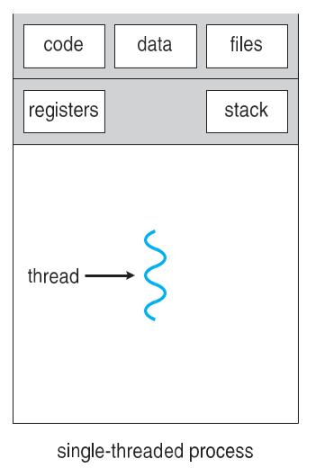
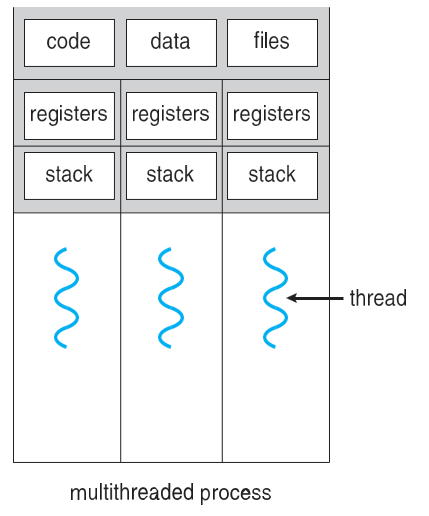

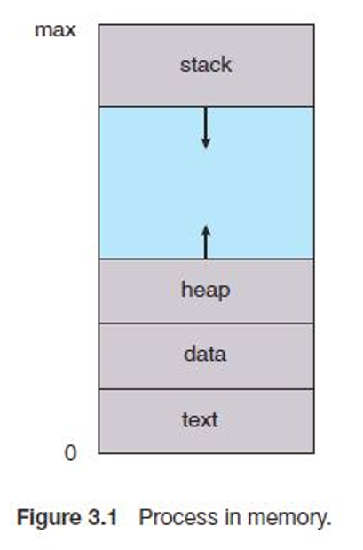

- Thread Advantages
  - **Responsiveness**
    - Threads **minimize the context switching** time.
  - **Resource Sharing**
    - Use of threads provides **concurrency within a process**.
  - **Efficient communication**.
  - **Economy**
    - It is more economical to create and context switch threads.
  - **Scalability**
    - Threads allow utilization of multiprocessor architectures to a greater **scale** and efficiency.

---

### Multicore Programming

- `Multicore / multiprocessor systems` putting pressure on programmers, challenges include:
  - Dividing activities
  - Balance
  - Data splitting
    Data dependency
    Testing and debugging
- **Parallelism** implies a system can perform more than one task **simultaneously**
- **Concurrency** supports more than one task making progress

  - Single processor / core, scheduler providing concurrency

- Types of parallelism
  - **Data parallelism**
    - distributes subsets of the same **data** across multiple cores, same operation on each
  - **Task parallelism**
    - distributing **threads** across cores, each thread performing unique operation
- As # of threads grows, so does architectural support for threading
  - CPUs have cores as well as hardware threads
  - Consider Oracle SPARC T4 with 8 cores, and 8 hardware threads per core

---

### Process vs Thread

| Process                                                                                            | Thread                                                                             |
| -------------------------------------------------------------------------------------------------- | ---------------------------------------------------------------------------------- |
| heavy weight or resource intensive                                                                 | light weight, taking lesser resources than a process.                              |
| switching needs interaction with OS.                                                               | switching does not need to interact with OS.                                       |
| each process executes the **same code** but has its **own** memory and file resources.             | All threads can share same set of open files, child processes.                     |
| If one process is blocked, then no other process can execute until the first process is unblocked. | While one thread is blocked and waiting, a second thread in the same task can run. |
| Multiple processes without using threads use more resources.                                       | Multiple threaded processes use fewer resources.                                   |
| In multiple processes each process operates independently of the others.                           | One thread can read, write or change another thread's data.                        |

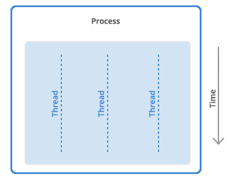

---

### User Threads and Kernel Threads

- `User Threads`

  - management done by user-level **thread libraries**
  - e.g.,

    - POSIX Pthreads
    - Windows Threads
    - Java Threads

  - `Thread Libraries`
    - provides a programmer with API for creating/managing threads

- `Kernel Threads`
  - OS managed threads acting on kernel.
  - e.g.,
    - Windows
    - Solaris
    - Linux
    - MacOS

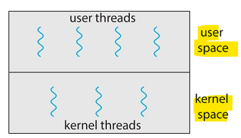

---

### Multithreading Models

Many-to-One
One-to-One
Many-to-Many

---

#### Many-to-One

- **Many** `user-level threads` mapped to **single** `kernel thread`
  - **One** thread blocking causes **all to block**
  - Multiple threads may **not** run in **parallel** on multicore system because only one may be in kernel at a time
  - **Few** systems currently use this model
  - Examples:
    - Solaris Green Threads
    - GNU Portable Threads

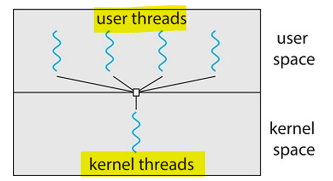

---

#### One-to-One

- **Each** `user-level thread` maps to `kernel thread`
  - Creating a `user-level thread` creates a `kernel thread`
  - More **concurrency** than many-to-one
  - **Number of threads per process** sometimes **restricted** due to overhead
  - Examples
    - Windows
    - Linux
    - Solaris 9 and later

---

#### Many-to-Many

- Allows **many** `user level threads` to be mapped to **many** `kernel threads`
  - Allows the operating system to create a sufficient number of kernel threads
  - Solaris prior to version 9
  - Windows with the ThreadFiber package

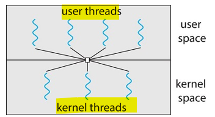

---

#### Two-level Model

- Similar to `M:M`, except that it allows a `user thread` to be **bound** to `kernel thread`
- Examples
  - IRIX
  - HP-UX
  - Tru64UNIX
  - Solaris 8 and earlier

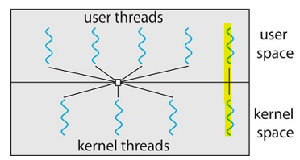

---

### Threading Issues

- Semantics of `fork()` and `exec()` system calls
- Signal handling
  - Synchronous and asynchronous
- Thread cancellation of target thread
  - Asynchronous or deferred
- Thread-local storage
- Scheduler Activations

---

#### Semantics of fork() and exec()

- Does `fork()` duplicate only the calling thread or **all** threads?

  - Some UNIXes have two versions of fork

- `exec()` usually works as normal
  - replace the running process including **all threads**

---

#### Signal Handling

- `Signals` are used in UNIX systems to **notify a process** that a particular **event** has occurred.
- A **signal handler** is used to process signals
  - Signal is **generated** by particular event
  - Signal is **delivered** to a process
  - Signal is **handled** by one of two signal handlers:
    - **default**
    - **user-defined**
- Every signal has **default handler** that kernel runs when handling signal
- **User-defined signal handler** can **override** default
- For single-threaded, signal delivered to process

---

- Where should a signal be delivered for multi-threaded?
  - Deliver the signal to the **thread** to which the signal **applies**
  - Deliver the signal to **every thread** in the process
  - Deliver the signal to **certain threads** in the process
  - Assign a **specific thread** to receive all signals for the process

---

#### Thread Cancellation

- **Terminating** a thread **before** it has finished
- Thread to be canceled is `target thread`
- Two general approaches:

  - **Asynchronous cancellation** terminates the `target thread` **immediately**
  - **Deferred cancellation** allows the `target thread` to periodically check if it should be cancelled

- Invoking thread cancellation **requests** cancellation, but **actual** cancellation **depends on thread state**

- If thread has cancellation **disabled**, cancellation **remains pending** until thread enables it
- **Default** type is **deferred**
  - Cancellation only occurs when thread reaches **cancellation point**
    - I.e. `pthread_testcancel()`
    - Then **cleanup** handler is invoked
- On Linux systems, thread cancellation is **handled through signals**

---

#### Thread-Local Storage

- `Thread-local storage (TLS)` allows each thread to **have its own copy of data**
  - Useful when you do not have control over the thread creation process (i.e., when using a thread pool)
  - Different from `local variables`
    - `Local variables` **visible** only during **single function invocation**
    - `TLS` **visible** **across** function invocations
- Similar to static data
- TLS is **unique** to each thread

---

#### Scheduler Activations

- Both M:M and Two-level models **require communication** to **maintain** the appropriate **number** of `kernel threads` allocated to the application
- Typically use an **intermediate data structure** between `user` and `kernel threads` – `lightweight process (LWP)`
  - Appears to be a **virtual processor** on which process can **schedule** `user thread` to run
  - Each `LWP` attached to `kernel thread`
  - How many LWPs to create?
- Scheduler activations provide `upcalls`
  - a **communication mechanism** from the kernel to the upcall handler in the `thread library`
  - This communication allows an application to **maintain the correct number** kernel threads

---

### Data Parallism vs Task Parallism

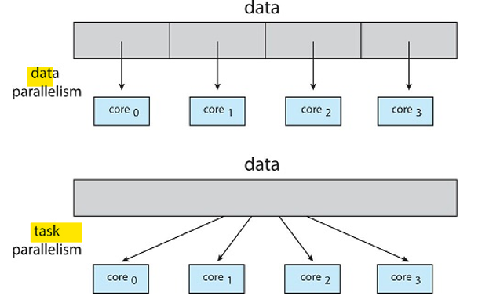

---

### Concurrency and Parallelism

- Can processes or threads run at the same time? It depends.

  - Modern Multiprocessor systems (or CPU cores) multiple processes or threads can be **executed in parallel**
  - Single processor systems this **not** truly possible
    - CPU is **shared** among running processes or threads using process scheduling to give the illusion of parallel execution.
    - The time given to each task is a “time slice”. Occurs rapidly.

- `Parallelism`
  - **simultaneous** execution
- `Concurrency`
  - **interleaving of processes** in time to give appears of simultaneous execution

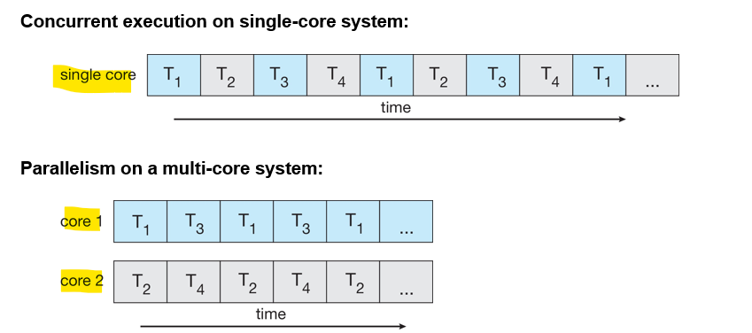

---

### Windows Threads

- Windows implements the `Windows API` – primary API for Win 98, Win NT, Win 2000, Win XP, and Win 7
- Implements the **one-to-one** mapping, kernel-level
- Each thread contains
  - A thread **id**
  - **Register set** representing **state** of processor
  - **Separate** user and kernel **stacks** for when thread runs in user mode or kernel mode
  - **Private data storage area** used by run-time libraries and `dynamic link libraries (DLLs)`
- The **register set**, **stacks**, and **private storage area** are known as the `context` of the thread

---

- The primary data structures of a thread include:
  - `ETHREAD (executive thread block)`
    - includes **pointer** to process to which thread belongs and to `KTHREAD`, in kernel space
  - `KTHREAD (kernel thread block)`
    - scheduling and synchronization info, kernel-mode stack, pointer to TEB, in kernel space
  - `TEB (thread environment block)`
    - thread id, user-mode stack, thread-local storage, in user space

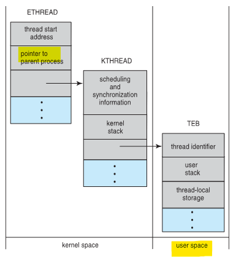

---

### Linux Threads

- Linux refers to them as **tasks** rather than threads
- **Thread creation** is done through `clone()` system call
  - `clone()` allows a child task to **share the address space** of the parent task (process)
- Flags control behavior

| flag            | meaning                            |
| --------------- | ---------------------------------- |
| `CLONE_FS`      | File-system information is shared. |
| `CLONE_VM`      | The same memory space is shared.   |
| `CLONE_SIGHAND` | Signal handlers are shared.        |
| `CLONE_FILES`   | The set of open files is shared.   |

- `struct_task_struct` points to process data structures (shared or unique)
