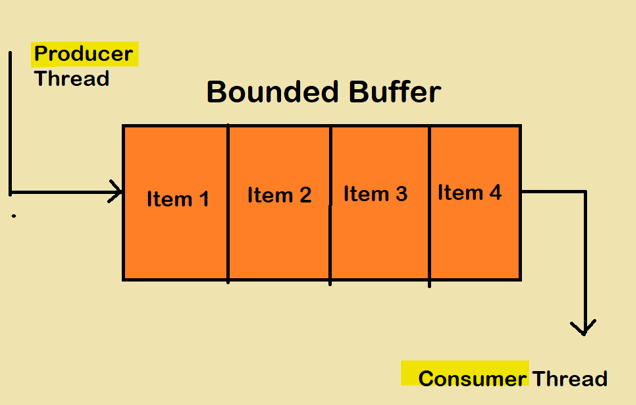
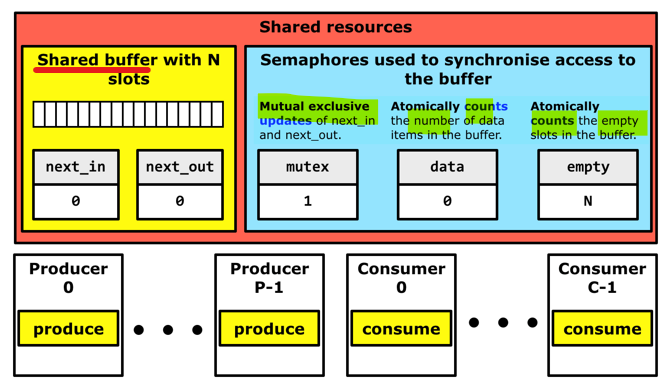

# OS 1: wk08

[Back](../OS1.md)

- [OS 1: wk08](#os-1-wk08)
  - [Process Synchronization Issues](#process-synchronization-issues)
    - [Features of Process Synchronization](#features-of-process-synchronization)
  - [Bound-Buffer Problem](#bound-buffer-problem)
    - [Solution](#solution)
  - [Sleeping Barber Problem](#sleeping-barber-problem)
    - [Solution](#solution-1)
  - [Dining Philosophers Problem](#dining-philosophers-problem)
    - [Solution](#solution-2)
  - [Readers and Writers Problem](#readers-and-writers-problem)
    - [Solution](#solution-3)

---

## Process Synchronization Issues

- Reminder: What is Process Synchronization?

- `Process synchronization`

  - essential for efficiently managing multiple concurrent processes or threads.

- Task of coordinating the execution of processes

  - **No 2** processes can have access to the **same shared data and resources**

- Required in **multi-processor system**

  - multiple processes running **together**, **more than 1 process** trying to gain access to the same shared resource at the same time

- Process 1 **changes** the data in a memory location while Process 2 is trying to **read** the data from the same memory location.
  - High probability that the data read by Process 2 will have errors

---

- Benefits:
  - `Synchronization` in OS ensures that processes operate smoothly **without interfering with each other's operations**, especially when accessing **shared resources**.
  - This allows **multiple processes** to access **shared resources concurrently without causing data inconsistency or conflicts**, ensuring the **orderly execution** of processes and maintaining **data integrity**.

---

- The main **objective** of `process synchronization` is to **ensure data integrity**, manage **shared resources**, and **avoid concurrency problems** such as `data corruption`, `deadlock`, and `contention`.

  - Process Synchronization **focuses** on **preventing conflicts** and **race conditions** when processes access shared resources or critical sections of code.

- `Race condition`:

  - a software bug that occurs when the outcome of a program **depends on the unpredictable order of events or timing** of multiple threads or processes accessing and manipulating the **same data or resource** 如果输出的结果依赖于不受控制的事件的出现顺序

- Race Condition 的解决方案
  - 信号量（semaphore）
  - 状态机

---

### Features of Process Synchronization

- **Mutual exclusion** to prevent data corruption
- Enables **mechanisms** such as semaphores and mutexes
- Protection of `critical code` from concurrent access
- Prevention algorithms to **avoid deadlocks**

---

## Bound-Buffer Problem

- `bounded-buffer problem` / `producer-consumer problem`

  - a classic concurrency synchronization problem where **multiple producers** **write** data to a shared, fixed-size **buffer** and **multiple consumers** **read** from it, requiring synchronization to avoid race conditions and data corruption.

- In this scenario, multiple processes act as either **producers**, **adding data** to the buffer, or **consumers**, **removing data** from it.
  - The key issue is ensuring that a producer **doesn't add** data to a **full buffer** and a consumer doesn't attempt to **remove** data **from an empty one**.

---

### Solution

- We can use `threading` & a `semaphore` to manage the buffer.

- The producer **adds** an item if the buffer **isn’t full**, and the consumer **removes** an item if the buffer **isn’t empty**.
- The `semaphore` acts as a **lock**, ensuring that **only one operation occurs at a time**.

- `Semaphores`
  - **integer variables** that act as **counters** to control access to **shared resources**.
  - They can be used to **signal** between processes, allowing one process to **enter** a critical section **while blocking** others.

---

- AI
- `bounded-buffer problem` / `producer-consumer problem`

  - a classic concurrency synchronization problem where **multiple producers write data** to a shared, fixed-size buffer and **multiple consumers read** from it, requiring synchronization to avoid race conditions and data corruption.

- Key Concepts:

  - `Producers`:
    - Processes or threads that **generate data and write** it into a **shared buffer**.
  - `Consumers`:
    - Processes or threads that **consume data** from the shared buffer.
  - `Shared Buffer`: A **fixed-size memory space** where producers store data and consumers retrieve it.
  - `Concurrency`:
    - **Multiple** producers and consumers **accessing** the buffer concurrently, leading to **potential synchronization issues**.
  - `Synchronization`:
    - **Mechanisms** (like semaphores) to **ensure** that the producers and consumers **coordinate** their access to the shared buffer, **preventing data corruption** and other race condition issues.

- Problem Challenges:
  - **Preventing Data Overwrite**:
    - Ensuring that a producer **doesn't overwrite unread data** in the buffer by another producer.
  - **Preventing Premature Reading**:
    - Ensuring that a consumer **doesn't read data** **before** it has been written by a producer.
  - **Managing Buffer Capacity**:
    - Ensuring that producers **wait** when the buffer is **full** and consumers **wait** when the buffer is **empty**.
  - **Mutual Exclusion**:
    - Enforcing that** only one** producer or consumer can **access** the shared buffer at a given time.

---

## Sleeping Barber Problem

- `Sleeping Barber Problem`

  - a scenario in a Barber Shop with one barber, a barber chair, and a waiting room with several chairs.

- The challenge lies in the fact that the barber must **sleep** if **no customers** are present and be **awakened** as soon as a customer **arrives**.
- On the other hand, if the **waiting room is full**, customers **must leave**.
- This problem highlights the complexities of process synchronization and resource allocation in operating systems.

---

- AI
- `Sleeping Barber Problem`

  - a classic computer science problem in concurrent programming and operating systems, demonstrating the need for synchronization when multiple processes (customers, barber) share resources (barber's chair, waiting room).

- Here's a breakdown:
- **Scenario**:
  - Imagine a barbershop with one barber, one barber chair, and a waiting room with several chairs.
- **Problem**:
  - The barber sleeps when there are no customers, but wakes up and cuts hair when a customer arrives.
  - Customers wait in the waiting room and might leave if all chairs are occupied.
- **Challenge**:
  - How do you ensure that the **barber only cuts** the hair of **one customer at a time** (synchronization) and that customers **don't get stuck** in a **race condition** (multiple customers entering the chair simultaneously)?
- Key Elements of the Sleeping Barber Problem:
  - **Multiple Processes**:
    - The barber and the customers are considered **separate processes or threads**.
  - **Shared Resources**:
    - The barber **chair** and the **waiting room** are **shared resources**.
  - **Synchronization Issues**:
    - Proper coordination is crucial to avoid problems like the **barber getting multiple customers** in the chair at once or **customers starving** because they can't get a haircut.

---

### Solution

- `Semaphores` and a `mutex lock` manage the interactions between the barber and customers.

- The barber waits for a customer to be ready (customer_ready), and a customer waits for the barber (barber_ready).
- `Mutex` ensures that modifications to the **waiting room** are **thread-safe**.

- `Mutexes` are **binary variables** that serve as locks.
  - When a process locks a mutex, it **signifies** that it has **access to a critical section**.
  - **Other** processes attempting to lock the same mutex will be **blocked** until it is released.

---

- `mutex("mutual exclusion")`
  - a programming synchronization mechanism that allows **only one thread** to access a shared resource at a time, preventing data corruption and ensuring data integrity in concurrent programming scenarios.

---

## Dining Philosophers Problem

- `Dining Philosophers Problem`

  - involves a circular table with five philosophers who alternate between thinking and eating.

- Between each philosopher, there is a chopstick.
  - To eat, a philosopher needs both chopsticks, which can **lead to a deadlock** if each philosopher picks up the chopstick on their left at the same time.

---

### Solution

- Each **philosopher** is a **thread**, alternating between thinking & eating.

  - **Chopsticks** are represented by **locks**.
  - Philosophers must acquire **locks** on both their left and right to eat, preventing deadlock **by always acquiring the lower-numbered chopstick first**.

- `Deadlocks` occur when **processes are stuck** and **unable to proceed** because they are **waiting for resources** held by others.

---

- `Orderly execution`:

  - Process Synchronization establishes a **sequence of execution** for processes, allowing them to interact with shared resources in a controlled and **orderly manner**.

- This ensures that processes do not interfere with each other's tasks and maintains the predictability of their execution.

---

## Readers and Writers Problem

- `Readers and Writers Problem`

  - a scenario where **multiple processes access** a shared resource, such as a database.

- The challenge is to allow **multiple readers to access** the resource simultaneously while ensuring that **writers** have **exclusive access**.

- This problem is key to understanding how an operating system manages concurrent access to shared resources.

---

### Solution

- The `readers counter` **tracks** the number of active readers.

  - If a reader is **reading**, **writers must wait**.
  - **Writers** obtain **exclusive access** with resource.acquire() before writing.

- We can set up a `semaphore` with a **counter** initialized to a **number of Readers** allowed to simultaneously read the critical section.

- `Semaphores` can be used to **restrict access** to the database **under certain conditions**.
  - In this example, `semaphores` are used to **prevent any writing processes** from changing information in the database while other processes are reading from the database.
