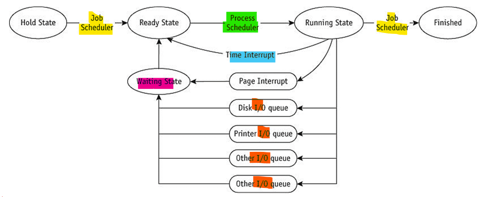
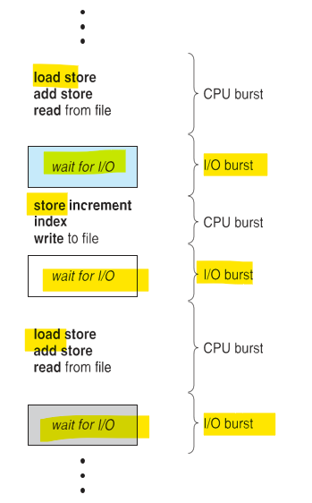
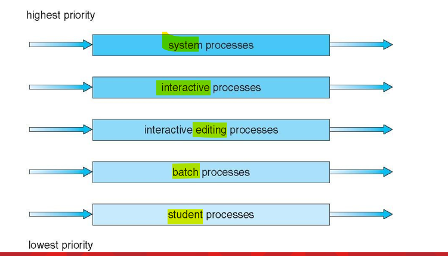
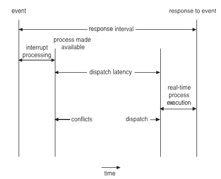

# OS 1: wk09

[Back](../OS1.md)

- [OS 1: wk09](#os-1-wk09)
  - [CPU Scheduling](#cpu-scheduling)
    - [Control Blocks and Queuing](#control-blocks-and-queuing)
    - [Scheduling Policies and Algorithms](#scheduling-policies-and-algorithms)
    - [Types of Scheduling Methods](#types-of-scheduling-methods)
      - [Determine Preemptive or Non-Preemptive](#determine-preemptive-or-non-preemptive)
    - [CPU Scheduling Terms](#cpu-scheduling-terms)
    - [CPU Scheduling Overview](#cpu-scheduling-overview)
    - [CPU Scheduling Criteria](#cpu-scheduling-criteria)
    - [Dispatcher](#dispatcher)
  - [Scheduling Algorithms](#scheduling-algorithms)
    - [First-Come, First-Served](#first-come-first-served)
    - [Shortest Job First](#shortest-job-first)
    - [Shortest Remaining Time (SRT)](#shortest-remaining-time-srt)
    - [Priority Scheduling](#priority-scheduling)
    - [Round Robin](#round-robin)
    - [Multiple-Level Queues](#multiple-level-queues)
      - [Case 1: No Movement Between Queues](#case-1-no-movement-between-queues)
      - [Case 2: Movement Between Queues](#case-2-movement-between-queues)
      - [Case 3: Variable Time Quantum Per Queue](#case-3-variable-time-quantum-per-queue)
      - [Case 4: Aging](#case-4-aging)
    - [Earliest Deadline First](#earliest-deadline-first)
    - [Why Use a Scheduling Algorithm?](#why-use-a-scheduling-algorithm)
    - [Summary](#summary)
  - [Multiple Processor Scheduling](#multiple-processor-scheduling)
    - [Techniques](#techniques)
    - [Processor Affinity](#processor-affinity)
    - [Load Balancing](#load-balancing)
    - [Multicore Processors](#multicore-processors)
    - [Real-Time CPU Scheduling](#real-time-cpu-scheduling)
      - [Priority Based Scheduling](#priority-based-scheduling)
  - [Windows Scheduling](#windows-scheduling)
    - [Windows Priority Classes](#windows-priority-classes)

---

Multiple Processor Scheduling
Processor Affinity
Processor Load Balancing
Real Time Scheduling
Priority Based Scheduling
Windows Example

## CPU Scheduling

- `CPU Scheduling`

  - Process of **determining which process** will own CPU for **execution** while another process is on **hold**.

- **Main task** of `CPU scheduling` is to make sure that whenever the CPU remains **idle**, the OS **selects** one available process in the **ready queue** for **execution**.

  - **Select** is done by the `CPU scheduler`
  - Selects 1 process in **memory** that is **ready for execution**

- `Short-term scheduler` **selects** from among the processes in ready queue, and **allocates** the CPU to one of them

---

### Control Blocks and Queuing

- **Queuing** paths from `HOLD` to `FINISHED`.
  - The `Job and Processor Schedulers` **release** the resources when the job **leaves** the `RUNNING` state.



---

### Scheduling Policies and Algorithms

- Multiprogramming environment
  - More **jobs** than **resources** at any given time
- Operating system **pre-scheduling task**
  - Resolve three system limitations
    - Finite number of **resources** (disk drives, printers, tape drives)
    - Some resources **cannot be shared** once allocated (printers)
    - Some resources require **operator intervention before reassigning**

---

- `Scheduling Policies`

- **Problem**
  - `Job` claims CPU for very long time before I/O request issued
    - Builds up `READY queue` and **empties** `I/O queues`
    - Creates unacceptable system imbalance
  - Corrective measure
    - Interrupt
      - Used by `Process Scheduler` upon **predetermined expiration** of time slice
      - **Current** job activity **suspended**
      - **Reschedules** job into `READY queue`

---

### Types of Scheduling Methods

- `Preemptive Scheduling`
  - Tasks are usually assigned with their **priorities**
  - Sometimes it is important to **run** a task with a **higher priority** before another lower priority, even if the lower priority task is still running.
  - **Lower priority task** is on **hold** and **resumes** when the higher priority task **finishes** executing.

---

- `Non-Preemptive Scheduling`
  - CPU has been **allocated** to a **specific process**.
  - Process that **keeps** the CPU **busy** will release the CPU either by **switching context** or **terminating**.
  - Does **not** require special **hardware** (e.g. a timer)

---

#### Determine Preemptive or Non-Preemptive

- `non-preemptive`:
  - A process switches from the **running** to the **waiting** state.
  - Process **finished** its execution and **terminated**.
- `Preemptive`
  - **Specific** process switches from the **running** state to the **ready** state.
  - **Specific** process switches from the **waiting** state to the **ready** state.

---

### CPU Scheduling Terms

- `Burst Time/Execution Time`:
  - It is a time required by the **process** to **complete execution**. It is also called `running time`.
- `Arrival Time`:
  - when a process **enters** in a **ready** state
- `Finish Time`:
  - when process **complete** and **exit** from a system
- `Jobs`:
  - It is a type of **program** **without** any kind of **user interaction**.
- `User`:
  - It is a kind of program **having user interaction**.
- `Process`:
  - It is the **reference** that is used for both `job` and `user`.
- `CPU/IO burst cycle`:
  - Characterizes **process execution**, which **alternates** between **CPU** and** I/O** activity.
  - CPU times are usually **shorter** than the time of I/O.

---

### CPU Scheduling Overview

- **Maximum** CPU **utilization** obtained with **multiprogramming**
- `CPU – I/O Burst Cycle`: Process execution consists of a **cycle** of **CPU execution** and **I/O wait**
- `CPU burst` **followed** by `I/O burst`
- `CPU burst` **distribution** is of main concern



---

### CPU Scheduling Criteria

- Maximize

  - **CPU utilization**:
    - keep the CPU as busy as possible
  - **Throughput**:
    - number of processes that complete their execution per time unit

- Minimize
  - **Turnaround Time**:
    - amount of time to **execute** a **particular process**
  - **Waiting Time**:
    - amount of time a process has been **waiting in the ready queue**
  - **Response Time**:
    - amount of time it takes from when a request was submitted until the first response is produced, not output (for time-sharing environment)

---

### Dispatcher

- `Dispatcher`
  - **Module** that **provides control** of the `CPU` to the **process**.
- `Dispatcher` should be **fast** so that it can run on every `context switch`.

  - **Dispatch latency** is the amount of **time** needed by the CPU scheduler to **stop** one process and **start** another.

- Functions performed by Dispatcher:
  - **Context Switching**
  - Switching to **user mode**
  - **Moving** to the **correct location** in the newly loaded program.

---

## Scheduling Algorithms

- 6 Types of CPU Scheduling Algorithms
  - First Come First Serve (FCFS)
  - Shortest-Job-First (SJF) Scheduling
  - Shortest Remaining Time
  - Priority Scheduling
  - Round Robin Scheduling
  - Multilevel Queue Scheduling

---

### First-Come, First-Served

- `Nonpreemptive`
- Job handled **based on arrival time**
  - **Earlier** job arrives, **earlier** served
- **Simple** algorithm **implementation**
  - Uses **first-in, first-out (FIFO) queue**
- **Advantages**

  - Good for **batch** systems

- **Disadvantages**

  - Average `turnaround time` **varies**; seldom minimized
  - **Unacceptable** in **interactive** systems
    - **Unpredictable** `turnaround time`

- 执行顺序很重要

---

### Shortest Job First

- `Nonpreemptive`
  - Also known as `shortest job next (SJN)`
- Job handled based on **length** of `CPU cycle time`

  - 越短优先
  - 总体等待时间最短

- **Advantages**

  - **Easy** implementation in **batch** environment
    - CPU time requirement **known in advance**

- **Disadvantages**
  - Does **not** work well in **interactive** systems
- **Optimal algorithm**
  - All jobs are **available at same time**
  - CPU **estimates** available and accurate

---

### Shortest Remaining Time (SRT)

- `Preemptive` version of `SJF`
- Processor allocated to **job closest to completion**
  - Preemptive if newer job has **shorter completion time**
- **Advantages**
  - Often used in **batch** environments
    - **Short** jobs given **priority** 越短越优先
- **Disadvantages**
  - Cannot implement in **interactive system**
    - Requires advance CPU time knowledge
  - Involves **more overhead** than `SJF`
    - System **monitors CPU time** for `READY queue` jobs
    - Performs **context switching**

---

### Priority Scheduling

- A **priority number (integer**) is associated with each **process**
- The CPU is **allocated** to the process with the **highest priority** (**smallest** integer **highest** priority)
  - Preemptive
  - Nonpreemptive
- `SJF` is **priority scheduling** where priority is the **inverse** of predicted next CPU burst time
- Problem
  - **Starvation**: low priority processes may **never** execute Solution
  - **Aging**: as time progresses **increase the priority** of the process

---

### Round Robin

- `Preemptive`
- Used **extensively** in **interactive** systems
- Based on **predetermined time slice** (time quantum)
  - Each job **assigned time quantum**
  - Time quantum size
    - Crucial to system performance
    - Varies from 100 ms to 1 to 2 seconds
- CPU **equally shared** among all active processes\
  - Not monopolized by one job

---

- Job placed on `READY queue` (`FCFS` scheme)
- `Process Scheduler` **selects** first job
  - Sets **timer** to **time quantum **
  - Allocates CPU
- Timer expires
  - If job CPU cycle > time quantum
    - Job **preempted** and **placed at end** of `READY queue`
    - Information saved in `PCB`
- If job CPU cycle < time quantum
  - Job **finished**: allocated resources **released** and job returned to user
  - **Interrupted** by I/O request: information saved in `PCB` and linked to `I/O queue`
    - Once I/O request **satisfied**
      - Job returns to end of `READY queue` and awaits CPU

---

- **Efficiency**
  - **Depends** on `time quantum` **size**
    - In relation to average `CPU cycle`
  - **Quantum too large** (larger than most C P U cycles)
    - Algorithm **reduces** to `FCFS` scheme
  - Quantum too **small**
    - `Context switching` occurs
      - Job execution **slows** down
      - **Overhead** dramatically increased

---

- **Best** quantum time **size**
  - Depends on system
    - **Interactive**:
      - **response time** key factor
    - **Archival system**:
      - **turnaround time** key factor
  - General rules of thumb
    - Long enough for** 80%** of `CPU cycles` to complete
    - At least **100** times longer than `context switch time` requirement

---

### Multiple-Level Queues

- Works in conjunction with **several other schemes**
- Works well in systems with jobs **grouped** by common characteristic
  - **Priority-based**
    - Different **queues** for each **priority level**
  - **CPU-bound jobs** in one queue and **I/O-bound jobs** in another queue
  - **Hybrid** environment
    - **Batch jobs** in **background** queue
    - **Interactive jobs** in **foreground** queue
- **Scheduling policy** based on **predetermined scheme**
- Four primary methods of moving jobs



---

#### Case 1: No Movement Between Queues

- **Simple**
- **Rewards high-priority** jobs
  - Processor allocated using `FCFS`
- Processor allocated to **lower-priority jobs**
  - **Only** when **high**-priority queues **empty**
- Good environment
  - **Few** **high**-priority jobs
  - Spend **more** time with **low**-priority jobs

---

#### Case 2: Movement Between Queues

- Processor **adjusts priorities** assigned to each job
- High-priority jobs
  - **Initial** priority **favorable**
  - **Treated** like all other jobs **afterwards**
- Quantum interrupt
  - Job preempted
    - Moved to **next lower queue**
    - May have **priority increased**
- Good environment
  - Jobs handled by **cycle characteristics** (CPU or I/O)
  - **Interactive** systems

---

#### Case 3: Variable Time Quantum Per Queue

- Case 2 variation: movement **between queues**
- Each **queue** given **time quantum size**
  - **Size twice** as long as previous queue
- **Fast turnaround** for **CPU-bound jobs**
- CPU-bound jobs execute **longer** and given longer time periods
  - Improves chance of **finishing faster**

---

#### Case 4: Aging

- Ensures **lower-level queue** jobs eventually **complete** execution
- System keeps **track** of job **wait time**
- If too “old”:
  - System **moves** job to **next highest queue**
  - Continues **until** old job **reaches** top queue
  - May drastically move old job to **highest** queue
- Advantage
  - Guards against **indefinite postponement**
  - Major problem: discussed further in Chapter 5

---

### Earliest Deadline First

- **Dynamic** priority algorithm
- `Preemptive`
- Addresses **critical processing requirements** of **real-time** systems: **deadlines**
- Job **priorities** can be **adjusted** while moving through the system
- Primary **goal**:
  - Process all jobs in order most likely to **allow** each to run to **completion** **before** reaching their respective **deadlines**

---

- **Initial** job **priority**:
  - **inversely proportional** to its absolute **deadline**
- Jobs with **same** deadlines:
  - another scheme applied
- Priority can **change** as more **important jobs** enter the system
- **Problems**
  - **Missed deadlines**:
    - **total time** required for all jobs **greater than allocated time** until final deadline
  - **Impossible** to predict job **throughput**:
    - changing priority nature
  - High **overhead**:
    - continual evaluation of deadlines

---

### Why Use a Scheduling Algorithm?

- The CPU uses scheduling to **improve its efficiency**.
- It helps you to **allocate resources among competing processes**.
- The **maximum utilization of CPU** can be obtained with multi-programming.
- The processes which are to be executed are in **ready queue**.

---

### Summary

- `Processor Manager` allocates CPU among all users
- `Job scheduling`
  - Based on **characteristics**
- `Process and thread scheduling`
  - Instant-by-instant allocation of CPU
- **Interrupt handler**:
  - generates and resolves **interrupts**
- Each **scheduling algorithm** is unique
  - Characteristics, objectives, and applications
- System designer selects **best policy** and algorithm
  - After careful strengths and weaknesses evaluation

| Algorithm                        | Policy Type               | Advantages                                                                                                          | Disadvantages                                                             |
| -------------------------------- | ------------------------- | ------------------------------------------------------------------------------------------------------------------- | ------------------------------------------------------------------------- |
| `First Come, First Served(FCFS)` | Nonpreemptive             | Easy to implement                                                                                                   | Unpredictable turnaround times; has an element of chance                  |
| `Shortest Job First (SJF)`       | Nonpreemptive             | Minimizes average waiting time                                                                                      | Indefinite postponement of some jobs; requires execution times in advance |
| `Priority Scheduling`            | Nonpreemptive             | Ensures fast completion of important jobs                                                                           | Indefinite postponement of some jobs                                      |
| `Shortest Remaining Time (SRT)`  | Preemptive                | Ensures fast completion of short jobs                                                                               | Overhead incurred by context switching                                    |
| `Round Robin`                    | Preemptive                | Provides reasonable response times to interactive users; provides fair CPU allocation                               | Requires selection of good time quantum                                   |
| `Multiple-Level Queues`          | Preemptive/Non-preemptive | Flexible scheme; allows aging or other queue movement to counteract indefinite postponement; fair to CPU-bound jobs | Overhead incurred by monitoring queues                                    |
| `Earliest Deadline First (EDF)`  | Preemptive                | Attempts timely completion of jobs                                                                                  | Overhead required to monitor dynamic deadlines                            |

---

## Multiple Processor Scheduling

- Focuses on designing the scheduling function for a system consisting of **‘more than one processor’**
- **Load sharing** becomes **feasible** BUT makes scheduling more **complex**

- Just like `single processor scheduling`, there is **no best** scheduling solution for a multiple processor system.

- Multiprocessor systems have **identical** (or **homogenous**) processes in terms of functionality.

---

### Techniques

- `Asymmetric Multiprocessor Scheduling`

  - 1 processor is assigned as the **master** processor – handles all **scheduling**, **I/O** processing, other system **activities**
  - **Master** processor runs the **OS code**, **other** processors execute **user code**

- `Symmetric Multiprocessor Scheduling`
  - All processors **self-schedule**
  - Each processor may have its **own list of processes** to execute or common list of processes where processors extract the process to be executed
    - **Ready queue** (most commonly used)

---

### Processor Affinity

- Process has **affinity** for **processor** on which it is **currently running**

  - E.g. Process 1 is running on Processor 1. While the process is running, data being accessed in cached in Processor 1’s Cache Memory. Most of the memory accesses made by Process 1 will be satisfied by the Cache Memory of Processor 1.

- What if Process 1 is migrated from Processor 1 to Processor 2?
  - `Cache memory` will now be invalid for Processor 1, cache memory of Processor 2 must be **populated** with the data accessed by Process 1.

---

- `Symmetric multiprocessing systems` do **not** let the processes **migrate** from 1 processor to another – called `Processor Affinity`.

  - “Likeness of a process to be on the processor it is currently running on”

- `Soft Affinity`
  - Strategy to **not migrate** process from 1 processor to another, but it is **not guaranteed**
- `Hard Affinity`
  - Strategy to **not migrate** process from 1 processor to another.
    - e.g. Linux has **system calls** to let process specify it does **not migrate**.

---

### Load Balancing

- For `symmetric multiple processor systems`, all processors must have an **equal workload** to benefit from the multiple processors.
- **Unbalanced** may result in some processors sitting **idle**, others would have a **high workload** with processes **waiting** in CPU.
- Can implement on **system** with own list of processes to execute.
  - If system has a **common list of processes** to execute, **no** need to load balance.

---

- Load balancing is achieved in 2 ways:

  - 1. `Push Migration`

    - **Periodic task checks** load on each processor, and if found **pushes** task from overloaded CPU to other CPUs

  - 2. `Pull Migration`
    - **Idle processors** pulls waiting task from busy processor
    - e.g. Linux runs push migration every 200 milliseconds and whenever a processor is found idle it runs its pull migration algorithm to pull processes from overloaded processors.

---

### Multicore Processors

- Recent trend to place multiple processor cores on same physical chip
  - **Faster** and consumes **less power**
- `Multiple threads` per core also growing
  - Takes **advantage** of `memory stall` to make **progress** on another thread while **memory retrieve** happens

---

### Real-Time CPU Scheduling

- Can present obvious challenges
- `Soft real-time systems`
  - **no guarantee** as to when **critical** real-time process will be scheduled
- `Hard real-time systems`

  - task must be serviced by **its deadline**

- Two types of **latencies** affect performance
  - `Interrupt latency`:
    - time from **arrival** of interrupt to **start** of routine that services interrupt
  - `Dispatch latency`:
    - time for schedule to take current process **off** CPU and **switch** to another

---

- Conflict phase of dispatch latency:
  - Preemption of any process running in kernel mode
  - Release by low - priority process of resources needed by high- priority processes



---

#### Priority Based Scheduling

- For real-time scheduling, `scheduler` must **support** `preemptive`, **priority** - based scheduling
  - But only **guarantees** `soft real-time`
- For `hard real-time` must also provide ability to **meet deadlines**
- Processes have new **characteristics**:
  - **periodic** ones require CPU at constant intervals
- Has processing time t, deadline d, period p
  - `0 ≤ t ≤ d ≤ p`
- Rate of periodic task is `1/p`

---

## Windows Scheduling

- Windows uses **priority-based** `preemptive` scheduling
- **Highest**-priority thread runs next
- `Dispatcher` is **scheduler**
- Thread runs until (1) **blocks**, (2) **uses time slice**, (3) **preempted** by **higher**-priority thread
- `Real-time threads` can preempt `non-real-time`
- `32-level` priority scheme
  - **Variable class** is `1-15`, **real-time class** is `16-31`
  - Priority `0` is **memory-management thread**
- Queue for each priority
  - If no run-able thread, runs **idle thread**

---

### Windows Priority Classes

- `Win32 API` **identifies** several priority classes to which a process can belong
  - `REALTIME_PRIORITY_CLASS`,
  - `HIGH_PRIORITY_CLASS`,
  - `ABOVE_NORMAL_PRIORITY_CLASS`,
  - `NORMAL_PRIORITY_CLASS`,
  - `BELOW_NORMAL_PRIORITY_CLASS`,
  - `IDLE_PRIORITY_CLASS`
  - All are **variable** except `REALTIME`
- A **thread** within a given **priority class** has a `relative priority`
  - `TIME_CRITICAL`,
  - `HIGHEST`,
  - `ABOVE_NORMAL`,
  - `NORMAL`,
  - `BELOW_NORMAL`,
  - `LOWEST`,
  - `IDLE`
- **Priority class** and **relative priority** combine to give **numeric priority**
- **Base priority** is `NORMAL` within the class
  - If quantum **expires**, priority **lowered**, but **never below base**
  - If **wait** occurs, priority **boosted** depending on what was waited for
    - **Foreground** process given **3x quantum priority** boost

```sh
$Priority = Get-Process
$Priority | get-process | format-table -view priority
```
