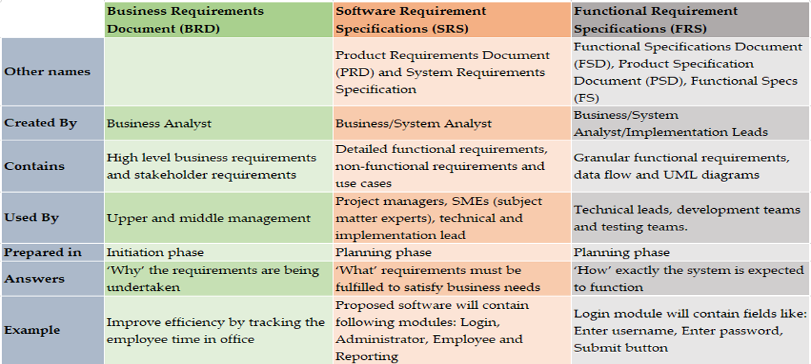
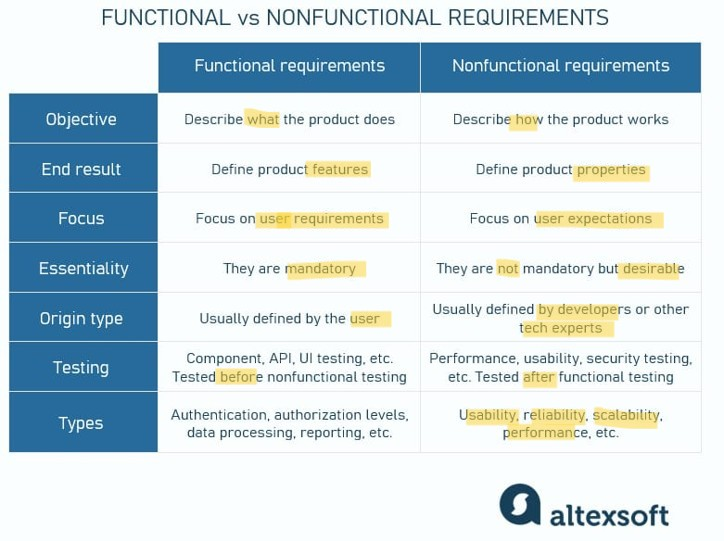

# APP Tech: wk01

[Back](../../app_tech.md)

- [APP Tech: wk01](#app-tech-wk01)
  - [Software architect](#software-architect)
    - [Operating Model](#operating-model)
    - [Target Operating Model(TOM)](#target-operating-modeltom)
    - [Architect – Deliverables](#architect--deliverables)
  - [Technical Solution Analyst](#technical-solution-analyst)
    - [Solution Analyst – Deliverables](#solution-analyst--deliverables)
  - [Cloud computing models](#cloud-computing-models)
  - [Application Architectures](#application-architectures)
    - [History](#history)
    - [Mainframe](#mainframe)
    - [Desktop (client-server)](#desktop-client-server)
    - [Tiers and layers](#tiers-and-layers)
      - [1-Tier](#1-tier)
      - [2-Tier Architecture](#2-tier-architecture)
      - [3-Tier Architecture](#3-tier-architecture)
      - [Why 3-Tier is used at an Organization](#why-3-tier-is-used-at-an-organization)
    - [Service Oriented Architecture](#service-oriented-architecture)

---

## Software architect

- `Software architect`

  - Provides architecture and technology leadership and **guidance** to project delivery teams as they develop technology solutions
  - a **subject matter expert** supporting the business and strategic technology initiatives
  - provides **expertise** and **counsel**; ensuring technology teams and business areas understand the **architectural options** and technology choices in support of their business.
  - **recommend solutions** that account for **total cost** of ownership, risk and leverage (or advance) strategic enterprise assets.

- Software vs IT architect
- Zooming in and zooming out
- Understanding the **business**
- Understanding the **trade-offs**
- Understanding the **strengths** of their software/IT teams
- **Communications** with all involved audiences
- Software architects care about **IT infrastructure**
- Consider scale & cost
- Assessment of **options**
- Regrettable **spend**
- **Non-functional requirements**
- Data **modelling**
- **Integration** points

---

### Operating Model

- **Processes**
  - Workflows, operating procedures, interactions between roles
- **Assets**
  - People, equipment, locations, IT
- **Configuration**

  - Organization structure, roles, decision making and delegation
  - Culture, training, hiring

---

### Target Operating Model(TOM)

- A way to **formulate business** transformation strategy
- Given the business’s mission and business model
- **Examine** effectiveness/performance of **current operating model**
- Identify improvement/optimization (**transformation model**)

Mission Model(WHY) -> Business Model(What) -> Value Model(How) -> From current operating model -> (When&where) transformation model -> Targetd model

- TOGAF Model: The Open Group Architecture Framework

---

- `Conway’s Law`
  - the system/software **design** is affected/constrained by the **communication structure** of the organization developing it
  - The system built by an organization will **tend toward** the **structure of the organization**
  - **Architecture** of the system will **mimic** how **teams** that build it are **defined**

---

### Architect – Deliverables

- Architecture **Assessment of Options**评估可选项
  - Used to outline potential **architecture options** with pros/cons to be used to communicate and collaborate between stakeholders **to reach a recommendation**
- Architecture **Blueprint**勾画出蓝图
  - Captures the architecture **solution** for a specific project.
  - **Outlines aspects** such as - components, integrations, data, security, infrastructure / how it addresses non-functional requirements, alignment to architecture strategies / target state, risks, etc
- **TOM – Target Operating Model**记档目标模型
  - **Document** primarily delivered by business architecture to feed into Enterprise Architecture process to document a target state architecture.

---

## Technical Solution Analyst

- `Technical Solution Analyst`

  - Combines **technical expertise** with understanding of the **business**
  - ”Translates” between business and technical requirements
    - Sometimes literally
  - Mostly found in **large** technology organizations, needed across a vast array of industries
  - Work closely with the **Architect and the technical teams** to ensure what is being designed corresponds to **business needs**
  - Define/refine the **scope** and **requirements**
  - Identify **key issues**, risks and trade-offs
  - Research and define **possible solutions**
  - Supporting **recommendations**

---

### Solution Analyst – Deliverables

- Technical **Requirements**
  - Define how a project or system must operate and **what it must accomplish** in order to be successful
- What – **functional** requirements
- How – **non-functional** requirements
- Performance, reliability, and availability targets your project must meet

- Possible **Outcome** of Technology & **Recommendations**
  - How will is **solve** the problem that is being faced or adding something new to the company, who will **benefit**
  - The **costs** and **trade-offs** of different technical **options**
  - Using the **Technical Requirements** to show correspondence to the **business requirements**
  - Provides technical **expertise** using past experiences, research and technology knowledge to provide **recommendations**.
  - Provides a **bridge** between business and technical teams

---

## Cloud computing models

- `Infrastructure as a Service (IaaS)`: **servers**, networking, data centre, virtualization
- `Platform as a Service (PaaS)`: IaaS + **OS**, development environment, analytics
- `Software as a Service (SaaS)`: complete **application**
- Private cloud

- Cloud computing - tradeoffs
  - Cost
    - CapEx vs. OpEx
    - Labour
  - Vendor lock-in

---

## Application Architectures

### History

- Evolution of application architectures follows **history of computing**
- Each aimed to build on and **solve deficiencies** of predecessors
- Each involves trade-offs and none are fully “obsolete” or “superior” regardless of novelty

- Mainframe
- Desktop
- 2-tier client/server
- Multi-tier client/server
- Web
- Service Oriented Architecture

---

### Mainframe

- A **Central Processing System** (Mainframe) provides all processing.
- **Local** Terminals are responsible for **display** and **keyboard** for user input and viewing capabilities.
- Local Terminals do **not contain any processing capabilities**.

- Advantages:

  - 1. Data is **centralized**, and therefore **secure**
  - 2. Dumb terminals are **not costly**

- Disadvantages:
  - 1. Load on the **network** is **high**
  - 2. **Mainframe** has to handle all the processing alone

---

### Desktop (client-server)

- With development of the PC, they took on the role of terminals
- Their processing power can be used to take on **some of the workload**
- Server could be anything from mainframe to just another PC

- Advantages:

  - Processing load is shared between client and server

- Disadvantages:
  - Server still continues to get loaded

---

### Tiers and layers

- Application’s **components** can be written in a **layered architecture**,

  - e.g. 3 layers:
    - Presentation
    - Business logic
    - Data access

- `Layers`
  - a **virtual/logical separation** within an application’s source code
- `Tiers`
  - a **physical distribution** of components across different **servers or locations**
  - Components communicate across tiers using the network

---

#### 1-Tier

- All 3 Layers are on the **same machine**
- All **code** and **processing** kept on a **single machine**
- Presentation, Logic, Data layers are **tightly coupled**

- Trade-offs
  - **Simplicity**, Development time
  - **Performance**: depends on your use case
  - **Scalability**: When data or processing needs **grow**
  - Reliability: Uptime is **harder** to maintain
  - **Maintenance**: Lack of redundancy makes it **difficult**

---

#### 2-Tier Architecture

- Split up application components into **separate physical tiers**
- **Client** hosts the `presentation layer`
- **Server** hosts the `data access layer`
- Business logic layer can live on **either**, or **both**

- Database runs on a **separate server**

  - Separated from the client
  - Allows more flexibility in maintenance, upgrades and scale-up

- If **client** executes application logic

  - Limited by **processing capability** of client workstation (memory, CPU)
  - Requires application logic to be **distributed** to each client workstation

- Pros

  - Development:
    - Can work for a number of **less complex use cases**
    - Simpler structure > **faster development**
    - Easier and/or cheaper to **deploy** and maintain
  - Performance:
    - Adequate performance for **low to medium volum**e environments
    - Business **logic** and **database** are on **same host**, which can lead to **higher performance**

- Cons
  - Development:
    - **Complex** application rules **difficult** to implement in **database server** - requires more code for the client
    - **Complex** application rules difficult to implement in **client** and can have poor performance
    - Changes to business logic not automatically enforced by a server - **changes require new client** side software to be distributed and installed
    - Not portable to other database server platforms
  - Performance:
    - Components communicate across tiers using the **network**
    - Potential bottleneck on retrieval of **data over network**
    - Extra **processing power**

---

#### 3-Tier Architecture

- Presentation tier

  - Provides user interface
  - Handles the interaction with the user
  - Sometimes called the GUI or client view or front-end
  - Should **not contain business logic or data access code**

- Logic tier

  - This layer coordinates the application, processes commands, makes logical decisions and & aluations, and performs **calculations**.
  - It also **moves and processes data** between the two surounding layers.
  - The set of rules for processing information
  - Can accommodate many users
  - Sometimes called `middleware` or `back end`
  - Should **not contain presentation or data access code**

- Data tier

  - Here information is stored and retriered from a **database or file system**.
  - The information is then passed back to the logic tier for processing, and then entually back to the user.
  - The physical storage layer for **data persistence**
  - Manages access to DB or file system
  - Sometimes called `back end`
  - Should not contain presentation or logic code

- Multi-Tier Client/Server

  - Web applications are typically multi-tiered by nature
  - 3-tier is most common
    - **Database Server** for storing data / persisting state
    - **Application Server** for business logic
    - **Browser** for presentation

- Architecture Principles

- Client-Server architecture
  - Each tier (Presentation, Logic, Data) should be **independent** and should **not expose dependencies** related to the implementation
  - Unconnected tiers should not communicate
  - **Change** in the platform **affects only the layer** running on that particular platform

---

#### Why 3-Tier is used at an Organization

- Independence of the Layers
- Easier to maintain
- Components are reusable
- Faster development (division of work)
  - Web design does presentation
  - Software engineer does the logic
  - DB admin does the data model

---

- **Layering** benefits include the following:

  - Your **code** will be easier to **understand**. Since this is one of the most widely used architectures, everyone has run into it and can follow it. The language used for most layers can be understood without much thought or explanation.
  - The **pattern** is easy to **follow** when writing new features. There isn’t a lot of mental gymnastics you have to do in order to understand how everything is tied together.
  - **Testing** is easier, as each layer is encapsulated and **modular**. Any calls outside the current layer should be using interfaces, which makes mocking in tests simple as well.
  - Your **application** is easy to **extend**. Whether it’s adding additional components or modifying existing ones, there’s an easy pattern to follow.

---

### Service Oriented Architecture

- Organize application around **loosely coupled services**
- each **service** can be **hosted** on different **infrastructure**
- Services communicate using a **common protocol**
  - E.g. using an API over the network
- Typically employed by **larger organizations** for more complex applications

- advantages

  - **Reusability** and **flexibility**
  - A service can be upgraded or rewritten in **isolation**
    - Just conform to an agreed-upon API
  - Services can be **heterogenous**
    - Different programming languages, OS, infrastructure
    - Mix and match in-house and purchased services
  - Scalability and resilience
    - Quickly respond to changes in your business

- drawbacks

  - Design **complexity**
    - To fully take advantage of SOA, service boundaries must be well thought-out
    - **API** that fully accounts for communication between services
  - More communication over the network
    - Potential bottleneck
  - More resources needed
    - Each service hosted in its own environment, e.g. OS instance

- `Service Oriented Architecture (SOA)`

  - a **style of software design** where **services** are provided to the other components **by application components**, **through a communication protocol** over a network.
  - A `SOA service` is a **discrete unit of functionality** that can be **accessed** remotely and acted upon and updated independently, such as retrieving a credit card statement online.
  - SOA is also intended to be **independent** of vendors, products and technologies.

- Benefits:
  - SOA offers **flexibility** by providing **infrastructure automation** and necessary tools, thereby achieving a **reduction in integration costs**, as well as their quick and effective coordination.
  - “The significance of SOA architecture is that it enables the company's IT structures to **align to business goals**.”
  - **Reusable code**
    - use **standalone services** instead of building **dependencies** into application code
  - More fine-grained **scalability**
    - add **resources** to heavily used services, improve network bandwidth, add more **nodes**, etc
  - Easier to make **improvements**
    - swapping services in and out as needed
    - As long as your API is well-designed

---

[TOP](#app-tech-wk01)
