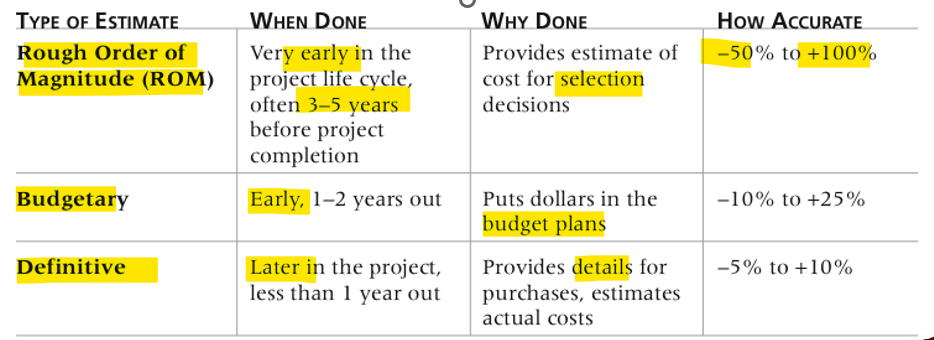
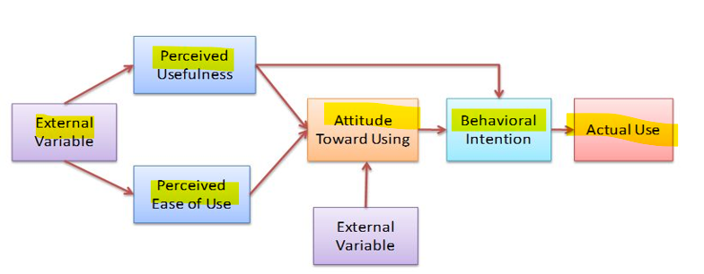
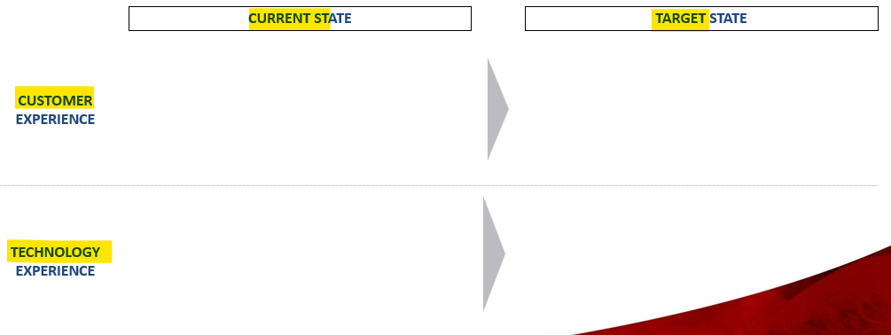

# App: Wk02

[Back](../../app_tech.md)

- [App: Wk02](#app-wk02)
  - [Service Oriented Architecture](#service-oriented-architecture)
    - [SOA - Governance](#soa---governance)
  - [Procurement](#procurement)
    - [Factors to consider when sourcing a vendor](#factors-to-consider-when-sourcing-a-vendor)
    - [Time estimation](#time-estimation)
    - [Basic Principles of Cost Management](#basic-principles-of-cost-management)
      - [Total Cost of Ownership](#total-cost-of-ownership)
      - [Cash Flow Analysis](#cash-flow-analysis)
    - [Estimating Costs](#estimating-costs)
    - [Responsibility Assignment Matrix](#responsibility-assignment-matrix)
    - [Planning – Procurement Management](#planning--procurement-management)
  - [Compatibility](#compatibility)
    - [Technical Compatibility Issues](#technical-compatibility-issues)
    - [Business, social \& personal compatibility](#business-social--personal-compatibility)
    - [Compatibilities Failures](#compatibilities-failures)
    - [Use of Compatibility to Move Technology Forward](#use-of-compatibility-to-move-technology-forward)
    - [Changing Technology Experiences](#changing-technology-experiences)
  - [Technology Acceptance Model](#technology-acceptance-model)
  - [TOM](#tom)
    - [Problem Statement](#problem-statement)
    - [Target State Vision](#target-state-vision)
    - [People Impacts](#people-impacts)

---

## Service Oriented Architecture

- `Service-oriented architecture (SOA)`

  - a style of software design where **services** are provided to the other components by application components, through a **communication protocol over a network**.
  - A SOA service is a **discrete unit of functionality** that can be accessed remotely and acted upon and updated **independently**, such as retrieving a credit card statement online.
  - SOA is also intended to be **independent** of vendors, products and technologies.
  - significance of `SOA architecture` is that it **enables** the company's **IT structures to align to business goals**.”

- **Reusable code**
  - use **standalone services** instead of building **dependencies** into application code
- **More fine-grained scalability**
  - add **resources** to heavily used services, improve network **bandwidth**, add more nodes, etc
- Easier to make **improvements**

  - **swapping** services **in and out** as needed
  - As long as your API is well-designed

- Organize application around **loosely coupled** services
  - each service can be hosted on **different infrastructure**
- Services communicate using a **common protocol**
  - E.g. using an **API** over the network
- Typically employed by **larger** organizations for more **complex** applications

- Advantages

  - **Reusability** and **flexibility**
  - A service can be **upgraded** or rewritten in **isolation**
    - Just conform to an **agreed-upon API**
  - **Services** can be heterogenous(异种的)
    - Different programming **languages**, OS, infrastructure
    - Mix and match **in-house** and **purchased** services
  - **Scalability** and **resilience**
    - Quickly respond to changes in your business
  - SOA typically **maps** well to various **cloud** platforms
    - PaaS, SaaS
    - Partially or fully deploy your application in the cloud

- drawbacks
  - Design **complexity**
    - To fully take advantage of SOA, **service boundaries** must be well thought-out
    - **API** that fully accounts for **communication** between services
  - More **communication** over the **network**
    - Potential **bottleneck**
  - More **resources** needed
    - Each service hosted in its own **environment**, e.g. OS instance

---

### SOA - Governance

- To achieve the goals and promises of SOA, services need to **exist in a structured environment**
- **Central registry** (services, IT assets)
  - Avoids duplication of efforts and improves efficient use of resources
- **Observability**
  - Maintenance, quality metrics, response to issues
- **Compliance** with laws (ethics, **privacy**) and company rules
- Best practices
  - Reference service, API standards

---

What is build versus buy do in an organization?
What is procurement?
Why is it important to know the costs and the benefits of the technology?
Methods to determine the costs

## Procurement

- `Procurement`
  - Project term
  - an act of selection
  - **Determining what to procure** and **when** and **how** to do it
  - Identifying which project **needs** can best be met by using products or services outside the organization
    - If there is **no need** to buy any products or services from outside the organization, then there is no need to perform any of the other procurement management processes

---

### Factors to consider when sourcing a vendor

- **Cost**

  - a **resource sacrificed or foregone** to achieve a specific objective or something given up **in exchange**.
  - Costs are usually **measured in monetary units** like dollars
  - More than just price of e.g. **licence**

- How well does it **meet** the business requirements?
- **Scalability**
- **Service**, **Installation** & **Support**
- **Reputation** of vendor and their strength in the marketplace

---

### Time estimation

- Instead of providing activity estimates as a discrete number, such as four weeks, it’s often helpful to create a **three-point estimate**
  - an estimate that includes an **optimistic**, **most likely**, and **pessimistic** time estimate
- Three-point estimates are needed for `PERT` and `Monte Carlo` simulations

---

- `Program Evaluation and Review Technique (PERT)`
  - Estimated **completion time** for multi-component activities
  - Combine **three-point estimates** of components into a weighted average
  - get **completion estimate** for **entire** project
  - Other techniques exist, with various **statistical assumptions**

---

### Basic Principles of Cost Management

- Business language/terms used in cost management analysis in an organization:
- `Profits`
  - revenues minus expenditures
- `Profit margin`利润率

  - **profit** as **percentage** of **revenue**

---

#### Total Cost of Ownership

- `Life cycle costing`
  - considers the **total cost of ownership**, or **development** plus **support** costs, for a project
  - Cost of deploying and using an application **through its lifecycle**
  - **Up-front costs**
    - Purchase (licence, hardware assets)
    - Configuration / customization (if procured)
    - Training
    - Migration from existing system
  - **Operating costs**
    - Maintenance / upgrades
    - Personnel
    - Scaling costs
    - Hardware, licences, cloud pricing
- **Cloud pricing**
  - Pricing depends on type of cloud **offering**
    - Comparison requires thorough understanding of application architecture and workload patterns
    - E.g. constant vs spike workloads
  - **Data storage**
    - Storage, ingress, egress (e.g. in $/TB/month)
  - **Computation**
    - Pay as you go, reservation
- **Retirement**
  - Migration of data
  - **Compatibility** with future applications/components
    - Use of industry standards, open standards

---

#### Cash Flow Analysis

- `Cash flow analysis`

  - determines the estimated **annual costs and benefits** for a project and the resulting **cash flow** (annual, monthly, etc.)
  - Expenditures and revenues per year, month, week, etc.
    - What **impact** will your application have on both **expenditures** (i.e. its direct costs), and **revenues** (what business process it will improve)?
    - How constant will the costs be over the life cycle of the application
  - Cash flow problems can **kill promising projects and entire companies**

- Types of Costs and Benefits
  - `Tangible costs` or `benefits`
    - are those costs or benefits that an organization can **easily measure in dollars**
  - `Intangible costs` or `benefits`
    - are costs or benefits that are **difficult to measure in monetary terms**
    - e.g., Brand, reputation, staff retention
- `Direct costs`
  - costs that can be **directly related to producing** the products and **services** of the project
- `Indirect costs`
  - costs that are **not directly related** to the **products or services** of the project, but are indirectly related to performing the project
    IT, management, buildings
- `Sunk cost`
  - money that has **been spent in the past**;
  - when deciding what projects to invest in or continue, you should **not include sunk costs**

---

### Estimating Costs

- `Cost estimates` are critical in order to complete projects within budget constraints

  - types of cost estimates
  - how to prepare
  - typical problems with IT cost estimates

---

- Types of Cost Estimates
  - The number and type of cost estimates **vary** by application **area**
  - **Association for the Advancement of Cost Engineering International** identifies **five types** of cost estimates for construction projects:
    - order of magnitude, conceptual, preliminary, definitive, and control
  - Estimates are usually done **at various stages** of a project and should become **more accurate** as time progresses
  - A **large** percentage of total project costs are often **labour costs**

- Tools and Techniques
  - **Analogous** or **top-down estimates**:
    - use the **actual cost** of a **previous, similar** project as the basis for estimating the cost of the current project
  - **Bottom-up estimates**:
    - involve estimating **individual work items** or **activities** and **summing** them to get a project total
  - **Parametric modeling**
    - uses design **characteristics** in a **mathematical model** to estimate project costs
      - Past productivity (lines of code per developer), function points

---

- Typical **Problems** with IT Estimates
  - Estimates are done **too quickly**
  - People lack estimating **experience**
  - **Bias** toward **underestimation**
    - Present **best case scenario** and gloss over risk
  - Management desires **accuracy**
  - Very highly **dependent on assumptions**
    - Lack of reliable data
      - e.g. simplistic statistical estimates of productivity
    - “lines of code”

---

- **Sample Cost Estimate**

  - Before creating an estimate, know what it will be used for, **gather** as much information as possible, and **clarify** the ground rules and assumptions for the estimate
  - If possible, **break down estimate costs** by major categories
    - **Work Breakdown Structure**
    - **Hierarchical structure** that can map to teams/team members
  - Create a cost model to make it easy to make changes to and document the estimate

---

### Responsibility Assignment Matrix

- `Responsibility Assignment Matrix`
  - A **table mapping** the **work** of the project as described in the **WBS** to the **people** responsible for performing the work as described in the OBS
  - Can be created in different ways to meet unique project needs

---

### Planning – Procurement Management

- `Procurement` means acquiring goods and/or services from an outside source
- Other terms include `purchasing` and `outsourcing`

- Determining **what** to procure and **when** and **how** to do it
- **Identifying** which project **needs** can best be met by using **products** or services outside the organization
  - If there is no need to buy any products or services from outside the organization, then there is no need to perform any of the other procurement management processes

---

Compatibility/examples
Challenges in adoption of new technology
Technology Acceptance Model - TAM

## Compatibility

- `Compatibility` / `interoperability`
  - The capacity of two or more systems to **operate effectively together**
- Directly **impacts** the operational **costs** of adopting a technology or application, and **decision** to adopt
- **Technical** compatibility issues
  - How applications **fit into the technology stack**, how “future-proof” they are
- Organizational or **business** compatibility

  - How applications conform to (and alter) pre-existing \*\*business processes

- `forward compatible`
  - Products that are designed to be **compatible with future versions** of themselves
- `backward compatible`
  - Products designed for **compatibility with older versions**

---

### Technical Compatibility Issues

- Data storage/transmission formats
  - File **formats** (e.g. word processor)
  - Communication **protocols** (e.g. RPC between two systems in distributed arch)
- Standards **compliance** (e.g. DICOM for medical systems)
- **Cross-platform** compatibility

  - Is the application written with **cross-platform** flexibility in mind
  - Cloud & hosted, different OS & processor architecture

- Are **security** needs of your business being met?
  - **Authentication** & **authorization** model
    - e.g. how an application’s access control model (RBAC) maps onto your security and access control practices of your business
  - **Third-party** integration risks
    - Where and how does your data **travel**, where and how is it stored (**at rest**)
  - **Regulations** and laws
    - Some industries have stringent privacy and transparency laws and zealous regulators
    - Finance, healthcare

---

### Business, social & personal compatibility

- Prior **experiences**
- **Existing practices** and values
- **Communications** between teams
  - How persistent are communication ”silos”?
- Preferred **work styles**
  - How independent and ”opinionated” are the users of your application?
- Technology changes often imply changes to:
  - workflow, schedule, work style, etc.

---

### Compatibilities Failures

- **Neglected** to assess the alignment with business requirements.
- Lacks insight into **user perspectives** and past **experiences**.
- Prioritizes revenue and cost considerations at the expense of potential benefits.
- **Overlooks** future **scalability** and technological **advancements**, focusing solely on current needs.
- Neglects to leverage **past lessons** as guiding principles for future actions.
- Addresses the needs of one department without considering **integration** with other systems.

### Use of Compatibility to Move Technology Forward

- **Compatibility beliefs** are instrumental in forming the mindset of the `usefulness and ease of use` for the technology
- As a technology professional it is your **responsibility** on accountability to understand the connection between the **use** of the technology and the **users** of that technology; \
  - they need to be a symbolic relationship that **provides beliefs** about its `usefulness and ease of use`
- Those who are implementing new technology need to pay attention to various ways the technology is **shaped**
  - There is a **strong connection** between the **workflow** enabled by technology and the current and preferred **work styles**
- People **resist change** by nature
  - show them this is a **solution for them** and its **benefits**, people and technology are now interwoven in all our experiences, both personal and professional

---

### Changing Technology Experiences

- There is no doubts that the **adaptation of technology**, its **use**, usefulness and abilities to provide efficiencies play a crucial role in its **creation** and its **longevity**. 有用性是新科技的产生的重要因素。
- Understanding the **factors** influencing technology adoption helps us **predict and manage** who adopts, when, and under what conditions. 了解因素有利于预测和管理谁，何时，什么条件采纳。
- New technologies come with various **social and economic advantages**, these must be **planned** and accounted for **prior to the undertaking** of new technology or system.采纳前必须计划和应对新科技的社会和经济效益。
- One **cannot** and should not excuse the role that compatibility plays in the creation, planning and delivering of technology in the work place or market place, **failure** to do so can be very reason that it is **not successful**. 不能为适用性作用找借口
- As a technologist you need to consider the **psychology of the users** as well. 必须考虑用者心里

---

## Technology Acceptance Model

- Seeks to **explain** and **predict** users' **acceptance and adoption** of new information technologies based on their **perceived** usefulness and perceived ease of use
- **Perceived Usefulness** (感知有用性)
  - degree of **user’s belief** that using this technology would **enhance their job performance** or make tasks easier
    - e.g., perceived effectiveness, productivity gains
- **Perceived Ease of Use**(感知易用性)
  - degree of **user’s belief** that using this technology be **free of effort** or friction
  - learning curve, user-friendliness, intuitive design

- `Attitude Toward Using`
  - user’s **overall favourable/unfavourable evaluation** on merits of using the technology
- `Behavioural Intention`
  - **readiness/unreadiness** to put technology into **use** (the decision point)
- `Actual Use`

---

- How does TAM inform our approach at introducing new technology in an organization?
  - Focus on **gauging** and **influencing** `perceived usefulness & ease of use`
    - Communications, marketing
    - Documentation, training
    - Monitoring adoption, surveying user experience
    - First impressions are important

---

## TOM

1. **Problem** Statement
2. Technology **Target State**
3. Technology **Assessment** Summary
4. Impacted Consumers - **People**
5. Investment Recommendation #1
6. Investment Recommendation #2
7. Quick **Wins**
8. **Final** Recommendation

---

### Problem Statement

- List what is **currently occurring** with the application/solution and **why** it is in the company’s **best interest** to solve for it
- `Target State`
  - identify the **target state** of the IT systems **architecture** and principles to **support** the processes and people.
- Considerations must be given to any changes needed in:

  - Infrastructure
  - Hardware
  - Computer systems
  - Manual systems
  - Data feeds
  - Other supporting technologies

---

- Not just the **technology** to consider but also significant **business benefits** for a holistic approach.
- Yes, **technology** does play a huge role but analyses have shown that it **hasn’t been the best driver of change**.

  - At the same time, it’s generally not the reason for transformation failure.
  - In fact, in many cases, smart, well thought out investments were made in all of the right technologies and yet failures still took place.

- Organizations have focused on new business models with too narrow a view, concentrating only on revenues and profits without considering key customer-driven business objectives.

  - This often leaves the door open to disruptors. It is becoming evident that the best way to avoid this common mistake is to address the “business culture” holistically. To the detriment of the enterprise, words like culture and holistic are taken too lightly. We are not talking here about the culture of a country or region. In this context we are referring to a Business Culture, which is defined by the “habits” of that business – habits that an enterprise exhibits across people, processes, systems, partners, organization and management. This business culture can be documented and addressed as an operating model

- We’ve found that legacy operating models are rife with bad habits.
  - Keep in mind these can be practices that worked well in the past but are now outdated and obsolete. In other words, many of these habits weren’t always bad. Time and market forces have just made them that way. But the truth is, certain legacy habits can be even more detrimental than legacy systems. And a company can have a great vision, a strong business objective and a portfolio of wisely purchased tools and hardware, but can still fail at transformation because they haven’t owned up to their “bad”, outdated corporate habits.

---

### Target State Vision

### People Impacts

- Identify for the new technology or process:
  - **Roles** required, **Team**/department total number etc.
  - Who is the targeted **audience**, who else will need to see the information in this document?
