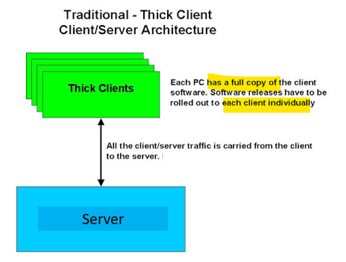

# App: Wk04

[Back](../../app_tech.md)

- [App: Wk04](#app-wk04)
  - [Thin and Fat Clients](#thin-and-fat-clients)
  - [Software Application](#software-application)
    - [Definition](#definition)
    - [Functions of Application Software](#functions-of-application-software)
    - [Business application software](#business-application-software)
  - [Fat Client](#fat-client)
    - [Benefits](#benefits)
    - [Drawbacks](#drawbacks)
  - [Thin Clients](#thin-clients)
    - [Benefits](#benefits-1)
    - [Drawbacks](#drawbacks-1)
  - [Thick versus Thin](#thick-versus-thin)

---

## Thin and Fat Clients

## Software Application

### Definition

- `Application software` (app for short)
  - a program or group of programs designed for end-users.
  - e.g., a word processor, a spreadsheet, an accounting application, a web browser, an email client, a media player, a file viewer, simulators, a console game, or a photo editor.
- `Software`

  - a set of programs designed to **perform a well-defined function**.
  - A program is a **sequence of instructions** written to solve a particular problem.

- **Choosing the right** application software for business or personal use can **improve function and efficiency**.
  - If you **don't understand** the options, you could propose something that **doesn't benefit** your business or, worse yet, hurts productivity, costing time and resources.
- **Understanding** what **types** of application software is available for the requirements given, be they **ready-made apps** (shrink wrapped) or **custom app** builds uniquely designed for your requirements, will help you to more clearly assess all of your options prior to giving your recommendation to the business and technical teams.

---

### Functions of Application Software

- Application software programs are created to facilitate a variety of functions, including but not limited to:
  - **Managing** information
  - **Manipulating** data
  - Constructing **visuals**
  - Coordinating **resources**
  - **Calculating** figures
  - Creating **graphics**, art etc
- ?? What do you use application software for??

---

- The **most common** application software programs are used by millions every day and include:
  - **Microsoft suite** of products (Office, Excel, Word, PowerPoint, Outlook, etc.)
  - Internet **browsers** like Firefox, Safari, and Chrome
  - **Mobile** pieces of software such as Pandora (for music appreciation), Skype (for real-time online communication), and Slack (for team collaboration), Zoom , WhatsApp etc

---

### Business application software

- `Business application software`
  - a **subset** of application software.
  - built to facilitate certain **business functions**, improving the accuracy, efficiency, and effectiveness of operations.
- Business application software programs **achieve measurable objectives** such as saving work time and **enhancing productivity**.
- Below are some popular examples of business applications that are commonly used by organizations:
  - `ERP` - Enterprise Resource Planning
  - `CRM` - Customer Relationship Management
  - `BPM` - Business Process Management
  - `Productivity Software`

---

## Fat Client

- `Fat client(thick client)`
  - a form of **client-server architecture**.
  - a networked computer system **with most resources installed locally**, rather than distributed over a network.
  - Thick client devices can be, for example, PCs, because they have their **own hard drives, software applications and other local resources**.
- Most, if not, **all essential components** related to the application are **contained in a thick client**.
- **Workplaces** will commonly provide thick clients to **employees** so they can **work offline**.
- With thick clients, there is **no need** to have **continuous server communication**.

---

- Features:

  - `Thick clients` are connected to a server **over a network connection** but don't need to have a maintained connection.
  - The **temporary connection** is needed to **download** programs, data and **updates** to the system.
  - thick clients **don't** need to **consume** any **server** computing **resources**.
    - Most resources will be available on the client, so it **can function independently**.

- Scenarios:

  - the **primary server** has **limited** storage and computing capacity
  - experiences high network speeds
  - work-from-home environments

- `rich client`
  - a system that has some components and software **installed** but also **uses resources distributed** over a network

---

### Benefits

- **Working offline**
  - the ability to work offline
  - Thick clients normally **have the hardware and software** requirements to work as needed, often **without** needing to be **connected to a central server**.
- **Server connection**
  - `Thick clients` don't need to **maintain constant connections** to central servers.
  - Once an **initial amount of information** is **gathered** from a server, server connections are generally not needed.
- **Fewer server requirements**
  - The **servers** that thick clients connect to **don't** need to be as **high-performing**.
  - Since the thick clients do a lot of the application processing, that can allow for cheaper servers.

---

- **Server capacity**
  - The use of thick clients normally means **more server capacity is available**.
  - With **fewer requirements** that a **server** has to provide to each individual client, the server can benefit more clients.
- **More flexibility**
  - Having a computer that **works off of its own local resources** -- operating system, user interface, storage -- means a large level of flexibility.
  - They should be able to **work from wherever**, as long as they are able to have a momentary **connection** to a central server to **download any needed data**.
- **Existing infrastructure**

  - many organizations may **already have fast enough local PCs** to implement an infrastructure to run thick clients with relative ease.

- **Storage**
  - Files and applications can be **stored** on the thick client, meaning they can be **accessed at any time**.
- **Computer performance**
  - Any application that would be resource or bandwidth-intensive should be able to **perform well** since resources are being taken **from the individual computers** and not being allocated by a central server.

---

### Drawbacks

- **Security**
  - The **individual** will now have to be **more responsible for the security and protection** of their computer, since data will be stored on the thick client. (e.g. your laptop)
- **Data storage**
  - Data storage can be a double-edged sword as **data** now needs to be **backed up** in order to ensure the data isn't gone forever if something goes wrong.
- **Investment into each client**
  - The hardware and software will have a **higher up-front cost**, and will then have a **continual cost in maintenance and updates**.
- **Maintenance**
  - May include **updates** for security or any **hardware and software** fixes across the connected clients.
- **Network traffic**
  - There can be a lot of network traffic since each client needs to bring data through a network to work on locally.
- **New applications**
  - New applications that a client may need may also have to be **uploaded** on other workstations.

---

---

## Thin Clients

- `Thin clients`
  - a l**ow-cost network computer** that **relies heavily on a server** for its computational role.
  - to **limit** the **local computing** capabilities to only essential applications.
  - more easily **manageable**
  - easier to **protect** from security risks
  - **lower** on maintenance and licensing **costs**.
  - **rely** on a **network connection** for computing and **don**'t do much processing on the **local hardware** itself.

---

- Features
  - all that work is **done by one or more servers**.
  - `dumb-terminals` or web interfaces are given to end users
    - Essentially all the thin client model does is **present** the user with an interface on their monitor and **accept** the users' **input** (mouse clicks and keyboard typing), **sending** it along to the server for processing.
  - All data, programs, and processing **remains on the server**.
    - In many ways this model is a **return to the mainframe model** of the 1950s.

---

### Benefits

- `Thin Clients` need **little** to no **maintenance**.
  - Only the servers need to be upgraded & maintained.
- Only the **server's hardware** must be **maintained** at levels acceptable for the software applications and the number of users (more users = more horsepower required for servers).
- **No data** can be **stored** on the **local** computer.
  - Thus data is better controlled and backed-up.
- If a **new application** is needed, it must only be **installed once - on the server**.

- **Network traffic** is made more predictable.
- Potentially depending on **the** data being **presented** to the remote user, **network** traffic may even be **reduced**.
  - Thus even with **minimal network bandwidth capacity** end users may not experience any slowness.
- This often results in much **lower total cost of ownership** for the organization versus the FAT client model.

---

### Drawbacks

- If users need to deal with a lot of **video & audio** (especially creation & editing) the centralization of thin client computing can tax the servers and network tremendously resulting **in poor performance**.
- The **servers** (their software and setup) are **more complex & expensive** than the servers the FAT Client model.
- The **downside** of centralization is a **single point of failure**.
  - Should your application **server fail**, **all your users** will be **affected**.
  - To mitigate this risk, IT must build in **redundancy** which **offsets** some (not all) of the **savings**.
- **Users** might be **tied to a terminal** and not able to move around the office or off the network to perform any of their work.

---

## Thick versus Thin

| Thick Client                                       | Thin Client                                                                       |
| -------------------------------------------------- | --------------------------------------------------------------------------------- |
| Can function independently of a central server     | Heavily dependent on the server                                                   |
| Expensive as they need more IT work to deploy them | Cost-effective as they are easy to deploy without any extra installation software |
| Utilizes more local resources                      | Utilizes less local resources                                                     |
| Data is stored locally                             | Data is stored on the server                                                      |
| Can function efficiently in offline mode           | Cannot function efficiently in offline mode                                       |
| Example: Personal Computers connected to LAN.      | Example: Web Browsers like Google Chrome and Apple Safari                         |
