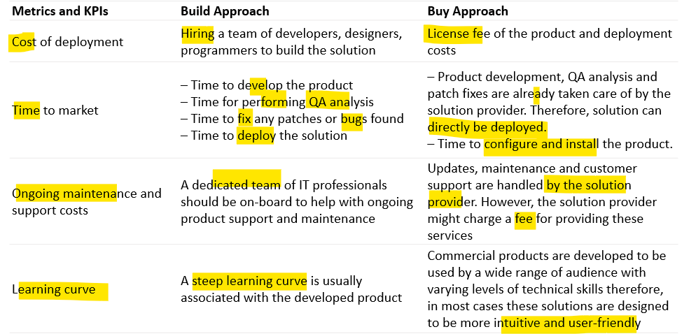

# App: Wk05

[Back](../../app_tech.md)

- [App: Wk05](#app-wk05)
  - [Enterprise Technology](#enterprise-technology)
    - [Enterprise](#enterprise)
    - [TSA’s role in the Enterprise](#tsas-role-in-the-enterprise)
    - [Understanding the Enterprise](#understanding-the-enterprise)
      - [stakeholders](#stakeholders)
      - [technology](#technology)
      - [mission being supported](#mission-being-supported)
    - [System Architecture](#system-architecture)
      - [Choosing the right Technology/Architecture](#choosing-the-right-technologyarchitecture)
      - [6-Step Process](#6-step-process)
    - [TSAs Role](#tsas-role)
    - [When to start designing Architecture](#when-to-start-designing-architecture)
    - [Four Points of View in Architecture](#four-points-of-view-in-architecture)
    - [EA models and methodologies](#ea-models-and-methodologies)
    - [Example Frameworks](#example-frameworks)
      - [The Zachman Framework](#the-zachman-framework)
      - [Unified Architecture Framework (UAF)](#unified-architecture-framework-uaf)
      - [Agile enterprise architecture](#agile-enterprise-architecture)
      - [TOGAF](#togaf)
  - [Enterprise Build or Buy](#enterprise-build-or-buy)
    - [Identify the problem that needs to be solved](#identify-the-problem-that-needs-to-be-solved)
    - [Requirements help Identify the problem](#requirements-help-identify-the-problem)
    - [Calculate the total cost of ownership](#calculate-the-total-cost-of-ownership)
    - [Understand the stakes](#understand-the-stakes)
    - [The gap analysis](#the-gap-analysis)
    - [The build or buy decision](#the-build-or-buy-decision)
    - [Compare the two approaches](#compare-the-two-approaches)
    - [When is ‘Building’ the right approach?](#when-is-building-the-right-approach)
    - [When is ‘Buying’ the right approach?](#when-is-buying-the-right-approach)

---

## Enterprise Technology

### Enterprise

- `Enterprise technology, information, and infrastructure`
  - information technology (IT) **resources** and **data** **shared across** an enterprise—at least across a sponsor’s organization, but also cross-organizational (multi-department, division etc).
- It includes such efforts as
  - **infrastructure engineering** for building, managing, and evolving shared IT;
  - IT or **infrastructure operations** for administering and monitoring the performance of IT services provided to the enterprise;
  - IT **services management**; and information services management.
  - IT **strategy and portfolio** management
  - IT **governance** helps the concept function effectively.

---

- `Enterprise technology` **streamlines workflows**, improves communication, and provides **access to data**.
- Enterprise technology makes it **easier** for the entire organization to **work seamlessly** and **achieve its goals**.
- **Increased agility**, **responsiveness**, and **security** are some of the aims of enterprise technology — or the systems, platforms, and tools that are shared across an organization.
- As a member of the IT team, it is important to **understand the breadth of technology** that exists.
- It is likely that you will be asked to evaluate or prioritize technology investments as part of your TSA role.

---

- Which technologies are **essential for your organization**?
  - The answer will vary **based** on your **size**, **industry**, and **objectives**.
  - Starting with a **clear IT strategy** helps to highlight **technology gaps and opportunities**.
  - Most IT teams develop an **evaluation process** for new technologies that account for multiple criteria.
  - These may include features and benefits, setup and maintenance costs, integrations, and security.
  - You need to understand how particular tools and systems meet current and future needs.

---

### TSA’s role in the Enterprise

- TSAs
  - expected to **understand** the **systems technical principles** to be applied to the enterprise-level IT programs they support.
  - expected to **understand** the larger **enterprise context** in which the programs operate.
    - For a particular enterprise-level program, you may be asked to play a role in **helping the customer define or refine business processes**, such as technical or systems engineering aspects of portfolio management, or operational constructs for shared infrastructure.
  - For mid- and senior-level TSA staff, the role often involves **recommending how to apply analysis, advice, processes, and resources** to achieve desired enterprise-level outcomes.
  - **Understanding** the **interconnections** and dynamics across the **different levels of an organization** or department structure is important to providing thoughtful, balanced recommendations.
  - Enterprise-level efforts **require many skills**.
    - TSAs may be expected to **support** enterprise architecture, technical evolution, preliminary **design of data** or **infrastructure** components, implementation, monitoring and operations of infrastructure, and technical **governance**.
  - **Critical areas** of focus normally include information assurance, data strategy, interoperability, application integration, information exchange, networks, and communications services

---

### Understanding the Enterprise

- In complex environments such as enterprise level IT programs, **three important factors** should be taken into consideration:
  - the **stakeholders**,
  - the **technology**,
  - the **mission** the IT supports.
- Failure in even one of these factors can cause total project failure.

---

#### stakeholders

- An “enterprise” usually involves a set of constituents with **various goals, requirements, and resources**.
  - Sometimes, these constituents’ considerations are **at odds with one another**.
  - **Vital** elements of the non-technical aspects of enterprise IT are **understanding the various stakeholders** and being able to **articulate needs from their perspective**.
- Several **methods** exist for **analyzing stakeholders**.
  - For instance, a simple `POET (Political, Operational, Economic, Technical)` analysis can be used to clearly articulate issues associated with stakeholders

---

#### technology

- A **wide array** of technology is associated with enterprise IT programs, from networking details to cloud computing and data centers.
- Keeping abreast of the **current trends** in the **appropriate areas** of your IT program allows you to address disruptive technology concerns and apply sound technical practice to the job.
  - Because **computing** is so **prevalent** in today’s society and it takes **many forms** from desktop PCs to handheld mobile devices, everyone touches technology and **has expectations from it**—often unrealistic.
  - Our sponsors and other program stakeholders are no different.
- The key to **managing technical expectations** is **knowing the technology and its applicability** and **having the trust** of the sponsor so you can help them recognize when something is too immature for implementation and not a shrink-wrapped, off-the-shelf bargain.

---

#### mission being supported

- The **ability to articulate the technical implications of mission needs** is arguably the most valuable systems engineering talent to bring to bear on customer programs.
- Enterprise technology succeeds by **anticipating end-user needs** and proactively **addressing them**, not waiting for breakage or unhappy users to complain that they are not being supported.

---

### System Architecture

- TSAs are expected to assist in or lead efforts to **define an enterprise architecture**, based on a set of requirements captured during the concept development and requirements phases of the systems development life cycle.
- The **architecture** definition activity usually **produces operational, system, and technical views**.
- This architecture **becomes the foundation** for developers and integrators to create design and implement architectures and views.
- To effectively communicate and guide the ensuing system development activities, TSAs should have a sound **understanding** of **enterprise architecture frameworks** and their use, and the **circumstances** under which each available framework might be used.
- They also must be able to **propose the appropriate framework** that applies to the various decisions and phases of the program.

- Architecture Framework, Models, and Views

---

#### Choosing the right Technology/Architecture

- The key **steps** of any **architecture evaluation approach** are:
  - Define the architecture **purpose**, **value**, and **decisions** it will support.
  - **Get information needed** to define the architecture from stakeholders as early as possible.
  - **Create, refine, and update** the architecture in an **iterative way** throughout the acquisition life cycle.
  - **Validate** that the architecture will **meet expectations** when implemented.
  - Define **roles for team members** to **guide** and **coordinate** their efforts.
  - Create **estimates** and **schedules** based on the architectural blueprint.
  - **Use** the architecture to **gain insight** into project performance.
  - **Establish** a lightweight, scalable, tailorable, repeatable process **framework**

---

#### 6-Step Process

- 1. determine intended user of the architecture
- 2. determine scope of architecture
- 3. determine data required to support architecture developement
- 4. collect, organize, correlate, and store architecture data
- 5. conduct analyses in support of architecture objectives
- 6. presen results that decision maker needs

---

### TSAs Role

- TSAs are expected to **understand the role that an architecture plays** in system development (e.g., conceptualization, development, and certification), the various **purposes** for architecture, and the **different types** of architectures.
- They are also expected to **understand** various architecture **frameworks, models and modeling, views and viewpoints**, as well as **when and why** each would apply.
- TSAs are expected to **understand** different architectural **approaches** and their **applications**

---

### When to start designing Architecture

- At this point in the systems development life cycle, an **operational need** has been expressed and **turned into** a concept and **set of operational requirements**
- They are then **analyzed and transformed** into a set of **system requirements**
- The next step is to **develop an architecture** (or update an existing architecture) as a basis or foundation **to guide design and development**.
- For Enterprise systems this can **include** _off the shelf_ Enterprise software and/or _custom developed_ enterprise software.

---

### Four Points of View in Architecture

- A view of enterprise architecture as containing four points of view:
  - the **business** perspective,
  - the **application** perspective,
  - the **information** perspective
  - the **technology** perspective.

---

- `business perspective`
  - defines the **processes and standards** by which the **business operates** on a day-to-day basis.
- `application perspective`
  - defines the **interactions among the processes and standards** used by the organization.
- `information perspective`
  - defines and classifies the **raw data** (such as document files, databases, images, presentations and spreadsheets) that the organization **requires** in order to operate efficiently.
- `technology perspective`
  - defines the **hardware**, operating systems, programming, and networking **tools** used by the organization.

---

- **Technical IT professionals** regard enterprise architecture strategies in terms of the **infrastructure, application and management components**
- For technical enterprise **architecture descriptions**, EA could **revolve** around the **context** of software architecture, systems architecture **deployment types** and other **steps** like testing.
- **Others** could view enterprise architecture based on **quality attributes**.
  - Examples include reliability, capacity, scalability and security.
  - **Quality elements** are **not functional** requirements, but are ways to determine acceptable operating conditions and necessary trade-offs to get there.
- Enterprise architecture, in a business context, may have organizations distinguish their **enterprise architecture** from the **technical architecture** required to build and run applications. 两种分离

---

### EA models and methodologies

- `Enterprise architectures` are typically implemented as **frameworks**.
- There are many different frameworks, and some will be a better fit than others when it comes to any one organization.
  - For example, a framework focused on consistency and relationships between various parts of an overarching enterprise will be more helpful to larger organizations with many moving parts compared to small ones.
- Frameworks exist to **help** businesses effectively **implement** and **track** their enterprise architecture **planning**.
- Enterprise architecture **can be vague(含糊的)** since it’s meant to address an **entire** organization, rather than individual needs or problems.
  - This is why frameworks are helpful, so businesses can establish processes or evaluate EA against their **long-term goals**.

---

### Example Frameworks

- `Zachman Framework for Enterprise Architecture`
  - which **covers six architectural points** as well as **six primary stakeholders** that aid in defining and **standardizing IT architecture components**.
- `Unified Architecture Framework (UAF)`
  - which is a complex but **flexible** enterprise architecture framework **suitable for military and government software development** as well as use in **commercial businesses**.
  - It's implemented as a **UML profile**.
- `Agile enterprise architecture`
  - which focuses an organization around a flexible, extended collection of **structures and processes that can grow**.
  - It can become an important part to agile software delivery.
- `TOGAF`
  - the `Architectural Development Method (ADM)`
  - The ADM provides a framework for the **architect development cycle**.
  - While it may look complicated, it all boils down to **organized teamwork**:
    - understanding a **common goal**,
    - communicating **changes**,
    - and working together **across teams**.

---

#### The Zachman Framework

- `Zachman framework`
  - a set of **detailed directions** of **how everything is connected**.
- The **categories** of this framework take various perspectives across the company. It asks six questions :
  - Who?
  - What?
  - When?
  - Where?
  - Why?
  - How?
- The perspectives are **organized in a top-down format**

  - It starts with the **C-level executive’s perspective**, trickles down to the perspectives of **management**, the enterprise **architect**, engineers, individual contributors, and **finally the end user**.

- `Zachman framework`
  - a lightweight model because it can be applied to many types of businesses.
  - However, this framework is **more descriptive** and **less prescriptive**.

---

#### Unified Architecture Framework (UAF)

- Associated with **UML**
- `UAF`
  - defines ways of **representing** an `enterprise architecture` that **enables** stakeholders to **focus on specific areas of interest** in the enterprise while **retaining** sight of the **big picture**.
- UAF meets the **specific** business, operational and systems-of-systems integration **needs** of commercial and industrial enterprises

- Provides a framework for enterprise analysis
- Common **terminology** across domains
- Common **concepts** and **models**
- Everybody **speaks the same language**
- UAF provides a set of **rules** to enable users to **create** consistent `enterprise architectures` (as models) based on generic enterprise and system concepts with rich semantics.
- These models then become the **repositories** from which various views can be extracted.

---

#### Agile enterprise architecture

- **Agile** is based on the **concept of “just in time.”**
- You can see this in many of the agile practices, especially in DevOps.
- **User stories** are **created** **when** they are **needed** and not before, and **releases happen** when there is appropriate **value** in releasing, not before and not after.
- Additionally, each **iteration** has a **commitment** that is met on time by the EA team.
- **Just-enough** `enterprise architecture`
- EA is missing the answer to the question of “what exactly is getting delivered?”
  - This is where we introduce the phrase “just enough, just in time” because stakeholders don’t just simply want it in time, they also want just enough of it — regardless of what it is.
  - This is especially important when communicating with non-EA professionals.
    - In the **past**, enterprise architects have focused on **delivering all** of the EA assets to stakeholders and demonstrating the technical wizardry required to build the actual architecture.

---

- **Agile EA Best Practices and Techniques**
  - **Campaigns**
    - Create a marketing-style **campaign** to focus on EA initiatives, gathering and describing only what is required to satisfy the goal of the campaign.
    - **Models**
      - At the start of the project, it doesn’t make sense to build a fancy EA that is going to change anyway.
      - Teams should strive to **build just enough architecture** to support the campaigns in the pipeline.
    - **Collaboration**
      - Agile teams certainly have high levels of collaboration, and that’s because that level is just enough to help them be successful.
      - In light of the global pandemic, such collaboration might be more difficult to achieve. But organizations can take advantage of collaborative enterprise architecture tools that support remote working.
    - **Planning**
      - In **iteration planning**, we don’t look at things outside the iteration. We do **just enough planning** to make sure we can **accomplish our goal** for the **iteration**.
      - Work packages and tasks play a large role in both planning and collaboration.

---

#### TOGAF

- `The Open Group Architecture Framework (TOGAF)`

  - the most used framework for enterprise architecture today

- it all boils down to **organized teamwork**:
  - understanding a common goal,
  - communicating changes,
  - and working together across teams.
- TOGAF argues for an “**Enterprise Continuum**.”
  - This includes **internal and external assets** like models, descriptions, and patterns that help inform your enterprise architecture.
- Simply put, it **accounts for the changing business environment** and **provides guidance** for managing **evolving architecture**.
- Some of the other **components** of TOGAF include:
  - Architecture vision
  - Migration planning
  - Implementation governance
  - Architecture change management
- This framework is comprehensive for nearly any business in any industry.
- Although the framework is **prescriptive**, it does **not prescribe** the number of iterations needed or the scope of each iteration.

---

## Enterprise Build or Buy

### Identify the problem that needs to be solved

- Pinpointing a specific **objective** as to **why software is needed** in the first place is key
- **Self-assessment** is the obvious first step for any tech planning.
- Figure out **what you need** and **how important** each requirement is.
- **Weighted scoring** is a powerful decision-making **tool**.
- Make sure you’ve identified where you are growing and your intended rate of growth, so you can plan adequate scalability.
- A **TSA** can see the **big picture** and how a proposed new software solution will fit into it.
  - If you’ve cobbled together disparate systems to meet various needs (which is very common during those start-up years), the current build or buy decision is a prime opportunity to **think holistically** about your enterprise tech platform.

---

### Requirements help Identify the problem

- Indeed, **large** organizations can **theoretically** meet all their requirements when they **build**, however, the question of **practicability** remains.
  - Enterprises always **balance** priorities given their resource availability, therefore, they might ultimately prioritize some requirements over others.
- There is also the question of **unknown requirements**, and it can be hard to identify them upfront.
  - Enterprises might need to use various tools and techniques to **unearth unknown requirements**
  - If you have thoroughly analyzed your requirements and decided to build your enterprise software, then you need to execute the requirements development phase well.

---

### Calculate the total cost of ownership

- The `total cost of ownership` is one of the most important **considerations** when deciding to build versus buy.
- The true cost of building, maintaining, and operating a long-term software solution can be **tricky to calculate**.
- **In-house solution** costs are rarely **predictable** and often result in **greater expenses** than expected.
  - According to a McKinsey survey of IT executives, large IT projects **run over budget 45%** of the time, while **delivering 56% less value** than planned. These high cost overruns can lead to project abandonment and internal dispute over how to solve the problem at hand.
- When exploring options to **buy** a software solution, an **initial cost** may cause sticker shock for some, but the cost benefits of **working with an expert third-party** are high.
- When the cost is given **up front**, it provides your organization and decision making committee with trans**parent information for budget and resource discussions**.

---

### Understand the stakes

- In a world of open-source development and 99-cent consumer apps, it can be **difficult** to understand the **value and benefits** that **enterprise-level software** offers.
  - Building a powerful enough software solution for enterprise typically **takes years** of work and expertise.
  - When an organization does take the leap to take on a development project, chances are, **third-party** solutions who specialize in building software are **already** ahead of the game.
- Even before writing a line of code, it’s important to **consider the long-term resource investment**.
  - **In-house development** requires continuous iteration, testing, training, monitoring, and many other technical updates in order to stay relevant and sticky.
  - There are situations where there may **not** be any **external vendors** who have tackled your specific enterprise needs yet

---

### The gap analysis

- Once the requirements list is **complete**, those requirements must be **rated for importance**.
  - This has the **added benefit** of building stakeholder **buy-in**.
  - The output of this exercise is a comprehensive **requirements profile** that adequately **captures organizational needs**.
- Use the completed **requirements profile** to create the **RFIs (or RFPs)** that will be sent to the **vendors**.
- Design the RFI to maximize vendor response.
  - You don’t want to miss out on the best-fit software because that vendor didn’t respond.

---

### The build or buy decision

- Once you have **fit scores** for the homegrown product and potential replacements, you can rationally answer the build or buy question.
- Assuming normalized fit scores where 100% means all requirements are fully met, if several cloud or off-the-shelf products have a fit score of **80** percent or more, then **buying** is the right way to go.
- If all **commercial products score** lower than **60**%, there are three other possibilities:
  - **Reduce the scope** of the project by **eliminating** certain **functionality**.
  - **Combining** one product with a **small custom code module**
  - **Combining** two or more **commercial products**
- Each of the above increases the fit score.
  - If none of these approaches works well enough, then building the app can be the right way to go.

---

### Compare the two approaches

---

### When is ‘Building’ the right approach?

- Building software is going to be **beneficial** for your business if:
  - The software is going to give you a **sustainable competitive advantage**
  - **No** other available **solution** can meet your business needs
  - The **end-points** from where your business collects data are **not** volatile or prone to **frequent changes**
  - You have **substantial resources** to cover the costs associated with building and maintaining the software

---

### When is ‘Buying’ the right approach?

- You should opt for buying a commercial software product if:
  - **Building** an enterprise application is **not the core of your business** and is **not** going to **yield** you any **competitive advantage**
  - There are **solutions available** that address the challenges your business is facing
  - You have **limited resources** and you would rather invest them in improving your core business activities
  - You are looking for a **quick solution** that can be immediately deployed
