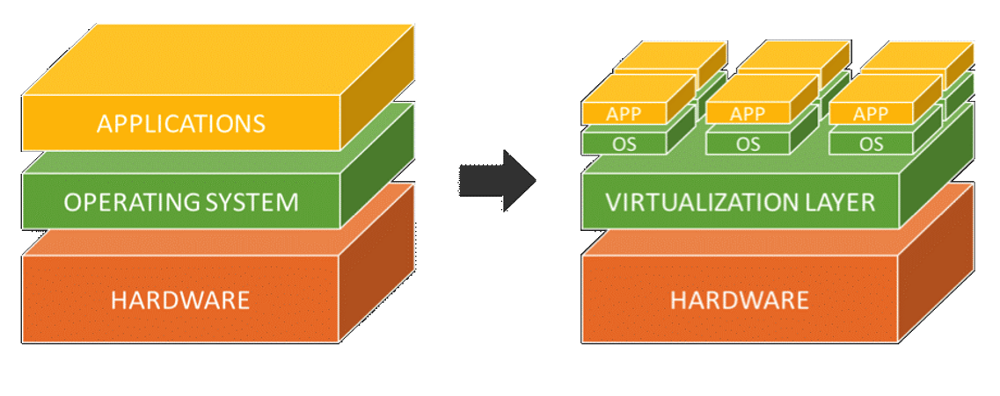

# App: Wk07

[Back](../../app_tech.md)

- [App: Wk07](#app-wk07)
  - [Containerization](#containerization)
    - [Docker](#docker)
    - [Portability](#portability)
    - [Application Containerization](#application-containerization)
    - [Isolation](#isolation)
    - [Benefit](#benefit)
    - [Containers vs VMs](#containers-vs-vms)
    - [Virtual Machines](#virtual-machines)
    - [Differences](#differences)
    - [Challenges](#challenges)
    - [Popular Containers](#popular-containers)
    - [Considerations when containerization tech.](#considerations-when-containerization-tech)
    - [STAs should consider…](#stas-should-consider)

---

## Containerization

- `Containerization`

  - involves **encapsulating** or **packaging** up software **code** and all its **dependencies** so that it can **run uniformly and consistently on any infrastructure**.

- allows developers to create and deploy applications **faster and more securely**.
  - code is **developed in a specific computing environment** which, when transferred to a new location, often results in bugs and errors.
  - For example, when a developer transfers code from a desktop computer to a virtual machine (VM) or from a Linux to a Windows operating system.
  - **eliminates** this problem by **bundling** the application **code** together with the related configuration files, libraries, and **dependencies** required for it to run.
  - This single package of software or “container” is abstracted away from the host operating system, and hence, it stands alone and becomes portable—able to run across any platform or cloud, free of issues

---

### Docker

- 2013 - Docker Engine, industry standard for containers

- `Container images` become **containers** at **runtime** and in the case of Docker containers
  - **images** become **containers** when they run on Docker Engine.
- Available for both Linux and Windows-based applications

- `Container`
  - lightweight **software components** that **bundle** the application, its dependencies, and its configuration **in a single image**, running in isolated user environments.

---

- `Containers` are often referred to as **“lightweight,”** meaning they **share** the machine’s operating system **kernel** and do **not require the overhead** of associating an operating system within each application.

- Containers are inherently **smaller in capacity** than a VM and require **less start-up time**, allowing far **more containers** to run on the same compute capacity as a single VM.
- This drives higher server efficiencies and, in turn, reduces server and licensing costs.

---

### Portability

- Containerization allows applications to be **“written once and run anywhere.”**
- This `portability` is important in terms of the development process and vendor compatibility.
- It also offers other notable benefits, like **fault isolation**, e**ase of management** and **security**, to name a few.

---

### Application Containerization

- Containers **encapsulate** an application **as a single executable package** of software that bundles application code together with all of the related configuration files, libraries, and dependencies required for it to run.
- **Containerized applications** are **“isolated”** in that they do not bundle in a copy of the operating system.
- Instead, an open source runtime engine (such as the Docker runtime engine) is installed on the host’s operating system and becomes the conduit for containers to **share an operating system with other containers** on the same computing system.

---

### Isolation

- Other **container layers**, like common **bins and libraries**, can also be **shared** among multiple containers.
  - This eliminates the overhead of running an operating system within each application and makes containers **smaller in capacity** and faster to start up, driving higher server efficiencies.
- The **isolation** of applications as containers also reduces the chance that malicious code present in one container will impact other containers or invade the host system.

---

### Benefit

- The abstraction from the host operating system makes containerized applications **portable** and able to run uniformly and consistently **across any platform** or cloud.
- Containers can be easily **transported** from a desktop computer to a virtual machine (VM) or from a Linux to a Windows operating system, and they will run consistently on virtualized infrastructures or on traditional “`bare metal`” servers, either on-premise or in the cloud.
  - This ensures that software developers can continue using the tools and processes they are most comfortable with.
  - This technology also **reduces the complexity** for a TSA to make technology and architecture decisions

---

- **Portability** between different platforms and clouds—it’s truly write once, run anywhere.
- **Efficiency** through using far fewer **resources** than VMs and delivering higher utilization of compute resources
- **Agility** that allows developers to **integrate** with their existing DevOps environment.
- Higher speed in the delivery of **enhancements**.
  - Containerizing **monolithic applications** using **microservices** helps development teams create functionality with its own life cycle and scaling policies.
- Improved **security** by **isolating** applications from the host system and from each other.
- Faster app **start-up** and easier **scaling**.
- **Flexibility** to work on virtualized infrastructures or on bare metal servers
- Easier management since install, upgrade, and rollback processes are built into the container platform.

---

- Containerization is one of the latest developments in the evolution of **cloud computing.**
- Many organizations, both large and small, are looking at containers as a means to improve application **life-cycle management** through capabilities such as **continuous integration and continuous delivery**.
- Also, certain implementations of containers conform to the **principles of open source**, which is appealing to organizations wary of being locked-in to a specific vendor.

---

- Containers help to satisfy three key use cases that reflect what enterprises **require** to run their applications in the cloud:
  - **Modernize** your existing applications.
  - Create new **cloud native** enterprise applications.
  - Open your **data center** to work with cloud services.

---

### Containers vs VMs

- `Virtualization`
  - a process whereby software is used to create an **abstraction layer** over computer **hardware** that allows the hardware elements of a single computer to be **divided** into multiple **virtual computers**.
- `hypervisor`
  - The software used for virtualization
  - a small **layer** that enables multiple operating systems to run alongside each other, **sharing the same physical computing resources**.
  - When a `hypervisor` is used on a physical computer or server (also known as bare metal server), it allows the physical computer to **separate** its operating system and applications from its hardware.
  - Then, it can divide itself into several independent “virtual machines.”

---

### Virtual Machines

- `Virtual machines (VMs)`
  - a technology for building virtualized computing environments.
  - They have been around for quite a while and are considered the foundation of the **first generation of cloud computing**.
- A `virtual machine` is an **emulation** of a **physical computer**.
  - VMs enable teams to run what appear to be multiple machines, with **multiple operating systems**, on a **single computer**.
- VMs interact with physical computers by using **lightweight software layers** called `hypervisors`.
- `Hypervisors` can **separate** VMs from one another and allocate processors, memory, and storage among them.
- VMs are also known as `virtual servers`, `virtual server instances`, and `virtual private servers`.

---

### Differences

- In **traditional** virtualization, a `hypervisor` **virtualizes physical hardware**.
  - The result is that each virtual machine contains a guest OS, a **virtual copy of the hardware** that the OS requires to run, and an application and its associated libraries and dependencies.
- Instead of **virtualizing** the underlying hardware, `containers` **virtualize** the **operating system** so each individual container contains only the application and its libraries and dependencies.
- `Containers` are **small, fast, and portable** because unlike a virtual machine, containers do not need to include a guest OS in every instance and can, instead, simply leverage the features and resources of the host OS.

---

- Just like virtual machines, `containers` allow developers to **improve CPU and memory utilization** of physical machines.
- `Containers` go even further, however, because they also enable **microservice architectures**, where application components can be **deployed** and **scaled** more granularly.
- This is an attractive alternative to having to scale up an entire monolithic application because a single component is struggling with load.

---

- While there are still many reasons to use `VMs`, `containers` provide a level of **flexibility** that is perfect for the multi-cloud world.
- When developers create new applications, they might **not know** all of the **places** it will need to be deployed.
  - Today, an organization might run the application on its private cloud, but tomorrow it might need to deploy it on a public cloud from a different provider.
- `Containerizing applications` provides teams the **flexibility** they need to handle the many software environments of modern IT.

---

### Challenges

- Despite the many benefits of containers, they do come with a few challenges of their own.
  - Large enterprise applications can include a **massive number of containers**.
  - Managing these containers presents some serious **issues** for teams.
  - How can you have **visibility** on what is running and where?
  - How do you handle crucial issues such as **security** and **compliance**?
  - How do you **consistently manage** your applications?

---

### Popular Containers

- `Apache Mesos`:
  - an open source cluster manager.
  - It handles workloads in a **distributed** environment through dynamic resource sharing and isolation.
  - suited for the deployment and management of applications in **large-scale clustered** environments
- `Google Kubernetes Engine`
  - a managed, production-ready environment for **deploying** containerized applications.
  - It enables rapid app **development** and iteration by making it easy to deploy, update and manage applications and services.
- `Amazon Elastic Container Registry (ECR)`:

  - an Amazon Web Services product that stores, manages and deploys Do**cker images**, which are managed clusters of Amazon EC2 instances.
  - Amazon ECR hosts images in a highly available and scalable architecture, enabling developers to dependably deploy containers for their applications.

- `Azure Kubernetes Service (AKS)`:
  - a managed container **orchestration** service based on the open source Kubernetes system.
  - AKS is available on the `Microsoft Azure` public cloud.
  - Developers can use AKS to deploy, scale and manage Docker containers and container-based applications across a **cluster** of container hosts.

---

### Considerations when containerization tech.

- **Application architecture**
  - focus on the application architecture decisions they need to make, such as whether the applications are **monolithic** or **microservices** and are they **stateless** or **stateful**.
- **Workflow and collaboration**
  - consider the changes to the workflows and whether the platform will enable them to easily **collaborate** with other stakeholders.
- **DevOps**
  - consider the requirements for using the self-service interface to **deploy** their apps using the **DevOps pipeline**.
- **Packaging**
  - consider the format and tools to use the application code, dependencies, containers and their dependencies.
- **Monitoring and logging**
  - ensure that the available monitoring and logging options meet their requirements and work well with their development workflows.

---

### STAs should consider…

- **Architectural needs** of applications
  - ensure that the platform meets the **architectural needs** of the application as well as the **storage needs** for stateful applications.
- **Legacy application migration**
  - the platform and tooling around the platform must support any legacy applications that have to be migrated.
- Application **updates and rollback strategies**
  - work with the developers to define application updates and rollbacks to meet the service level agreement
- **Monitoring and logging**
  - put plans in place for the right infrastructure and application monitoring and logging tools to collect a variety of metrics.
- **Storage and network**
  - ensure that the necessary storage clusters, network identities and automation to handle the needs of any stateful applications are in place.
