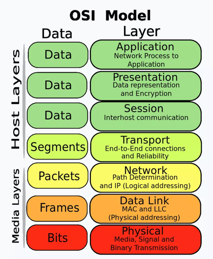
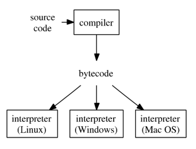

# App: Wk08

[Back](../app_tech.md)

- [App: Wk08](#app-wk08)
  - [Application Development](#application-development)
    - [Software Development](#software-development)
    - [Abstraction layers](#abstraction-layers)
    - [The software development process](#the-software-development-process)
    - [Types of software](#types-of-software)
    - [Typical Steps in Developing Software](#typical-steps-in-developing-software)
  - [Compiled languages: C/C++](#compiled-languages-cc)
    - [Compilation](#compilation)
    - [Direct compilation process](#direct-compilation-process)
    - [Static and runtime dependencies](#static-and-runtime-dependencies)
    - [Linking](#linking)
  - [Interpreted languages: JS](#interpreted-languages-js)
    - [Compiled vs Interpreted](#compiled-vs-interpreted)
  - [Hybrid languages:Java/Python](#hybrid-languagesjavapython)
    - [A hybrid approach](#a-hybrid-approach)
    - [Just In Time (JIT) Compilation](#just-in-time-jit-compilation)
    - [Summary: Language](#summary-language)
  - [Scripting languages](#scripting-languages)
    - [Interactive environments](#interactive-environments)
      - [Ipython and Jupyter Notebooks](#ipython-and-jupyter-notebooks)
  - [Markup languages](#markup-languages)
    - [Web applications stack](#web-applications-stack)
    - [Programming language types](#programming-language-types)
    - [Summary](#summary)

---

## Application Development

- **Scope**:

  - high-level overview of concepts and tools in software application development

- **Motivation**:

  - A **foundation/starting point** if your job requires you to support development teams

- A grasp of programming language landscape (types, trade-offs)
- Build/test/deploy process and terminology

- Helps in answering technical questions about application deployment, customizability, compatibility and fit with existing infrastructure

---

### Software Development

- Understanding the **technology** that **existing software** is written in and its **deployment** will assist you in **evaluating** any **constraints** and **opportunities** in future development and/or integrations.
- Understanding the **existing skillsets** in the current organization will help you in understanding which **technologies** are currently supported and whether or not **new skills** will be required based on your proposals.

---

- `Software development`
  - the process of **creating**, **designing**, **deploying** and **supporting** software
- Encompasses a wide range of activities, methodologies, and practices aimed at developing software applications that meet specific requirements
- Can be conducted by special roles/teams (software developers, engineers, computer programmers), or be part of another role’s responsibilities (scientists, hardware designers, technical analysts)

---

- An important distinction is **custom** `software development` as opposed to **commercial** `software development`.
- `Custom software development`
  - the process of designing, creating, deploying and maintaining software **for a specific set of users, functions or organizations**.
- In contrast, `commercial off-the-shelf software (COTS)` is designed **for a broad set of requirements**, allowing it to be packaged and commercially marketed and distributed.

---

### Abstraction layers

- `Abstraction layers` separate complex systems into simpler, more **manageable parts**
- To focus on understanding/designing **specific functionality** (e.g. business logic or data processing algorithm):
- **Hide** (abstract away) the implementation **details** of lower-level sub-tasks (e.g. storage or networking)
- Software components that are well **scoped/partitioned into abstraction layers** are key to enable **reuse, interoperability** and platform independence

---

- Example: OSI model of networking

---

- Abstraction layers in computing

- Task
- Algorithm
- Program
- Hardware
- Instruction set, microarchitecture, logic gates, circuits, semiconductor physics

- Developing and deploying a software application involves tasks at different abstraction layers

---

### The software development process

- SDLC (Software Development Lifecycle)
  - Requirement Gathering
  - Analysis
  - Design
  - Coding
  - Testing
  - Deployment
- Agile
  - Requirement
  - Design
  - Develop
  - Test
  - Deploy
  - Review

---

### Types of software

- `System software`:

  - provides **core/foundational, low-level functionality** that other types build upon such as operating systems, disk management, utilities, hardware management and other operational necessities.

- `Programming software`:

  - tools for **creating and testing software** - text editors, compilers, linkers, debuggers

- `Application software (applications or apps)`:

  - helps users perform **tasks**.
  - Office productivity suites, data management software, web/mobile

- `Embedded systems software`:
  - used to program and **control special-purpose computers** —network hardware, cars, industrial robots and more.
  - These devices, and their software, can be connected as part of the `Internet of Things (IoT)`

---

### Typical Steps in Developing Software

- **Selecting a methodology Methodologies**
  - can include Agile development, DevOps, Rapid Application Development (RAD), Scaled Agile Framework (SAFe), Waterfall and others
- **Gathering requirements**

  - to understand and document **what is required** by users and other stakeholders.

- **Choosing or building an architecture**

  - as the underlying structure within which the **software will operate**.

- **Developing a design**

  - around solutions to the problems presented by requirements, often involving **process models** and **storyboards**.

- **Constructing code**

  - in the appropriate programming language.
  - Involves peer and team review to eliminate problems early and produce quality software faster.

- **Testing with pre-planned scenarios**

  - as part of software design and coding — and conducting **performance testing** to simulate load testing on the application.

- **Managing configuration and defects**

  - to understand all the software artifacts (requirements, design, code, test) and build distinct **versions** of the software.
  - **Establish quality assurance priorities and release criteria** to address and track defects.

- **Deploying the software** for use and responding to and resolving user problems.
- **Migrating data** to the new or updated software from existing applications or data sources if necessary.
- **Managing and measuring the project** to maintain quality and delivery over the application lifecycle, and to evaluate the development process with models such as the Capability Maturity Model (CMM).

---

## Compiled languages: C/C++

- Some languages (e.g. `C/C++`) are typically **compiled** directly into **machine code**
  - The resulting **machine code** (**binary executable**) can be run on your machine, or any machine with the same combination of OS and instruction set (e.g. x86_64 Linux or arm64 MacOS)
- Key functions:
  - Analysis of your source code to ensure it is **valid** (lexical, syntax, semantic)
  - **Optimization** – **improving** machine code for performance/efficiency using various techniques, both general and specific to your OS/architecture

---

### Compilation

- Your computer’s CPU executes programs that are **stored as low level instructions**, also known as `assembly code` or `machine code`

  - Load data from memory address X into register Y
  - Add 5 to it and store in register Z
  - Move result from register Z to memory address W

- You write software code at a **higher abstraction layer**

  - Y=X+5

- `Compilers`
  - **software programs** that convert **source code** written by you into **object code**
  - Object code can be machine code readable by your computer, or some intermediate language

---

### Direct compilation process

- 1. A programmer writes **source code**
- 2. A **compiler converts** the source code to a **machine language module** (called an **object file**).
- 3. Another program, called a `linker`, combines object file(s) with other previously compiled object files and libraries to **create an executable file**.

- The resulting executable or binary file can be **run** repeatedly, and **shared** with others compile once, run on any system with same architecture/OS

### Static and runtime dependencies

- `Libraries` are **collections of reusable components** that can be used many times on the same system
  - E.g. standard library, DB, GUI, networking, etc
  - At link time, libraries can be either **statically** or **dynamically linked** with the object files to create the final product – binary executable
- `Static linking` simply **copies** the library components referenced/called by the objects into the **executable**
- `Dynamic linking` leaves a **reference** to the shared library (also known as `DLL`), making it the job of the OS to **find a copy of it at runtime**

---

### Linking

- Let's say you have a **library libmath** that contains several mathematical functions: add(), subtract(), multiply(), and divide().
- Your application **main.cpp** uses the add() and multiply() functions.
  - If you linked **statically**, the linker found the static copy of libmath (.a files on Linux) and **copied the machine code** for add()and multiply() into the binary
  - If you linked **dynamically**, the linker found the static copy of libmath (.so files on Linux) **referenced it**
    - At runtime, a **dynamic loader** will locate libmath.so, **load it into memory**. Find add()and multiply() and attach them to the rest of the binary in order to run it

---

- `Dynamic linking` **defers** resolution of dependencies **until run time**
- **Reduces the size** of the binary
- Allows **updates to libraries** at any time after compilation – as long as the functions needed by your binary did not change their call signature (e.g. number and types of parameters)
- `Static linking` resolves dependencies **at compile time**
  - Larger binary
  - Allows you to **unambiguously link dependencies** to **prevent** future **interoperability** problems
    - e.g. if the call signature does change, you don’t have to maintain multiple versions of the same library

---

## Interpreted languages: JS

- Some languages (e.g. `PHP`, `JavaScript`) **defer conversion** into **machine code** to **run time**
- Instructions are translated to machine code **directly by the interpreter program**, **line by line**
- Each time the program is run, the interpreter has to repeat this process
- To **share** software written in an interpreted language, you have to **share the source code**

---

### Compiled vs Interpreted

- **Portability**
  - `Compiled binaries` are **platform dependent**, requiring compilation for every CPU architecture and OS
  - `Interpreted code` runs on any system **with an interpreter**
- **Performance**
  - `Compiled binary` is executed **directly by the CPU**, having been **optimized** by the compiler
  - `Interpreted` executes programs **line by line** each time, so it’s generally **slower**
- **Distribution**
  - Can **distribute only the binary** without sharing source code

---

- **Development process**
  - Some **errors** are **caught** during **compilation** (compile time)
  - Special debug-friendly (e.g. un-optimized) versions need to be compiled for debugging
  - `Compilation` and linking can **take a long time**
  - Debugging can be more **straightforward** in `interpreted languages`

---

## Hybrid languages:Java/Python

- `Python` and `Java` are two major hybrid/VM languages
- **Portability**
  - `Source code` is **compiled** to `bytecode` once, `bytecode` can be **run anywhere** (cross-platform compatible)
  - The VM/JIT **compiler** becomes a **dependency**
- **Performance**
  - A good JIT compiler can achieve **performance close to** that of **directly compiled machine code**
  - There is **overhead in starting up** the JIT compiler, and it requires **additional** CPU/memory **resources** at run time

---

### A hybrid approach

- Break up the process of translating `source code` to `machine code` **into two steps**

  - 1. Source code is translated into **an intermediate, platform-independent form** called `bytecode`.
    - `Bytecode` is **partially optimized** and is no longer suitable for human readability, but it’s **not yet runnable** on a specific OS/architecture
  - 2. `Bytecode` is either **interpreted** or **Just-In-Time compiled** by a `Virtual Machine`.
    - This is a different (though somewhat related) meaning of the term than full system virtual machine

- Hybrid languages
  - 1. A programmer writes `source code`
  - 2. A compiler **converts** the source code `bytecode`
  - 3. An **interpreter** or **JIT compiler** converts the `bytecode` to `machine code`, possibly on a different machine with different architecture
- Either the `bytecode` or the `source code` can be **shared** with others
- compile once, run anywhere (through an interpreter)

---

### Just In Time (JIT) Compilation

- `Bytecode` is **partially optimized**, so there is some performance gain from running source code directly in the interpreter
- Rather than simply executing bytecode line by line, **performance** can be **improved** much further by **analyzing the code at runtime** to **identify frequently used sections** (hot spots) and make **optimizations**
- `JIT compilation` can perform **optimizations** specific to the architecture, inline functions, unroll loops, cache previously compiled code fragments based on frequency of use, etc.
- The resulting performance approaches that of directly compiled machine code
- JIT compilation can adapt to actual usage patterns, going further than traditional (ahead-of-time) compilation

---

### Summary: Language

- `Compiled Languages`
  - pro
    - offer **high performance and straightforward deployment**
  - Con
    - **less portable**
    - **less flexible**
    - **harder to debug**.
- `Interpreted Languages`

  - pros
    - provide rapid development
    - portability
    - ease of debugging
  - Con
    - suffer from **slower performance**
    - complex **deployment requirements**.

- `Hybrid Languages`
  - strike a **balance** between **performance** and **flexibility**,
  - with considerations for deployment and runtime **overhead**.

---

## Scripting languages

- `Scripting languages`

  - specialized programming languages **designed to automate tasks, manipulate data, or control software applications**.
  - They are typically **interpreted** rather than compiled.

- `Shell scripting languages` like bash are **used to interact with the OS** and **automate** system tasks (e.g. backups, batch processing)
  - Often used in system administration

---

### Interactive environments

- `REPL (Read-Eval-Print Loop)` environments are **interactive programming shells** that take single user **inputs** (one line of code), **execute** them, and **return** the result to the user.
  - This process is **repeated**, making it easy to test and debug code on-the-fly.
- This makes interpreted/hybrid languages well suited for **prototyping** and **experimentation**, and easier to learn by doing

---

#### Ipython and Jupyter Notebooks

- `Ipython`
  - an enhanced **interactive Python shell** designed to provide a more powerful and user-friendly **interface** for Python programming
- `Jupyter Notebooks`
  - an open-source web application that allows you to **create and share documents** containing live code, equations, visualizations, and narrative text
- Both support **rich media outputs**, including images, videos, LaTeX, and more
- Can be used for interactive **data exploration/visualization**

---

## Markup languages

- A method of **specifying structure and formatting of a document**, relationship between its parts
- Whereas the end goal of writing source code is to produce runnable machine code, the end goal of writing markup code is to **produce a document for purposes of display/presentation**, or to define structured data
- `HTML` is used to **define pages to be displayed** in a web browser
- `LaTeX` is used for **typesetting and formatting documents** (books, papers)
- `XML` is used for **storing, transmitting and transforming data**

---

### Web applications stack

- a `solution stack` or `software stack`
  - a set of software **subsystems** or **components** needed to create a compete platform
- A web application will consist of a **server component** (back end), a and **client component** (front end)
- `Back-end code` is typically written in an **interpreted** (PHP), **hybrid** (Java/Python) or sometimes **compiled** language
- This is often done within a `web application framework`, which **provides common functionality** such as DB access, templating, session management, etc.

---

- On the **client** side, there are typically **three components** used to render a web page:
  - `HTML (Markup Language)`: **Structures the content** of web pages
  - `CSS (Cascading Style Sheets)`: **Styles and formats** the appearance of web pages
  - `JavaScript (Interpreted Language)`: Adds interactivity and **dynamic behaviour** to web pages

---

### Programming language types

- Other than **execution model** detailed above, programming languages differ by many other parameters:
  - **Programming paradigm**
    - a way to **structure or conceptualize** a software system
- **Procedural** (sequence of actions/commands) vs **declarative** (describes what the end result should be)
- **Object-Oriented**: organizes code into **objects** that encapsulate data and behaviour
- **Typing system**
  - how strictly and when are **variable types checked**/enforced
  - Static vs dynamic, strongly vs weakly typed

---

- **Memory management**
  - do developers manually manage allocation/deallocation of memory, or does **garbage collection** automatically do it for them, reducing possibility for errors and memory leaks at the expense of performance?
- **Use case and domain**
  - is the language **general purpose** or **domain-specific**? Each language’s features will make it best suited for certain tasks and ill-suited for others
    - E.g. C and C++ are used for writing low-level software components, graphics and embedded hardware programming
    - JavaScript is very frequently used for front-end web development
    - Python and Java’s strength is its versatility

---

### Summary

- Reasoning about **trade-offs** and **use cases** of programming languages can help technical analysts answer important technical questions, foresee problems and suggest solutions
- Being able to understand an application at different layers of abstraction, such as reasoning about its execution model, is a valuable skill
