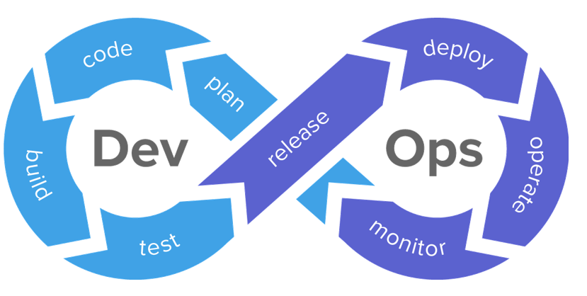

# App: Wk12

[Back](../app_tech.md)

- [App: Wk12](#app-wk12)
  - [DevOps](#devops)
    - [DevOps in the organization](#devops-in-the-organization)
    - [DevSecOps](#devsecops)
  - [Observability](#observability)
    - [Logs](#logs)
    - [Metrics](#metrics)
    - [Traces](#traces)
    - [Instrumentation](#instrumentation)
    - [OpenTelemetry](#opentelemetry)
    - [Observability Platform](#observability-platform)
      - [Prometheus and Grafana](#prometheus-and-grafana)
  - [Observability](#observability-1)

---

## DevOps

- Intersection between application **development** and IT **operations**
- Dev: software design/planning, **development**, **testing**
- Ops: **Deploying** applications on production infrastructure, **monitor/improve** performance
- Major focus of DevOps:
  - **Communication/collaboration** when accomplishing Dev and Ops tasks

---

- Teams that **develop** applications and teams that **deploy** and **run** them in production need to collaborate and understand each other’s tasks
  - Developers need to understand how an app is **run**
  - Operations need to understand its **design** and **environment** – e.g. programming language, resource utilization patterns, libraries and other dependencies
- There is built-in “tension” or competing priorities
  - Devs want to **respond to customer requirements** and **release** features **quickly**
  - Ops want to focus on **stability/reliability,** which can **slow down** development cycles (for a very good reason)

---

- `DevOps` aims to **bridge the gap** by using **automatic processes**, improved communications and feedback, and iterative development

- `Containerization` and `orchestration`
- `Version control` and VCS **platform**
- **Communication** and collaboration **tools** (issues, MRs, etc)
- **Automatic** testing and deployment
- `Infrastructure as Code`
- **Observability** platforms

- End goal:
  - **faster release cycles** of high-**quality** software

---

### DevOps in the organization

- The **roles** of IT/operations and software development are **no longer separated**/siloed from each other
- Organizing teams around products
- Creating special **“DevOps engineer”** or “DevOps **specialist”** roles
- A `DevOps engineer` works on the product **throughout its development/deployment lifecycle**
- Creating and maintaining **tooling** we discussed in previous topics
- A successful DevOps environment is one that fosters **joint** **project ownership** and **responsibility**

---

### DevSecOps

- Augmentation of `DevOps` which **integrates security reviews** into all stages of the **DevOps lifecycle**
- Integrates an IT **security role**/team into the **development/deployment process** to achieve the same goal: more **automated** and streamlined **security testing** without communication silos
- Add au**tomated security checks**
  - Code analysis **identify** sources of **vulnerabilities** in the software design
  - Identify risks to the “supply chain” – **dependencies, packaging tools**, deployment technology (e.g. containers)
  - Security **training** and code **reviews**

---

- Learning DevOps
  - DevOps is closely related to `Agile` software development approach
  - Promoted by `SaaS` providers as an ecosystem that’s best consumed as a packaged product
  - Most DevOps tools are built on **open-source projects**
  - Best way to learn the DevOps approach is to focus on fundamentals
    - **Git**
    - **Unit testing** in a widely used programming language
    - A common **IaC** tool
    - **Good** software engineering and IT collaboration/communications **practices**
  - If you develop those skills, connecting the building blocks together in the ecosystem of your (employer’s) favourite cloud provider is the easier part

---

Observability platforms
Logs, metrics and traces
Analysis and alerts
Automation of observability

## Observability

- Ability to **monitor and measure** a **running** application and **analyse** its **performance** and **correctness**
  - **Collect**, **analyse** and act on information generated by the application
- `Logs`, `metrics` and `traces`
- As applications and systems increase in complexity, having a good observability platform becomes more important

---

### Logs

- Running applications generate logs
- Make a **record** of **normal** operations (server handles a request)
- Inform of an **error** state or provide a **warning**
- Output **debugging information**, useful in **development** or bug **investigation**
- Typically contain a **timestamp**, **component** of the app generating the message, **severity level** and other context

---

- Historically, each application environment developed its own logging format and placed them into its own log files
- `Syslog` is a **standard** for **logging messages** on a system
  - A **common interface** which can be used by admins to **control log destination and verbosity**
  - Can **forward** logs to another system, where they can be collected and stored together
- Standard levels (debug, info… warning, error, critical, alert…)
- **Facilities** to help **distinguish** e.g. **user application** and **system logs**
- **Formatting** is still up to the **application**

---

- Modern logging allows for **machine parsing** as well as being useful to **humans** for manual processing
- This typically means **more structure** within the message itself
- Generating logs in **JSON format** makes it easier to **parse** and store them into a database

---

### Metrics

- A **measurable quantity** **describing** something useful about a **system** or an **application**
- A `metric` is a function, **measurement** is result of evaluating a metric
- Can **measure**
  - application **load** (e.g. requests served in the last 5 minutes)
  - **performance** (e.g. average DB query execution time)
  - amount of **available resources** (e.g. available disk space)
- Metrics lend themselves to being **monitored** as time series
- Can measure discrete **events** (e.g. web server requests), so often **aggregated** over time (e.g. requests in last N minutes)

---

### Traces

- A distributed system can have **multiple** components/services which handle user requests in some sequence
- These services can be hosted on multiple systems, partially or fully in a cloud, etc.
- A `trace` is a way of **recording the request** as it **propagates** through the system
- Every **operation performed on a request** by a system’s component, called a `span`, is recorded for later analysis
- Can **diagnose** complex problems involving **interactions** of components, analyse performance for bottlenecks, etc.

---

### Instrumentation	

- In order to **output** logs, metrics and traces, application components need to **collect and export** this information
- `Instrumentation仪表` can be internal to the application (implemented by modifying code), or genetic and automatic

---

### OpenTelemetry

- In order to ensure that different applications and systems all **generate telemetry遥测** (logs, metrics and traces) that are interoperable, their generation can be standardized
- `OpenTelemetry (OTel)` is a collection open-source **observability tools**, **APIs** and **libraries**
- Observed systems and applications **generate** `OTLP` (OpenTelemetry protocol) data
- Allows software products that collect data and observability platforms which collect and analyse it to be interchangeable and interoperable

---

### Observability Platform

- A system which **provides insight** into the **internal state** of applications and infrastructure
- **Collection**, **storage**, **analysis** and **visualization** of telemetry
- Collection involves efficiently storing and organizing incoming data
  - Log **deduplication**
  - Efficient **storage** of **time series** data for later analysis
  - **Query** API and/or **graphical interface**
  - Ability to handle **large amounts** of data
  - Continuous **monitoring**, **alerts** or other actions triggered on events

---

- `Datadog`, `New Relic`, `Splunk`: 
  - **Commercial** observability platforms that provide a comprehensive suite of tools for monitoring, logging, and tracing.
- `Prometheus` and `Grafana`: 
  - An **open-source** combination often used for **monitoring** and **visualizing** metrics.
- `ELK Stack (Elasticsearch, Logstash, Kibana)`: A popular open-source stack for **managing** and **visualizing** **logs**

---

#### Prometheus and Grafana

- `Prometheus` records metrics in **a time series database**
- ”Exporters” are **agents** on observed clients which generate metrics
- Can be **built into** the applications or provide general **system-level info**
- Prometheus host queries exporters **periodically** using `HTTP` and provides a **query API** to access the metrics
- `Grafana` is the **interface** used to **visualize** the data using **graphs** and **dashboards**
- **Alert** managers built into both Prometheus and Grafana

---

- Grafana platform
  - `Grafana Loki` **collects** logs and pushes them into **centralized storage**
  - When collecting huge amounts of logging data, the critical features of such log aggregation tools is the ability to efficiently **index** the data for fast querying later on
  - `Loki` **indexes** metadata (i.e. labels generated by the log collector at collection time, timestamps, hostnames)
  - **Metrics** (time series) can then be generated and **visualized** in `Grafana`

---

## Observability

- Complex and distributed systems (such as those built around SOA) **require observability tools** 
  - to **diagnose problems**
  - to ensure **performance** targets and other non-**functional requirements** are satisfied
- Components need to be **instrumented**, **telemetry** data collected, efficiently stored and analysed using queries and dashboards
- The process is **automated** and integrated into other tools to allow both IT and developers to gain insight on how applications perform in production
