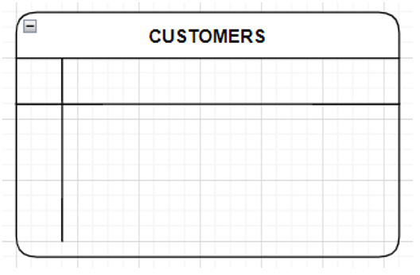
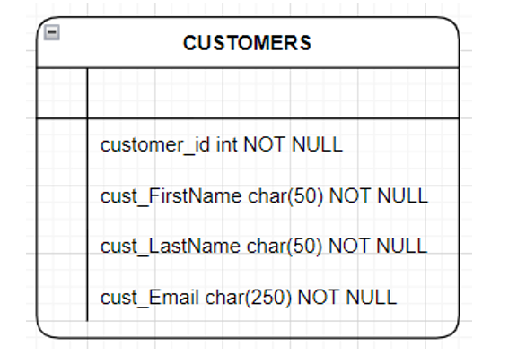
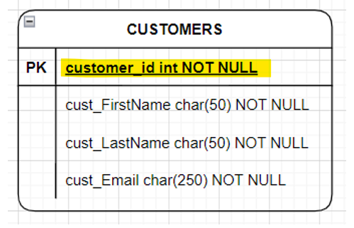
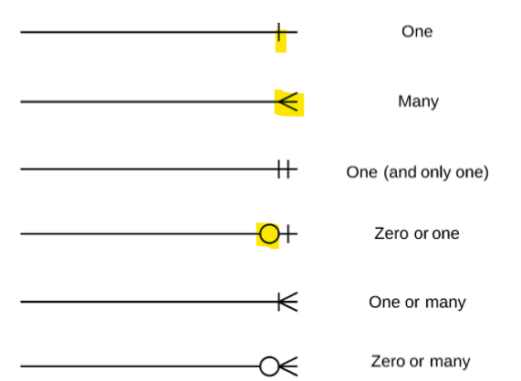
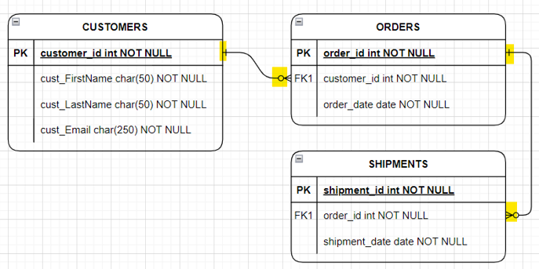

# Data Tech: wk03

[Back](../data_tech.md)

- [Data Tech: wk03](#data-tech-wk03)
  - [Data Integrity](#data-integrity)
    - [Importance of Data Integrity](#importance-of-data-integrity)
      - [Data Accuracy](#data-accuracy)
      - [Data Consistency](#data-consistency)
      - [Regulatory Requirements](#regulatory-requirements)
      - [Customer Trust](#customer-trust)
      - [Efficiency](#efficiency)
  - [ERD Diagrams](#erd-diagrams)
    - [ERD Components](#erd-components)
    - [Entities](#entities)
    - [Attributes](#attributes)
      - [Candidate Keys](#candidate-keys)
      - [Primary Key](#primary-key)
    - [Relationships](#relationships)
      - [Cardinality](#cardinality)
  - [Physical Data Model](#physical-data-model)

---

- Understand the **necessity** of Data Integrity
- Discuss the **need** of Data Integrity and **outcomes** if that integrity is lost

## Data Integrity

- `Data Integrity`
  - the **process** of **ensuring** that data is **accurate**, **reliable**, **consistent**, and **valid**.
  - ensures that data is **correct**, **up-to-date**, and can be **trusted** to make informed decisions.

### Importance of Data Integrity

#### Data Accuracy

- Accurate data is essential for **making informed business decisions**.
- Data that is **inaccurate or incomplete** can lead to **wrong conclusions**, which in turn can lead to **bad decisions**.
- By ensuring data integrity, businesses can be **confident** that the data they use is **accurate** and **reliable**.

---

#### Data Consistency

- **uniformity** and **standardization** of data across **all data sets**.
- It ensures that data is entered and stored **in the same format** and **adheres to the same rules**, regardless of the **source** or **application**.
- This makes it **easier to manage**, analyze, and report on data, and helps **avoid errors** or discrepancies.

---

#### Regulatory Requirements

- Many industries are **subject to legal and regulatory requirements** that **mandate** the accuracy and completeness of data.
  - Ex. financial institutions are required to maintain **accurate records** of transactions for auditing and regulatory purposes.
- By ensuring data integrity, businesses can **avoid potential legal** or **financial penalties**.

---

#### Customer Trust

- Customers expect businesses to **protect their personal and financial data**.
  - If data is **compromised**, it can **erode customer trust**, resulting in lost business and damage to reputation.
- By ensuring data integrity, businesses can **assure** customers that their **data is secure and protected**.

---

#### Efficiency

- Data that is consistent and accurate **saves time and resources**.
  - If data is **incomplete** or **inconsistent**, it can lead to **duplicate efforts** or **wasted time** spent reconciling data.
- By ensuring data integrity, businesses can **streamline operations and improve efficiency** and productivity.

---

## ERD Diagrams

- Understand and describe the various parts of an ERD Diagram
- Model an ERD Diagram

- `Entity-Relationship Diagram (ERD)`
  - a **graphical representation** of **entities** and their **relationships** to each other.
- It is a **modeling technique** used in software engineering to **document the structure** of a database.

- When to use:

  - Requirements Gathering
  - Database Design
  - Database Debugging

- An **initial model** can also be evolved into a `Physical Database Model` that aids the **creation of a relational database**, or aids in the **creation of process maps** and **data flow modes**.

---

### ERD Components

- ERD diagrams consist of three main components:

  - **entities**,
  - **attributes**,
  - and **relationships**.

---

### Entities

- `Entities`

  - **objects or concepts** that exist in the system, such as customers, products, or orders.

- An entity is shown as a **rounded rectangle**, with its **name** on top, it **CAPS** and its attributes listed in the body of the entity shape

---

### Attributes

- `Attributes`

  - the **properties** of these entities, such as name, age, or address.
  - a **property or characteristic** of the entity that holds it, this is also know as a `column`

- `Attributes` use **nouns** with an **initial capital letter** followed by **lowercase** letters in the naming convention
- In E-R diagrams, the attribute’s name is placed inside the rectangle that represents the associated entity

---

#### Candidate Keys

- Each entity type must have **an attribute or set of attributes** that **distinguishes** one instance from other instances of the same type
- e.g., A Candidate Key for the STUDENT entity might be Student_ID

- Choose a candidate key that will **not change its value**, this is the `Primary Key (PK)`
  - Using Employee_Name and Employee_Address as primary keys for EMPLOYEE may not be the best choice because those values could change.
- Choose a candidate key that will always have a value and will **never be null**
- 不变，非空，用于区分

---

#### Primary Key

- `primary key`
  - a **column** or **set of columns** in a table that **uniquely identifies** each row.
  - It must **uniquely** identify a row in a table and **not be null**
  - For each entity, the name of the identifier is **underlined** on an E-R Diagram

---

### Relationships

- `Relationships`
  - **represent the connections** between entities, such as a customer placing an order.

---

#### Cardinality

- `Cardinality`
  - the **numerical relationship** between two entities.
- It describes **how many instances** of one **entity** are related to another **entity**.

- There are **three** main types of cardinality:

  - `One-to-One (1:1)`:

    - In a one-to-one relationship, each **instance of an entity** is **related to only one** instance of another entity, and **vice versa**.
    - e.g., each person has only one SIN number, and each SIN number is assigned to only one person.

  - `One-to-Many (1:N)`:
    - In a one-to-many relationship, **one instance** of an entity is related to **multiple instances** of another entity.
    - e.g., a single **customer** can place multiple **orders**, but each order is associated with only one customer.
  - `Many-to-Many (N:N)`:
    - In a many-to-many relationship, **multiple instances** of an entity are related to **multiple instances** of another entity.
    - e.g., a **student** can enroll in multiple **courses**, and each course can have multiple students.

---

## Physical Data Model

- `Physical ERD`

  - represents the **actual design blueprint** of a relational database

- A `physical data model` **elaborates** on the `logical data model` by assigning each column with type, length, nullable, etc.
- Since a `physical ERD` represents how data should be structured and related in a specific DBMS it is important to **consider the conventions and restrictions of that system**
- Make sure the column **types** are supported by the DBMS and **reserved words** are not used in naming entities and columns (more on this in the coming weeks)

---
