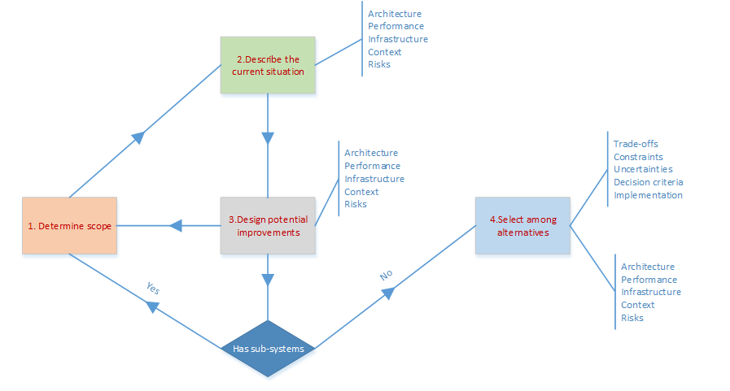

# Doc - Wk10

[Back](../doc.md)

- [Doc - Wk10](#doc---wk10)
  - [Researching and Evaluating Systems](#researching-and-evaluating-systems)
    - [Analysing Current Systems](#analysing-current-systems)
      - [5 perspectives](#5-perspectives)
        - [Architecture Perspective](#architecture-perspective)
        - [Performance Perspective](#performance-perspective)
        - [Infrastructure Perspective](#infrastructure-perspective)
        - [Context Perspective](#context-perspective)
        - [Risks Perspective](#risks-perspective)
    - [The Process](#the-process)
  - [TSA need to](#tsa-need-to)
    - [Types and Sources of Information](#types-and-sources-of-information)
    - [Hardware and Software](#hardware-and-software)
    - [Inputs, Outputs](#inputs-outputs)
    - [Processes](#processes)
    - [Identifying Problems](#identifying-problems)
    - [Gather and Collecting Information](#gather-and-collecting-information)
    - [Documentation](#documentation)
      - [User Documentation](#user-documentation)
      - [Technical Documentation](#technical-documentation)
  - [Evaluating an Existing System](#evaluating-an-existing-system)
    - [What does an Evaluation Look for?](#what-does-an-evaluation-look-for)
    - [How is a System Evaluated?](#how-is-a-system-evaluated)
  - [Documentation](#documentation-1)

---

## Researching and Evaluating Systems

### Analysing Current Systems

- `Analysing existing systems` is used to **evaluate** the **degree of support provided** by current systems **to the business activities** of the enterprise.
- To **document** the physical existing (current) system(s)
- **Assessments** of user and technical **satisfaction** are performed and data, procedures and **problems** are **analyzed**.
- The **purpose** is to **identify shortcomings**, **issues**, & **opportunities** with current systems.
  - It is used to assess the usefulness, usability, and overall user satisfaction with the current systems to facilitate decision making concerning the current systems’ strategic and tactical viability.

---

#### 5 perspectives

- Looking at the existing system from multiple perspectives is necessary for understanding any existing system.

- **Architecture**:
  - What are the **components** of the system that produces the work and uses the work product?
  - How are the components **linked**?
  - How do the components **operate together**?
- **Performance**
  - How **well** do the **components** **operate** individually?
  - How **well** does the **system** **operate**? (How well is the work performed?)
  - How **well** **should** the **system** operate?
- **Infrastructure**
  - What technical and human **infrastructure** does the work rely upon?
  - In what ways does infrastructure present **opportunities** or **obstacles**?
- **Context**
  - What are the **impacts** of the organizational and technical **context**?
  - In what ways does the context present **opportunities** or **obstacles**?
- **Risks**
  - What foreseeable things can **prevent** the work from happening, can make the work inefficient, or can cause **defects** in the work product?
  - What are the likely **responses** to these problems?

---

##### Architecture Perspective

- Looks at **how** the current or proposed system **operates** mechanically by summarizing its **components**, the way the **components are linked**, and the way the components **operate together**.
- The term `architecture` applies equally to **processes**, **information**, **technology**, and **organizations**.
  - For example, information architecture is a statement of **how information** is **organized** within a system, whereas organizational architecture is a statement of how the **people** and departments are organized.
- `Architecture` is dealt with in two ways.
  - First, as is often done using data flow diagrams, flow charts, or other diagramming methods, it can be **documented using diagrams** showing sets of **linked components**.
  - In addition, it can be **described** conceptually using ideas such as **degree of structure**, **degree of integration**, range of involvement, reliance on computers, attention to planning and control within the process, and provision for recovery from errors and malfunctions.
- Each of these ideas can be used to look beyond the concrete details and to motivate identification of alternatives.

---

##### Performance Perspective

- Uses **business terms** to describe **how well** the system or its components **operate**.
  - For example, **product performance** can be measured in terms of variables perceived outside of the system, such as
    - cost to the customer,
    - quality,
    - responsiveness,
    - reliability,
    - conformance to standards or regulations.
  - In contrast, **process performance** can be measured in terms of inwardly directed variables, such as
    - capacity,
    - consistency,
    - productivity,
    - cycle time,
    - flexibility, and security.
- Encouraging business professionals to look at systems this way is consistent with the **TQM (Total Quality Management)** refrain that many businesses need better process measurement to guide process improvement.
- The above are **NFAs (non-functional requirements or aspects** of the system)

---

##### Infrastructure Perspective

- Describes the **resources** the system **depends upon** and shares with other systems.
- Infrastructure is typically **not** under **control** of the systems it serves, yet plays an essential role in those systems.
- For information systems, the **technical infrastructure** typically includes computer **networks**, **telephone** systems, and **software** for building and operating these systems.
- The **human infrastructure** for these systems is the support staff that keeps them operating effectively.
- Examining infrastructure often reveals **constraints limiting the changes** that can occur, but may also reveal untapped opportunities to use available resources.

---

##### Context Perspective

- Describes the **organizational and technical realm** within which the current or proposed system operates, including
  - non-participating **stakeholders**,
  - competitive and **regulatory issues** external to the firm,
  - **resources outside** of the system,
  - implementation issues related to the organization's **policies**, **practices**, and **culture**.
- The context may create **incentives** and even **urgency** for change, but may also create **obstacles**.

---

##### Risks Perspective

- Looks at **foreseeable events** whose occurrence could **cause** system **degradation** or **failure**.
- General **categories** of risks can be identified for each element of the framework. For example, risks related to information include
  - data errors,
  - data fraud,
  - data theft.
- Since every business system has some risks, any effort to build or change a system should include **identifying foreseeable risks** and either **countermeasures** or **acceptance** of the risks.

---

### The Process

1. Determine the **scope** and **purpose** of the analysis:
   - Decide what **problem** is being solved or **opportunity** is being taken advantage of.
   - `Scope` is defined primarily by the **scope of the business processes** included in the analysis.
2. **Describe** the **current situation**:
   - Describe the existing system from five perspectives: how it operates (**architecture**), how well it operates (**performance**), what **infrastructure** it relies upon, what **context** it operates in, and what **risks** it brings.
   - Look at each element of the framework
3. **Design** potential **improvements**:
   - **Describe** potential **changes** in architecture and estimate how they will be reflected in the other perspectives, namely, performance, infrastructure, context, and risks.
   - Because the six elements in the framework are linked, architectural changes in any element usually call for corresponding changes elsewhere.
4. Select among **alternatives**:
   - Use the understanding developed through the first three steps to **decide what to do**.
   - Make the decision considering issues such as **trade-offs**, **constraints**, **uncertainties**, decision criteria, and feasibility of implementation in the organization from all five perspectives.

---

## TSA need to

### Types and Sources of Information

- The **information** required to document an existing system includes **static information** about the system **configuration** and **dynamic information** extracted from **transaction records** produced during system operation by various administration staff and processes.
  - Some information is **recorded** for purposes of **accounting**, while other information is **recorded** explicitly for **performance evaluation** purposes.. Like those in last week's Financial Feasability content.
- Software packages of varying degrees of sophistication are available for storing, analyzing, and reporting the information recorded during system operation.
- If these systems for keeping this information has not been utilized, the TSA must **extract the information manually** (Using SQL Queries for Example.. ) through various information gathering activities.

---

### Hardware and Software

- The systems analysts will now need to decide what **hardware** and **software** will be required for the new system...
- Hardware
  - How many computers?
  - What type of network?
  - How many servers?
  - Any special input devices? (e.g. barcode readers)
  - Any special output devices?
- Software
  - Is **ready-made**, **off-the-shelf** software available? Would it integrate well with other corporate systems?
  - Is **custom**-written software required?

---

### Inputs, Outputs

- Every system has inputs and outputs, and the systems analyst needs to **identify** the **data input** to the present system, and the **data output**.
- This is because any new system that is designed will have to deal with similar inputs and outputs as the present system.
- For example, the payroll system in a business might have the following inputs and outputs...

---

### Processes

- Any new system that is created will need to take in the same input data (the number of hours worked by employees) and will have to produce the same three outputs.
- For similar reasons, the systems analyst also must understand how the present system works (the processes – who does what and when)...

---

### Identifying Problems

- No system is perfect, and it is the job of the **systems analyst** to try and **identify** where the problems in a system are.
- If these problems can be fixed, the system will work more smoothly, be more efficient and, in the case of a business, be more profitable.
- In the above payroll example, the following problems might be identified...
  - The payroll often takes over three days to process, resulting in many employees being paid late
  - Timesheets sometimes get lost before being processed. This means that sometimes pay has to be estimated
  - The reports sent to management do not show enough information.

---

### Gather and Collecting Information

- **Observation**
  - This involves the systems analyst **walking around** the organisation or business, watching **how things work** with his/her own eyes.
- Observation allows the systems analyst to **gather first-hand, unbiased information.**
- The downside to observation is that often people **won't work the way they normally do** if they know they are being watched。

- **Interviews**
  - The systems analyst can **interview** key people within the system to find out how it works.
- Interviews allow lots of very **detailed information** to be gathered, but they take a **long time** to do, so are not possible if **large groups** of people are involved.

- **Questionnaires**
  - With **large groups** of people, a questionnaire is a quick and **simple** way to gather information.
- However the information gathered is **limited** by the **questions set** by the systems analyst (people could have a lot of useful information in their heads, but if the questionnaire doesn’t ask the right questions, they will not be able to pass it on)
- Also many people do **not take the time** to fill in questionnaires seriously.

- **Collecting Documents**
  - Most businesses and organisations **use documents to record information**, or to communicate information (forms get filled in and passed to other offices, etc.)
- The systems analyst needs to collect examples of the documents used to get an **understanding** of the type and quantity of data that flows through the business or organisation.

---

### Documentation

#### User Documentation

- The user documentation is **intended to help the users** of the system.
- The users are usually **non-technical** people, who don't need to know how the system works. They just need to know **how to use it**.
- User documentation usually **includes**:
  - List of minimum **hardware** and **software** **required** to use the system
  - How to **install** the system
  - How to **start / stop** the system
  - How to **use** the **features** of the system
  - **Screenshots** showing the system in **typical use**
  - **Example** inputs and outputs
  - **Explanations** of any **error messages** that might be shown
  - A **troubleshooting guide**
- Can be a very valuable source of information

---

#### Technical Documentation

- The `technical documentation` is intended to **help the maintainers** of the system (the people who need to keep the system running smoothly, fix problems, etc.)
  - The **maintainers** are usually **technical people**, who need to know exactly **how the system works**.
- Technical documentation usually **includes**:
  - Details of the **hardware** and **software** **required** for the system
  - Details of **data structures** (data types, field names, etc.)
  - Details of expected **inputs**
  - Details of **validation** checks
  - Details of how data is **processed**
  - **Diagrams** showing how **data moves** through the system
  - **Flowcharts** describing how the system **works**

---

## Evaluating an Existing System

- The **purpose** of an evaluation is to assess the system to see if it does what it was **supposed to do**, that it is working **well**, and that everyone is **happy** with it.
- **Improve** system design and implementation.
  - Evaluations make take place on a regular basis
- Better understand an existing system so that you can better design **upgrades** or **enhancements**
- **Anticipate** or determine the **end of life** for an existing system

---

### What does an Evaluation Look for?

- Is the system...
  - ...**efficient**?:
    - Does it operate quickly, smoothly and with minimal waste?
    - Is the system saving time, and resources?
  - ...**easy to use**?:
    - Are all of the system's users able to use the system easily and effectively?
    - Can new staff understand and use the system with minimal training?
  - ...**appropriate**?
    - Is the system suitable for the particular business / organisation?
    - Does the system actually meet the needs of the business / organisation?

---

- Often when analysing a system, a TSA will do so from a **competitive perspective**..
  - Ie. Is the system...
    - ...AS **efficient as OTHERS** in the Industry?
      - Does it operate quickly, smoothly and with minimal waste, saving time, resources?
    - ...AS **easy to use as OTHERS** in the industry?
      - Are all users able to use the system easily and effectively, with minimal training?
    - ...As **appropriately as OTHERS** in the industry?
      - Is the system suitable for the particular business / organisation?
- OFTEN a TSA will use research tools like ChatGPT (AND Validation with actual examples.. ) to determine what others are doing / how other companies are being successful.

---

### How is a System Evaluated?

- The systems analyst will use a number of **techniques** to evaluate the system...
  - Check against the
    - **Requirements** Specification
    - If you remember, we have documentation and information from our collection activities (including SQL Queries, etc..)
    - The systems analyst will use this documentation to check the system.
    - Going through the requirements one-by-one the analyst will check if they are being met.
  - Check the **Users' Responses**
    - It is essential to get feedback from the users of the system...
    - Do they like it?
    - Does it make their work easier?
    - What, if anything, could be improved?

---

## Documentation

- As a TSA you can **re-use** existing documentation if it is accurate and up to date
- You may have to **update** the existing documentation if required
- **Missing** documentation may need to be created.

- Can take **many forms**
  - **Textual** such as user stories, descriptions etc.
  - **Diagrams and models** such system architecture models, ER diagrams, DFD diagrams
  - Diagrams show action such as BPMN, UML and process flows
- **Tools** used can be as simple as
  - MS Office or more specific tools such as Visio, Blueprint, LucidChart
  - SQL Query tools like SSMS for SQL Server,
  - Business Analytics/Business Intelligence tools
    - Like PowerBI, Alteryx, etc. See list here:
      https://en.wikipedia.org/wiki/Business_intelligence_software
