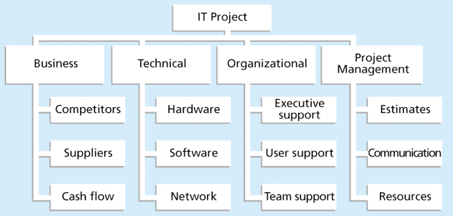

# Doc - Wk12

[Back](../doc.md)

- [Doc - Wk12](#doc---wk12)
  - [System Risk](#system-risk)
    - [Importance of risk management](#importance-of-risk-management)
      - [Negative Risk](#negative-risk)
      - [Positive Risk](#positive-risk)
  - [Risk Management Processes](#risk-management-processes)
    - [Planning risk management](#planning-risk-management)
      - [Risk Mgmt Plan Topics](#risk-mgmt-plan-topics)
      - [Broad Categories of Risk](#broad-categories-of-risk)
      - [Risk Breakdown Structure](#risk-breakdown-structure)
    - [Identifying Risks](#identifying-risks)
      - [Brainstorming](#brainstorming)
      - [Delphi Technique](#delphi-technique)
      - [Interviewing](#interviewing)
      - [SWOT Analysis](#swot-analysis)
      - [Trend Analysis](#trend-analysis)
      - [Risk Register](#risk-register)
        - [Risk Register Contents](#risk-register-contents)
    - [Performing Qualitative Risk Analysis](#performing-qualitative-risk-analysis)
      - [Probability/Impact Matrix](#probabilityimpact-matrix)
      - [Top Ten Risk Item Tracking](#top-ten-risk-item-tracking)
      - [Risk Interdependencies](#risk-interdependencies)
    - [Performing Quantitative Risk Analysis](#performing-quantitative-risk-analysis)
      - [Simulation](#simulation)
        - [Steps of a Monte Carlo Analysis](#steps-of-a-monte-carlo-analysis)
      - [Sensitivity Analysis](#sensitivity-analysis)
    - [Planning Risk Responses](#planning-risk-responses)
      - [Response Strategies for Positive Risks](#response-strategies-for-positive-risks)

---

Understand **risk** and the importance of good system **risk management**
Discuss the **elements** of planning risk management and the **contents** of a **risk management plan**
List common **sources of risks** on information technology (IT) projects & systems
Describe the **process of identifying risks** and create a **risk register**
Discuss **qualitative risk analysis** and explain how to calculate **risk factors**, create **probability/impact matrixes**, and apply the Top Ten Risk Item Tracking technique to **rank risks**
Explain quantitative risk analysis and how to apply **decision trees**, **simulation**, and **sensitivity analysis** to quantify risks
Provide examples of using different **risk response planning strategies** to address both negative and positive risks
Discuss how to **control risks**
Describe how **software** can assist in system & project risk management

## System Risk

### Importance of risk management

- `System & Project risk management`
  - the art and **science** of **identifying**, **analyzing**, and **responding** to risk **throughout the life of a system** or project and in the best interests of **meeting business objectives**
- `Risk management` is often **overlooked** in systems planning projects, but it can help **improve system success** by helping **select** good projects, determining project **scope**, and developing realistic **estimates**

---

#### Negative Risk

- A dictionary definition of `risk` is “**the possibility of loss or injury**”
- `Negative risk` involves understanding **potential problems** that **might occur** in the system or project and **how** they might **impede** business **success**
- `Negative risk management` is like a form of **insurance**; it is an **investment**

---

#### Positive Risk

- `Positive risk`s are risks that **result in good things** happening; sometimes called `opportunities`
- A general definition of `system or project risk` is an **uncertainty** that can have a negative or positive **effect** on meeting **business objectives**
- The goal of risk management is to **minimize potential negative risks** while **maximizing potential positive risks**

---

## Risk Management Processes

- `Planning risk management` : Deciding **how** to approach and **plan** the **risk management activities** for the project / System change
- `Identifying risks`: **Determining which risks** are likely to **affect** a system or project and documenting the **characteristics** of each
- `Performing qualitative risk analysis`: **Prioritizing** risks based on their **probability** and **impact** of occurrence

---

- `Performing quantitative risk analysis`: Numerically **estimating the effects** of risks on business objectives
- `Planning risk responses`: **Taking steps** to **enhance opportunities** and **reduce threats** to meeting business objectives
- `Controlling risk`: **Monitoring** identified and residual risks, **identifying new** risks, **carrying out** risk response plans, and **evaluating** the effectiveness of risk strategies throughout the life of the system or project

---

### Planning risk management

#### Risk Mgmt Plan Topics

- Methodology
- Roles and responsibilities
- Budgets and schedule/timeline
- Risk categories
- Risk probability and impact
- Revised stakeholders’ tolerances
- Tracking
- Risk documentation

---

- Contingency and Fallback Plans, Contingency Reserves
  - `Contingency plans` are **predefined actions** that the business/system team will **take** **if** an identified **risk event occurs**
  - `Fallback plans` are developed for **risks** that **have a high impact** on meeting business objectives.
  - `Contingency reserves` or allowances are **provisions** held by the **project sponsor** or organization to **reduce the risk of cost** or schedule overruns to an acceptable level; management reserves are funds held for **unknown risks**

---

#### Broad Categories of Risk

- **Market** risk
- **Financial** risk
- **Technology** risk
- **People** risk
- Project/**process** risk
- Which of these do you as Systems Analysts have the most control over ??

---

#### Risk Breakdown Structure

- A `risk breakdown structure` is a **hierarchy of potential risk categories** for a project or a system, and is used research and document/categorize risks

---

### Identifying Risks

- `Identifying risks`
  - the **process** of **understanding** what **potential events** might hurt or enhance a particular system or project
- Another reason to continuously do risk analysis is the likelihood of **identifying previously unknown risks** that can help a business **survive & grow**.
- Identification tools and techniques include:
  - Brainstorming
  - The Delphi Technique
  - Interviewing
  - SWOT analysis
  - Trend Analysis

---

#### Brainstorming

- `Brainstorming`
  - a technique by which a **group** attempts to **generate ideas or find a solution** for a specific problem by amassing ideas spontaneously and **without judgment**
- An **experienced facilitator** should run the brainstorming session
- Be careful not to **overuse** or **misuse** brainstorming.
- Psychology literature shows that individuals produce a greater number of ideas **working alone** than they do through brainstorming in small, face-to-face groups
- **Group effects** often **inhibit** idea generation

---

#### Delphi Technique

- The `Delphi Technique`
  - used to **derive a consensus** among a **panel of experts** who make **predictions** about **future developments**
- Uses **repeated rounds of questioning** and written responses and avoids the biasing effects possible in oral methods, such as brainstorming

---

#### Interviewing

- `Interviewing`
  - a **fact-finding technique** for collecting information in **face-to-face**, **phone**, **e-mail**, or **instant-messaging discussions**
- Interviewing people **with similar system experience** is an important tool for identifying potential risks

---

#### SWOT Analysis

- `SWOT analysis` (strengths, weaknesses, opportunities, and threats) can also be used during risk identification
- Helps identify the broad **negative and positive risks** that apply to a system or project

---

#### Trend Analysis

- `Trend Analysis` involves **researching** and documenting the **trends over time** (daily, weekly, quarterly, yearly, etc… ) with respect to the **system resource usage** (eg. CPU, Internet Bandwidth, disk storage space, etc.) and overall business/system **costs** and **benefits**, as seen in previous feasibility study in this course.
- This trend analysis helps **identify** the areas of **most concern** & some indication of when a risk event might happen.

---

#### Risk Register

- A `risk register` is:
  - A **document** that contains the **results of various risk management processes** and that is often displayed in a **table** or **spreadsheet format**
- A tool for **documenting** potential **risk events** and related **information**
- `Risk events` refer to specific, uncertain events that may occur to the detriment or enhancement of the business

---

##### Risk Register Contents

- An identification **number** for each risk event
- A **rank** for each `risk event` (often from **Probability x Impact** )
- The **name** & description of each risk event
- The **category** under which each risk event falls
- The **root cause** of each risk
- **Triggers** for each risk; triggers are indicators or symptoms of actual risk events
- Potential **responses** to each risk
- The risk owner/person who will own/ be **responsible** for a risk
- The **probability** and **impact** of each risk occurring.
- The **status** of each risk

---

### Performing Qualitative Risk Analysis

- Assess the **likelihood** and **impact** of identified risks to determine their magnitude and **priority**
- Risk quantification tools and techniques include:
  - Probability/impact **matrixes**
  - The **Top Ten Risk** Item Tracking
  - Expert **judgment**

---

#### Probability/Impact Matrix

- A `probability/impact matrix` or chart **lists** the relative **probability** of a risk occurring on one side of a matrix or axis on a chart and the relative **impact** of the risk occurring on the other
- List the **risks** and then **label** each one as **high, medium, or low** in terms of its probability of occurrence and its impact if it did occur

---

#### Top Ten Risk Item Tracking

- `Top Ten Risk Item Tracking`
  - a **qualitative risk analysis tool** that helps to **identify risks** and maintain an awareness of risks throughout the life of a system or project
- Establish a **periodic review** of the top ten system/project risk items
- List the current ranking, previous ranking, number of times the risk appears on the list **over a period** of time, and a summary of progress made in resolving the risk item

---

#### Risk Interdependencies

- It is important to realize that there are often risk interdependencies.
- For example, the **probability** of one risk event occurring **might change** if another one **materializes**, and the **response** to one risk event might **affect another**

---

### Performing Quantitative Risk Analysis

- Often follows qualitative risk analysis, but both can be done together
- Main techniques include:
  - **Decision tree** analysis
  - **Simulation**
  - **Sensitivity** analysis

---

#### Simulation

- `Simulation` uses a **representation** or **model** of a system to analyze the **expected behavior** or performance of the system
- `Monte Carlo analysis` **simulates** a model’s **outcome many times** to provide a **statistical distribution** of the calculated results

---

##### Steps of a Monte Carlo Analysis

1. **Assess** the range for the **variables** being considered
2. Determine the **probability** distribution of **each variable**
3. For each variable, select a **“random value”** - based on the probability distribution
4. Run a **deterministic analysis** or one pass through the **model**
5. **Repeat** steps 3 and 4 many times to obtain the **probability distribution** of the model’s results

---

#### Sensitivity Analysis

- `Sensitivity analysis`
  - a technique used to **show the effects of changing one or more variables** on an outcome
  - For example, many people use it to determine what the monthly payments for a loan will be given different interest rates or periods of the loan, or for determining **break-even points** based on different assumptions
- **Spreadsheet** software, such as Excel, is a **common tool** for performing sensitivity analysis
- Large organizations such as TD Canada Trust use **weighted Risk Assessment** excel spreadsheets that all system & project leaders to assess risks from 1 project or system to the next.

---

### Planning Risk Responses

- After identifying and quantifying risks, you must decide **how to respond** to them
- Four main response strategies for negative risks:
  - Risk **avoidance** – **Reduce the likelihood** the risk will happen
  - Risk **acceptance**
  - Risk **transference** – (Transfer some/all the risk to a **3rd Party**)
  - Risk **mitigation** – **Reduce the effects** if the risk happens

---

#### Response Strategies for Positive Risks

- Risk exploitation
- Risk sharing
- Risk enhancement
- Risk acceptance

---

- Results of Good Risk Management
  - Unlike crisis management, **good** risk management often goes **unnoticed**
  - Well-run systems and projects appear to be almost **effortless**, but a lot of work goes into running a system or project well
  - Systems analysts & project managers should **strive** to make their jobs look **easy** to reflect the results of well-run systems and projects
