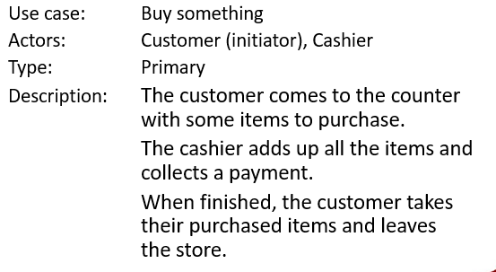

# Gather - Wk05

[Back](../../gather.md)

- [Gather - Wk05](#gather---wk05)
  - [Use Case](#use-case)
    - [All system activities](#all-system-activities)
    - [characteristics](#characteristics)
    - [Functional / Non-Fcnl](#functional--non-fcnl)
    - [Use Case \& The SDLC](#use-case--the-sdlc)
    - [User Goals \& Activities](#user-goals--activities)
    - [Use-case mode](#use-case-mode)
      - [Diagram](#diagram)
        - [Actor](#actor)
      - [Document Components](#document-components)
    - [Use Case Syntax](#use-case-syntax)
  - [Writing: Rules of Thumb(经验法则)](#writing-rules-of-thumb经验法则)
  - [Use Case Scenarios](#use-case-scenarios)
  - [Traps to Avoid](#traps-to-avoid)
  - [Rules](#rules)
  - [Flow of Events / Paths](#flow-of-events--paths)
    - [Event Flows/Path Types](#event-flowspath-types)
  - [When are we done?](#when-are-we-done)
  - [Summary](#summary)

---

Understand process modelling and the value of Use Case Analysis in systems design and analysis
Exploring the vocabulary, grammar and syntax of Use Case Analysis
Understanding how a use case is used in system analysis to identify, clarify, and organize system requirements
Clarifying the set of possible sequences of interactions between systems and users related to particular user goals
Listing the possible outcomes of the interaction of a user with the system – main flow paths, alternate paths, etc.

## Use Case

- `Use Case`
  - achieves a discrete goal for the user
  - captures some **visible function or activity done** by a user.
    - help identify user's interactions

---

- Benefits:
  - `Use cases` are great for **developing test cases** at the system level and the acceptance level.
  - `Use cases` are important for **discovering integration defects** that may be caused by interaction between differing components of a system.
  - We use the use cases to **explain the most likely use** of a system. - This means the test cases that are created because of use cases are great at finding defects in the system
  - (the ones that users are most likely going to come across while using the system).

---

### All system activities

- A `use case` is used in **system analysis** to **identify, clarify, and organize system requirements.**
- The `use case` is **made up of** a set of possible **sequences of interactions between systems and users** related to a particular **goal** the user is trying to achieve.
- The `use case` should contain **all system activities** that have significance to the users.
- `Use cases` capture **all the possible ways** the user and system can interact that result in the user achieving the goal.
  - They also capture all the things that **can go wrong along the way** that prevent the user from achieving the goal.

---

### characteristics

- A use case (or set of use cases) has these **characteristics**:
  - Organizes **functional requirements**
  - Models the **goals** of system/actor (user) **interactions**
  - Records **paths** (called scenarios) from **trigger** events to **goals**
  - Describes one main **flow of events** (also called a `basic course of action` or `Successful Path` or `Happy Path`), and possibly other ones, called `Alternate` and `Exceptional flows` of events
  - Is multi-level, so that one use case can use the **functionality of another** one
  - Can describe functional and **non-functional** req’s.

---

### Functional / Non-Fcnl

- `Functional requirements`:

  - Define the **features** and **functions** of a product
  - Explain how a system **must work**
  - Focus on what a **specific feature** or functionality should do
  - These are **typically features** that are **initiated** by the users or stakeholders of the system
    - Login
    - Register
    - Generate reports
    - Make purchase, etc…

- `Non-functional requirements`:
  - Describe the **general properties** of a system
  - Explain how a **system should perform**
  - Describe how a given feature should work
  - Specify **criteria** that can be used to judge the **operation of a system**
  - These are essentially the **background features necessary** for a system to function properly:
    - Backup
    - Internet connectivity
    - Security, etc…

---

### Use Case & The SDLC

- **Use case analysis** is important and useful technique not only in the **analysis phase**, but also in the **design phase** or even in the **implementation phase**!

- The use-case model serves as a unifying thread 统一线索 **throughout** system development.
- It is used
  - as the **primary** specification of the **functional requirements** for the system, as the basis for **analysis** and **design**,
  - as an input to **iteration planning**,
  - as the basis of defining **test cases**
  - and as the basis for **user documentation**.

---

### User Goals & Activities

- First we need to understand what it is that the **system is required to do**.
  - This is where you will determine the **goal** of the system.
- Then we move on to deciding what **activities** are required to meet those goals.
  - **Capture all activities**.
  - What **order** will those activities occur?
- So start with the **goals** and **refine** those goals into **several activities**.

---

### Use-case mode

- A use case is a **contract of an interaction** between the **system** and an **actor**.
- A full `use-case mode`l comprise of:
  - A **diagram**, describing relations between use-cases and actors
  - A **document** describing the use case in details

---

#### Diagram

##### Actor

- External **objects** that **produce/consume data**:

  - Must serve as **sources** and **destinations** for data
  - Must be **external** to the system

- When we use the term `Actor`, we are usually referring to a **person**.
- An `Actor` could also represent a **system**, that connects to your system.
- `Actors` are connected to use cases, by describing their **interaction** with a system.

- We generally define `use cases` by referring to the `actor`, describing what he or she **does** and what they **see** rather than what the system expects from them in the form of inputs and outputs.
- The vocabulary we use will be the language and terminology of **business** instead of technical terms.
  - This is because the `actor` will be a **business user** and understands his or her business terms more so than technical terms.

---

#### Document Components

- Components
  - **Name**
    - A clear **verb/noun** or **actor/verb/noun** descriptor that communicates the **scope** of the use case.
  - **Brief Description**
    - A brief paragraph of text describing the scope of the use case.
  - **Actors**
    - A list of the types of users who can engage in the activities described in the use case.
    - Actor names should **not correspond to job titles**.
  - **Preconditions**
    - Anything the solution can **assume to be true** when the use case **begins**, or anything **needed** for the use case to run successfully.
  - **Post Conditions**
    - Anything that is **true** when the use case is **complete**.
  - **Basic Flow**
    - The **set of steps** the actors take to accomplish the goal of the use case.
    - A clear description of what the system does in **response** to each user action on that main successful path.
  - **Alternate Flows**
    - Capture the **less common** user/system interactions, such as being on a new computer and answering a security question.
  - **Exception Flows**
    - The things that can happen that **prevent** the user from achieving their **goal**, such as providing an incorrect username and password.

---

### Use Case Syntax

- We can look at a use case as having **a main path or scenario**, but may also have an `alternative path` dealing with exceptional situations.
- When creating a use case, we must state any **conditions** that have to exist for the use case to function properly.
- You must also state any **conditions** that should be observed at the **end** of the use case, and what the **state of the system** should be after the use case has been utilized.

---

- For **use case testing**, we would have
  - a test of the **success scenario** and
  - one test for each **extension**.
- **System requirements** can also be specified as **a set of use cases**.
  - This approach can also make it easier to involve the users in the requirements gathering as well as the definition processes.

---

## Writing: Rules of Thumb(经验法则)

- Focus on Effective Communication:
  - **Main purpose** of use case modelling
- Pursue **Simplicity**:
  - Make it as simple and **straightforward** as possible
- Who are the Stakeholders?
  - The model is created for the **entire stakeholder community**.
- Good enough is as Good as it Gets:
  - **No** such thing as a **perfect** use case model.
  - GEPO Model(Good Enough, Push On)
- **Write things down:**
  - No way to avoid explaining, in detail, what the system is supposed to do.

---

## Use Case Scenarios

- It is easy to mix up the definitions of use case and `use case scenario`.
- A `use case` represents the **actions** that are required to enable or abandon a goal.
- A use case has **multiple “paths”** that can be taken by any user at any one time.
- A `use case scenario` is a **single path** through the `use case`.

- Multiple Scenarios
  - Whenever there are options or decisions that need to be considered, there will be **a different use case scenario associated with each option**.
  - See the next slide for a single scenario associated with withdrawing money from an atm.
  - There may be **exceptions**

---

## Traps to Avoid

- Use cases that users **don’t understand**
  - Focus on tasks a user needs to accomplish with the help of the system.
  - They should relate to the user's **business processes**
- **Too many** use cases
  - Each use case should be **general enough to cover several** related scenarios on a common theme
- **Overly complex** use cases
  - The number of **steps** in the normal flow of a use case should **not** exceed approximately a **dozen**
- Describing **specific** user interface elements and actions
  - Write "essential" use cases that describe the interactions between the user and the system at an **abstract** level, without incorporating user interface specifics
- Not using **other** requirement models
  - **Avoid** the temptation to force **fit all** of your functional requirements into use cases.

---

## Rules

- Actors should be declared in **singular form.**
  - Example: client not clients.
- **No names** are to be used.
  - Example: Bill, Bob, Samantha… etc.
- Use cases should begin with a **verb**.
  - Example: generate report or purchase camera online
- Do NOT show **behavior** in a use case.
  - Only show system **functionality**
- Use cases should **not** be **opened ended.**
  - Example: generate or check-in are not specific enough
- Do not show **communication** between actors.

---

## Flow of Events / Paths

- A `flow of events` is a text based **description** of the **sequence of activities** associated with a use case.
- Flow of events is **understood** by the stakeholders.
- A **detailed description** is necessary to ensure that there is understanding of the complexities involved in use cases.

- The `flow of events` indicates how and when the use case **starts** and **ends**, **when** the use case interacts with the actors, and the **information** that is exchanged between an actor and the use case.
- Flow of events come from a “what” perspective, **not a “how”** perspective.
  - Details and technical specifications should not be included in a use case scenario.

---

- Think of a `use case scenario` as a bridge between the **stakeholders** of a system and the **development** team (those creating the system)
  - Systems analysts create the `use case diagrams` and `scenarios` while consulting with end users.
  - Programmers look at the **use case specifications** to understand the requirements

---

### Event Flows/Path Types

- `Basic Flow of Events`:
  - This is **the most common** pathway
  - It depicts a perfect situation where **nothing will go wrong**
  - e.g.,
    - Successfully withdraw money from an ATM.
- `Alternate Flow of Events`:
  - This is still considered a **good pathway**, just **not** the most **heavily** travelled one
  - e.g.,
    - Can’t get money out due to insufficient funds.
- `Exception Flow of Events`:
  - Things don’t always go as planned
  - An exception is an **error** condition that is important enough to the application to capture
  - e.g.,
    - Your valid pin number is not accepted.

---

## When are we done?

- You have **named** all the **primary** `actors` and all the **user goals** with respect to the system.
- You have written **all** the user-goal `use cases`.
- Each use case is **clearly enough written** that - the sponsors **agree** they will be able to tell whether or not it is actually delivered.
- The users **agree** that, that is what they want or can accept as the system’s behavior.
- The developers **agree** they can actually **develop** that functionality.
- The sponsors **agree** that the use case set covers all they want.

---

## Summary

- **Use Case**:
  - Helps us view the whole system’s operation from start to finish.
    - It looks at **scenarios** from the point of clicking until a **goal** is accomplished.
    - It describes how a system is used by an actor, (user).
    - It looks at the one main **flow of events** as well as other paths that may occur depending on what the actor chooses, (the other paths are called exceptional flows of events).
    - The use case should describe **what the actor is doing** with the system in order to complete a specific action.
    - You can use use cases in many different stages of SW development;
      - System requirements, Design, Validation, Software Testing, etc…
