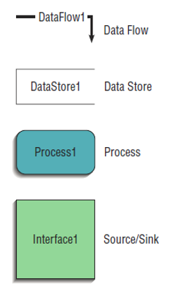

# Gather - Wk07

[Back](../gather.md)

- [Gather - Wk07](#gather---wk07)
  - [Process Modeling](#process-modeling)
  - [Data-flow Diagram](#data-flow-diagram)
  - [DFD Definitions](#dfd-definitions)
  - [DFD Rules](#dfd-rules)
  - [DFD Decomposition](#dfd-decomposition)
  - [Balancing DFDs](#balancing-dfds)
  - [Drawing DFDs Guidelines](#drawing-dfds-guidelines)
  - [DFDs as Analysis Tools](#dfds-as-analysis-tools)
  - [Logic Modeling](#logic-modeling)
    - [Decision Tables](#decision-tables)
  - [Summary](#summary)

---

- Explain process modeling
- Discuss data-flow diagramming mechanics, definitions, and rules
- Discuss balancing data-flow diagrams
- Discuss the use of data-flow diagrams as analysis tools
- Examine decision tables used to represent process logic

## Process Modeling

- Graphically **represents the processes** that capture, manipulate, store, and distribute **data** between a system and its environment and among system components

- There are many ways to capture business processes with diagrams, and a common process model is the `Data Flow Diagram`

- `Data-flow Diagrams (DFD)`
  - Graphically **illustrate movement of data** between **external entities** and the **processes** and **data** stores within a system

---

- Modeling a System’s Process
  - Utilize **information** gathered during **requirements determination**
  - **Structure of the data** is also modeled in addition to the processes
- Deliverables and Outcomes
  - Set of coherent, interrelated `data-flow diagrams`
  - These are the:
    - `Context data-flow diagram (DFD)`
      - Scope of system
    - DFDs of **current** system
      - Enable analysts to understand current system
    - DFDs of **new** logical system
      - Technology **independent**
      - Show data flows, structure and **functional requirements** of new system
    - `Project dictionary` and `CASE repository`

---

## Data-flow Diagram

- symbols:
  - Source/Sink
  - Process
  - Data Flow
  - Data Store

---

- `Data Flow`
  - Depicts data that are **in motion** and moving as a unit from one place to another in the system
  - Drawn as an **arrow**
  - Select a meaningful **name** to represent the data

---

- `Data Store`
  - Depicts **data at rest**
  - May represent data in
    - File folder
    - Computer-based file
    - Notebook
  - Might contain data about customers, students, customer orders, supplier invoices, and so forth
  - Drawn as a **rectangle** with the **right vertical line missing**
  - Label includes **name** of the store as well as the **number**

---

- `Process`
  - Depicts **work or actions** performed **on data** so that they are transformed, stored, or distributed
  - Processes can be manual, automated, computer generated or driven
  - Drawn as a **rectangle** with **rounded corners**
  - **Number** of process as well as names are recorded

---

- `Source/Sink`
  - Depicts the **origin** and/or **destination** of the data
  - Sometimes referred to as an **external entity** because they are outside of the system
  - Drawn as a **square** symbol
  - **Name** states what the external agent is
  - Because they are **external**, many characteristics are not of interest to us

---

## DFD Definitions

- `Context Diagram`

  - A data-flow diagram of the **scope of an organizational system** that shows the system **boundaries**, **external entities** that interact with the system and the **major information flows** between the entities and the system
  - **no** data stores
  - **One** process
  - **major** data flows
  - sources/sinks: external entities and environmental boundaries
  - The single process labeled `‘0’` represents the **entire system**

- `Level-0 Diagram`
  - A data-flow diagram that represents a **system’s major processes**, **data flows**, and **data stores** at a **higher level**
  - **expand** the context diagram to show the **breakdown** of processes
  - it represents the **primary** individual **processes** in a system at the highest possible level of detail
  - Each process has a number that **ends** in `‘0’` corresponding to the level number of the DFD

---

## DFD Rules

- **Inputs** to a process are always **different** than **outputs**
- **Objects** always have a **unique name**
  - In order to keep the diagram uncluttered(整洁), you can **repeat** data stores and data flows on a diagram
- **Process**
  - A process has a **verb phrase** label
  - No process can have **only outputs** (a miracle)
  - No process can have **only inputs** (black hole)
- **Data Store** 必须对接 process
  - Data store has a **noun** phrase label
  - Data cannot be **moved** from one **store** to another
  - Data cannot **move** from an outside **source** to a **data store**
  - Data cannot move **directly** from a data **store** to a data **sink**
- **Source/Sink**
  - A source/sink has a **noun** phrase label
  - Data cannot move directly from a **source** to a **sink**
- **Data Flow**
  - A data flow has a **noun** phrase label
  - A data flow has **only one direction** of flow between symbols
  - A `fork` means that exactly the **same data** go from a c**ommon location** to two or more **processes**, data **stores**, or **sources/sinks**
  - A `join` means that exactly the **same data** come from any two or more different **processes**, data **stores** or **sources/sinks** to a common location
  - A data flow **cannot go directly back** to the **same process** it leaves
  - A data flow to a data **store** means `update`
  - A data flow **from** a data **store** means `retrieve` or use

---

quiz

- A `composite data flow` on one level can be **split** into `component data flows` at the **next level**, but **no new data** can be **added**, and **all data** in the `composite` must be **accounted** for in one or more `subflows`.
- The **input** to a process must be **sufficient** to produce the **outputs** (including data placed in data stores) from the process.
  - Thus, **all outputs** can be produced, and **all data** in inputs move somewhere, either to another process or to a data store outside the process or on a more detailed DFD showing a decomposition of that process.
- At the **lowest level** of DFDs, **new data flows** may be added to represent data that are **transmitted** under **exceptional conditions**; these data flows typically represent **error messages** (e.g., "Customer not known; do you want to create a new customer?") or **confirmation notices** (e.g., "Do you want to delete this record?").
- To avoid having data-flow lines **cross each other**, you may r**epeat data store or sources/sinks** on a DFD.
  - Use an **additional symbol**, like a **double line** on the middle vertical line of a data store symbol, or a **diagonal line** in a corner of a source/sink square, to indicate a **repeated symbol**.

---

## DFD Decomposition

- Functional Decomposition
  - Act of going from one single system to **many component processes**
  - Repetitive procedure
  - **Lowest level** is called a `primitive DFD`
- `Level-n Diagrams`
  - A DFD that is the result of **n nested decompositions** of a series of subprocesses from a process on a level-0 diagram

---

## Balancing DFDs

- When decomposing a DFD, you must **conserve inputs to and outputs from a process** at the next level of decomposition
- This is called `balancing`
- Notice Figure 6-6.: We have the same inputs and outputs
  - **No new** inputs or outputs have been introduced
  - We can say that the `context diagram` and `level-0 DFD` are **balanced**

---

- We can split a data flow into **separate data flows** on a **lower** level diagram
  - different data

---

## Drawing DFDs Guidelines

- **Completeness**
  - DFD must include **all components** necessary for the system
  - Each component must be fully **described in the project dictionary or CASE repository**
- **Consistency**

  - The **extent** to which information contained on **one level** of a set of nested DFDs is also included on **other levels**

- **Timing**
  - Time is **not represented** well on DFDs
  - Best to draw DFDs as if the system has **never started** and will **never stop**
- **Iterative Development**
  - Analyst should expect to **redraw diagram** several times before reaching the closest approximation to the system being modeled
- **Primitive DFDs**
  - **Lowest logical level** of decomposition
  - Decision has to be made when to **stop** decomposition

---

- Rules for **stopping decomposition**: (continued)
  - When every data flow does **not need to be split further** to show that data are handled in various ways
  - When you believe that you have **shown each** business form or transaction, online display and report as a single data flow
  - When you believe that there is a **separate process** for each choice on **all lowest-level menu options**

---

## DFDs as Analysis Tools

- **Inefficiencies** in a system can often be **identified** through DFDs

- **Gap Analysis**
  - The process of discovering **discrepancies** between **two or more sets of data-flow diagrams** or discrepancies within a **single** DFD

---

## Logic Modeling

- `Data-flow diagrams` are good for **identifying processes**, but they do **not show the logic** inside the processes.
- `Logic modeling` involves representing **internal structure and functionality** of processes depicted on a DFD.
- A common method for modeling system logic – the `Decision Table` allows you to represent in a **tabular format** a set of conditions and the actions that follow them.
- When several **conditions** and several possible **actions** can occur, Decision Tables help you **keep track of the possibilities** in a clear and concise manner.

---

### Decision Tables

- Logic Modeling with Decision Tables

- A **matrix representation** of the logic of a decision
- Specifies the **possible conditions** and the **resulting actions**
- Best used for complicated decision logic
- Consists of three **parts**:
  - `Condition stubs` – Contains the various **conditions** that apply in the situation the table is modeling
  - `Action stubs` – Contains all the possible courses of **action** that result from combining values of the condition stubs
  - `Rules` – Specify which **actions** are to be **followed** for a given set of **conditions**

---

- **Indifferent Condition**
  - Condition whose value does **not affect which action** is taken for two or more rules
- **Standard procedure** for creating decision tables:
  - Name the conditions and values each **condition** can assume
  - Name all possible **actions** that can occur
  - List all possible **rules**
    - 2 conditions, one with 2 rules, one with 3 rules results in 2x3 **rules**
  - Define the **actions** for each rule
  - **Simplify** the decision table
  - **Remove** any rules with **impossible** actions

---

## Summary

- Data-flow Diagrams (DFD)

  - Symbols
  - Rules for creating
  - Decomposition
  - Balancing

- DFDs for Analysis
- DFDs for Business Process Reengineering (BPR)
- Logic Modeling
  - Decision Tables
- Process Modeling for the Internet
