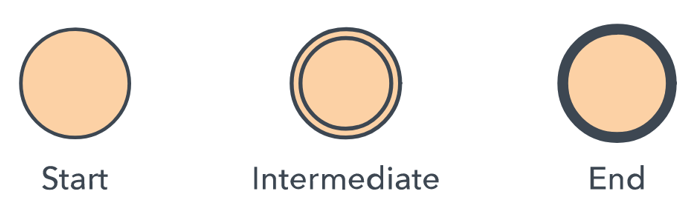
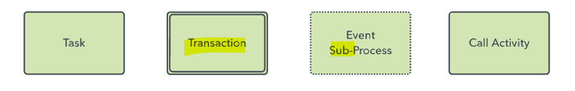
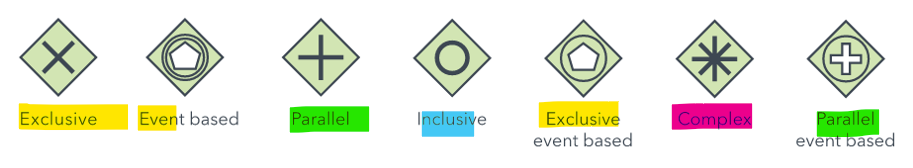
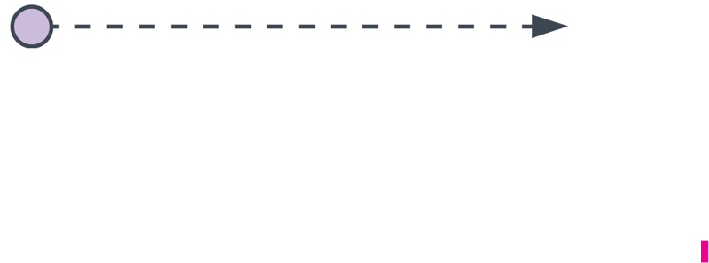
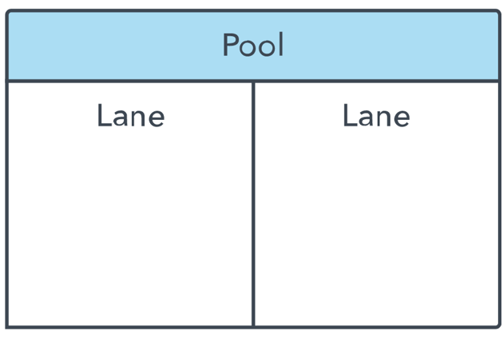

# Gather - Wk10

[Back](../gather.md)

- [Gather - Wk10](#gather---wk10)
  - [BPMN](#bpmn)
  - [BPMN 2.0 diagram elements and symbols](#bpmn-20-diagram-elements-and-symbols)
    - [Flow Objects](#flow-objects)
      - [Events](#events)
      - [Activities](#activities)
      - [Gateways](#gateways)
    - [Connecting objects](#connecting-objects)
    - [Pool and Swimlane](#pool-and-swimlane)
    - [Artifact](#artifact)
  - [Business Modelling](#business-modelling)
    - [Who does Business Process Modelling](#who-does-business-process-modelling)
    - [Tips](#tips)
    - [Example with Gateways](#example-with-gateways)

---

## BPMN

- `Business Process Model and Notation (BPMN)`
  - a standard for **business process modeling** that provides a **graphical notation** for specifying business processes in a `Business Process Diagram (BPD)`.
- `BPMN` is based on a **flowcharting technique** very similar to activity diagrams from the U`nified Modeling Language (UML)`.
- The **objective** of BPMN is to **support business process management**, for both **technical** users and **business** users, by providing a notation that is intuitive to business users, yet able to represent complex process semantics.

---

`BPMN` has been designed to provide a **standard notation** readily understandable by all business stakeholders, typically including business analysts, systems analysts, technical developers and business managers.

- `BPMN` can be used to **support** the generally desirable aim of **all stakeholders** on a project adopting a common language to describe processes, helping to avoid communication gaps that can arise between business process design and implementation.

---

- BPMN as a **standard**
  - A standard `Business Process Model and Notation (BPMN)` will provide businesses with the **capability of understanding** their internal **business procedures** in a **graphical notation** and will give organizations the ability to **communicate** these procedures in a standard manner.
  - The BPMN standard is managed by the `OMG (Object Management Group)` https://www.bpmn.org/
- The current spec is version 2.0

---

- `Business Process Modeling Notation (BPMN)`
  - a **flow chart method** that **models** the steps of a planned **business process from end to end**.
- A key to Business Process Management, it visually depicts a detailed **sequence of business activities** and **information flows** needed to complete a process.

---

## BPMN 2.0 diagram elements and symbols

- BPMN depicts these **four element types** for business process diagrams:

- **Flow objects**: events, activities, gateways
- **Connecting objects**: sequence flow, message flow, association
- **Swimlanes**: pool or lane
- **Artifacts**: data object, group, annotation

---

### Flow Objects

#### Events

- `Events`
  - A **trigger** that **starts, modifies or completes a process**.
- Event types include
  - message,
  - timer,
  - error,
  - compensation,
  - signal,
  - cancel,
  - escalation,
  - link and others.
- They are shown by **circles** containing other symbols based on event type.
- They are classified as either **“throwing”** or **“catching**,” depending on their function.

---

#### Activities

- `Activities`
  - A particular **activity** or **task** performed by a person or system.
- It’s shown by a **rectangle** with **rounded** corners.
- They can become more **detailed** with **sub**-processes, **loops**, **compensations** and multiple **instances**.

---

#### Gateways

- `Gateways`
  - **Decision point** that can **adjust the path** based on conditions or events.
- They are shown as **diamonds**.
- They can be **exclusive** or **inclusive**, **parallel**, **complex**, or based on **data** or **events**.

---

### Connecting objects

- `Sequence Flow`

  - Shows the **order** of activities to be performed.
  - It is shown as a **straight line** with an **arrow**.
  - It might show a conditional flow, or a default flow.

- `Message Flow`
  - Depicts messages that **flow across “pools,**” or **organization boundaries** such as departments.
  - It **shouldn’t** connect events or activities **within a pool**.
  - It is represented by a **dashed line** with a **circle** at the start and an **arrow** at the end.

- Association:

---

### Pool and Swimlane

- A `pool` represents **major participants** in a process.
  - A **different** `pool` may be in a **different company or department** but still involved in the process.
- `Swimlanes` within a pool show the activities and flow for a **certain role or participant**, defining who is **accountable** for what parts of the process.

---

- Pools and lanes can be drawn **vertical** or **horizontal**.
- Lanes can have **sub-lanes**

---

### Artifact

- `Artifact`
  - **Additional information** that is added to bring a **necessary level of detail** to the diagram.
- There are three types of artifacts:

  - data object,
  - group
  - annotation.

- `data object`
  - shows **what data is necessary** for an activity.
- `group`
  - shows a **logical grouping of activities** but **doesn’t change** the diagram’s flow.
- `annotation`
  - provides further **explanation** to a part of the diagram.

---

## Business Modelling

### Who does Business Process Modelling

- `Business Process Modeling` can range from simple, hand-drawn diagrams to more involved ones with expandable elements to provide sufficient implementation detail.
- At its most sophisticated, BPMN is conducted by **credentialed analysts**. (You, the TSA)
- The `Object Management Group (OMG)` provides OCEB 2, which stands for `OMG-Certified Expert` in BPM 2.0.
  - One track is **business-oriented**, and the other is **technical**.
- OMG intends for BPMN 2.0 to standardize business process modeling in the same way that `Unified Modeling Language (UML)` standardized software modeling.

---

### Tips

- Clearly define the **scope of the process** with a beginning and end.
- You might first map the **current business process** to highlight inefficiencies before modeling a better way with BPMN.
- Aim for BPMN diagrams that **fit on one page**, even if the page is poster-sized, as some are.
- Lay out sequence flows **horizontally**.
  - Show **associations** and **data flows** **vertically**.
- You can create **different versions** of the diagram for **different stakeholders**, depending on the level of detail needed for their role.
- BPMN is **not** appropriate for modeling organizational **structures**, **functional** breakdowns, or **data flow** models.
  - Although BPMN depicts some information flows in business processes, it’s **not** a `Data Flow Diagram (DFD.)`

---

### Example with Gateways

- **event-based gateway** at that point, branching into waiting more time, or into calling.
  - **Time** can either be days/hours/minutes or specific dates/years/quarters.
  - **Messages** are any information directed by and to a specific recipient (individual, department, organization, etc.). It can be data, files, emails, phone calls, letters, etc.
