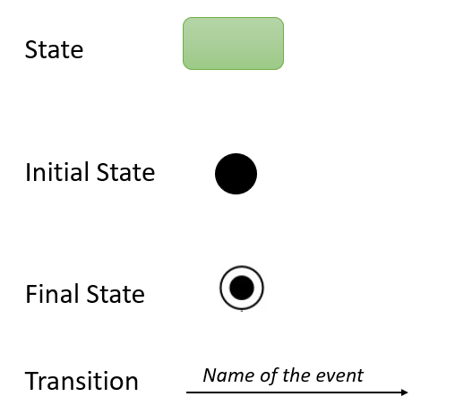

# Gather - Wk12

[Back](../gather.md)

- [Gather - Wk12](#gather---wk12)
  - [Dynamic System Modeling](#dynamic-system-modeling)
    - [State Diagram VS Flowchart](#state-diagram-vs-flowchart)
    - [State Diagrams: State](#state-diagrams-state)
    - [State Diagrams: Transition](#state-diagrams-transition)
    - [State Diagrams: Events](#state-diagrams-events)
    - [State Transition: Symbols](#state-transition-symbols)
    - [States and Events](#states-and-events)
    - [Tips](#tips)
    - [Summary](#summary)

---

What is dynamic modeling
Why do we need state transition diagrams
The Difference Between a State Diagram and a Flowchart
What are system events and triggers
How to create a state transition diagram

## Dynamic System Modeling

- `Dynamic Systems Modeling` DMS is used to **describe** and **model** the **behavior of the system over time**
- `State diagrams` are a popular **tool** used to model the **dynamic aspects of a system** from the **perspective of state transitions** of some **objects** in the system.
- In UML, A `state diagram` depicts the various **state transitions or changes** an object can experience **during its lifetime**, along with the **events** that cause those transitions.

---

### State Diagram VS Flowchart

- `Flowchart`

  - Illustrates **processes** that are **executed** in the system that **change the state** of objects.

- `State Diagram`
  - Shows the actual **changes in state**, **not** the **processes** or commands that created those changes.

---

### State Diagrams: State

- A `state`
  - a **condition** **during the life of an object** during which it satisfies some condition(s), performs some action(s), or waits for some event(s).
- The **state changes** when the object receives some **event**; the object is said to undergo a state transition.
- The **state** of an object **depends** on its **attribute values** and **links** to other objects.
- In UML, a `state` is shown as a **rectangle** with **rounded corners**
  - When an object is **created** it is in an `initial state`
  - Example: different states for an order can be received, processed, shipped, cancelled, refunded.

---

### State Diagrams: Transition

- A `state transition` occurs by **changes in the attributes** of an object or in the **links** an object has with other objects.
- A `transition` may be **labeled** with a **string** consisting of the **event name**, **parameters of the event**, guard **condition**, and **action expression**
- The transition is **symbol** is a **solid arrow** from the **source** state to the **target** state, labeled with the **name of the event**

- A transition, does not have to show all the elements; it shows **only** those **relevant** to the transition
- We can include **event** name, **condition** and **action** or just the event name

---

### State Diagrams: Events

- An `event`

  - something that **takes place** at a certain **point in time**. It is a noteworthy **occurrence** that **triggers** a state transition.

- Some examples of events are: a customer places an order, a student registers for a class, a person applies for a loan, and a company hires a new employee.

---

### State Transition: Symbols

---

### States and Events

- For the purpose of modeling, an `event` is considered to be instantaneous, though, in reality, it **might take some time**.
- A `state`, on the other hand, **spans a period** of time.
- An object remains in a particular state for some time before transitioning to another state.

- Example: an Employee object might be in the Part-time state (as specified in its employment-status attribute) for a few months, before transitioning to a Full- time state, based on a recommendation from the manager (an event).

---

- The `guard condition` is shown within **square brackets**
- The `action` is specified after the “/” symbol.

- e.g.:

`|Applied| -- evaluate [acceptable] /mail approval letter --> |Approved|`

> guard condition: `[acceptable]`
> action: `/mail approval letter`

---

- `elapsed-time event`

  - indicating the **amount of time** the object **waits** in the current state **before** transitioning.

- `final state`
  - shown as a bull’s eye: a small, solid, **filled** circle surrounded by another circle.
  - **After** transitioning to the `final state`, the Student object **ceases to exist**.

---

### Tips

- Before you begin your drawing **find** the **initial** and **final state** of the object in question.
- Next, think of the **states** the object might undergo.
  - For example, in e-commerce a product will have a release or available date, a sold out state, a restocked state, placed in cart state, a saved on wish list state, a purchased state, and so on.
- Certain **transitions** will **not** be **applicable** when an object is in a particular state,
  - for example a product can’t be in a purchased state or a saved in cart state if its previous state is sold out.

---

### Summary

- **Status** of an object or an entity is often a key part of the **logic** within many systems and processes
- If **status changes** are critical components of the system, then state diagrams will increase the value of system requirements
- State diagrams s**how the different states an entity** can take in the system, and **what causes** the state to change
- Understanding the states and how they change ensures that events, data and states are processed accurately according to user actions and enhances user experience
