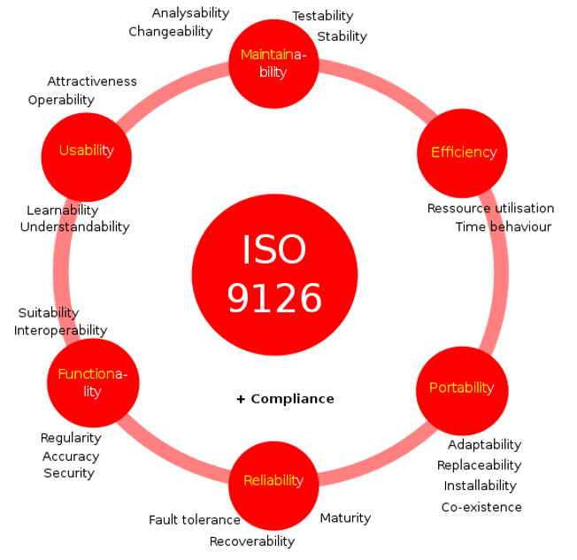

# Gather - Wk12

[Back](../gather.md)

- [Gather - Wk12](#gather---wk12)
  - [Non-Functional Requirements](#non-functional-requirements)
    - [Finding Non-Functional Requirements](#finding-non-functional-requirements)
      - [Read the functional requirements](#read-the-functional-requirements)
      - [ISO 9126 Quality Standard](#iso-9126-quality-standard)
    - [Quality Factor models](#quality-factor-models)
    - [Factors vs. Criteria](#factors-vs-criteria)
    - [Non-Functional Metrics](#non-functional-metrics)
    - [Testable Non-Functional Requirements](#testable-non-functional-requirements)
    - [Examples](#examples)
  - [Non-Functional Requirements Types](#non-functional-requirements-types)
    - [Performance Requirements](#performance-requirements)
      - [Performance Metrics](#performance-metrics)
    - [Performance Testing](#performance-testing)
      - [Load Testing](#load-testing)
      - [Stress Testing](#stress-testing)
      - [Volume Testing](#volume-testing)
    - [Failover Requirements](#failover-requirements)
    - [Usability Requirements](#usability-requirements)
      - [Usability Metrics](#usability-metrics)
    - [Scalability Requirements](#scalability-requirements)
      - [Scalability Types](#scalability-types)
    - [Maintainability Requirements](#maintainability-requirements)
    - [Reliability Requirements](#reliability-requirements)
      - [Reliability Metrics - Objective](#reliability-metrics---objective)
      - [Reliability Metrics - POFOD](#reliability-metrics---pofod)
      - [Reliability Metrics - ROCOF](#reliability-metrics---rocof)
      - [Reliability Metrics - MTTF, MTBF](#reliability-metrics---mttf-mtbf)
    - [Availability Requirements](#availability-requirements)
      - [Availability Metrics](#availability-metrics)
      - [HA – High Availability Costs](#ha--high-availability-costs)
    - [Portability Requirements](#portability-requirements)
  - [Accessibility Requirements](#accessibility-requirements)
      - [General Types of Disability](#general-types-of-disability)
      - [Defining Accessibility Requirements](#defining-accessibility-requirements)
      - [Accessibility Requirements Project Plan](#accessibility-requirements-project-plan)
  - [Summary](#summary)

---

Understand the importance of non-functional requirements
Identify and gather non-functional requirements
List and explain quality factors and criteria
Understand the characteristics of good quality metrics
Identify non-functional requirements types and testing
Understand accessibility requirements, guidelines and standards

## Non-Functional Requirements

- `non functional requirement`

  - define how a system behaves and performs,
  - in software system engineering, a **software requirement** that describes not what the software will do, but **how the software will do it**,

  - for example, software performance requirements, software external interface requirements, design constraints, and software quality attributes.

- `Non-functional requirements`
  - **difficult to test**; therefore, they are usually **evaluated subjectively**.”

---

- The purpose of **“identifying** non-functional requirements” is to **get** a handle on these absolutely necessary requirements that are normally not ‘functional.’
- Understand the **user’s expectations**
- During **Analysis**, this information is **speculative**.
  - Will be **refined later**.
  - Capture now, Realize later…
- Non-functional requirements
  - Consists of **Constraints** that must be adhered to during development (design and implementation)
  - Key word: ‘Constraints.’

---

- Usually **stated informally**, and so are:
  - often **contradictory**
  - **difficult to enforce** during development
  - **difficult to evaluate** for the customer prior to delivery
- Hard to make them **measurable** requirements
  - Need to be stated in a way that we can **measure** how well they’ve been met
- Place **restrictions** on the product being developed, the development process, and specify **external constraints** that the product must meet.

---

- Asking The Right Questions

  - `Functional`

    - What inputs the system should accept?
    - What outputs the system should produce?
    - What data the system should store?
    - What transaction should the system perform?
    - What actions/activities should the system perform?

  - `Non-Functional`
    - Is it fast?
    - Is it nice to look at?
    - Easy to use?
    - Reliable?

---

### Finding Non-Functional Requirements

- Talk to the **users**
- Talk to the **support teams**
- Talk to the **technical** teams, **designers**, **architects**, **developers** etc.
- Read the **documentation**
- **Research** the industry
- Understand the **standards** actual and perceived
- **Observe** similar systems

---

#### Read the functional requirements

- NFRs are often buried in the **functional requirements**
  - e.g., An application must allow a user to make a payment using a credit card
  - How should the form look?
  - How easy should it be to read or use?
  - How fast should the process be?
  - Should it be an intuitive process?

---

#### ISO 9126 Quality Standard

- The objective of the `ISO/IEC 9126` standard is to **address** some of the well-known **human biases** that can adversely affect the delivery and perception of a software development project
- The standard is divided into four parts:
  - **Quality** model
  - **Internal** metrics
  - **External** metrics
  - Quality in **use metrics**.

---

- **Quality**

  - Classifies software quality in a **structured set of characteristics** and sub-characteristics

- **Internal Metrics**

  - Those which do **not rely** on software execution (**static measure**)

- **External metrics**

  - Applicable to **running** software

- **Quality-in-use metrics**
  - Are only available when the final product is used in **real conditions**. Ideally, the internal quality determines the external quality and external quality determines quality in use.

---

- `ISO 9126` - non-functional requirements linked to “**quality in use**”, which is **users experience** when using the system.
- Since the users’ experience is subjective, many of the quality factors will also be **subjective**.

---

### Quality Factor models

- `Software Quality factors`
  - can be related to as our **non-functional test types** expressed as customer or user concerns.
- `McCall’s Quality Factors`
  - McCall has 11 factors and 3 categories. Defined in 1977
  - Three categories:
    - **Product Operation Factors**
      - How well it **runs…**. Correctness, reliability, efficiency, integrity, and usability
    - **Product Revision Factors**
      - How well it can be **changed**, tested, and redeployed, Maintainability - flexibility; testability
    - **Product Transition Factors**
      - How well it can be moved to **different platforms** and interface with other systems - Portability; Reusability; Interoperability

---

### Factors vs. Criteria

- **Quality Factors**

  - These are **customer**-related concerns
  - e.g., efficiency, integrity, reliability, correctness, survivability, usability,...

- **Design Criteria**
  - These are **technical** (development-oriented) **concerns** such as anomaly
  - management, completeness, consistency, traceability, visibility,...

---

### Non-Functional Metrics

- In software development, a `metric` (noun) is the **measurement** of a particular **characteristic** of a program's **performance** or efficiency.
  - Similarly in network routing, a metric is a measure used in calculating the next host to route a packet to.
- A `metric` is sometimes used directly and sometimes as an **element in an algorithm** .
- Must **Quantify** the requirement
- We must have a way to measure the requirement or expectation - metrics".
- A **benchmark** includes metrics.
- `Benchmark`
  - A set of **conditions/criteria** against which a product or system is **measured**.

---

- Metrics Must be:
  - **Measurable** – can have some sort of scale applied
  - **Consistent** and **unambiguous** (objective) - e.g. not someone's opinion of how complex something was
  - Specified with **precision** - i.e. a range in which measured values have to fall
  - I **MEANINGFUL**!! - there must be some reason to believe that numbers for the metric have something to do with something we care about!
  - **Understandable** – should not take special or hard to achieve knowledge to understand
  - Simple and **computable**
  - Easy and **cost-effective** to obtain
  - Able to be **validated** for accuracy and reliability
  - Relevant to the Quality factors and criteria

---

### Testable Non-Functional Requirements

- If we will state requirements that are **testable**, we at least need to go to the criteria level.
- Once you understand the **criteria** you will use to evaluate the factor you can determine which **metrics** you will **collect**.
- During **Analysis**:
  - Identify the relative **importance** of each **quality factor**
  - From the **customer’s** point of view!
  - Identify the **design criteria** on which these factors depend
  - Make the requirements **measurable** by defining the metrics and benchmark for assessing the product

---

### Examples

- Non-Testable Requirements

  - Payment can be made via **all available** payment methods
  - Reservation is acknowledged and customer is **notified**
  - All submitted information is **stored** in the system
  - All **incorrect** user inputs are flagged by the system
  - Protection against spam is working as expected??

- **Testable** Requirements
  - Payment can be made via **PayPal, Debit or Credit Cards**
  - An acknowledgement **email** is sent to the customer after completing the reservation
  - Information from the **form** is **stored** in the registrations **database**
  - Conflicting reservation, unauthorized reservations, and submissions missing payment details or address are **flagged** and added to the failed requests table
  - You can get more technical and define **Failed requests** (response codes: 407, 404, 409,500) but that is usually defined by the developers

---

## Non-Functional Requirements Types

- These Categories cover the most **common objectives**.
  - Performance
    - Load
    - Stress
    - Volume
  - Failover
  - Recovery
  - Usability
  - Scalability
  - Availability
  - Reliability

---

### Performance Requirements

- **Evaluates** the **overall performance** of the system. (Hardware and software)
- Evaluates **response times** of several business-critical processes/transactions
- Frequently **not** performed against a **specification**
- Frequently used as part of the **process of performance profile tuning**
- Helps to **identify** the "weakest link" or **“bottleneck”**, a part of the system which, if it is made to respond faster, will result in the overall system running faster
- Can be measured during **development**, **pre-production** and during **production** as part of performance monitoring

---

#### Performance Metrics

- Performance requires a:
  - **Metric** of **amount of work** performed in **unit time**
  - **Deadline** that must be met
- Example
  - **1000 transactions per second**
  - 3 second **average latency** for a **request**
  - The homepage supports **2000 users per hour**, with a maximum response time of **6 seconds** on Chrome browser

---

- `Latency`:
  - The **delay** before a **transfer of data begins** following an instruction for its transfer.
- `Throughput`:
  - **Measure** of the **amount of work** an application must perform **in unit time**
- Transactions **per second**
- Messages **per minute**
- Is required throughput:
  - **Average**?
  - **Peak**?
- Many systems have **low** average but **high** peak throughput requirements

---

- `Response Time`
  - **Measure of the latency** an application exhibits in **processing a request**
  - Usually measured in **(milli)seconds**
  - Often an important metric for users
- Is required response time:
  - **Guaranteed**?
  - **Average**?
  - E.g. 95% of responses in sub-4 seconds, and all within 10 seconds

---

- `Hardware performance`
  - **CPU** utilization
  - **Memory** utilization
  - **Thread** performance
  - **Capacity** management
- Requests **per second**
- Average **response** time
- **Uptime**
- **Error** rates
- Count of open file descriptors

---

### Performance Testing

- Performance Test
  - Speed
  - Resource
  - Usage
  - Response Time
  - Stability
  - Throughput

---

#### Load Testing

- **Performed** to determine a **system's behavior** under both **normal** and anticipated **peak load** conditions
- `Load testing` is especially important if the application, system or service will be subject to a `service level agreement (SLA)`
- **Simulates** real-world load on any software, application, or website or system
- **Determines** if a system, piece of software, or computing device **can handle high loads** given a high demand of end users
- May be performed end to end or against sub-components.
- A `load test` enables you to **measure** **response** times, **throughput** rates, and resource-**utilization** levels, and to identify your application’s **breaking point**, assuming that the breaking point occurs below the peak load condition. (Microsoft)
- `Peak load` - the **heaviest demand** that would be generated **at peak user times**—for example, credit card verification between noon and 1 PM on Christmas Eve

---

#### Stress Testing

- When the **load** placed on the system is **raised beyond normal usage patterns** to test the system's **response at unusually high loads**
- The load is usually so great that **error conditions** are the **expected** result
- Used to **determine the limit**, at which the system or software or hardware breaks
- Performed over a **longer period**

---

#### Volume Testing

- Also known as `flood testing`
- The system is subjected to a **huge volume of data**
- Performed to **analyze the system performance** by **increasing the volume of data** in the data storage mechanism
- Can include all or some **CRUD** activities (Create, Read, Update, Delete)

---

### Failover Requirements

- `HA – High availability`
- Many high-end systems that have heavy use and carry a lot of data have a **failover system** in place.
- This can be as simple as **allocating additional resources** by bringing **more web servers** online, to **moving an entire operation** to a back-up or **alternate** server.
- `Failover testing` is used to **verify** the system’s **ability to continue** day-to-day operations while the processing part is transferred or moved
- It can determine if a system is able to **allocate additional resources** when needed, or even if it’s able to recognize when the need has arisen.

---

### Usability Requirements

- `Usability` is a measure of **how well** a specific user in a specific **context** **can use** a product/design to achieve a **defined goal** **effectively**, efficiently and satisfactorily.
- `Usability testing` usually involves **systematic observation** under controlled conditions to **determine how well people can use** the software or device
- Involves **watching** people trying to use something for its intended purpose
- It is not the same as market research or documenting opinions.

---

#### Usability Metrics

- `Learnability`
  - **Proportion** of functionalities or tasks **mastered** **after a given training time**
- `Efficiency`
  - Acceptable **response time**
  - Number of **tasks performed** or problems resolved in a given time
- Number of **mouse clicks** needed to get to information or functionality
- `Memorability`
  - Number (or ratio) of **learned tasks** that can **still be performed** after **not** using the system for a given time **period**
- **Error avoidance**
  - Number of **error per time period** and user class
  - Number of **calls** to user **support**

---

- `Error handling`
  - **Mea**n time to **recover** from an error and be able to continue the task
- `User satisfaction`
  - Satisfaction **ratio** per user class
  - Usage ratio
- Examples
  - Four out of five users shall be able to book a guest within 5 minutes after a 2-hour introduction to the system.
  - Novice users shall perform tasks X and Y in 15 minutes.
  - Experienced users shall perform tasks X and Y in 2 minutes.
  - At least 80% of customers polled after a 3 months usage period shall rate their satisfaction with the system at 7 and more on a scale of 1 to 10.

---

### Scalability Requirements

- A software application or system and its capability to **scale up or scale out** in terms of any of its **non-functional capability**.
- Understanding the **ability** of a network, system or a process to **continue to function** well, when changes **occur** in **size** or **volume** to **meet growing need**.
- Ensures that an application can handle the projected **increase** in user **traffic**, data **volume**, **transaction** counts frequency, etc.

---

#### Scalability Types

- `Vertical Scaling` / `scaling up`
  - the process of **replacing a component with a device** that is generally more powerful or **improved**.
- `Horizontal Scaling` / `scaling out`
  - **setting up another server** for example to run in parallel with the original so they **share the workload**
- Although `scaling up` may be **simpler**, the addition of hardware resources can result in **diminishing returns**
- `Vertical scaling` can be extremely **expensive**, not only the cost of entire systems such as servers, but also **maintenance costs**

---

### Maintainability Requirements

- Measures **ability to make changes quickly** and **cost effectively**

- **Extension** with new **functionality** (Selenium?)
- **Deleting** **unwanted** capabilities
- **Adaptation** to new operating **environments** (**portability**)
- **Restructuring** (rationalizing, **modularizing**, **optimizing**, creating **reusable** components)
- Can be **measured** in terms of
  - **Coupling**/**cohesion** metrics, number of anti-patterns, cyclomatic complexity
- **Mean** time to **fix a defect**, **mean** time to **add new functionality**
- Quality/quantity of **documentation**
- Measurement **tools**
  - code analysis tools such as IBM Structural Analysis for Java

---

- Examples
  - Every program module must be assessed for maintainability according to procedure xx. 70% must obtain “highly maintainable” and none “poor”.
  - The cyclomatic complexity of code must not exceed 7.
  - No method in any object may exceed 200 lines of code.
  - Installation of a new version shall leave all database contents and all personal settings unchanged.
  - The product shall provide facilities for tracing any database field to places where it is used.

---

### Reliability Requirements

- How well software is capable of performing a **failure-free operation** for a specified **period of time** in a specified **environment**.
- `Reliability` means "**yielding the same**," in other terms, the word "reliable" mean something is **dependable** and that it will give the **same outcome** every **time**.

---

- Can be categorized into **three segments**
  - **Modeling** - Software Modeling
    - Prediction Modeling
    - Estimation Modeling
  - **Measurement** - Software reliability **cannot be measured directly**, other related factors are considered in order to estimate the software reliability
    - **Product** Metrics
    - Project **Management** Metrics
    - **Process** Metrics
    - Fault and **Failure** Metrics
  - **Improvement**

---

#### Reliability Metrics - Objective

- To find the **structure** of repeating failures.
- To find the **number** of failures occurring is the specified amount of time.
- To discover the **main cause** of failure

- `Probability of failure` = **Number** of failing **cases** / **Total number** of cases under **consideration**

---

#### Reliability Metrics - POFOD

- `POFOD (Probability of failure on demand)`

  - the **probability** that the system **will fail** when service is **requested**.

- Mainly useful for systems that provide **emergency or safety services**.
  - E.g. the emergency shutdown in a nuclear power plant will never be used, but if it is, it shouldn't fail.
  - How to evaluate? **Repeated tests** in **simulation**.

---

#### Reliability Metrics - ROCOF

- `ROCOF (Rate of occurrence of failure)`
  - the **number** per **unit time** of **failures** (unexpected behaviour).
  - **Time** may mean **elapsed** time, **processing** time, **number** of transactions, etc.
- Mainly used for systems **providing regular service**, where failure is **significant**. (has a large impact to users)
  - E.g. banking systems.
  - VisaNet processes over 108 transactions/day. Failure rate is not published, but probably (much) less than 10^(−5) failures/transaction.

---

#### Reliability Metrics - MTTF, MTBF

- `MTTF = Mean time to failure`
  - MTTF used when system is **non-repairable**, popular metric for hardware components.
- `MTBF = Mean time between failures`

  - MTBF used when system can **recover from failures**. E.g. used for OS crashes

- Both mainly used where a **single client** uses the system **for a long time**.

  - E.g. CAD systems or indeed desktop PCs

- Q: You buy a hard drive with an MTTF of 5 years. When will you replace it?

---

### Availability Requirements

- `Availability`
  - a **measure** of **how often** the application/system/device is **available for use**
- ``Availability` is a **percentage calculation** based on how often the application is **actually available to handle service requests** when compared to the total, planned, available runtime
- The **formal calculation** of availability **includes repair time** because an application that is being repaired is **not available** for use.

---

#### Availability Metrics

- `Availability` is the **proportion** of the **time** that the system is **available for use’**.
- Appropriate for systems offering a **continuous service**, where customers expect it to be there all the time. (**Five nines**' is achieved by large data processing systems (e.g. Interac) running on big servers or mainframes, not PCs)

---

- Availability – The Nines
  - One **popular way to describe** availability is by the "**nines**," such as three nines for `99.9%` availability.
  - The implication of measuring by nines is sometimes misunderstood. You need to **do the math to understand** that `three nines` (**99.9%** availability) represents about **8.5** hours of service outage in a single year.
  - The next level up, `four nines` (**99.99%**), represents about **1** hour of service outage in a single year.
  - `Five nine`s **(99.999%)** represents only about **5 minutes** of outage per year.

---

- The system shall meet or exceed **99.99% uptime**.
- The system shall not be **unavailable** more than **1 hour** per **1000 hours** of operation.
- Less than **20 seconds** shall be needed to **restart** the system after a **failure 95%** of the time. (This is an MTTR requirement)

- Availability Downtime
  - 90% **36.5** days/year
  - 99% **3.65** days/year
  - 99.9% **8.76** hours/year
  - 99.99% **52** minutes/year
  - 99.999% **5** minutes/year
  - 99.9999% **31** seconds/year

---

- `MTBF`: Mean-Time Between Failure; Length of time between failures
- `MTTR`: Mean-Time to **Repair**; Length of time needed to **resume operation** after a failure
- May lead to **architectural requirements**
  - **Redundant components** (lower `MTBF`)
  - **Modifiability** of components (lower `MTTR`)
  - Special **types** of components (e.g., **self-diagnostic**)

---

`Availability` = (`MTBF` / (`MTBF` + `MTTR`)) X 100

---

#### HA – High Availability Costs

- The **hardware costs** for the application **increase** due to server, network, and disk **redundancy**.
- **Identifying** and eliminating **complex failures** becomes increasingly difficult, requiring highly trained, very skilled software engineers.
- `High availability` requires **comprehensive testing** of every automatic and people-based **procedure** that may **affect** your application as long as it is in service.
- **Most** business applications can run effectively at **99.9% availability**

---

### Portability Requirements

- Measure ability of the system to **run under different** computing **environments**
  - Hardware, software, OS, languages, versions, combination of these
- Can be measured as

  - **Number** of targeted **platforms** (hardware, OS…)
  - **Proportion** of **platform specific** components or functionality
  - **Mean** time to **port** to a **different platform**

- Examples
  - **No** more than 5% of the system implementation shall be **specific to the operating system**.
  - The meantime needed to **replace** the current Relational Database System with another Relational Database System shall **not exceed 2 hours**.
  - No data loss should ensue.

---

## Accessibility Requirements

- `Accessibility for Ontarians with Disabilities Act (AODA)`
  - a law that sets out a **process** for developing and enforcing **accessibility standards**.
- `Web Content Accessibility Guidelines (WCAG)`
  - a set of technical **standards** that, when applied, **make online content accessible** for users of all abilities.
  - `WCAG` states that websites must be:
    - **Perceivable**
    - **Operable**
    - **Understandable**
    - **Robust**
  - 3 Levels (A, AA, AAA)
  - **Private** or **non-profit** organizations with more than **50 employees** and **all public** sector organizations must make their website and web content **compliant** with `Web Content Accessibility Guidelines (WCAG) 2.0` Level **AA** by January 1, 2021

---

#### General Types of Disability

- Physical
- Visual
- Hearing
- Mental Health
- Intellectual
- Learning

---

#### Defining Accessibility Requirements

- Accessibility requirements can be challenging to define and capture because they are **difficult to understand without experience**
- That’s why a solid **understanding** of the **guidelines** is required
- To test these requirements specialized **tools** are needed, examples of these tools include:
  - **Colour contrast tools**: `WebAim`
  - Web accessibility **checkers**: Accessibility Checker by Intent Based, `AChecker`
  - Screen **readers**: Microsoft `Narrator` for Windows, or `Voice Over for Mac`
  - ARIA **Tags**: `Accessible Rich Internet Applications (ARIA)` is a set of roles and attributes that define ways to make web content and web applications more accessible to people with disabilities

---

#### Accessibility Requirements Project Plan

- During the **Analysis** Phase:

- Think about **accessibility** from the start.

  - When working on the website **design**, **document** project accessibility requirements in the `project plan` and **inform** stakeholder about **compliance** and regulations for making website and web content accessible (WCAG 2.0)
  - You need to define the **level of accessibility** required (Level A or AA) and any government mandated **deadlines** for this compliance

- The `project plan` should **include** the following information:
  - Identifies **techniques or software** used:
    - document the use of accessible coding **techniques or software that supports** accessible websites
  - Outlines how the website will be **tested**:
    - the plan should include automated and manual tests, as well as testing using assistive technology, such as screen readers
  - Identifies how the website will be **maintained**:
    - this could include learning **how to make changes** to the website, and how to create **accessible content**, or an agreement to maintain the website
  - Outlines key **deliverables** and **timelines**:
    - whether the goal is fixing accessibility issues or creating an entirely new website, include when and how the project will be delivered

---

## Summary

Definition of Non-Functional Requirements
Finding Non-Functional Requirements
Quality Factors and Criteria
Quality Metrics
Non-Functional Requirements Types and Testing
Accessibility Requirements
