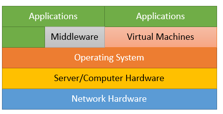

# Interface - Wk01

[Back](../../interface.md)

- [Interface - Wk01](#interface---wk01)
  - [Interfaces and the Enterprise](#interfaces-and-the-enterprise)
  - [Enterprise Information Systems](#enterprise-information-systems)
  - [Layers of Enterprise Architecture](#layers-of-enterprise-architecture)
    - [The four layers](#the-four-layers)
  - [stack](#stack)
    - [Network](#network)
    - [Server/Computer Hardware](#servercomputer-hardware)
    - [Operating System](#operating-system)
    - [Middleware](#middleware)
    - [Virtual Machines](#virtual-machines)
    - [Applications](#applications)
  - [Enterprise Interfaces](#enterprise-interfaces)
    - [Enterprise Application Integration](#enterprise-application-integration)
    - [Integrating Systems](#integrating-systems)
  - [Interfaces and Integration](#interfaces-and-integration)
    - [Integration versus Interoperability/Interfaces](#integration-versus-interoperabilityinterfaces)
    - [Integrated products versus Interfaced products](#integrated-products-versus-interfaced-products)
    - [Cons – Interfaces/Interoperability](#cons--interfacesinteroperability)
  - [Interoperability](#interoperability)
  - [Integration](#integration)
    - [Integration versus Interfacing](#integration-versus-interfacing)

---

## Interfaces and the Enterprise

- Three **Fundamental Roles** of `Information Systems`：
  - **Information Storage and Analysis**
    - Through the adoption of information systems, companies can **make use of** sophisticated and comprehensive **databases** that can **contain** all imaginable pieces of **data** about the company.
    - Information systems **store**, **update** and even **analyze** the information, which the company can then **use to pinpoint solutions** to current or future problems.
    - These systems can **integrate data** from various **sources**, inside and outside the company, keeping the company up to date with internal performance and external opportunities and threats.
  - **Assist With Making Decisions**
    - The **long-term success** of a company depends upon the adequacy of its **strategic plans**.
    - An organization’s management team uses information systems to **formulate strategic plans and make decisions** for the organization's longevity and prosperity.
    - The business uses information systems to evaluate information from all sources, including information from external references which provide information on the general economy.
    - This analysis of and comparison to market trends helps organizations analyze the adequacy and quality of their strategic decisions.
  - **Assist With Business Processes**
    - Information systems aid businesses in developing a larger number of value added-systems in the company. For example, a company can integrate information systems with the manufacturing cycle to ensure that the output it produces complies with the requirements of the various quality management standards.
    - Adoption of information systems **simplifies business processes** and **removes unnecessary activities**.
    - Information systems **add controls** to employee processes, ensuring that only users with the applicable rights can perform certain tasks.Information systems eliminate repetitive tasks and increase accuracy, allowing employees to concentrate on more high-level functions.
    - Information systems can also lead to better project planning and implementation through effective monitoring and comparison against established criteria.

---

## Enterprise Information Systems

- `Enterprise Information Systems`
  - a system that **integrates** various **business processes** within an organization,
  - **handle** large volumes of **data** and **enable** organisations to **integrate** and **coordinate** their **business processes**.
- a **single systems central** to organisations and ensure that information can be **shared** across all functional levels and management hierarchies.

- In reality **an** enterprise consists of **multiple** systems that may need to work together even though they were not originally intended to.
  - **Legacy** systems
  - One or more **commercial enterprise application**
  - **Custom** applications
  - **Off the shelve** applications
- To allow these systems to integrate we need to understand **interfaces**

---

- `Enterprise software`
  - a collection of computer programs that have common business **applications, tools for modelling how the entire organization works**, and **development tools for building applications** unique to the organization.
- The software is intended to solve an **enterprise-wide problem**, rather than a departmental problem.
- Enterprise level software **aims** to improve the enterprise's **productivity** and **efficiency** by providing business logic support functionality.

- `Application Software`
  - `Enterprise application software` performs **business functions** such as order processing, procurement, production scheduling, customer information management, energy management, and accounting.
  - It is typically hosted on servers and provides **simultaneous** services to **many** users, typically over a **computer network**.支持多用户
    - This is in **contrast** to a single-user application that is executed on a user's personal computer and serves only one user at a time.

---

## Layers of Enterprise Architecture

- Enterprise architecture is **unique** to every organization, however, there are some **common elements**.
- The four commonly accepted domains of enterprise architecture are:

### The four layers

- **Business architecture domain** Business Strategy

  - describes **how the enterprise is organizationally structured** and what **functional capabilities** are necessary to deliver the business vision.
  - Business architecture **addresses the questions WHAT and WHO**:
    - WHAT is the organization’s **business vision**, strategy, and **objectives** that guide creation of business services or capabilities?
    - WHO is executing defined business services or capabilities?

- **Data architecture domain** data structure

  - describes the structure of an organization’s logical and physical **data assets** and **data management resources**.
  - Knowledge about your customers from data analytics lets you improve and continuously evolve business processes.

- **Application architecture domain** app to interact with data and support process

  - describes the **individual applications**, their **interactions**, and their **relationships** to the **core business processes** of the organization.
  - Application architecture **addresses the question HOW**:
    - HOW are previously defined business services or capabilities implemented?

- **Technology architecture domain** software and hw to support all above

  - describes the software and hardware needed to implement the business, data, and application services.

- Each of these domains have well-known artifacts, diagrams, and practices.

---

## stack

- `stack`

  - a collection of different components that work together to build and run a complete application and essentially **layered on top of each other** like a stack, with each component **depending on the one below** it to function properly
    - like programming languages, frameworks, databases, servers, and operating systems,

---

### Network

- `network`
  - a collection of computers, servers, mainframes, network devices, peripherals, or other devices **connected to one another to allow the sharing of data**.
- Networks are actually a **combination of hardware and software**.
- The `network layer` **allows interaction** between various components of a system as well as between different systems

---

### Server/Computer Hardware

- `physical computing hardware layer`
  - where the software and the operating systems **run**
  - includes storage devices
  - peripheral devices

---

### Operating System

- OS
  - a software but **interacts directly with the hardware**
  - Can be proprietary and can require proprietary hardware
  - **Manages** computer hardware, software **resources**, and provides common services for computer programs.

---

### Middleware

- `Middleware`
  - software that **provides common services and capabilities** to applications **outside of** what's offered by the **operating system**.
  - **Data** management, application services, messaging, **authentication**, and API management

---

### Virtual Machines

- `virtual machine`

  - an **emulation** of a computer system.

- Virtual machines are based on computer architectures and **provide functionality of a physical computer**.
- Their implementations may involve specialized hardware, software, or a combination.

---

### Applications

- Computer software consists of **programs** and **procedures** intended to **perform specific tasks** on a system.
- From the lowest level assembly language to the high level languages, there are different types of application software.
- System software comprises device drivers, OS, servers and software components
- `Application software` in contrast, is **used for performing specific tasks**

---

## Enterprise Interfaces

- Understanding the layers in the system you are building, extending or integrating will allow you to **choose the correct interfaces** for the components involved.
- You may be required to recommend interface technology or design interfaces **at certain layers** of the model

### Enterprise Application Integration

- `Enterprise application integration`
  - the process of linking **applications within a single organization** together in order to **simplify and automate business processes** to the greatest extent possible
- At the same time **avoiding** having to **make sweeping changes** to the existing applications or data structures.
- Applications can be linked either at the **back-end via APIs** or (seldom) the **front-end (GUI)**.

---

### Integrating Systems

- The various systems that need to be linked together may **reside on different operating systems**, use different database solutions or computer languages, or different date and time formats, or could be legacy systems that are no longer supported by the vendor who originally created them.
- In some cases, such systems are dubbed "`stovepipe systems`" because they consist of components that have been **jammed together in a way that makes it very hard to modify them in any way**.

- Benefits
  - **Data integration**:
    - Ensures that information in **multiple systems** is kept **consistent**.
    - This is also known as `enterprise information integration (EII)`.
  - **Vendor independence**:
    - **Extracts business policies or rules from applications** and implements them in the EAI system, so that even if one of the business applications is **replaced** with a different vendor's application, the **business rules** do not have to be **re-implemented**.
  - **Common facade**:
    - An EAI system can front-end a cluster of applications, **providing a single consistent access interface** to these applications and shielding **users** from having to **learn** to use different software packages.

---

## Interfaces and Integration

### Integration versus Interoperability/Interfaces

- `Integration`: different products work as one.
  - This includes **information exchange**, meaning, that two or more systems won’t require a bridge to pass information, as they share the same code and data store.
- Integration is favoured in cases where you handle **multiple systems**, complex, real-time reporting tools, etc. ERPs are the best example for an integrated system, where all product related data is stored in the same place, gathered and mediated in real-time.
- **ERP systems** examples – **SAP**, Oracle NetSuite, Sage, Peoplesoft etc.

---

整合需要交流，接口有利于交流

- An `interface` is basically a **bridge, which enables two programs/systems to share information** with each other.
  - Interfaces are tools, especially, when the communicating programs were developed differently – they use a different programming language, or their sources are totally different.
  - The communication in these cases usually **uses common protocols and controlled sets of rules** to enable information exchange between systems.
- Interfaces can be p**arts of a product (built-in)**, or **separate programs** which let users configure and deploy them on various systems.
- Interfaces often require **separate application engines** to digest and process this information to then talk to the software.

---

### Integrated products versus Interfaced products

- **Interfaced** Products:

  - May **not share** the same **hardware**, **data store**, may not be co-located in the same location
  - Might **not share** the same **programming** language or source
  - Require time to **sync** data
  - Require **Mapping** to ensure correct data fetching
  - Provides **flexibility** (changeable system parts)
  - More easily **implemented** into an existing system environment

- Integrated Products:
  - Do **share** the same database, hardware, usually co-located
  - **Share** the same programming **language** and source
  - Real-time **sync** is available
  - **No need** for **Mapping** data
  - **Less** flexibility (changing system parts might need you to change other departments)
  - Might need to upgrade to a full, single-vendor solution

---

- While `integrated products` deliver outstanding **speed** and real-time data **sync**, `interfaced products` provide you with better **flexibility**.
- `Integrated products` are less easily integrated into existing system environments, while `interfaced products` require regular maintenance.
- Choosing one over the other simply comes down to the **organizations need**s and which fits better the specific situation.
  - `Interfaced products` might be better choices for organizations that wants to **keep their existing software** while using different pieces for various tasks.
  - While `integrated products` are recommended for situations the require **fast**, singular solution that is capable of delivering a **centralized** experience.

---

### Cons – Interfaces/Interoperability

- **Separate** software products **communicate** under **limited capacity**
- Data is **maintained** in **multiple locations** requiring more **administration**
- Additional steps to **exchange data**
- Constantly maintain, monitor and **update mappings**
- Real-time **synchronization** is **not** available 

---

## Interoperability

- `Interoperability`
  - a characteristic of a product or system whose interfaces are **completely understood to work with other** products or systems, at present or future, in either implementation or access, without any restrictions" according to Wikipedia. 对其他部分的完全理解
- `Semantic interoperability`:
  - the ability to automatically **interpret** the information exchanged meaningfully and accurately in order to produce useful results as defined by the end users of both systems." 完全诠释
- If you are expecting information to come from two or more sources, and you get it, and it makes sense, then you have a win on your hands.
- "`Interoperability` would allow different systems to **work together in their existing state**; however, future upgrades, developments, or improvements to any of these products can cause interoperability to cease." 

---

- `Interoperability` implies exchanges between a range of products using `interfaces`
- **Upgrades** or product advances can **terminate** interoperability 

---

## Integration

- `integration`
  - your software products **work as one solution**. 
  - Instead of passing information between different systems.
  - Your 'one' system contains the **same code and database**. 
- `Integrated systems` **work tightly together** as the pieces of the whole are 'one.'  
  - System updates are easier, as are real-time reporting requirements. 
- `Integrated solutions` share the same databases, so there is **no process of mapping codes** between systems which can substantially reduce errors and downtime. 
- Any **changes** are automatically applied to your whole system. 
- Integration provides a **unified user experience** that combines data, reporting and workflow across a single business platform. 
- Integration is indisputably the truest, most unified way a software system can be utilized. 

---

- An integrated system not only allows a series of products to talk to each other in their current state, but also **provides backwards and forwards compatibility** with future versions of each product within the structure.
- One uninterrupted system
- **Real-time**–All data is immediately gathered, stored, mediated and reportable
- **Data** is centralized, no synchronization needed
- Data **transfers** are reliable and workflow **performance** is accelerated
- No **mapping updates** required, less maintenance
- Business Intelligence Reporting is up-to-the-minute 

---

### Integration versus Interfacing

- Where `integration` is **flexible** and **synchronous**, `interfacing` is just the opposite – rigid and **limited** regarding what you can share and do. 
- When you interface one system to another, much like building a bridge to link them together, it works to satisfy your needs of today only.
  - But down the road, if you need more information from that other system, or need to share information with a new system, you would have to go back and redevelop the interface and reconstruct that bridge or create a new bridge from scratch. 
  - This requires additional work, time, and resources. 
- Integrated products may not provide the services you are looking for out of the box.
