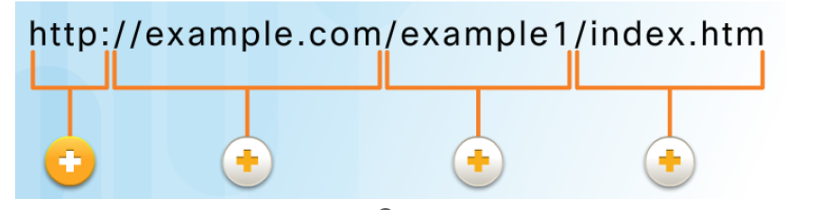

# Interface - Wk09

[Back](../interface.md)

- [Interface - Wk09](#interface---wk09)
  - [Networks](#networks)
    - [Local Networks](#local-networks)
    - [Transmitting Data on the Network](#transmitting-data-on-the-network)
    - [Bandwidth](#bandwidth)
    - [Network Components](#network-components)
    - [Blocks of a Network](#blocks-of-a-network)
      - [Simple network](#simple-network)
    - [Ping Command](#ping-command)
    - [Wireless](#wireless)
    - [Local Network Connections](#local-network-connections)
    - [Topology](#topology)
    - [Cabling and Media](#cabling-and-media)
    - [Network Communications](#network-communications)
    - [Protocols for wired networks](#protocols-for-wired-networks)
      - [Network Messages](#network-messages)
    - [Physical and Logical Addresses](#physical-and-logical-addresses)
    - [Network Design](#network-design)
    - [Network Components](#network-components-1)
    - [Broadcasts](#broadcasts)
    - [Distributing messages to other devices](#distributing-messages-to-other-devices)
      - [Routing Across Networks](#routing-across-networks)
    - [Local Area Networks](#local-area-networks)
  - [Client Server](#client-server)
    - [The Client Server relationship](#the-client-server-relationship)
    - [TCP/IP Protocols](#tcpip-protocols)
    - [Track of the Conversation](#track-of-the-conversation)
    - [Domain Name System](#domain-name-system)
    - [Web Clients and Servers](#web-clients-and-servers)
    - [FTP Clients and Servers](#ftp-clients-and-servers)
    - [Virtual Terminals](#virtual-terminals)
    - [Email and Messaging](#email-and-messaging)
    - [Wireless Standards](#wireless-standards)
    - [Accessing Wireless Routers](#accessing-wireless-routers)
    - [Internet Providers](#internet-providers)
    - [Mobile Devices on the Network](#mobile-devices-on-the-network)
    - [Firewalls](#firewalls)

---

## Networks

- `Computer networking`
  - a pool of **integrated computers** configured to one another.
- `Computer networks` / `data networks`

  - **chains of nodes linked** by communication channels (interfaces).
  - The **nodes** receive, transmit and exchange data between endpoints.

- **Networks** are the **backbone** of Distributed and Enterprise systems.

---

### Local Networks

- `Local Networks`
  - come in all sizes
    - from **peer-to-peer** (two interconnected device),
    - to home networks, SOHO, and **large** organization networks.
- Making Connections
- All types of devices connect to local networks

---

### Transmitting Data on the Network

- **Transmitting Data** on the Network

- `Data`

  - a **value** that represents something.

- Networks need to transmit data in order to **share** with others or for long-term storage.

-

- The `Mighty Bit`
  - Computers **use binary codes** to represent and interpret letters, numbers and special characters with bits.
- Each group of **eight bits**, such as the representations of **letters** and **numbers**, is known as a `byte`.
- Getting Bits Moving
  - `Bits` are transmitted as signals over **copper wire** (electrical pulses), **fiber**- **optic cable** (light pulses), and **wireless** (radio waves).

---

### Bandwidth

- It’s All About the Speed
- Measuring `Bandwidth`

  - `Digital bandwidth`
    - the **amount of data** that can flow from one place to another **in a given amount of time** **measured in the number of bits** that (**theoretically**) can be sent across the media in a second.

- Measuring `Throughput`
  - `Throughput`
    - the **actual measure** of the transfer of **bits** across the media **over a given period of time**.
  - Many **factors** influence throughput including the **amount of data** being sent / received, the **types of data** being transmitted, and the **accumulated latency** created by the **number of network devices** encountered between source and destination.

---

### Network Components

- Clients and Servers

  - `Servers`
    - **hosts** that have **software installed** that enable them to **provide information**, like email or web pages, to other hosts on the network.

- `Clients`
  - **computer** hosts that have software installed that enable them to **request and display** the information obtained from the server.
- Multiple Roles in the Network
  - `Servers` can provide **multiple services** in a network

---

### Blocks of a Network

- `Network Infrastructure`

  - the **platform** that **supports** the network containing end devices, intermediate devices (routers, switches, access points, …) **interconnected** using network **media** (wired and wireless).

- `End Devices`
  - Includes computers, laptops, printers, tablets, smart devices, …
  - Form the interface between users and the underlying communication network.

---

#### Simple network

- `Peer-to-Peer` Networking

  - Network in which a host can be a **client** and a **server** for other hosts.

- The **advantages** of peer-to-peer networking:

  - **Easy** to set up
  - **Less** **Complex**
  - Lower **cost** because network devices and dedicated servers may not be required.
  - Can be used for **simple tasks** such as transferring files and sharing printers

- The **disadvantages** of peer-to-peer networking:
  - **No** centralized **administration**
  - **Not** as **secure**
  - **Not scalable**
  - All devices may act as **both clients and servers** which can slow their performance

---

### Ping Command

- Use the `ping` utility to **test** end-to-end IP **connectivity** between a source and destination IP address.
  - Following the Path
- Use the `traceroute` utility to **display** each hop in the **path** to the destination.

---

### Wireless

- **Mobile phones** use **radio waves to transmit** voice signals to antennas mounted on towers located in specific geographic areas.
- The abbreviations 3G, 4G, and 5G are used to describe enhanced **cell phone networks** that are optimized for the fast transmission of data.
- Other networks that are used by smart phones include `GPS`, `Wi-Fi`, `Bluetooth`, and `NFC`.

---

### Local Network Connections

- Some examples of network components are personal computers, servers, networking devices, and cabling.
- These components can be **grouped into four categories**:

  - `hosts`,
  - `shared peripherals`,
  - `network devices`,
  - and `network media`.

- There are **three parts** to the **IP configuration** which must be correct for the device to send and receive information on the network:
  - `IP address`: **identifies the host** on the network.
  - `Subnet mask`: **identifies the network** on which the host is connected.
  - `Default gateway`: identifies the networking device that the **host uses to access the Internet** or another **remote network**.
- An IP address can be configured **manually** or assigned **automatically** by another device.

---

### Topology

- As a network grows in size and complexity, it is important that the network is **well-planned**, **logically organized**, and appropriately **documented**.
- When networks are installed, a `physical topology` is created to **record** where each host is **located** and how it is **connected** to the network.
- The `physical topology` also shows where the **wiring is installed** and the of the networking devices that connect the hosts- **locations**

---

- A `logical topology` illustrates the **device names**, **IP** addressing, **configuration** information, and network **designations**.
- These are `logical` pieces of information that may **change more frequently** than the phy`sical topology` of a network.
- The icons in the image are used to create both physical and logical topologies.

---

### Cabling and Media

- Modern networks primarily use **three types of media** to interconnect devices and to provide the pathway over which data can be transmitted:

  - `Copper wires` within cables
  - Glass or plastic `fibers` (fiber-optic cable)
  - `Wireless transmission`

- `Twisted-Pair (TP)`

  - a type of copper cable.
  - TP is the **most common** type of network cabling.

- `Coaxial Cable`

  - usually made of **copper** or **aluminum**.
  - used by cable **television** companies to provide service, and for satellite communication systems.

- `Fiber-optic cables`
  - made of **glass** or **plastic**- They have a very **high bandwidth**, so they can carry vast amounts of data.
  - used in **backbone networks**, **large** enterprise environments, and large **data centers**.

---

### Network Communications

- Stacking Them Up

  - Successful communication requires interaction between **protocols**.
  - A `protocol stack` is used to help **separate the function** of each **protocol**.
  - This enables each layer in the stack to **operate independently** of others.

- Using a **Layered Model**

  - Layered models help us **visualize how the various protocols work together** to enable network communications

- Each layer has a well-defined interface through which the layer above it accesses its services.

- TCP/IP Model

  - App = 5-7
  - Transport = 4
  - Internet =3
  - Network Access = 1,2

- Open Systems Interconnection (OSI) Model

---

### Protocols for wired networks

- Why Ethernet?

- `Ethernet` has become the de facto **standard**
- This means it is used by almost all wired local area networks

---

#### Network Messages

- `Encapsulation`
  - The process of **placing** one message **inside another message format** is called encapsulation.
- `De-encapsulation` occurs when the process is **reversed**.
- Before a network message is sent over the network, it is **encapsulated** in a frame that identifies the **destination** and **source** **MAC** addresses.

---

### Physical and Logical Addresses

- A `MAC address` is **physically assigned** to a NIC and **never changes**.
- The physical MAC address **remains the same** regardless of network.

- An `IP address` (network address) is **logically assigned** to a host `network interface card`.

  - The logical IP addresses contain two parts:
    - `Network portion`:
      - The left-hand portion of an IP address **identifies the network portion** of the address.
      - It is the same for all hosts connected to the **local network**.
    - `Host address`:
      - The right-hand portion of an IP address that **uniquely identifies** the individual host on the network.

- Both the `physical MAC` and `logical IP addresses` are required for a computer to communicate on a hierarchical network.

---

### Network Design

- `Access Layer`:
  - **Provides connections to hosts** in a local Ethernet network.
- `Distribution Layer`:
  - **Interconnects the smaller** local networks.
- `Core Layer`:
  - Provides a **high-speed connection** between **distribution** layer devices

---

### Network Components

- `Access Layer Devices`

  - Provides the first line of networking devices that **connect hosts to the wired Ethernet network**.
  - Typically connected using **switches**.

- `Ethernet Hubs`

  - **Legacy** access layer device that **broadcast** frames to **all ports**.
  - Created excessive col**lision domains**.
  - Hubs have been superseded by `switches`.

- `Ethernet Switches`
  - A `switch` **accepts and decodes** the frames to read the **physical (MAC) address** portion of the message.
  - The switch **checks a table** on the switch, called a `MAC address table`, that contains a **list of all of the active ports** and the host **MAC addresses** that are attached to them.
  - The switch creates a **circuit** that connects those two ports, enabling the switch to support multiple conversations between different pairs of ports.

---

### Broadcasts

- What are Broadcasts Anyway?

  - A **broadcast message** is **simultaneously sent** by a host t**o all other hosts**.

- `Broadcast Domains`

  - A `local area network`, a network with one or more Ethernet switches, is also referred to as a `broadcast domain`.
  - When a broadcast message is sent, all switches **forward** the message **to every connected host** within the **same local network**

- Communicating at the `Access Layer`
  - To send a message, a host needs the `IP address` and `MAC address` of the destination host.
  - The destination `IP address` is typically known; therefore, how does the sending host determine the destination MAC address?
    - The sending host can use an IPv4 protocol called `address resolution protocol (ARP)` to discover the MAC address of any host on the same local network.
    - IPv6 uses a similar method known as Neighbor Discovery.

---

### Distributing messages to other devices

- Dividing the Local Network
  - As networks evolve, it is necessary to **divide one** `access layer` network into **multiple** `access layer networks`.
- There are many ways to divide networks based on different criteria.

- Now We Need `Routing`
  - `Routers` and `routing` is required to **reach remote hosts**.
  - `Routing` is the **process of identifying the best path** to a destination.

---

#### Routing Across Networks

- Selecting a Path

  - Every router creates a `routing table` containing all **locally-connected and remote networks** and the **interfaces** that connect to them.
  - Routers **use** their routing tables and forward packets to either a **directly connected network** containing the actual destination host, or **to another router** on the path to reach the destination host.

- Building the Tables

  - Routers **build** their `routing tables` by **first adding** their locally connected networks, and then learning about other networks using `routing protocols`.

---

- Routing Tables
- How Routers Use Tables

  - The router has **added its two directly connected networks** to the `routing table`.

- Sending to Remote Networks
  - If H1 sent a packet to H7, the router would **examine its routing table** and determine that to reach network 172.16.1.0/24 , it must forward the packet out of its Fa0/1 interface.
  - Because the outgoing network is a directly connected Ethernet network, the router may also have to `ARP` the IP address.

---

### Local Area Networks

- `Local Area Networks`
  - a local network, or a **group of interconnected local networks** that are under the **same administrative control**.
- The term Intranet refers to a `private LAN` that belongs to an **organization**, and is **accessible only** by the organization's **members**, employees, or others with authorization.

---

- Placing All Hosts in One **Local Network Segment**

  - **Advantages**:

    - Appropriate for **simpler** networks
    - Less complexity and lower network **cost**
    - Allows devices to **be "seen"** by other devices
    - **Faster** data transfer - more direct communication
    - Ease of **device access**

  - **Disadvantages**:
    - All hosts are in one broadcast domain which **causes more traffic** on the segment and may **slow** network performance

- Placing Hosts in Remote Network Segments

  - **Advantages**:

    - More appropriate for **larger**, more **complex** networks
    - Splits up **broadcast domains** and **decreases traffic**
    - Can **improve** **performance** on each segment
    - Makes the machines **invisible** to those on other local network segments
    - Can provide increased **security**
    - Can **improve** network **organization**

  - **Disadvantages:**
    - Requires the use of **routing** (distribution layer)

---

## Client Server

### The Client Server relationship

- There are millions of servers connected to the Internet, providing services such as web sites, email, financial transactions, and music downloads to clients.

- The primary **characteristic** of `client/server systems` is that

  - the `client` **sends a request** to a server,
  - the `server` **responds** by carrying out a function, such as **sending** the requested document back to the client.

- A `uniform resource locator (URL)` is used to **locate** the **server** and a specific **resource**.
- The URL identifies:
  - `Protocol` being used, usually HTTP (Hypertext Transfer Protocol) for web pages
  - `Domain name` of the server being accessed
  - `Location` of the resource on the server
  - `Resource`

---

### TCP/IP Protocols

- Some of the protocols used for Internet services are:

  - `Domain Name System (DNS)` - **Resolves** Internet `names` to `IP addresses`.
  - `Secure Shell (SSH)`: Used to **provide remote access** to servers and networking devices.
  - `Simple Mail Transfer Protocol (SMTP)`: Sends **email** messages and attachments **from clients to servers** and **from servers to other email servers**.
  - `Post Office Protocol (POP)`: Used by email **clients** to **retrieve** email and attachments from a remote server.
  - `Internet Message Access Protocol (IMAP)`: Used by email **clients** to **retrieve** email and attachments from a remote server.
  - `Dynamic Host Configuration Protocol (DHCP)`: Used to **automatically configure devices** with IP addressing and other necessary information to enable them to communicate over the Internet.
  - `Web Server`: Transfers the files that make up the web pages of the World Wide Web using `Hypertext Transfer Protocol (HTTP)`.
  - `File Transfer Protocol (FTP)`: Used for interactive **file transfer** between systems.

---

- The various protocols necessary to deliver a web page function at the **four different levels** of the `TCP/IP model` are:

  - `application layer protocol`,
  - `transport layer protocol`,
  - `Internetwork layer protocol`,
  - and `network access layer`.

- The two most common transport protocols are `Transmission Control Protocol (TCP)` and `User Datagram Protocol (UDP)`.

  - The IP protocol uses these transport protocols to enable hosts to **communicate and transfer data**.

- When an application **requires acknowledgment** that a message is delivered, it uses `TCP`.
- `UDP` is a **'best effort' delivery** system that does **not require acknowledgment** of receipt.

---

### Track of the Conversation

- A `port`
  - a **numeric identifier** within each segment that is used to **keep track of specific conversations** between a client and server.
  - Ports are categorized into three groups:
    - **Well-known**,
    - **registered**,
    - and **private**.
- Every message that a host sends contains both a **source** and **destination** port.

  - The `source port number` is **dynamically generated** by the sending device to identify a conversation between two devices.
  - The client places a **destination port number** in the segment to tell the destination server **what service is being requested**.

---

### Domain Name System

- The `Domain Name System (DNS)` names are registered and organized on the Internet within specific **high level groups, or domains**. Some of the most common high level domains on the Internet are .**com**, .**edu**, and .**net**.

- A `DNS server` contains a **table** that associates **hostnames** in a domain with corresponding **IP** addresses.
  - When the DNS server receives a request, it checks its table to determine the IP address associated with that server.

---

### Web Clients and Servers

- When a web **client** receives the **IP address** of a web server, the client browser uses that IP address and port `80` to **request** web services using the `Hypertext Transfer Protocol (HTTP)`.
- The `HyperText Markup Language (HTML)` coding tells the browser how to **format** the web page and what graphics and fonts to use.

- There are many different web servers and web clients available on the market.
  - The `HTTP` protocol and `HTML` standards make it possible for these servers and clients from many different manufacturers to **work together seamlessly**.

---

### FTP Clients and Servers

- The `File Transfer Protocol (FTP)` provides an easy method to **transfer files** from one computer to another.
  - It also enables clients to **manage files remotely** by sending file management commands such as delete or rename.
  - To accomplish this, the FTP service uses two different **ports** to communicate between client and server

---

### Virtual Terminals

- `Telnet` uses software to **create a virtual device** that provides the same features of a **terminal session** with access to the server's command line interface (CLI).
- `SSH` provides for **secure remote login** and other secure network services.
  - It also provides stronger **authentication** than Telnet and supports the transport of session data using encryption.
  - Network professionals should always use SSH in place of Telnet, whenever possible.

---

### Email and Messaging

- **Email Clients and Servers**

  - Each mail ``server` **receives and stores** mail for users who have mailboxes configured on that mail server.
  - Each `user` with a mailbox must then use an email **client** to access the mail server and read these messages.

- Email **Protocols**

  - Various application protocols used in processing email include
    - SMTP,
    - POP3,
    - IMAP4.

- **Instant Messaging (IM)**

  - IM applications reguire minimal configuration to operate.
    - After the client is downloaded, all that is required is to enter username and password information.
    - In addition to text messages, IM can support the **transfer of documents, video, music, and audio files**.

- **Internet Phone Calls**
  - An Internet telephony client **uses peer-to-peer technology** similar to that used by instant messaging.
    - IP telephony makes use of `Voice over IP (VolP)` technology which converts analog voice signals into digital data.
    - The **voice data** is **encapsulated** into IP packets which carry the phone call through the network.

---

### Wireless Standards

- Many standards have been developed to ensure that wireless devices can communicate.

  - The `IEEE 802.11` standard governs the `WLAN` environment.

- Wireless routers using the 802.11 standards have many settings that have to be **configured**, including:

  - Network **mode**
  - Network **Name** (SSID)
  - Standard **Channel**
  - SSID **Broadcast**

- Note: `SSID` stands for `Service Set Identifier`.

---

### Accessing Wireless Routers

- Decide where to place the router

- **Connect the router to the network (cable)**
- Configure the **wireless router gateway**
- Set up **security**

---

### Internet Providers

- `Internet Service Provider (ISP)`
  - provides the link between the **network** and the **global Internet**.
  - ISPs are critical to communications across the Internet.
  - Each ISP **connects to other ISPs** to form a network of links that interconnect users all over the world.
- A **router is required** to securely connect a computer to an `ISP`.
  - The `router` includes
    - a `switch` to connect wired hosts
    - and a `wireless AP` to connect wireless hosts.
- The `router` also provides client **addresses** and **security** for inside hosts.

- Connectivity Options

  - The two most common methods to connect to an ISP are **Cable** and **Digital Subscriber Line (DSL)**.
  - Other ISP connectivity options are **Satellite**, **Cellular**, and **Dial-up Telephone**.

---

### Mobile Devices on the Network

- `Mobile devices` is preprogrammed to use a **Wi-Fi network for Internet** if one is available and the device can connect to the `access point` and receive an IP address.
  - If no Wi-Fi network is available, the device uses the **cellular data** capability if it is configured.
  - `Bluetooth` is wireless, automatic, and uses very little power, which helps conserve battery life.
    - Up to eight Bluetooth devices can be connected together at any one time.

---

### Firewalls

- What is a Firewall?
  - A `firewall` **prevents undesirable traffic** from entering protected areas of the network.
  - A firewall is usually installed **between two or more networks** and **controls the traffic** between them as well as helps **prevent unauthorized access**.
- Firewalls can be implemented in **software**.
- Firewalls may also be **hardware** devices.
- A hardware firewall is a **freestanding unit**.
- Firewalls often perform `Network Address Translation`.
