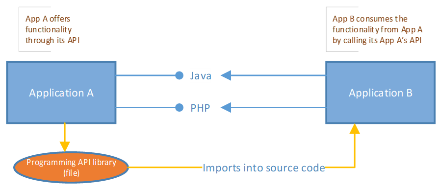

# Interface - Wk11

[Back](../interface.md)

- [Interface - Wk11](#interface---wk11)
  - [Software Interfaces](#software-interfaces)
    - [Application Integration](#application-integration)
        - [Advantages of Integrating Applications](#advantages-of-integrating-applications)
      - [Challenges to Application Integration](#challenges-to-application-integration)
    - [How?](#how)
  - [Application Interfaces](#application-interfaces)
  - [Web Interfaces](#web-interfaces)
    - [Characteristics](#characteristics)
    - [Benefits](#benefits)

---

## Software Interfaces

### Application Integration

- `Application integration` is becoming increasingly crucial because no matter how much you want to carry out all your work using a **single** application, it’s almost **impossible**.
- There are several applications, fulfilling dedicated needs and roles within businesses.
- Instead of depending on one application, you end up depending on many. Although this helps you accomplish numerous tasks, handling several applications and the data within each can be challenging.
- This is where application integration comes in.
- When you create an **integrated application network**, allowing applications within an enterprise to interact with one another, all your business and work procedures can be performed more proficiently.

---

- `Application integration` enables the **consolidation** and **sharing** of data, resources, and processes among an organization’s different applications.
- The definition of `software application integration` is the **combination and improvement of workflows and data** across software applications.
- The end **goal** of this process is to **enhance** business **efficiency**.
- Data access, analysis, and transformation are imperative for application integration. Because if an application is unable to transfer and comprehend data from another application, **inconsistencies** can arise and cause delays in business processes.
- This is where application/software Interfaces come in.

---

##### Advantages of Integrating Applications

- **Eliminate Data Silos**
  - Applications designed by **different vendors** do **not** have the **ability to communicate** with each other without using additional technology.
  - `Application Interfaces` act as a **glue between various applications**, whether they are on-premise or in the cloud.
  - The benefit is the elimination of data silos that occur when an information system or subsystem is unable to connect.
  - Data **silos** **slow down business operations** and **prevent** effective **sharing** of data; as a result, it remains isolated within every system.

---

- **Faster Time-to-Market**
  - Businesses often fail to generate a **higher** `ROI (return on investment)` because of **delays** in technology deployment.
  - By integrating various applications, companies can **fast-track their business processes**, **reduce** time-to-market, and **boost** their ROI.
  - Irrespective of the application and data format, companies can incorporate and convert data according to the appropriate specifications along with **eradicating the tiresome manual procedures** that often plague the addition of a new business system or product.

---

- **Process Automation**
  - Depending on the industry, business procedures can **diverge** significantly.
  - Application integration helps facilitate smooth **data transfer** among all kinds of systems and workflows to support productivity and **automation**.

---

- **Data Visibility**
  - Application integration **facilitates point-to-point integration** and augmented **data visibility** that empowers businesses to observe, measure, and embrace the data all through the workflow.
  - Through application integration, you can **utilize data** to effortlessly **address customer expectations** and acquire a broad view of business activities.

---

- **Interoperability**
  - By integrating different applications, users can get a **holistic view of enterprise data** by providing users an integrated interface to access functionality and data of various platforms.
  - Thus, creating interoperability between complementing systems, both old and new.

---

#### Challenges to Application Integration

- Application integration is often a **challenging process**. This is particularly true if you are integrating **old** applications with **new** ones.
  - A frequently ignored aspect of this type of integration is related to **applications** that are firmly connected with other **systems**, such as `ERP` applications.
  - They are not only connected but are reliant on one another to support a particular process.
  - These applications become particularly challenging to integrate, and don’t often respond well to updates and changes, which cause IT integration issues.
  - IT department also uses different types of system integrations. As a result, these **integrations** are **fragile** and expensive to maintain.

---

### How?

- `Application integration` is not possible without the use of an `application programming interface` or `API`.
- An `API` is the set of **rules** or **protocols** for building application software.
  - Its a **method of communication** that facilitates the **interaction** between applications and system software.
  - Furthermore, it allows **access to data** trapped in cloud sources.
- An API allows flexibility and control for end-users while ensuring that the original creators maintain their application without any external interference.
- APIs have been around a long time and used for integration of on-premise based software systems.
- Nowadays, APIs are being used for different purposes, such as **real-time data** retrieval, system integration, system synchronization, and system updates.

---

## Application Interfaces

- An `API (application programming interface)`
  - a **package of functions or rules** that allow a user to **reference and interact** with parts of an application for their own purposes.
- While APIs these days are most often referencing web APIs, APIs have long been used to integrate on-premise software systems.
- APIs have played a significant **role** in `SOA (service-oriented architecture)`, which has mainly taken place on-premise. This means application integration was only really able to take place **internally**.
- With the web and the development of cloud applications, application integration is more commonly an **external** process.
  - You do not necessarily need to have an application stored on your computer for you to be able to access the API of an application.

---

- A **programmer’s library** that supports 1 or more programming languages.
- Supports **custom** integrations
- **Operating systems** have an `API`, application that run on Windows can **call** the Windows `API` to take advantage of the operating system’s services.
  - File Services
  - GUI library
  - Graphics functions such as 3D
  - Printer and other output devices
  - OS shell and network
- Provided by libraries that are imported into the calling applications source code

---

- Generally **not** used in remote integration
- **Limited** to the programming **languages** supported by the application providing the API
- All **operating systems** provide APIs
  - **Not** all **applications** provide APIs for integration
- Custom applications can be designed to call other application’s APIs as well as exposing their own functionality through a custom API
- Custom applications need to understand their requirements so they know what functionality to expose and what to consume.
- This is the job of the **Technical Systems Analyst**.

---

## Web Interfaces

- **APIs for web applications** have become very popular and essential for various tasks due to the increase in mobile applications and cloud-based software.
- `Web APIs` are distinct for the following reasons:
  - They are **exposed over the web** using an **HTTP** or **HTTPS** protocol
  - Public web APIs are **available** over the internet, typically with supporting **documentation**
  - They are most often built using `JSON` or `XML`
- While `web APIs` do share consistencies, most web APIs will be **unique** in the way that you can use them.
  - These differences are dependent on how the developers of the application decided to create the corresponding API.
  - Therefore, the specific information that is needed to fully make use of a specific API relies heavily on the **documentation** that is provided.

---

- **Integrating Applictions** that are **not co-located** is becoming more common.
  - Standard approach using `application APIs` will **not** work.
- Need something that is standardized.
- All **Web Services** are `APIs`, but not all APIs are Web Services.
- Common communication **types** in Web Services are `SOAP`, `REST` and XML-RPC, JSON.
  - `SOAP - Simple Object Access Protocol`
  - `REST - Representational State Transfer`
  - `JSON - Javascript Object Notation`
  - `UDDI - Universal Description, Discovery, and Integration`
  - `WSDL - Web Service Definition Language`

---

### Characteristics

- **XML-Based**
  - Web services use XML **at data representation and data transportation layers**.
    - Using XML eliminates any networking, operating system, or platform binding.
  - **Web services** based applications are highly **interoperable** at their core level.
- **Loosely Coupled**
  - A **consumer** of a web service is **not tied** to that web **service** directly. The web service interface can change over time **without compromising** the client's ability to interact with the service.
  - A tightly coupled system implies that the **client and server logic are closely tied to one another**, implying that if one interface changes, the other must be updated.
  - Adopting a loosely coupled architecture tends to make software systems more **manageable** and allows simpler integration between different systems.

---

- **Coarse-Grained**
  - `Object-oriented` technologies such as Java expose their services through individual methods. An individual method is too fine an operation to provide any useful capability at a corporate level.
  - Building a Java program from scratch requires the creation of several **fine-grained methods** that are then composed into a **coarse-grained service** that is consumed by either a client or another service.
  - Businesses and the interfaces that they expose should be coarse-grained.
  - Web services technology provides a natural way of **defining coarse-grained services** that access the right amount of business logic.

---

- **Ability to be Synchronous or Asynchronous**
  - `Synchronicity` refers to the **binding of the client to the execution** of the service.
  - In **synchronous** invocations, the client **blocks** and **waits** for the service to complete its operation before continuing.
  - **Asynchronous** operations allow a client to **invoke** a service and then **execute** other functions.
  - `Asynchronous` clients **retrieve their result at a later point in time**, while `synchronous` clients **receive** their result when the service **has completed**.
  - `Asynchronous` capability is a key factor in enabling **loosely coupled systems**.

---

- **Supports Remote Procedure Calls(RPCs)**
  - Web services allow clients to **invoke procedures, functions, and methods** on remote objects using an **XML-based protocol**.
  - Remote procedures expose input and output parameters that a web service must support.
    - For example component development through Enterprise JavaBeans (EJBs) and .NET Components has increasingly become a part of architectures and enterprise deployments over the past couple of years. Both technologies are distributed and accessible through a variety of `RPC` mechanisms.
  - A web service supports `RPC` by providing services of its own, equivalent to those of a traditional component, or by translating incoming invocations into an invocation of an EJB or a .NET component.

---

- **Supports Document Exchange**
  - One of the key advantages of XML is its **generic way of representing** not only data, but also complex **documents**.
  - These documents can be as simple as representing a current address, or they can be as complex as representing an entire book or Request for Quotation (RFQ).
  - Web services support the **transparent exchange of documents** to facilitate business integration.

---

### Benefits

- **Exposing the Existing Function on the network**
  - A web service is a unit of managed code that **can be remotely invoked** using HTTP.
    - It can be activated using HTTP requests.
    - They allow you to **expose the functionality** of your existing code over the network where other applications can use the functionality of your program.
- **Interoperability**
  - Web services allow various applications to **talk to each other** and **share** data and services among themselves.
  - Web services are used to make the application platform and technology **independent**.
- **Standardized Protocol**
  - Web services use **industry standard protocols** for communication.
  - All the four layers (Service Transport, XML Messaging, Service Description, and Service Discovery layers) use well-defined protocols in the web services protocol stack. This standardization of the protocol stack gives the business many advantages such as a wide range of choices, reduction in the cost due to competition, and increase in the quality.
- **Low Cost Communication**
  - Web services use SOAP over the HTTP protocol, so you can use your **existing** low-cost internet for implementing web services. This solution is much less costly compared to proprietary solutions like EDI/B2B.
  - SOAP over HTTP, web services can also be implemented on other reliable transport mechanisms like FTP.
