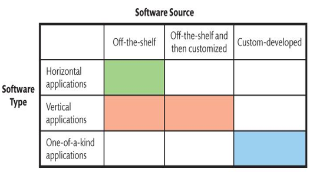

# Mis - Wk01

[Back](../../gather.md)

- [Mis - Wk01](#mis---wk01)
  - [Hardware and Software](#hardware-and-software)
    - [Computer Hardware](#computer-hardware)
    - [Types of Hardware](#types-of-hardware)
    - [Computer Data](#computer-data)
    - [Volatility of Memory](#volatility-of-memory)
    - [How Can New Hardware Affect Competitive Strategies?](#how-can-new-hardware-affect-competitive-strategies)
      - [Internet of Things (IoT)](#internet-of-things-iot)
      - [Self-Driving Cars](#self-driving-cars)
      - [3D Printing](#3d-printing)
  - [Computer Software](#computer-software)
    - [Major Operating Systems](#major-operating-systems)
    - [Server Operating Systems](#server-operating-systems)
    - [Virtualization](#virtualization)
    - [Owning Versus Licensing](#owning-versus-licensing)
    - [Types of Applications](#types-of-applications)
    - [Firmware](#firmware)
    - [Open-Source Software](#open-source-software)
  - [Components of an Information System](#components-of-an-information-system)
    - [IS Basic Process](#is-basic-process)
    - [MIS](#mis)
      - [Development and Use of Information Systems](#development-and-use-of-information-systems)
      - [Achieving Business Goals and Objectives](#achieving-business-goals-and-objectives)
    - [Social Media: Changing the Relationship Between Customers and Business](#social-media-changing-the-relationship-between-customers-and-business)
    - [IS vs IT](#is-vs-it)
    - [Importance of IS](#importance-of-is)
    - [How Do Successful Business Professionals Use IS?](#how-do-successful-business-professionals-use-is)
    - [Gaining a Competitive Advantage](#gaining-a-competitive-advantage)

---

- Overview of computer hardware
- How can new hardware affect competitive strategies?
- What is computer software?
- Is open source software a viable alternative?

## Hardware and Software

### Computer Hardware

- `Computer hardware`

  - the electronic **components and gadgets** that input, process, output, and store data **according to software instructions**

- Components:
  - **Central processing unit (CPU)** - “the brain”
    - Can be dual-processor and quad-processor computers
    - Vary in speed, function, cost
    - Works in conjunction with main memory (or random access memory, RAM)
    - Reads data and instructions from memory, stores results of in RAM
  - Common **storage devices**
    - Magnetic disks (Hard disks): most common
    - Solid-state storage (SSD drive): faster than hard drives, more expensive
    - USB flash drives: Small, portable
    - Optical disks (CD/DVD): Small, portable

---

### Types of Hardware

- **Personal computers**: classic computing devices
  - Gradually being supplanted by tablets, mobile devices.
- **Tablets**: brought to prominence with iPad in 2010
  - Microsoft Surface, Google Nexus, also available.
- **Phablet**: functionality of a smartphone with the larger screen of a tablet
  - Samsung Galaxy, iPhone Plus
- **Smartphones**: Cell phones with processing capabilities
  - Samsung Galaxy , Google Pixel, iPhone .
- **Server**: computer design to support processing requests from remote computers and users.
  - PC on steroids
  - Differs from a PC mostly in **what it does**
  - Clients – PCs, tablets, smartphones that access a server
- **Server farm**
  - Collection of many servers-
  - Often in large truck trailers, holding 5,000 or more servers, with one power cable and one processing cable coming out.

---

### Computer Data

- **Binary bits (bits)**: how computers represent data
  - Either a **zero** or a **one**
    - **Open** switch represents **zero**, **closed** switch represents **one**
    - Or, magnetism in **one direction** represents a **zero**, magnetism in the **next direction** represents **one**

---

- Sizes
  - All computer data are represented by **bits**: numbers, currency amounts, photos, recordings
  - Grouped into **8-bit chunks**: `Bytes`
    - If a picture is 100 000 bytes in size, that means the length of the bit string that represents the picture is 100 000 bytes (or 800 000 bits, since 8bits per byte)
- Computer disk capacities are specified by amount of storage
  - 500 GB disk can contain 500 GB of data, programs
- CPU **speed in cycles** called `hertz`
  - Slow personal computer speed of 3.0 Gigahertz
  - Fast PC 4.0+ GHz

---

### Volatility of Memory

- `Cache` and `main memory` are **volatile**
  - Contents are **lost** when power is **off**
- `Magnetic`, `optical disk memory` are **non-volatile**
  - Contents **survive** when power is **off**
  - Saving often saves!

---

### How Can New Hardware Affect Competitive Strategies?

- Following Examples are **latest hardware** technologies:
  - Smart device have
  - Internet of Things (IoT):
    - Self-driving vehicles
    - 3D Printing

---

#### Internet of Things (IoT)

- Everyday objects **embedded** with hardware **capable of sensing, processing, transmitting data**
- Connect to a **network** to **share data** with any other applications, services and devices.
- Objects becoming **connected** with each other for communiction.
- Consumer **homes** is an attractive **target** for smart device makers
- Greatest **potential** for smart devices in **hospitals**, power **grids**, **railroads**, and manufacturing **plants**
  https://www.youtube.com/watch?v=EKRVILAohck

---

#### Self-Driving Cars

- Pilot project in Ontario started in 2016
- Google cars logged 3 million miles by 2017
- Make life easier, ridesharing, cheaper, safer
  - **Reduce** human **error**
  - Fewer **accidents**
  - Avoid costly traffic tickets, parking tickets, DUI citations
- Eliminate **need** for multiple cars

- Impact on Businesses
  - Auto **sales**
    - Fewer cars on road may mean fewer cars sold (e.g. Ride sharing)
  - Auto **loans**, **insurance**, car **repair**
  - More **jobs** for engineers, programmers, systems designers
  - More computer **hardware, sensors, and cameras** in vehicles

---

#### 3D Printing

- `3D Printing`
  - Plastics, metals, ceramics, foods, biological material
- **Opportunities** in aerospace, defense, automotive, entertainment, healthcare industries
- What happens when 3D-print extra-large objects like cars, planes, boats, houses, and drones happens?

- Existing 3D Printing **Examples**
  - ChefJet, culinary artists and novices can produce intricate, beautiful, and fully customized deserts
  - Living cells (organs, bones, heart valves, skin)
  - Houses, buildings

---

## Computer Software

- **Native** applications
- **Thin-client:**
  - lightweight computer that **relies on the the host** computer.
  - It works by connecting with a remote server, where applications and data are stored.
  - They **don't have storage capability** to store user's data, so the data stores at a remote server from which the thin client is connected to.
- **thick-client** applications:
  - Relies lightly upon the server and provides **rich functionality**.
  - The majority of **data processing** is performed by **thick clients**.
  - They are also called as heavy or fat clients.
- **Web** applications

- Categories of Computer Software

|        | Operating Systems                                     | Application Programs                                |
| ------ | ----------------------------------------------------- | --------------------------------------------------- |
| Client | Programs that control the client computer's resources | Applications that are processed on client computers |
| Server | Programs that control the server computer's resources | Applications that are processed on server computers |

---

### Major Operating Systems

- **Non-mobile clients**

  - **Windows**
    - Used for personal computer clients
  - **MacOS**
    - Macintosh clients
  - **Unix**
    - Workstation clients
  - **Linux**
    - Just about anything

- **Mobile clients**
  - **Symbian**
    - Nokia, Samsung, and other phones
  - **BlackBerry OS**
    - Research In Motion Blackberries
  - **iOS**
    - iPhone, iPod Touch, iPad
  - **Android**
    - Samsung, Google, HTS, and Sony smartphones, tablet
  - **Windows 10**
    - Nokia and Microsoft Surface

---

### Server Operating Systems

- **Windows Server**
  - Used on servers
- **Unix**
  - Used on servers
- **Linux**
  - Used on servers

---

### Virtualization

- Process by which **one physical** computer **hosts** different **virtual** (not literal) computers within it
- **Host operating system**
  - runs one or more operating systems within it.
  - Controls activity of virtual machine
- **Virtual machine**: the hosted operating systems

- Three types
  - **PC** virtualization
  - **Server** virtualization
  - **Desktop** virtualization

---

### Owning Versus Licensing

- **Licensing**

  - You do not actually own a program, You **own a license** or **right to use** the program.
  - **Right to use** specified number of copies
  - **Limits** vendor’s liability
  - Site License
    - Flat fee to install software on all company computers or all computers

- **Owning**:
  - Open Source
  - No license fee

---

### Types of Applications

- `Application software`
  - performs a service or function.
- `Horizontal-market application software`
  - provides **capabilities common across** all organizations and industries
  - MS office, Graphics programs, word processors, spreadsheets, presentation software also called Off the shelf
- `Vertical applications` serves the **needs of a specific industry**.
  - Dental offices, auto mechanics, warehouses for inventory

---

### Firmware

- Basic **machine instructions** that allow the hardware to **function and communicate** with other software running on a device

- Special software on **read-only memory (ROM)**
  - Printers, print servers, communication devices
  - As if program’s logic designed into device’s circuitry
  - Changeable and upgradable.

---

### Open-Source Software

- **Open-Source software**:
  - typically free and modifiable, source code is publicly available
- **Source code**:
  - Computer code written by humans, **understandable** by humans
- How Does Open-Source Work?

  - In **closed code**, source code is highly **protected**
  - Open-source code **compiled** into **machine code**, which is processed by a computer
  - Open-source succeeds because of **collaboration**

- Why Do Programmers Volunteer Their Services to Open-Source Projects?

  - Exercise creativity on **interesting & fulfilling** projects
  - Freedom to choose projects and **Exhibit one’s skill** to get a job
  - Start a business selling services
  - Succeeds because of collaboration

- Is Open-Source Software a Reliable Alternative?
  - Depends on requirements and constraints
  - “Free” open-source software might require support and operational costs exceed cost of licensing fee

---

## Components of an Information System

- `system`

  - a group of **interconnected components** that interact to achieve some purpose

- `information system (IS)`

  - a group of interconnected components that interact **to produce information **

- By connecting system components, it **enables departments to collect, store and process information** in an efficient way and distribute it for a variety of purposes, the example is IT department.

- Five fundamental components of computer-based information systems are:
  - Hardware
  - Software
  - Data
  - Procedure
  - People

---

### IS Basic Process

- **Input**:
  - The system **collects data and information** from keyboards, sensors, scanners or databases etc.
- **Processing**:
  - The system **processes raw data** through sorting, classification, calculation, and **analysis** for meaningful information.
- **Storage**
  - Database **file system and cloud storage space** can be use to store the processed information in a structured and secure way
- **Output**:
  - Information can be observed through reports, graphs, charts, or dashboards.
- **Feedback**
  - The system **collects feedback** for performance and improvements

---

### MIS

- `Management Information Systems (MIS)`
  - comprise the **development and use of information systems** that help organizations achieve their goals and objectives
- Key elements:
  - Goals and objectives
  - Information Systems
  - Development and use of IS

---

#### Development and Use of Information Systems

- **Objective**:

  - The core objective is to ensure that system **should meet your buiness needs** and **fullfil the requirmeents**.

- Learn how to acquire information systems, by Asking critical questions:
  - “Where did the information come from?”
  - “What new info or opportunities are enabled”
  - “How was the system constructed”
  - “What role did users play in development”
- Learn how to use information systems
  - Security, backup, recovery

---

#### Achieving Business Goals and Objectives

- MIS **aids** businesses in **achieving objectives**
  - Organizations themselves don’t do anything
  - People within an organization or business who:
    - sell, buy, design, produce, finance, market, account, and manage
- MIS empowers users to reach goals
  - Exist to assist businesspeople
  - Need to be developed for right reason

---

### Social Media: Changing the Relationship Between Customers and Business

- **Social media** connect people, and when people get connected, they talk, share, and let friends know what they think about the world
- Social networking was often **ignored by companies at first** – they do not make positive cash flows.
- Companies learned, information and reviews can now be **shared** to millions of people **within seconds**.
- Now, organizations are creating **strategies** that incorporate social networking tools.

- Example:
  - `Molson` in the Community provides space for staff to **share volunteer work** they do on behalf of Molson Canada, in blogs and vlogs.
  - `Big Wild` founded by Canadian parks and Wilderness Society and Mountain Equipment Co-op, provides space to **share pictures and videos of wild spaces,** and connect with others doing same.
  - `Netflix` utilizes social media(Twitter, Instagram, Facebook) to **promote** its original content, interact with viewers, and create buzz around upcoming releases.

---

### IS vs IT

- `Information system (IS)`

  - a system of hardware, software, data, procedures, and people that produces information

- `Information System` refers to:
  - Methods
  - Inventions
  - Standards
  - Products

---

- `Information technology (IT)`

  - represents **raw technology, components** of `IS`
    - Hardware
    - Software
    - Data components

- `IT` alone will not help an organization achieve goals
- `IT` must be **embedded** into an `IS` to help accomplish objectives
- `Technology` must be **combined with people** and **procedure** components
- `Information System` will make `IT` **useful**

---

### Importance of IS

- Industry Canada categorizes sectors and collects data about them.
- `Information and Communications Technology (ICT)` **sector** is the most closely related to use of IS in Canada.
- Sector provides **products**, **services** that other **industries rely on**
- Includes companies involved in software, computer services, cable, program distributors, telecommunications, manufacturing, wholesaling

---

### How Do Successful Business Professionals Use IS?

- basic information systems are:

  - **Email**
  - Accessing **web pages**
  - Using **word processors** and **spreadsheets**, Creating **presentations**
  - Instant **messaging** and location-based services on **smart phones**

- Business professionals need to expand their knowledge to include the following:
  - Use of **mobile devices** and applications
  - Use of **project-management software**
    - Microsoft Project, OpenProject, Jira etc.
  - Business **graphics**
    - MS Visio, SmartDraw. Etc.
  - **Collaborative systems** such as Google Docs, MS Team etc.

---

### Gaining a Competitive Advantage

- **Communication** and **business skills** are paramount
- For business majors, adding technical knowledge will increase ability to **work across spectrum** of industries
- Five occupations predicted to have above-average growth rates:
  - Computer and information systems managers
  - Computer engineers (except software engineers, designers)
  - Database analysts, administrators
  - Computer programmers and interactive media developers
  - Graphic arts technicians

---

- `Moore’s Law` noted that the **density of circuits** on an integrated chip was **doubling** approximately **every two years** or so
  - This prediction has been generally accurate for almost five decades
  - Moore’s Law is one of the few predictions in area of IT that has really stood the test of time
  - The **cost** of computers has declined over the past 50 years, the same amount of money can buy increased computer capacity

---

- Once established, `network effects` can lock-in users and make it harder for them to switch technologies
