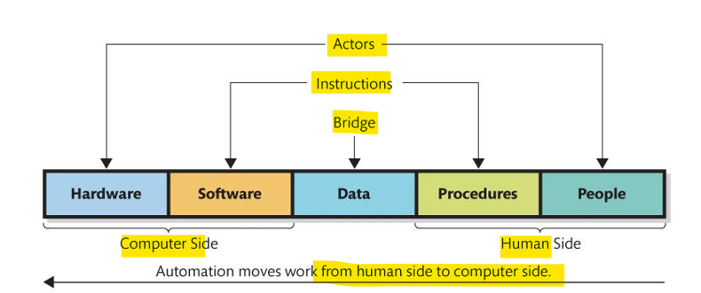
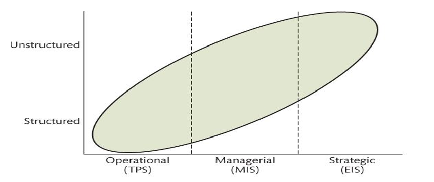

# Mis - Wk02

[Back](../../mis.md)

- [Mis - Wk02](#mis---wk02)
  - [Business Processes and Decision Making](#business-processes-and-decision-making)
    - [What Is a Business Process](#what-is-a-business-process)
    - [Components of a Business Process](#components-of-a-business-process)
      - [Activities](#activities)
      - [Resources](#resources)
      - [Facilities](#facilities)
      - [Information](#information)
      - [Role of Information in Business Processes](#role-of-information-in-business-processes)
    - [Business Process Management (BPM)](#business-process-management-bpm)
    - [Information Systems Support Business Processes](#information-systems-support-business-processes)
    - [Automation of Process Activity](#automation-of-process-activity)
    - [Support Counter Sales](#support-counter-sales)
    - [Support Payment](#support-payment)
    - [Support Decision Making](#support-decision-making)
  - [Decisions](#decisions)
  - [Types](#types)
    - [Decision process](#decision-process)
      - [Intelligence Gathering](#intelligence-gathering)
      - [Alternatives Formulation](#alternatives-formulation)
      - [Choice](#choice)
      - [Implementation](#implementation)
      - [Review](#review)
    - [Role of TSA](#role-of-tsa)

---

What is the role of information in business processes?
How do information systems support business processes?
How do information systems support decision making?
What is the role of a Technical Analyst?

## Business Processes and Decision Making

- Business processes must work together
- Each business must
  - Obtain payment
  - Cover costs
  - Make profit

---

### What Is a Business Process

- `business process / business system`

  - a series of **structured activities, tasks or steps** designed to produce a **product** or provide **service** for a particular customer or customers.

- **Inventory** management processes → **manufacturing** processes → **sales** processes → **customer support** processes.

- `Inventry Managemnet`:

  - a business process, with the goal of ensuring **enough inventory** to **fulfill customer requests**, but not to much so that goods could **spoil**
  - It helps to **balances** demands of customers with inventory purchased.

- how to know how much to purchase?
  - They **gets information** through Inventory management system.
  - **Database** collects information (quantity ordered, quantity on hand)
  - When stock gets low, inventory management system **alerts** manager to re-order (“reorder point”)
  - Purchase **Order** is created and sent to supplier
  - **Supplier** receives and ships

---

### Components of a Business Process

- A business process consists of:
  - Activities
  - Resources
  - Facilities
  - Information

---

#### Activities

- **Activities** can be manual, automated, or combination which helps to **transform** resources and information of **one type** into resources and information of **another type**
- Example:
  - Payment (activity) transforms quantity received (information) and shipping invoice (information) into supplier payment (resource)

---

#### Resources

- Any factor that's **necessary to accomplish a goal** or carry out an **activity**

- Can be external to organization
- Examples:
  - Cash
  - Workers
  - Customers
  - Suppliers
  - Capital

---

#### Facilities

- **Structures** used within the business process
- Resources can be **stored** within facilities
- Examples:
  - Factories
  - Equipment
  - Inventories
  - Databases

---

#### Information

- Activities **use information to determine** how to **transform** the inputs received into the outputs produced
- Information created in processes is a key focus on this book.
- Business **processes** **create** information
- `Business Process Modeling Notation` is a **standard** used to **document** a business process.

- `Information`

  - Knowledge derived from data
  - Data presented in a meaningful context

- **Processed data**

  - Data which is processed through summing, ordering, averaging, grouping, comparing, or other similar operations (that is, we do something to data to produce information)

- Characteristics of Good Information
  - **Accurate**
    - Based on **correct** and **complete** data, processed correctly
  - **Timely**
    - Produced **in time** for intended use
  - **Relevant**
    - To the **context**
    - To the **subject**
- Sufficient to **meet the purpose**
  - Sufficient for purpose for which generated
  - Do not need additional, extraneous information
- Worth Its **Cost**
  - Relationship between cost and value
  - Information systems cost money to develop, maintain, and use
  - Must be worth the cost

---

#### Role of Information in Business Processes

- Business process helps moving actual **goods** and providing **services** to real people.
  - Data and information are **always created**
- Business processes **generate** information.
  - Brings together important items of data in a context
- Information is very important and useful to **manage** business processes.

---

### Business Process Management (BPM)

- `Business Process Management (BPM)`
  - A field of management that **promotes** the development of **effective and efficient processes** through continuous improvement and innovation
- Methods of BPM
  - **Total Quality Management (TQM)**
  - **Six Sigma**
  - **Lean Production**
- Information about the process helps to better manage the process itself

### Information Systems Support Business Processes

- Business **Activitiies**:
  - Several activities may use one **system**
  - Activity may have **own** system
  - Activity may use **several** systems
  - **Several** activities may use **one** system
  - Analysts and designers determine relationship of activities to information systems
  - Relationship determined during systems analysis

---

### Automation of Process Activity

- Automation of processes
  - **Transfer** work done by people to computers
  - People will **follow** procedures
  - Computers has software **instructions** to follow
- **Moving work from human side to computer side**

- Characteristics of the Five Components

---

### Support Counter Sales

- Fully automated
  - Cashiers do not require extensive training
  - Cashiers are trained only in how to use cash register
  - Cashiers do not work directly with programs on computer
- Computer in cash register communicates with computer that hosts Inventory Database
- Programs record sales and makes changes

---

### Support Payment

- Most of the support **payment functionalities** in business models are **manual**
  - examples are Payment receives,Quantity Received and Shipping Invoice, Supplier Payment.
- Also Accounts related **software implementations** are **expensive** so:
  - Accounts Payable Clerk reads documents and issues payment or investigates discrepancies
  - Payment system Implementation is complicated and expensive.
    - Programming expensive
    - Probably not effective because it has multiuple approval steps.

---

### Support Decision Making

- Data are an important part of any information system
- Data can be **transformed** into information
- **Information** is an important starting point for **decision making** in many organizations
- IS support decision making **by providing the information** for many decisions
- Decision making in organization is varied and complex

---

## Decisions

## Types

- Vary by Level
- Decisions occur at three levels in organizations
  - `Operational decisions`
    - concern **day-to-day activities**
    - Supported by **transaction processing systems (TPS)**
  - `Managerial decisions`
    - concern the **allocation and utilization of resources**
    - Supported by **management information systems (MIS)**
  - `Strategic decisions`
    - concern broader-scope, organizational issues

---

- Vary by Structure

- `structured decision` has an **understood and accepted method** for making the decision
- `unstructured decision` does **not** have an **agreed-on** decision-making **method**
- Note: **terms** structured and unstructured refer to the **decision process/method**, not to the underlying subject/problem
  - Example of Structured - weather forecasting
  - Example of Unstructured – weather itself

---

### Decision process

- Decisions at **operational level** usually **structured**
- Decisions at **strategic** level usually **unstructured**
- Typical steps in decision making **process**:
  - **Intelligence** gathering
  - Formulation of **alternatives**
  - **Choice**
  - **Implementation**
  - Review
- Each decision making step needs a **different** type of IS

---

#### Intelligence Gathering

- Decision makers will define the rules:

  - Determine what are the decision **criteria**?
  - Obtain only **relevant data**

- Examples of possible **information systems** that uses Inteligence gethering:
  - Communications **applications** (email, presentations)
  - Query and **reporting** systems
  - **Data analysis** applications

---

#### Alternatives Formulation

- Decision makers lay out various alternatives after reviewing the choices?
  - They can decided to start using or change with better communications applications

---

#### Choice

- Decision makers **analyze** the alternative choices and **select** one choice
- Examples of possible information systems
  - **Spreadsheets**
  - **Financial** applications
  - Other applications

---

#### Implementation

- Decision makers **implement** the decision
- Examples of possible information systems
  - **Communications** applications

---

#### Review

- Organization **reviews the results** of the decision
- May lead to another decision and another **iteration** through the decision process
- Examples of possible information systems
  - Communications applications
  - Query and reporting systems
  - Spreadsheets and other analysis

---

### Role of TSA

- Most important component of IS - people
  - Must be able to use information system
  - Quality of your thinking for the improvements
