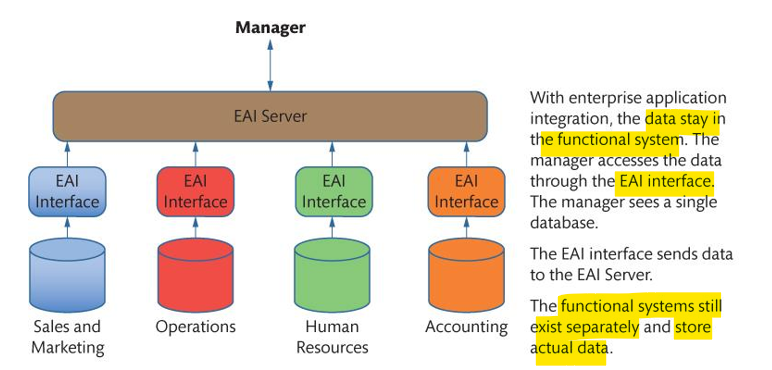
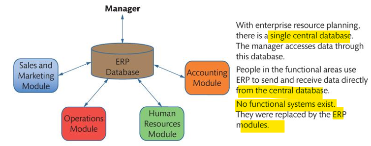

# Mis - Wk04

[Back](../../mis.md)

- [Mis - Wk04](#mis---wk04)
  - [Organizations and Information Systems (ERP, CRM, SCM)](#organizations-and-information-systems-erp-crm-scm)
    - [Fundamental Ways For Achieving Competitive Advantage](#fundamental-ways-for-achieving-competitive-advantage)
    - [Business Functions and Functional Systems](#business-functions-and-functional-systems)
    - [Typical Functional Systems](#typical-functional-systems)
    - [Using Technology to Improve Business Processes](#using-technology-to-improve-business-processes)
    - [Integrating Functional Systems: EAI and ERP](#integrating-functional-systems-eai-and-erp)
    - [Challenges of Implementing Business Process Changes](#challenges-of-implementing-business-process-changes)
    - [Industry Standard Processes](#industry-standard-processes)
  - [ERP Systems](#erp-systems)
  - [CRM Systems](#crm-systems)
  - [SCM Systems and SRM systems](#scm-systems-and-srm-systems)
    - [Benefits on Supply Chain Performance](#benefits-on-supply-chain-performance)

---

What are the fundamental ways of achieving competitive advantage?
What are business functions and functional systems?
How can business processes be improved?
What are the challenges of implementing business process changes?
What is the importance of industry standard processes?
What are ERP systems?
What are CRM systems?
What are SCM systems?

## Organizations and Information Systems (ERP, CRM, SCM)

### Fundamental Ways For Achieving Competitive Advantage

- There are two basic ways to develop competitive advantage through systems:
  - Changing the **product**:
    - By introducing **new products or services** or **enhancing current** products or services
  - Business **processes**:
    - Organizations use technology to help lock in customers, reduce costs, and create entry barriers for competitors in the market

---

### Business Functions and Functional Systems

- Porter’s value chain model
- Two types of activities:
  - Primary: **main core parts** of the goods/services
  - Support: **secondary** or ancillary to the main goods or services produced
- Classification determined by the organization and what it produces

---

- Primary activities
  - Relate directly to organization’s **customers and products**
    - Marketing and sales
    - Inbound logistics
    - Operations and manufacturing
    - Outbound logistics
    - Service and support

---

- Support activities
  - Human resource
  - Accounting and infrastructure
  - Procurement
  - Technology activities

---

- `business functions`

  - Primary and support activities in organizations

- `Functional Systems`

  - It facilitate the work of a single department or business function.
  - Examples:
    - Accounting systems,
    - HR Systems,
    - Sales systems(When they are integrated it will become ERP)

- `Separate Functional Systems`
  - When **separate functional system** are implemented, data will also be **in different data bases** and to generate a report or filter the data, manager will **make separate query** on all system and then manually integrate the data.
- `Cross-Functional Systems`
  - **Cross-departmental systems** operate **across** departmental **boundaries**, designed to **reduce isolation** systems caused by functional systems
  - Transition from functional systems to centralized-functional systems is difficult
  - **Integrated** processing **needs** many departments to **coordinate activities**

---

### Typical Functional Systems

- Marketing and Sales
  - Product management,
  - Sales forecasting,
  - Customer management
- Operations
  - Order management,
  - Inventory management,
  - Customer service
- Manufacturing
  - Inventory,
  - Planning,
  - Scheduling,
  - Manufacturing operations
- Human resources
  - Payroll and compensation
  - Recruiting
  - Assessment
  - Development and training
  - Human resources planning

---

### Using Technology to Improve Business Processes

- Using IT to improve business process **requires understanding** of where **improvements** are possible
- Business process design (redesign) idea
  - Organizations should **not simply automate or improve existing** functional systems
  - “Paving the cowpath” – the **process of making efficient what already exists** – it makes things easier but does not change how they are done
- Establish more efficient business processes that **integrate** the activities of all departments involved **in a value chain**

---

### Integrating Functional Systems: EAI and ERP

- `Enterprise Application Integration (EAI)`

  - An approach to **combine different app**s which will work together using a special layer called **middleware**, this layer will work as a **bridge to connect different functional systems together**

- `Enterprise Resource Planning (ERP)`
  - A second approach to combining functional systems, **one central database** is combined with a set of **standard processes** built on top of the database to ensure integration between functional system.

---

### Challenges of Implementing Business Process Changes

- Process design projects are expensive and difficult; three reasons for this are:
  - There is a lot of **detailed work** to be done
  - Hard to **estimate**.
  - Many people like change but do **not want to change**
  - May take a long time

---

### Industry Standard Processes

- Many early business process design projects **failed** because they were **tailor-made**
- Software vendors designed integrated applications, with **built-in industry standard processes**
  - Integrate **activities across departments**
  - **Save costs** of new process design
    - Examples: Oracle, Salesforce.com, Microsoft, or SAP

---

## ERP Systems

- `Enterprise Resource Planning (ERP)`

  - **Support primary business processes** and human resource, accounting support processes
  - integrate sales, order, inventory, manufacturing, and customer service activities
  - provide software, **pre-designed databases**, procedures, and job descriptions for organization-wide process integration

- Benefits
  - Efficient business **processes**
  - **Inventory** reduction
  - **Lead-time** reduction
  - Improved **customer service**
  - Greater, real-time **insight** into organization
  - Higher profitability

---

## CRM Systems

- `Customer Relationship Management (CRM)`

  - Provides single repository for **data about customer interactions**
  - Supports all direct value chain activities involving customers
    - Attracting, selling, managing, delivering, and supporting customers
  - Type of cross-functional system
    - Developed to **overcome problems in functional silos**

- Purpose
  - maximize the value of the existing customer
- Two types of applications for RM applications
  - **Sales Management applications**
    - support **sales** to existing customers
    - Ensures sales management has sufficient information to prioritize and allocate sales time, efforts
  - Integrated **CRM applications**
    - store data in a **single database**
    - CRM processes can be linked to one another

---

## SCM Systems and SRM systems

- `Supply Chain Management (SCM) systems`

  - **interorganizational** systems, enable **flow of goods** from suppliers to customers

- `Supply chain`
  - network of organizations, facilities
  - transforms **raw** materials into **products** delivered to **customers**
  - Involves customers, retailers, distributors, manufacturers, suppliers, transportation companies, warehouses, inventories, and some means for transmitting messages and information among the organizations involved

---

- **Supplier** is any organization that **sells** something to the organization that has the SRM application
- `Supplier Relationship Management (SRM)`
  - Business process for **managing all contacts** between an organization and its **suppliers**
  - Supports both the **inbound logistics**(primary activity) and the **procurement**(support activity)
- Support basic business processes
  - source, purchase, and settle

---

### Benefits on Supply Chain Performance

- Reduce **costs** of buying and selling
- Increase supply chain **speed**
- Reduce size and cost of **inventories**
- Improve **delivery scheduling**
  - enable just-in-time inventory
