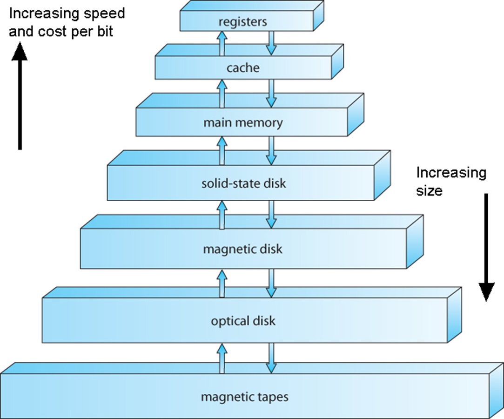

# OS2 - wk02

[Back](../os2.md)

- [OS2 - wk02](#os2---wk02)
  - [File Manager](#file-manager)
    - [Responsibilities of the File Manager](#responsibilities-of-the-file-manager)
    - [Definitions](#definitions)
    - [Device-independent](#device-independent)
    - [Typical Volume Configuration](#typical-volume-configuration)
    - [Subdirectory](#subdirectory)
    - [File-Naming Conventions](#file-naming-conventions)
  - [UNIX File Management](#unix-file-management)
    - [Directories In Unix](#directories-in-unix)
    - [File Naming Conventions](#file-naming-conventions-1)
      - [Address from the Root](#address-from-the-root)
      - [Relative Path](#relative-path)

---

## File Manager

- File Manager’s efficiency directly affected by:

  - How the system’s files are **organized**
  - How files are **stored**
  - How each file’s **records** are structured
  - How user **access** to all files is protected

- File management system
  - **Software**
- File access responsibilities
  - Creating, deleting, modifying, controlling

---

### Responsibilities of the File Manager

- Four tasks
  - File **storage tracking**
  - **Policy** implementation
    - **Determine where** and how files are stored
    - Efficiently use **available** storage **space**
    - Provide efficient file **access**
  - File **allocation** if user access cleared
    - **Record** file use
  - File **deallocation**
    - Return file to **storage**
    - **Communicate** file availability

---

- Policy determines:
  - File storage **location**
  - System and user **access**
    - Uses device-independent commands
  - Access to material
    - Two factors
      - **Factor 1**:
        - flexibility of access to information
        - Share files
        - Provide distributed access
        - Allow users to browse public directories
      - **Factor 2**:
        - subsequent protection
        - Prevent system malfunctions
        - Security checks
          - Account numbers and passwords
  - **File allocation**
    - Activate **secondary storage device**, load file into memory, and update records
  - **File deallocation**
    - Update **file tables**, rewrite file (if revised), and notify waiting processes of file availability
  - File management in the cloud
    - Same concepts

---

### Definitions

- `Field`
  - Group of related **bytes**
  - **Identified** by user (name, type, size)
- `Record`
  - Group of related `fields`
- `File`

  - Group of related `records`
  - Information used by specific application **programs**
    - Report generation

- `Flat file`

  - No **connections** to other files; no **dimensionality**

- `Database`
  - Group of related `files`
  - **Interconnected** at various levels
    - Give users flexibility of access to stored data
- `Program files`
  - Contain instructions
- `Data files`
  - Contain data
- `Directories (folders)`
  - Listings of filenames and their attributes

---

- Most common user commands
  - `OPEN`, `DELETE`, `RENAME`, `COPY`

---

### Device-independent

- Physical location:
  - knowledge not needed
  - Cylinder, surface, sector
- Device medium:
  - knowledge not needed
  - Tape, magnetic disk, optical disc, flash storage
- Network knowledge: not needed

---

- Logical commands
  - Broken into **lower-level signals**
  - Example: `READ`
    - Move **read/write heads** to record cylinder
    - Wait for rotational **delay** (sector containing record passes under read/write head)
    - Activate appropriate read/write **head** and read record
    - Transfer record to **main memory**
    - Send flag indicating **free** device for another request
- System monitors for error conditions

---

### Typical Volume Configuration

- Volume
  - Secondary storage unit (**removable**, **nonremovable**)
  - **Multi-file volume**
    - Contains many files
  - **Multi-volume files**
    - Extremely large files spread across several volumes
- Volume name
  - `File manager` **manages**
  - Easily accessible
    - Innermost part of CD, beginning of tape, first sector of outermost track

---

- `Master file directory (MFD)`
  - Stored immediately after `volume descriptor`
- Lists
  - **Names** and **characteristics** of every file in volume
    - File names (program files, data files, system files)
  - **Subdirectories**
    - If supported by file manager
  - Remainder of **volume**
    - Used for file **storage**

---

- **Single directory per volume**
  - Supported by early operating systems
- Disadvantages
  - Long search **time** for individual file
  - Directory space filled before disk storage space filled
  - Users **cannot** create **subdirectories**
  - Users **cannot safeguard** their files
  - Each program needs **unique** name
    - Even those serving many users

---

### Subdirectory

- `File managers`
  - Create `MFD` for each volume
    - Contains file and subdirectory entries
- `Subdirectory`
  - Created upon account opening
  - **Treated as file**
    - Flagged in `MFD` as subdirectory
    - **Unique properties**
- Improvement over `single directory scheme`
  - Problems remain: unable to logically group files

---

- File managers today
  - **Users** create own subdirectories (folders)
    - Related files grouped together
- Implemented as **upside-down tree**
  - Efficient system searching of individual directories
  - May require several directories to reach file

---

- A typical file directory tree structure.
  - The **“root”** is the `MFD` shown at the **top**,
  - each `node` is a `directory` file,
  - each **branch** is a `directory entry` pointing to either another `directory` or to a real `file`.
  - All program and data files subsequently added to the tree are the leaves, represented by circles.

---

- `File descriptor`

  - an **integer number** assigned by the operating system to **identify an open file** (or input/output resource).
  - It acts like a "**handle**" or "**ticket**" the OS gives your program **when it opens a file**.
  - Your program then **uses that handle (FD)** to read/write/close the file.

- **Filename**: each must be unique
- **File type**: organization and usage
  - System dependent
- File size: for convenience
- File location
  - Identifies **first physical block** (or all blocks)
- Date and time of creation
- Owner
- Protection information: access restrictions
- Record size: fixed size, maximum size

---

### File-Naming Conventions

- Filename components
  - Relative **filename** and **extension**
- `Complete filename` (**absolute** filename)
  - Includes **all path information**
  - `/file`, `~/file`
- `Relative filename`
  - Name **without path information**
  - Appears in directory listings, folders
  - Provides filename differentiation within directory
  - Varies in length
  - **One to many characters**
  - Operating system specific

---

- `Extensions`
  - Appended to **relative filename**
  - Two to **four** characters
  - Separated from relative filename by **period**
  - Identifies file **type** or **contents**
- Example
  - `BASIA_TUNE.MPG`
- Unknown extension

  - Requires user intervention

- Operating system specifics
  - Windows
    - **Drive** label and **directory** name, **relative** name, and **extension**
  - UNIX/Linux
    - Forward slash (**root**), first **subdirectory**, sub-**subdirectory**, file’s **relative** name

---

- Linux (Ubuntu):
  - Case Sensitive
  - Not Allowed
    - `* ? $ & [ ] / \`
    - No extension
    - length: 256
- Windows:
  - Case inSensitive
  - Most special characters are not allowed
  - requires extension
  - length: 255/256

---

## UNIX File Management

- Three file types

  - `Directories`
  - `Ordinary files`
  - `Special files`

- Each enjoys certain **privileges**
- Directories
  - Maintain **hierarchical structure** of file system
  - Users allowed to **read information in directory files**
  - Only system allowed directory file modification

---

- `Ordinary files`

  - Users’ stored information
  - Protection based on user requests
  - Related to **read**, **write**, **execute**, **delete** functions performed on file

- `Special files`

  - Device drivers providing I/O hardware interface
  - **Appear** as entries in **directories**
  - Part of file system (most in `/dev` directory)
  - Special filename indicates **type of device association**

---

- Files stored as **sequences of bytes**
  - No structure imposed
- Structure of files
  - Controlled **by programs** using them: not by system
- `Text files`
  - Character strings
    - Lines **delimited by line feed** or new **line character**
- `Binary files`
  - Sequences of **binary digits**
  - Grouped into words as they appear in **memory** during program execution

---

- Organizes disk into **blocks**
- Divides disk into **four basic regions**
  - `First region (address 0)`: reserved for **booting**
  - `Second region (superblock)`: contains **disk size** and other regions’ **boundaries**
  - `Third region`: includes **file definitions** called i-list
  - `Remaining region`: holds free blocks **available for file storage**
- Files stored in contiguous empty blocks
  - Simple allocation and no need to compact

---

- Each entry in `i-list` called an `i-node` (or `inode`)
  - Contains 13 disk addresses
  - Contains specific file information
    - **Owner’s** identification
    - Protection **bits**, physical address, and file size
    - **Time** of creation, last use, and last update
    - **Number** of links
    - **File** type
      - Directory, ordinary file, or special file

---

### Directories In Unix

`/bin`: contains files **essential for operation of system**.core command binaries
`/home`: where **user home directories** are stored
`/var`: used to store **files** which **change frequently**
`/etc`: various **system config files**
`/dev`: **device** files (e.g. hard disk, CD-ROM etc.)
`/sbin`: **binaires** only expected to be used by **super user**
`/tmp`: **temporary** files

---

### File Naming Conventions

- Case-**sensitive** filenames
- 255 character length
- Special characters **allowed**, except colon (`:`)
  - `touch fd:fdf`
- No file naming conventions
- Some compilers expect specific **suffixes**
- Supports hierarchical tree directory structure
- Root directory identified by slash (`/`)

---

- `Absolute path name`: starts at the root directory
- `Relative path name`: does not start at the root directory
- Path name rules
  - Path name beginning with a **slash** starts at the **root** directory
  - Path name
    - One name or list of names: **separated by slashes**
    - Last name on list: **filename** requested
  - Two periods (..) in path name
    - Moves **upward** in hierarchy (closer to root)

---

#### Address from the Root

- `/home/unix`
- `~/unix`

---

#### Relative Path

- Relative to your current location

- `.` : your current location
- `..` : one directory above your current location
- `Pwd` : gives your current location

`ls ./unix` Lists the contents of the dir unix
`ls ../../` List everything 2 dir higher
