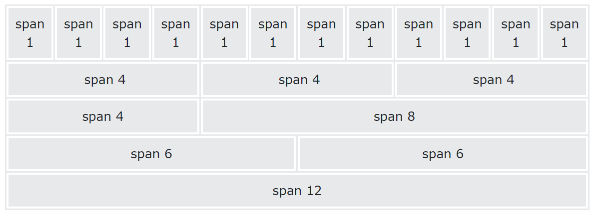

# Bootstrap - Grid

[back](./index.md)

- [Bootstrap - Grid](#bootstrap---grid)
  - [Containers](#containers)
  - [Grid system](#grid-system)
    - [Grid Classes](#grid-classes)
    - [Gutter](#gutter)

---

## Containers

- `Container`:
  - Containers are the most **basic layout element** in Bootstrap and **are required when using our default grid system**. 
  - used to pad the content inside of them

| Class             | Description                                                           |
| ----------------- | --------------------------------------------------------------------- |
| `container`       | a responsive **fixed width** container                                |
| `container-fluid` | a full width container, **spanning the entire width** of the viewport |

- By default, containers have left and right padding, with **no top or bottom padding**.

---

## Grid system

- Bootstrap's grid system is built with flexbox and allows up to **12 columns** across the page.



---

### Grid Classes

- The Bootstrap 5 grid system has six classes:

  - `col-`: extra small devices(less than 576px)
  - `col-sm-`: small devices(equal to or greater than 576px)
  - `col-md-`: medium devices(equal to or greater than 768px)
  - `col-lg-`: large devices(equal to or greater than 992px)
  - `col-xl-`: xlarge devices(equal to or greater than 1200px)
  - `col-xxl-`: xxlarge devices(equal to or greater than )1400px

- Template

```html
<div class="container text-center">
  <div class="row">
    <div class="col">Column</div>
    <div class="col">Column</div>
    <div class="col">Column</div>
  </div>
</div>

<!-- control how many columns that should appear next to each other -->
<div class="row row-cols-1">
  <div class="col">1 of 2</div>
  <div class="col">2 of 2</div>
</div>

<div class="row row-cols-2">
  <div class="col">1 of 4</div>
  <div class="col">2 of 4</div>
  <div class="col">3 of 4</div>
  <div class="col">4 of 4</div>
</div>
```

---

### Gutter

- Gutters are the padding between columns, used to responsively space and align content in the Bootstrap grid system.

| Class        | Description                             |
| ------------ | --------------------------------------- |
| `g-0`        | No gutters                              |
| `g-num`      | Horizontal & vertical gutters           |
| `g-size-num` | Horizontal & vertical gutters with size |
| `gx-num`     | horizontal gutter                       |
| `gy-num`     | vertical gutter                         |

- num: 0-5
- size: sm, lg

---

[TOP](#bootstrap---grid)
