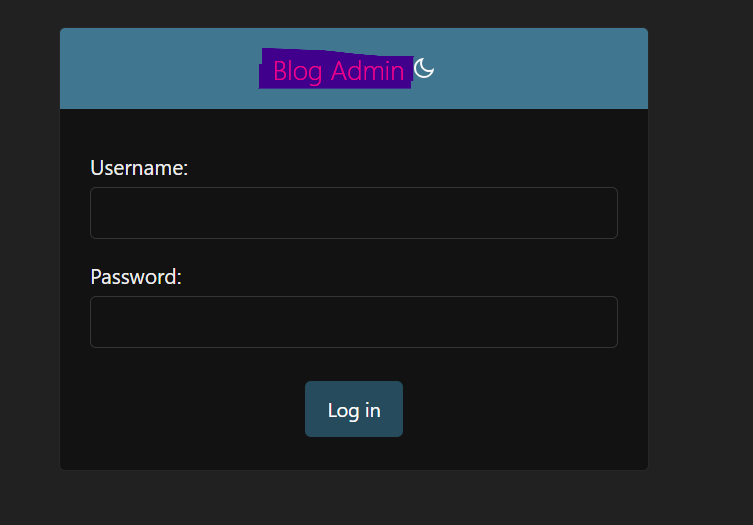
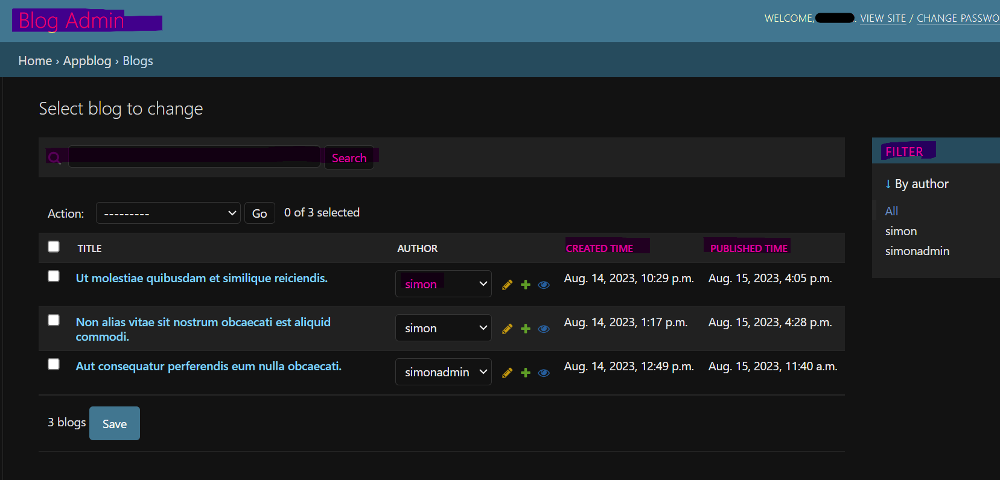

# Django - Admin

[Back](../index.md)

- [Django - Admin](#django---admin)
  - [`AdminSite`](#adminsite)
  - [`ModelAdmin`](#modeladmin)
  - [Example](#example)

---

## `AdminSite`

- `AdminSite`
  - representes a Django administrative site

- Attribute

| Method        | Description                                   |
| ------------- | --------------------------------------------- |
| `site_header` | The text to put at the top of each admin page |
| `site_title`  | admin page’s `<title>`                        |


- Method

| Method       | Description                                                   |
| ------------ | ------------------------------------------------------------- |
| `register()` | Registers the given model class with the given `admin_class`. |

---

## `ModelAdmin`

- `ModelAdmin`
  - the representation of a model in the admin interface.

- Attribute

| Attribute       | Description                                                                          |
| --------------- | ------------------------------------------------------------------------------------ |
| `fields`        | layout the field in the forms on the “add” and “change” pages                        |
| `list_display`  | fields are displayed on the change list page of the admin.                           |
| `list_editable` | a list of field names on the model which will allow editing on the change list page. |
| `list_filter`   | activate filters in the right sidebar of the change list page of the admin.          |
| `search_fields` | enable a search box on the admin change list page.                                   |

---

## Example

```py
from django.contrib import admin
from .models import Blog, Hashtag
# Register your models here.


class BlogAdmin(admin.ModelAdmin):
    fields = ("title", "author", "content",)
    list_display = ("title", "author", "created_time", "published_time")
    list_editable = ("author",)
    list_filter = ("author",)
    search_fields = ("title", "content",)


admin.site.site_title = "Blog Admin"
admin.site.site_header = "Blog Admin"
admin.site.register(Blog, BlogAdmin)
admin.site.register(Hashtag)
```





---

[Top](#django---admin)
