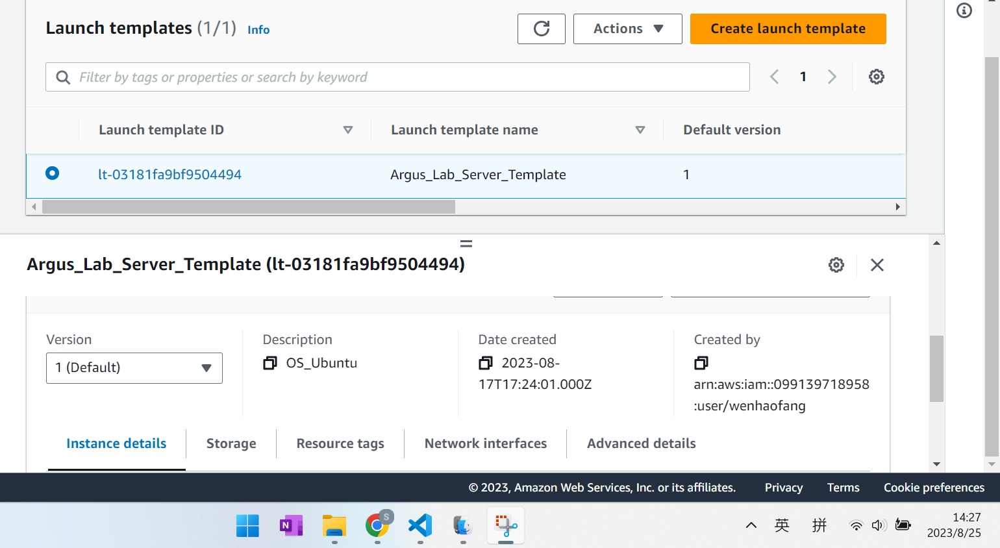
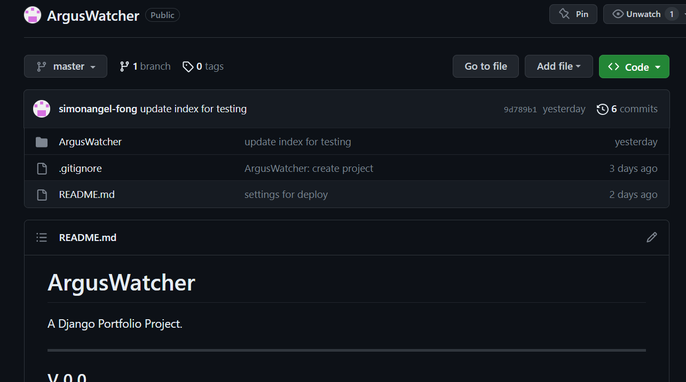
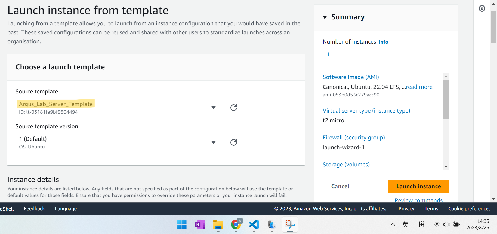
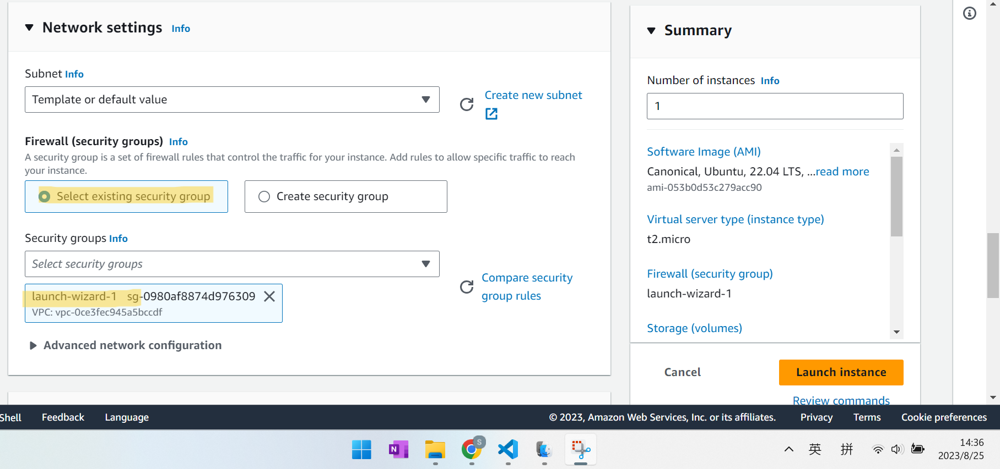
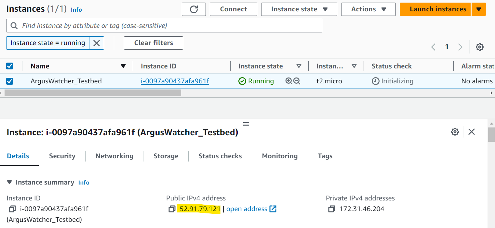

# Django - Deploy Example(EC2 + Ubuntu + Bash + Gighub + Django)

[Back](../index.md)

- [Django - Deploy Example(EC2 + Ubuntu + Bash + Gighub + Django)](#django---deploy-exampleec2--ubuntu--bash--gighub--django)
  - [Prerequisite](#prerequisite)
    - [Create EC2 with template](#create-ec2-with-template)
    - [Django project on Github](#django-project-on-github)
  - [Initiate EC2 Instance from template](#initiate-ec2-instance-from-template)
  - [Deploy using Bash script](#deploy-using-bash-script)

---

## Prerequisite

### Create EC2 with template

- EC2 Template:
  - OS: Ubuntu
  - Security Group

---

### Django project on Github

---

## Initiate EC2 Instance from template

---

## Deploy using Bash script

---

[TOP](#django---deploy-exampleec2--ubuntu--bash--gighub--django)