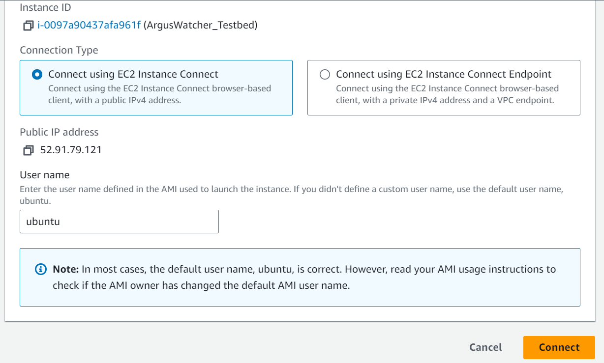
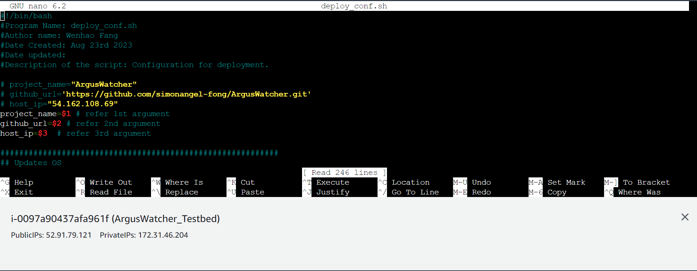
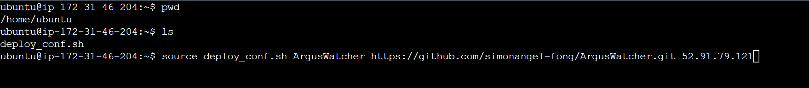
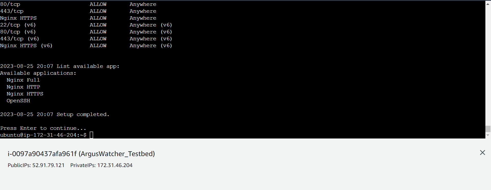
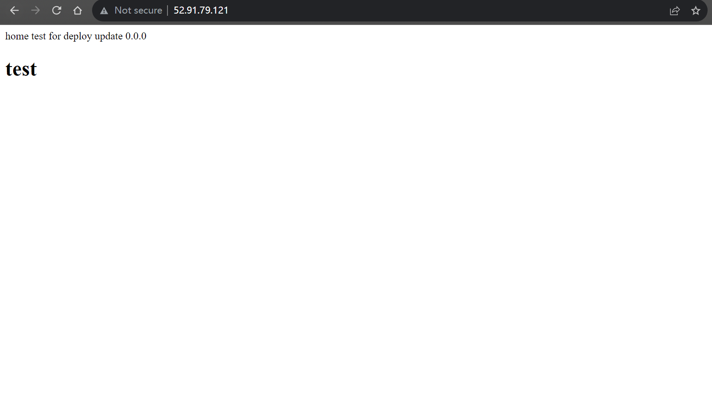

# Django - Deploy Example(EC2 + Ubuntu + Bash + Gighub + Django)

[Back](../index.md)

- [Django - Deploy Example(EC2 + Ubuntu + Bash + Gighub + Django)](#django---deploy-exampleec2--ubuntu--bash--gighub--django)
  - [Prerequisite](#prerequisite)
    - [Create EC2 with template](#create-ec2-with-template)
    - [Django project on Github](#django-project-on-github)
  - [Initiate EC2 Instance from template](#initiate-ec2-instance-from-template)
  - [Deploy using Bash script](#deploy-using-bash-script)
    - [`deploy_conf.sh`: script for deployment](#deploy_confsh-script-for-deployment)
    - [`test_code.sh`: script to run app on port 8000 for testing](#test_codesh-script-to-run-app-on-port-8000-for-testing)
    - [`update_code.sh`: script to update codes from github](#update_codesh-script-to-update-codes-from-github)

---

## Prerequisite

### Create EC2 with template

- EC2 Template:
  - OS: Ubuntu
  - Security Group


---

### Django project on Github


---

## Initiate EC2 Instance from template


---

## Deploy using Bash script

- Connect to EC2 instance with SSH
  - Connect >> EC2 Instance Connect >> Connect



---

- Create `deploy_conf.sh` and copy bash codes

```sh
sudo nano deploy_conf.sh
```



---

- Run bash scrtipt using arguments:
  - project_name
  - github url
  - public IP

```sh
source deploy_conf.sh project_name github_url public_ip
```





---

- Result



---

### `deploy_conf.sh`: script for deployment

- Update linux package
- Install firewall
- Download codes from github
- Create virtual environment
- Configure `gunicorn`
- Configure `ngnix`
- Configure `supervisor`

```sh
#!/bin/bash
#Program Name: deploy_conf.sh
#Author name: Wenhao Fang
#Date Created: Aug 23rd 2023
#Date updated:
#Description of the script: Configuration for deployment.

# project_name="ArgusWatcher"
# github_url='https://github.com/simonangel-fong/ArgusWatcher.git'
# host_ip="54.162.108.69"
project_name=$1 # refer 1st argument
github_url=$2 # refer 2nd argument
host_ip=$3  # refer 3rd argument

###########################################################
## Updates OS
###########################################################
echo -e "\n$(date +'%Y-%m-%d %R') Updating package on Linux..."
yes | sudo apt-get update  # update the package on Linux system.
# sudo apt-get upgrade # downloads and installs the updates for each outdated package and dependency
echo $(date +'%Y-%m-%d %R') Package updated.

###########################################################
## Firewall
###########################################################
echo -e "\n$(date +'%Y-%m-%d %R') Installing Firwall..."
sudo apt-get install ufw        # install firewall
echo $(date +'%Y-%m-%d %R') Firwall installed.

echo -e "\n$(date +'%Y-%m-%d %R') Configure Firwall"
sudo ufw default allow outgoing # Allow outgoing traffic
sudo ufw default deny incoming  # Deny all incoming traffic
sudo ufw allow ssh              # Allow ssh traffic
sudo ufw allow 8000             # Allow the port 8000, the port to test django while configuring deployment
yes | sudo ufw enable           # Enables firewall

echo -e "\n$(date +'%Y-%m-%d %R') Firwall status:"
sudo ufw status # Status of firewall

###########################################################
## Download codes from github
###########################################################
cd ~
sudo rm -rf ~/${project_name}
if [ -z ${github_url} ]; then # if github url is empty
  echo -e "\n$(date +'%Y-%m-%d %R') Cannot clone code from github because github_url is not given."
else
  echo -e "\n$(date +'%Y-%m-%d %R') Downloading codes from github..."
  git clone $github_url # clone codes from github
  echo $(date +'%Y-%m-%d %R') Code downloaded.
fi

###########################################################
## Establish virtual environment
###########################################################
cd ~
echo -e "\n$(date +'%Y-%m-%d %R') Installing venv package..."
sudo apt-get install python3-venv # Install venv package
echo -e "$(date +'%Y-%m-%d %R') Venv package installed."

echo -e "\n$(date +'%Y-%m-%d %R') Creating virtual environment..."
python3 -m venv env # Creates virtual environment
echo -e "$(date +'%Y-%m-%d %R') Virtual environment Created."

echo -e "$(date +'%Y-%m-%d %R') Activate virtual environment."
source env/bin/activate # Activates venv

###########################################################
## Install packages within venv
###########################################################
echo -e "\n$(date +'%Y-%m-%d %R') Installing packages within virtual environment..."
if test -f requirements.txt; then # if requirements file exists
  pip install -r requirements.txt
else
  echo $(date +'%Y-%m-%d %R') Install django packages
  pip install django
  echo -e "\n$(date +'%Y-%m-%d %R') Install gunicorn packages"
  pip install gunicorn # install gunicorn
fi

echo $(date +'%Y-%m-%d %R') Deactivate virtual environment
deactivate
cd ~

###########################################################
## Configuration gunicorn
## Configuration gunicorn.socket
###########################################################
echo -e "\n$(date +'%Y-%m-%d %R') Create gunicorn socket conf file"
socket_conf=/etc/systemd/system/gunicorn.socket

sudo bash -c "sudo cat >$socket_conf <<SOCK
[Unit]
Description=gunicorn socket

[Socket]
ListenStream=/run/gunicorn.sock

[Install]
WantedBy=sockets.target
SOCK"

###########################################################
## Configuration gunicorn.service
###########################################################
echo -e "$(date +'%Y-%m-%d %R') Create gunicorn service conf file"
service_conf=/etc/systemd/system/gunicorn.service

sudo bash -c "sudo cat >$service_conf <<SERVICE
[Unit]
Description=gunicorn daemon
Requires=gunicorn.socket
After=network.target

[Service]
User=root
Group=www-data 
WorkingDirectory=/home/ubuntu/${project_name}/${project_name}
ExecStart=/home/ubuntu/env/bin/gunicorn \
    --access-logfile - \
    --workers 3 \
    --bind unix:/run/gunicorn.sock \
${project_name}.wsgi:application

[Install]
WantedBy=multi-user.target
SERVICE"

###########################################################
## Apply gunicorn configuration
###########################################################
echo -e "$(date +'%Y-%m-%d %R') Apply gunicorn configuration"
sudo systemctl daemon-reload          # reload daemon
sudo systemctl start gunicorn.socket  # Start gunicorn
sudo systemctl enable gunicorn.socket # enable on boots
sudo systemctl restart gunicorn       # restart gunicorn

# echo -e "$(date +'%Y-%m-%d %R') Gunicorn status: \n"
# sudo systemctl status gunicorn

###########################################################
## Configuration nginx
###########################################################
echo -e "\n$(date +'%Y-%m-%d %R') Installing nginx package..."
sudo apt-get install nginx # install nginx
echo -e "\n$(date +'%Y-%m-%d %R') Nginx package installed."

echo -e "$(date +'%Y-%m-%d %R') Configure nginx conf"
nginx_conf=/etc/nginx/nginx.conf
sudo sed -i '1cuser root;' $nginx_conf

echo -e "$(date +'%Y-%m-%d %R') Configure nginx for django project"
django_conf=/etc/nginx/sites-available/django.conf
sudo bash -c "cat >$django_conf <<DJANGO_CONF
server {
  listen 80;
  server_name ${host_ip};
  location = /favicon.ico { access_log off; log_not_found off; }
  location /static/ {
    root /home/ubuntu/${project_name}/${project_name};
  }

  location /media/ {
    root /home/ubuntu/${project_name}/${project_name};
  }

  location / {
    include proxy_params;
    proxy_pass http://unix:/run/gunicorn.sock;
  }
}
DJANGO_CONF"

sudo ln -sf /etc/nginx/sites-available/django.conf /etc/nginx/sites-enabled
echo -e "$(date +'%Y-%m-%d %R') Creat link in sites-enabled directory."

echo -e "\n$(date +'%Y-%m-%d %R') Test nignx syntax:"
sudo nginx -t

# restart nginx
echo -e "\n$(date +'%Y-%m-%d %R') Restart nignx"
sudo systemctl restart nginx

# echo -e "\n$(date +'%Y-%m-%d %R') Nignx status:"
# systemctl status nginx

###########################################################
## Configuration supervisor
###########################################################
echo -e "\n$(date +'%Y-%m-%d %R') Installing supervisor package..."
sudo apt-get install supervisor # install supervisor
echo -e "$(date +'%Y-%m-%d %R') Supervisor package installed."

echo -e "$(date +'%Y-%m-%d %R') Create directory for logging"
sudo mkdir -p /var/log/gunicorn

echo -e "$(date +'%Y-%m-%d %R') Configure supervisor for gunicorn"
supervisor_gunicorn=/etc/supervisor/conf.d/gunicorn.conf

sudo bash -c "cat >$supervisor_gunicorn <<SUP_GUN
[program:gunicorn]
    directory=/home/ubuntu/${project_name}/${project_name}
    command=/home/ubuntu/env/bin/gunicorn --workers 3 --bind unix:/run/gunicorn.sock  ${project_name}.wsgi:application
    autostart=true
    autorestart=true
    stderr_logfile=/var/log/gunicorn/gunicorn.err.log
    stdout_logfile=/var/log/gunicorn/gunicorn.out.log

[group:guni]
    programs:gunicorn
SUP_GUN"

echo -e "$(date +'%Y-%m-%d %R') Reread configuration file"
sudo supervisorctl reread # tell supervisor read configuration file

echo -e "$(date +'%Y-%m-%d %R') Update supervisor configuration"
sudo supervisorctl update # update supervisor configuration

echo -e "$(date +'%Y-%m-%d %R') Configuration status:\n"
sudo supervisorctl status # verify configuration status

###########################################################
## Firewall configuration for production
###########################################################
echo -e "\n$(date +'%Y-%m-%d %R') Configure Firwall after deployment configuration"
sudo ufw delete allow 8000 # disable port 8000
sudo ufw allow http/tcp
sudo ufw allow https/tcp
sudo ufw allow "Nginx HTTPS"

echo -e "\n$(date +'%Y-%m-%d %R') Firwall status:"
sudo ufw status # Status of firewall

echo -e "\n$(date +'%Y-%m-%d %R') List available app:"
sudo ufw app list

###########################################################
## Setup completed
###########################################################
echo -e "\n$(date +'%Y-%m-%d %R') Setup completed. \n"
read -p "Press Enter to continue..."

# # shortcut to update deployment script
# sudo rm -rf ArgusWatcher deploy_conf.sh # remove existing script
# sudo nano deploy_conf.sh  # create a new sh file
# source deploy_conf.sh ArgusWatcher https://github.com/simonangel-fong/ArgusWatcher.git 54.161.164.221 # run bash sccript using arguments

```

---

### `test_code.sh`: script to run app on port 8000 for testing

```sh
#!/bin/bash
#Program Name: test_code.sh
#Author name: Wenhao Fang
#Date Created: Aug 24rd 2023
#Date updated:
#Description of the script: test django at port 8000

# Test django project
python3 manage.py runserver 0.0.0.0:8000
echo $(date +'%Y-%m-%d %R') 'Test django project on port 8000'
read -p 'Press Enter to continue'

# shortcut to update script
# sudo rm -rf test_code.sh  # remove the existing script
# sudo nano test_code.sh  # create new script
# source test_code.sh # run bash script
```

---

### `update_code.sh`: script to update codes from github

- The deployed app will not updated even if the code in EC2 is updated. It needs to reload `nginx`.
- Download the latest codes from github
- Reload `nginx`

```sh
#!/bin/bash
#Program Name: update_code.sh
#Author name: Wenhao Fang
#Date Created: Aug 24rd 2023
#Date updated:
#Description of the script: update github codes

# project_name="ArgusWatcher"
# github_url='https://github.com/simonangel-fong/ArgusWatcher.git'
project_name
github_url

###########################################################
## Download codes from github
###########################################################
cd ~
sudo rm -r ~/${project_name}  # remove the exsting directory
if [ -z ${github_url} ]; then # if github url is empty
  echo -e "\n$(date +'%Y-%m-%d %R') Cannot clone code from github because github_url is not given."
else
  echo -e "\n$(date +'%Y-%m-%d %R') Downloading codes from github..."
  git clone $github_url # clone codes from github
  echo -e "$(date +'%Y-%m-%d %R') Code downloaded."
fi

###########################################################
## Reload supervisor and nginx
###########################################################
echo -e "\n$(date +'%Y-%m-%d %R') Reload supervisor"
sudo service supervisor reload  # reload supervisor

echo -e "$(date +'%Y-%m-%d %R') Reload nginx"
sudo service nginx reload # relaod nginx

###########################################################
## Update completed
###########################################################
echo -e "\n$(date +'%Y-%m-%d %R') Update completed. \n"
read -p "Press Enter to continue..."

# sudo rm -rf update_code.sh  # remove existing script
# sudo nano update_code.sh    # create a new sh file
# source update_code.sh       # run bash script
```

---

[TOP](#django---deploy-exampleec2--ubuntu--bash--gighub--django)