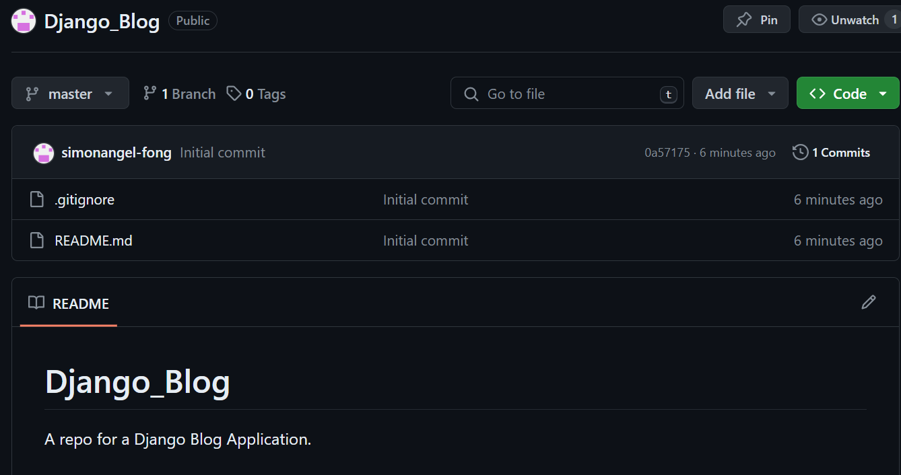

# Django Blog Project - Development Part 1: Project Creation

[Back](../../index.md)

- [Django Blog Project - Development Part 1: Project Creation](#django-blog-project---development-part-1-project-creation)
  - [Create GitHub Repo](#create-github-repo)
  - [Create Django Project](#create-django-project)
    - [Clone Repo](#clone-repo)
    - [Create Django Project](#create-django-project-1)
  - [Feature: Home Page](#feature-home-page)
    - [Static Files](#static-files)
    - [Database](#database)
    - [Test Application locally](#test-application-locally)
    - [Output installed packages](#output-installed-packages)
    - [Push Github](#push-github)

---

## Create GitHub Repo

- https://github.com/simonangel-fong/Django_Blog.git



---

## Create Django Project

### Clone Repo

```sh
git clone https://github.com/simonangel-fong/Django_Blog.git
```

---

### Create Django Project

- Create and activate virtual environment

```bash
cd Django_Blog
py -m venv env # create virtual environment
```

- Install Django

```bash
python.exe -m pip install --upgrade pip # upgrade pip
pip install django
pip list
```

- Start project: `django_blog`

```bash
django-admin startproject django_blog  # Start project
py ./django_blog/manage.py runserver 8000  # Starts a lightweight development web server locally
```

- Create VSCode `launch.json` file

- Update `.gitignore`

```conf
.vscode/
```

---

## Feature: Home Page

- Create `django_blog/views.py`

```py
from django.views.generic.base import TemplateView


# View of home page
class HomeView(TemplateView):
    template_name = "index.html"     # the template of this view

    # define the context data
    def get_context_data(self, **kwargs):
        context = super().get_context_data(**kwargs)
        # a dictionary representing the context
        context["msg"] = "hellow world"
        return context
```

---

- Update `django_blog/urls.py`

```py
from django.contrib import admin
from django.urls import path
from .views import HomeView

urlpatterns = [
    path('', HomeView.as_view(), name="home"),
    path('admin/', admin.site.urls),
]
```

---

- Create template files

  - `django_blog/templates/layout`
    - `base.html`
    - `nav.html`
    - `footer.html`
  - `django_blog/templates/`
    - `index.html`

---

### Static Files

- `Arguswatcher/static/`

  - `css/style.css`
  - `img/home.png`

---

- `Arguswatcher/Arguswatcher/settings.py`

```py
# region Static

# URL to use when referring to static files located in STATIC_ROOT.
STATIC_URL = 'static/'
# defines the additional locations the staticfiles app will traverse
STATICFILES_DIRS = [
    BASE_DIR / 'static',
]
# The absolute path to the directory where collectstatic will collect static files for deployment.
STATIC_ROOT = Path(BASE_DIR, 'collectstatic')

# endregion
```

---

- Collect static files

```bash
py ./Arguswatcher/manage.py collectstatic
```

---

### Database

- Using sqlite3
- Migrate

```bash
# creating new migrations based on the changes
py ./Arguswatcher/manage.py makemigrations  # No changes detected
# applying migrations.
py ./Arguswatcher/manage.py migrate  #  Apply all migrations: admin, auth, contenttypes, sessions
```

---

### Test Application locally

- Home


- Admin


---

### Output installed packages

```bash
pip freeze > requirements.txt
```

---

### Push Github

```bash
git add -A  # Add all file contents to the index.
git log --oneline -4   # Show commit logs
git commit -m "create django project Arguswatcher"  # Record changes to the repository
git push  # Update remote repo
```

---

---

[TOP](#django-blog-project---development-part-1-project-creation)
