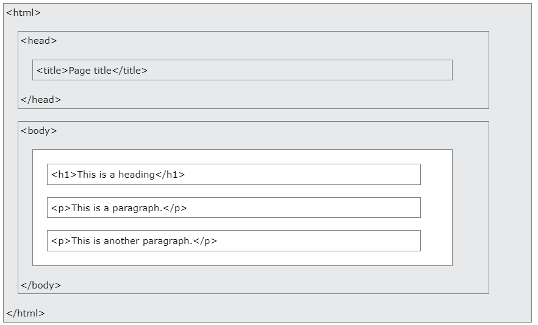

# HTML - Fundamental

[Back](./index.md)

- [HTML - Fundamental](#html---fundamental)
  - [Two types of pages](#two-types-of-pages)
  - [HTML File](#html-file)
  - [HTML Page Structure](#html-page-structure)
  - [HTML Element](#html-element)
    - [Nested HTML Elements](#nested-html-elements)
  - [Comment](#comment)
  - [Attribute](#attribute)

---

## Two types of pages

1. Static pages

   - The content in pages cant be changed;
   - Everyone see same content
     &emsp;

2. Dynamic pages
   - The content are connected to the database which return different data
     e.g.: hotel.com different people have different contents.
     php 不用学, 所以主要学 html, css, js, Jquery
     &emsp;

---

## HTML File

HTML files end with the extension of `.html`.

- HTML stands for Hyper Text Markup Language
- HTML is the standard markup language for creating Web pages
- HTML describes the structure of a Web page
- HTML consists of a series of elements
- HTML elements tell the browser how to display the content

---

## HTML Page Structure

```html
<!-- All HTML documents must start with a document type declaration that represents the document type, and helps browsers to display web pages correctly. -->
<!-- It must only appear once, at the top of the page (before any HTML tags). -->
<!-- not case sensitive -->
<!DOCTYPE html>

<!-- The HTML document itself begins with <html> and ends with </html>. It is the root element of an HTML page -->
<html>
  <!-- The element contains meta information about the HTML page -->
  <head>
    <!-- element specifies a title for the HTML page -->
    <title>Page Title</title>
  </head>
  <!-- The visible part of the HTML document is between <body> and </body>. -->
  <body>
    <!-- element defines a large heading -->
    <h1>My First Heading</h1>
    <!-- element defines a paragraph -->
    <p>My first paragraph.</p>
  </body>
</html>
```



---

## HTML Element

- An HTML element is defined by **a start tag**, some content, and **an end tag**.

- Empty elements do not have content and the end tag! <br>e.g.: `<br>`

---

### Nested HTML Elements

- HTML elements can be nested (this means that elements can contain other elements). <br>嵌套

- All HTML documents consist of nested HTML elements.

---

## Comment

HTML comments are not displayed in the browser, but they can help document your HTML source code.

```html
<!-- this is a comment line. -->
```

- Notice that there is **an exclamation point (!)** in the start tag, but not in the end tag.

- Everything between the `<!--` and the `-->` will be hidden from the display.

---

## Attribute

- HTML Attribute allow to add more information to HTML tags.

| Attribute         | Description               |
| ----------------- | ------------------------- |
| `<a href=""></a>` | URL that the link goes to |
| ``    | Source of image           |
| ``    | Alternate of image        |

---

[TOP](#html---fundamental)
