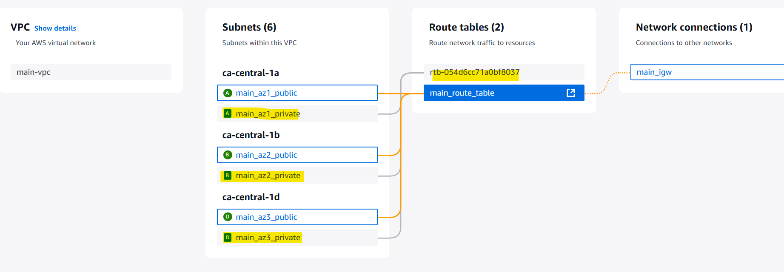

# Terraform - AWS: VPC

[Back](../../index.md)

- [Terraform - AWS: VPC](#terraform---aws-vpc)
  - [VPC](#vpc)
  - [Lab: Create VPC](#lab-create-vpc)

---

## VPC

- `VPC`

  - `virtual private network`
  - isolate instances on a network level.
  - one vpc per region for small to medium setups
  - instances in 2 VPCs cannot communicate using private IP address.
    - can be linked with peering.

- Private Subnet: default, no internet
- Publie Subnet: Private Subnet + IGW + routetable

---

## Lab: Create VPC



```terraform
terraform {
  required_providers {
    aws = {
      source  = "hashicorp/aws"
      version = "~> 6.0"
    }
  }
}

# Configure the AWS Provider
provider "aws" {
  region = "ca-central-1"
}

# define a VPC
resource "aws_vpc" "main" {
  cidr_block           = "10.0.0.0/16"
  enable_dns_hostnames = true # enable DNS hostnames in the VPC

  tags = {
    Name = "main-vpc"
  }
}

# define subnets
# AZ1
resource "aws_subnet" "main_az1_public" {
  vpc_id                  = aws_vpc.main.id
  cidr_block              = "10.0.1.0/24"
  availability_zone_id    = "cac1-az1"
  map_public_ip_on_launch = true # enable public ip

  tags = {
    Name = "main_az1_public"
  }
}

resource "aws_subnet" "main_az1_private" {
  vpc_id               = aws_vpc.main.id
  cidr_block           = "10.0.2.0/24"
  availability_zone_id = "cac1-az1"

  tags = {
    Name = "main_az1_private"
  }
}

# AZ2
resource "aws_subnet" "main_az2_public" {
  vpc_id                  = aws_vpc.main.id
  cidr_block              = "10.0.3.0/24"
  availability_zone_id    = "cac1-az2"
  map_public_ip_on_launch = true # enable public ip

  tags = {
    Name = "main_az2_public"
  }
}

resource "aws_subnet" "main_az2_private" {
  vpc_id               = aws_vpc.main.id
  cidr_block           = "10.0.4.0/24"
  availability_zone_id = "cac1-az2"

  tags = {
    Name = "main_az2_private"
  }
}

# AZ3
resource "aws_subnet" "main_az3_public" {
  vpc_id                  = aws_vpc.main.id
  cidr_block              = "10.0.5.0/24"
  availability_zone_id    = "cac1-az4"
  map_public_ip_on_launch = true # enable public ip

  tags = {
    Name = "main_az3_public"
  }
}

resource "aws_subnet" "main_az3_private" {
  vpc_id               = aws_vpc.main.id
  cidr_block           = "10.0.6.0/24"
  availability_zone_id = "cac1-az4"

  tags = {
    Name = "main_az3_private"
  }
}

# Define IGW
resource "aws_internet_gateway" "main_igw" {
  vpc_id = aws_vpc.main.id

  tags = {
    Name = "main_igw"
  }
}

# Define Route table
resource "aws_route_table" "main_route_table" {
  vpc_id = aws_vpc.main.id

  route {
    cidr_block = "0.0.0.0/0"
    gateway_id = aws_internet_gateway.main_igw.id
  }

  tags = {
    Name = "main_route_table"
  }
}

# rt assiciate with public subnet
resource "aws_route_table_association" "main_rt_az_1" {
  route_table_id = aws_route_table.main_route_table.id
  subnet_id      = aws_subnet.main_az1_public.id
}

resource "aws_route_table_association" "main_rt_az_2" {
  route_table_id = aws_route_table.main_route_table.id
  subnet_id      = aws_subnet.main_az2_public.id
}

resource "aws_route_table_association" "main_rt_az_3" {
  route_table_id = aws_route_table.main_route_table.id
  subnet_id      = aws_subnet.main_az3_public.id
}
```
