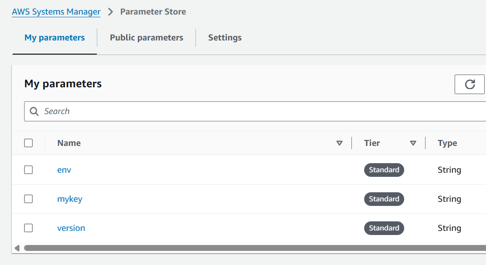

# Terraform - Module

[Back](../index.md)

- [Terraform - Module](#terraform---module)
  - [Module](#module)
    - [Module Provider](#module-provider)
    - [Passing input](#passing-input)
    - [Getting output](#getting-output)
    - [Module Registry](#module-registry)
    - [Common Modules](#common-modules)
    - [Root Module](#root-module)
    - [Published Modules](#published-modules)
    - [Using Modules](#using-modules)
  - [Child Modules](#child-modules)
    - [Calling a Child Module](#calling-a-child-module)
  - [Argument](#argument)
  - [Count](#count)
  - [for\_each in module](#for_each-in-module)
  - [Lab: Create SSM parameters with for\_each](#lab-create-ssm-parameters-with-for_each)
    - [Create Module](#create-module)
    - [Apply](#apply)
  - [Lab: Complex data type and flatten() function](#lab-complex-data-type-and-flatten-function)
    - [Complex Data Type + flatten()](#complex-data-type--flatten)
    - [Update module](#update-module)
  - [Refactor](#refactor)
    - [Rename a resource](#rename-a-resource)
    - [Add `count`](#add-count)
    - [Add `for_each`](#add-for_each)
    - [Rename Module](#rename-module)
    - [Add `count` with module](#add-count-with-module)
    - [Refactor from resource to module](#refactor-from-resource-to-module)

---

## Module

- `Modules`

  - containers for **multiple resources** that are **used together**.
  - consists of a **collection** of `.tf` and/or `.tf.json` files kept together **in a directory**.
  - the main way to **package and reuse** resource configurations with Terraform.

- Typical module declaration

```terraform
module "vpc" {
  source  = "terraform-aws-modules/vpc/aws"
  version = "6.0.1"
}
```

---

### Module Provider

- Terraform Registry:

  - Semantic：
    - `NAMESPACE/MODULE_NAME/PROVIDER`
    - ie: `hashicorp/consul/aws`

- Terraform private registry:

  - Semantic：
    - `HOSTNAME/NAMESPACE/MODULE_NAME/PROVIDER`
    - ie: `registry.mycorp.com/myteam/mymodule/aws`
    - Default hostanme: `registry.terraform.io`
  - private registry requires to specify access token in config `.terraform.rc`

- refer to a directory
  - `source = "./mymodule"`
- refer to a github

  - `source = "github.com/simonangelfong/mytfproject/vpc_module"`
  - if over SSH: `source = "git@github.com:simonangelfong/mytfproject.git"`

- Also avaialbe:
  - https, can be zip file
  - s3 bucket, can be zip file

---

### Passing input

- Variable is used to pass input
- Variable is only available within module that it is declared.

```hcl
# defile a varialbe to get the input in a module
# /mymodule/variable.tf
variable "myValue" {
  default = "123"
}

# define input in the root
# /main.tf
module "mymodule" {
  source = "./mymodule"
  myValue = "123" # passing input
}
```

---

### Getting output

- root module only can access the output defined within a module.

```hcl
# define output in a module
# /mymodule/output.tf
output "instance_public_ip" {
  value = aws_instance_myinstance_public_ip
}


# refer the output of module
# /main.tf
# define a module
module "mymodule" {
  source = "./mymodule"
  myValue = "123" # passing input
}

# refer the output of a module
module "other_module" {
  public_ip = module.mymodule.instance_public_ip  # refer to the output of a module
}

```

---

### Module Registry

- `Module Registry`

  - a platform to found different modules that support terraform.
  - https://registry.terraform.io/browse/modules

- Version constraint
  - follows semantic versioning: `major.minor.patch`
  - `version = ">= 1.2.0, < 2.0.0"`
  - Operators:
    - `=`: `=1.0.0` / `1.0.0`
    - `!=`: excludes a version
    - `~>`: allows right most version to increment
      - `~> 1.2.3`: match 1.2.4, 1.2.5, but not 1.3.0
      - `~> 1.2`: match 1.3, 1.32, but not 2.0

---

### Common Modules

| Module       | Refer                                                                               |
| ------------ | ----------------------------------------------------------------------------------- |
| AWS VPC      | https://registry.terraform.io/modules/terraform-aws-modules/vpc/aws/latest          |
| AWS Instance | https://registry.terraform.io/modules/terraform-aws-modules/ec2-instance/aws/latest |
| AWS ECS      | https://registry.terraform.io/modules/terraform-aws-modules/ecs/aws/latest          |
| AWS EKS      | https://registry.terraform.io/modules/terraform-aws-modules/eks/aws/latest          |

---

### Root Module

- Every Terraform **configuration** has **at least one** `module`
- `root module`
  - consists of the resources defined in the `.tf` files in the **main working directory**.

---

### Published Modules

- Terraform can **load modules** from a **public or private registry**.

  - This makes it possible to publish modules for others to use, and to use modules that others have published.

- The `Terraform Registry` hosts a broad collection of **publicly available** `Terraform modules` for configuring many kinds of common infrastructure.

---

### Using Modules

- `Module Blocks` documents the **syntax** for calling a child module from a parent module, including meta-arguments like `for_each`.

- `Module Sources` documents what kinds of paths, addresses, and URIs can be used in the source argument of a module block.

---

## Child Modules

- A Terraform **module** (usually the root module of a configuration) can **call other modules** to include their resources into the configuration.

- `Child Modules`
  - A module called by another module.
  - can be **called multiple times** within the same configuration, and multiple configurations can use the same child module.

---

### Calling a Child Module

- calling a module

  - **include the contents** of that module into the configuration with specific values for its input variables.

- Syntax

```terraform
module "servers" {
    source = "./app-cluster"

    servers = 5
}
```

- `local name`

  - The label immediately after the **module keyword**
  - can be used to refer to this instance of the module.

- **arguments**
  - Within the block body (between `{` and `}`) are the **arguments** for the module.
  - `source` argument:
    - **mandatory** for all modules.
  - `version` argument:
    - **recommended** for modules from a registry.
  - Most other arguments correspond to **input variables** defined by the module.
  - `meta-arguments`:
    - can be used with all modules, including `for_each` and `depends_on`.

---

## Argument

- `Arguments`
  - items declared within the block body (between `{` and `}`).

---

- Variable: declare the input for module
- Output: declare the module output, which can be used for other modules.
  - ie. module.mymodule.myvalue

---

## Count

- `count`

- Example

```terraform
# count with condition
module "my_module_condition" {
  count = var.enable_my_module? 1:0
}

# count with list
module "my_module_list" {
  count = ["instance1","instance2","instance3"]
}

# Actual resources:
module.my_module_list[0].resource
module.my_module_list[1].resource
module.my_module_list[2].resource
```

- Problem of `count` with list
  - assume count = [0,1,2] and created resource[0],resource[1], resource[2]
  - when resource[1] is removed, then resource[2] will be rebuilt.
  - Solution:
    - using `tf state mv old_name new_name` to rename resource[2] to resource[1], instead of resource[2] being destroyed and resource[1] being rebuilt.

---

## for_each in module

- Example

```terraform
locals {
  mymap = {
    instance1 = "instance1 data "
    instance2 = "instance2 data "
    instance3 = "instance3 data "
  }
}

module "my_module" {
  for_each = local.mymap
  instance_name = each.key
}
# actual resource
module.my_module["instance1"].resource
module.my_module["instance2"].resource
module.my_module["instance3"].resource
```

- Even removing instance2, it would be fine.
- If the instance2 key in mymap is renamed instance20, then the resource instance2 will be destroyed and instance20 will be created.

- Example

```terraform
variable "conditions" {
  type = list(object({
    field = string
    values = list(string)
  }))
  default = [
    {
      field = "host-header"
      values = ["mydomain.com", "www.mydomain.com"]
    }
  ]
}

resource "aws_lb_listener_rule" "alb_rule"{
  # ...

  # delare condition block
  dynamic condition{
    for_each = var.conditions
    content{
      # declare nested host_header block
      dynamic host_header {
        for_each = condition.value.field == "host-header" ? [1] : []
        content{
          values = condition.value.values
        }
      }
    }
  }
}

# actual resource
resource "aws_lb_listener_rule" "alb_rule"{
  condition{
    host_header {
      values = ["mydomain.com", "www.mydomain.com"]
    }
  }
}
```

---

## Lab: Create SSM parameters with for_each

### Create Module

- /ssm-parameter/
- /ssm-parameter/ssm-parameter.tf

```terraform
# Variable
variable "name" {}
variable "value" {}

# ##############################
# SSM parameter
# ##############################
resource "aws_ssm_parameter" "param" {
  name  = var.name
  type  = "String"
  value = var.value
}

# Module output
output "param_arn" {
  value = aws_ssm_parameter.param.arn
}

```

- /main.tf

```terraform
provider "aws" {
  region = "ca-central-1"
}

# Define local variables
locals {
  my_param = {
    env     = "dev"
    version = "1.0"
    mykey   = "myval"
  }
}

# define module
module "param_module" {
  source   = "./ssm-parameter"

  # loop map varialbe
  for_each = local.my_param
  name     = each.key   # pass key
  value    = each.value # pass value
}

# module output
output "all-parameters"{
  # customized output as a map
  value = {for k, p in module.param_module: k => p.param_arn}
}

```

---

### Apply

```sh
terraform init
terraform apply
```

- Confirm

```sh
terraform console
# confirm a specific parameter
module.param_module["mykey"].param_arn
# param_arn" = "arn:aws:ssm:******************:parameter/mykey

# loop all parameters
[ for k, p in module.param_module: p.param_arn]
# [
#   "arn:aws:ssm::******************::parameter/env",
#   "arn:aws:ssm::******************::parameter/mykey",
#   "arn:aws:ssm::******************::parameter/version",
# ]

# output as map
{for k, p in module.param_module: k => p.param_arn}
{
  "env" = "arn:aws:ssm::******************::parameter/env"
  "mykey" = "arn:aws:ssm::******************::parameter/mykey"
  "version" = "arn:aws:ssm::******************::parameter/version"
}
```



---

## Lab: Complex data type and flatten() function

### Complex Data Type + flatten()

- /main.tf

```terraform
locals {
  my_param = [
    {
      "prefix" = "/myprefix"
      "parameters" = [
        {
          "name"  = "myparameter"
          "value" = "myvalue"
        },
        {
          "name"  = "env"
          "value" = "dev"
        }
      ]
    },
    {
      "prefix" = "/myapp"
      "parameters" = [
        {
          "name"  = "env"
          "value" = "prod"
        }
      ]
    }
  ]
}
```

- Explore data type using console

```sh
terraform concolse
# get all prefix
[ for p in local.my_param: p.prefix ]
# [
#   "/myprefix",
#   "/myapp",
# ]

# custom paramters: concatenate prefix with name
[ for p in local.my_param: [ for kv in p.parameters: {"name" = "${p.prefix}/${kv.name}", "value" = kv.value} ] ]
# [
#   [
#     {
#       "name" = "/myprefix/myparameter"
#       "value" = "myvalue"
#     },
#     {
#       "name" = "/myprefix/env"
#       "value" = "dev"
#     },
#   ],
#   [
#     {
#       "name" = "/myapp/env"
#       "value" = "prod"
#     },
#   ],
# ]

# flatten function: to convert the above into a list
flatten([ for p in local.my_param: [ for kv in p.parameters: {"name" = "${p.prefix}/${kv.name}", "value" = kv.value} ] ])
# [
#   {
#     "name" = "/myprefix/myparameter"
#     "value" = "myvalue"
#   },
#   {
#     "name" = "/myprefix/env"
#     "value" = "dev"
#   },
#   {
#     "name" = "/myapp/env"
#     "value" = "prod"
#   },
# ]
```

---

### Update module

- /ssm-parameter/ssm-parameter.tf

```terraform
# ##############################
# Variable
# ##############################
variable "parameters" {
  type = list(object(
    {
      prefix = string
      parameters = list(object(
        {
          name  = string
          value = string
        })
      )
    }
    )
  )

  default = []
}

# ##############################
# Extract data from variable using flatten function
# ##############################
locals {
  parameters = flatten([
    for p in var.parameters : [
      for kv in p.parameters :
      {
        "name"  = "${p.prefix}/${kv.name}"
        "value" = kv.value
      }
    ]
    ]
  )
}

# ##############################
# SSM parameter
# ##############################
resource "aws_ssm_parameter" "param" {
  for_each = { for kv in local.parameters : kv.name => kv.value }
  name     = each.key
  type     = "String"
  value    = each.value
}
```

- /main.tf

```terraform
# Define complex data type to pass to module
locals {
  my_param = [
    {
      "prefix" = "/myprefix"
      "parameters" = [
        {
          "name"  = "myparameter"
          "value" = "myvalue"
        },
        {
          "name"  = "env"
          "value" = "dev"
        }
      ]
    },
    {
      "prefix" = "/myapp"
      "parameters" = [
        {
          "name"  = "env"
          "value" = "prod"
        }
      ]
    }
  ]
}

# module
module "param_module" {
  source     = "./ssm-parameter"
  parameters = local.my_param
}
```

- Apply

```sh
terraform init
terraform apply

terraform state list
# module.param_module.aws_ssm_parameter.param["/myapp/env"]
# module.param_module.aws_ssm_parameter.param["/myprefix/env"]
# module.param_module.aws_ssm_parameter.param["/myprefix/myparameter"]
```

---

## Refactor

### Rename a resource

- Old

```terraform
resource "aws_ssm_parameter" "myparam" {
  type     = "String"
  name     = "env"
  value    = "test"
}
```

- Show state

```sh
terraform state list
# aws_ssm_parameter.myparam
```

- Inform tf the resource has new name but is not to destroy and recreate.

```terraform
resource "aws_ssm_parameter" "new_myparam" {
  type     = "String"
  name     = "env"
  value    = "test"
}

moved {
  from  = aws_ssm_parameter.myparam
  to    = aws_ssm_parameter.new_myparam
}
```

- Refresh

```sh
terraform refresh
# aws_ssm_parameter.new_myparam: Refreshing state... [id=env]
terraform state list
# aws_ssm_parameter.new_myparam
```

---

### Add `count`

- Old

```terraform
resource "aws_instance" "web" {
  count         = 2
  ami           = ""
  instance_type = ""

  tags = {
    Name = "web instance"
  }
}
```

- Apply and list state

```sh
terraform apply
terraform state list
# aws_instance.web
```

- Add count and rename

```terraform
resource "aws_instance" "web" {
  count         = 2
  ami           = ""
  instance_type = ""

  tags = {
    Name = "web instance"
  }
}

moved {
  from = aws_ssm_parameter.web
  to   = aws_ssm_parameter.web[0]
}
```

- Apply and list state

```sh
terraform apply
terraform state list
# aws_instance.web[0]
# aws_instance.web[1]
```

---

### Add `for_each`

- Old

```terraform
resource "aws_instance" "web" {
  count         = 2
  ami           = ""
  instance_type = ""

  tags = {
    Name = "web instance"
  }
}
```

- Apply and list state

```sh
terraform apply
terraform state list
# aws_instance.web
```

---

- Add count and rename

```terraform
variable "arch_ami" {
  default = {
    amazon_linux = { ami = "ami-06131bddb5c4ff9ac" }
    ubuntu       = { ami = "ami-0c0a551d0459e9d39" }
  }
}

resource "aws_instance" "web" {
  for_each = var.arch_ami
  ami      = each.value.ami
  instance_type = "t2.micro"

  tags = {
    Name = "web instance ${each.key}"
  }
}

moved {
  from = aws_instance.web
  to   = aws_instance.web["ubuntu"]
}
```

- Apply and list state

```sh
terraform apply
terraform state list
# aws_instance.web["amazon_linux"]
# aws_instance.web["ubuntu"]
```

---

### Rename Module

- Old

```terraform
module "vpc" {
  source  = "terraform-aws-modules/vpc/aws"
  version = "6.0.1"
}
```

- Apply

```sh
terraform init
terraform apply
terraform state list
# module.vpc.aws_vpc.this[0]
```

---

- Rename and refresh

```terraform
module "vpc-new" {
  source = "terraform-aws-modules/vpc/aws"

  name = "my-vpc"
  cidr = "10.0.0.0/16"
}

moved {
    from = module.vpc
    to = module.vpc-new
}
```

- Refresh

```sh
terraform refresh
# module.vpc-new.aws_vpc.this[0]: Refreshing state...
terraform state list
# module.vpc-new.aws_vpc.this[0]
```

---

### Add `count` with module

- Old

```terraform
module "ec2-instance" {
  source  = "terraform-aws-modules/ec2-instance/aws"
  version = "6.0.2"

  instance_type = "t2.micro"
  subnet_id     = ""
  ami           = ""
  name          = "web"
}
```

- Apply

```sh
terraform init
terraform apply
terraform state list
# module.ec2-instance.aws_instance.this[0]
```

---

- Add count

```terraform
module "ec2-instance" {
  count = 2
  source  = "terraform-aws-modules/ec2-instance/aws"
  version = "6.0.2"

  instance_type = "t2.micro"
  subnet_id     = ""
  ami           = ""
  name          = "web"
}

moved {
  from = module.ec2-instance
  to   = module.ec2-instance[1]
}
```

- Apply and list state

```sh
terraform state list
# module.ec2-instance[0].aws_instance.this[0]
# module.ec2-instance[1].aws_instance.this[0]
```

---

### Refactor from resource to module

- Old

```terraform
resource "aws_instance" "web" {
  ami           = "ami-06131bddb5c4ff9ac"
  instance_type = "t2.micro"
  subnet_id     = ""

  tags = {
    Name = "web instance"
  }
}
```

- refactor

```terraform

module "instance" {
  source        = "terraform-aws-modules/ec2-instance/aws"
  name          = "web-instance"
  ami           = "ami-06131bddb5c4ff9ac"
  instance_type = "t2.micro"
  subnet_id     = "subnet-072bd92fbc35ffaca"
}

moved {
  from = aws_instance.web
  to   = module.instance.aws_instance.web-instance
}
```

- Refresh

```sh
terraform refresh
terraform state list
# module.instance.aws_instance.web-instance
```
