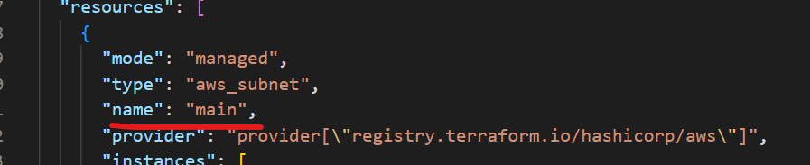
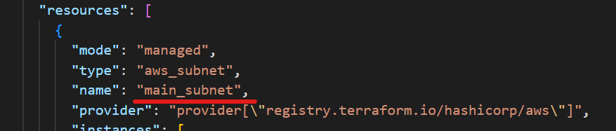

# Terraform - State

[Back](../index.md)

- [Terraform - State](#terraform---state)
  - [States](#states)
    - [Lab: Manage State](#lab-manage-state)
    - [Lab: Rename State](#lab-rename-state)
    - [Lab: Remove](#lab-remove)
    - [Purpose](#purpose)
    - [State Storage](#state-storage)
    - [State Locking](#state-locking)
    - [State Refresh](#state-refresh)
    - [Common Commands](#common-commands)
  - [Backend](#backend)
    - [Backend configuration](#backend-configuration)
    - [Partial configuration for Backend](#partial-configuration-for-backend)
  - [Lab: S3 as backend](#lab-s3-as-backend)
    - [Specify variables using a config file](#specify-variables-using-a-config-file)
    - [Specify variables using Cli](#specify-variables-using-cli)
    - [Refer to the existing remote backend](#refer-to-the-existing-remote-backend)

---

## States

- `State`

  - used to **map real world resources** to your **configuration**, keep **track of metadata**, and to improve performance for large infrastructures.
    - the bindings between **objects in a remote system** and **resource instances declared in your configuration**.
    - When Terraform **creates** a remote object in response to a change of **configuration**, it will **record the identity of that remote object** against a particular resource instance, and then potentially **update or delete** that object in response to future **configuration changes**.
  - used to **determine which changes to make to your infrastructure**.

- `state file`

  - By default, a local file named `terraform.tfstate`
  - recommend storing it in HCP Terraform to version, encrypt, and securely share it with your team.
  - In `JSON` format
  - use `terraform state` command for modifications

- one-to-one mapping

  - **guaranteed** by Terraform being the one to **create** each object and **record its identity** in the state, or to **destroy** an object and then **remove the binding** for it.
  - It is the user's responsibility to ensure the one-to-one rule when the manual modification is applied with command `terraform import` or `terraform state rm`

- Format

  - `State` snapshots are stored in `JSON` format and new Terraform versions are generally **backward compatible** with state snapshots produced by earlier versions.

---

### Lab: Manage State

- `main.tf`

```terraform
resource "aws_vpc" "main" {
  cidr_block = "10.0.0.0/16"
}

resource "aws_subnet" "main" {
  vpc_id     = aws_vpc.main.id
  cidr_block = "10.0.1.0/24"
}

```

```sh
terraform apply

terraform state list
# aws_subnet.main
# aws_vpc.main

terraform show
# # aws_subnet.main:
# resource "aws_subnet" "main" {
#     arn                                            = "arn:aws:ec2:ca-central-1:099139718958:subnet/subnet-0dd8e689541b8932f"
#     assign_ipv6_address_on_creation                = false
#     availability_zone                              = "ca-central-1d"
#     availability_zone_id                           = "cac1-az4"
#     cidr_block                                     = "10.0.1.0/24"
#     customer_owned_ipv4_pool                       = null
#     enable_dns64                                   = false
#     enable_lni_at_device_index                     = 0
#     enable_resource_name_dns_a_record_on_launch    = false
#     enable_resource_name_dns_aaaa_record_on_launch = false
#     id                                             = "subnet-0dd8e689541b8932f"
#     ipv6_cidr_block                                = null
#     ipv6_cidr_block_association_id                 = null
#     ipv6_native                                    = false
#     map_customer_owned_ip_on_launch                = false
#     map_public_ip_on_launch                        = false
#     outpost_arn                                    = null
#     owner_id                                       = "099139718958"
#     private_dns_hostname_type_on_launch            = "ip-name"
#     region                                         = "ca-central-1"
#     tags_all                                       = {}
#     vpc_id                                         = "vpc-0990959cf08b033a0"
# }

# # aws_vpc.main:
# resource "aws_vpc" "main" {
#     arn                                  = "arn:aws:ec2:ca-central-1:099139718958:vpc/vpc-0990959cf08b033a0"
#     assign_generated_ipv6_cidr_block     = false
#     cidr_block                           = "10.0.0.0/16"
#     default_network_acl_id               = "acl-0154c16862eb0e3b8"
#     default_route_table_id               = "rtb-0f55d3f64d8c00841"
#     default_security_group_id            = "sg-044e2fc72add880ef"
#     dhcp_options_id                      = "dopt-077605ecfdd0f617f"
#     enable_dns_hostnames                 = false
#     enable_dns_support                   = true
#     enable_network_address_usage_metrics = false
#     id                                   = "vpc-0990959cf08b033a0"
#     instance_tenancy                     = "default"
#     ipv6_association_id                  = null
#     ipv6_cidr_block                      = null
#     ipv6_cidr_block_network_border_group = null
#     ipv6_ipam_pool_id                    = null
#     ipv6_netmask_length                  = 0
#     main_route_table_id                  = "rtb-0f55d3f64d8c00841"
#     owner_id                             = "099139718958"
#     region                               = "ca-central-1"
#     tags                                 = {}
#     tags_all                             = {}
# }

terraform state show aws_vpc.main
# # aws_vpc.main:
# resource "aws_vpc" "main" {
#     arn                                  = "arn:aws:ec2:ca-central-1:099139718958:vpc/vpc-0990959cf08b033a0"
#     assign_generated_ipv6_cidr_block     = false
#     cidr_block                           = "10.0.0.0/16"
#     default_network_acl_id               = "acl-0154c16862eb0e3b8"
#     default_route_table_id               = "rtb-0f55d3f64d8c00841"
#     default_security_group_id            = "sg-044e2fc72add880ef"
#     dhcp_options_id                      = "dopt-077605ecfdd0f617f"
#     enable_dns_hostnames                 = false
#     enable_dns_support                   = true
#     enable_network_address_usage_metrics = false
#     id                                   = "vpc-0990959cf08b033a0"
#     instance_tenancy                     = "default"
#     ipv6_association_id                  = null
#     ipv6_cidr_block                      = null
#     ipv6_cidr_block_network_border_group = null
#     ipv6_ipam_pool_id                    = null
#     ipv6_netmask_length                  = 0
#     main_route_table_id                  = "rtb-0f55d3f64d8c00841"
#     owner_id                             = "099139718958"
#     region                               = "ca-central-1"
#     tags                                 = {}
#     tags_all                             = {}
# }
```

- state file



---

### Lab: Rename State

- update resource name

```terraform
resource "aws_subnet" "main_subnet" {
  vpc_id     = aws_vpc.main.id
  cidr_block = "10.0.1.0/24"
}
```

- Rename resource state

```sh
# rename old_name new_name
terraform state mv aws_subnet.main aws_subnet.main_subnet
# Move "aws_subnet.main" to "aws_subnet.main_subnet"
# Successfully moved 1 object(s).

# confirm
terraform state list
# aws_subnet.main_subnet
# aws_vpc.main
```



---

### Lab: Remove

```sh
# remove subnet
terraform state rm aws_subnet.main_subnet
# Removed aws_subnet.main_subnet
# Successfully removed 1 resource instance(s).

terraform state list
# aws_vpc.main
```

---

- Common use cases required to modify the state:
  - upgrade the tf version
  - rename a resource without recreating it
  - Change a key in a for_each withou recreating the resources
  - Change position of a resource in a list (resource[0], resource[1])
  - Stop managing a resource without destroying it.

---

### Purpose

- Terraform state is **required**.

- **Mapping to the Real World**

  - Terraform requires **some sort of database** to map Terraform **config** to the **real world**.
  - Not all resources support tags as identifier. Therefore, tf has to use its own state structure.

- **Metadata**

  - Terraform must also **track metadata**
    - i.e.,resource **dependencies**, a pointer to the provider configuration
  - To ensure correct operation, Terraform **retains a copy of the most recent set of dependencies** within the state.

- **Performance**

  - Terraform stores **a cache of the attribute values for all resources** in the state for a performance improvement.
  - default behavior:
    - for every plan and apply, Terraform will **sync** all resources in your state.
    - For larger infrastructures, querying every resource is too slow.
    - In these scenarios, the **cached state** is treated as the **record of truth**.

- **Syncing**
  - When working in a team, the state is used to keep operations will be applied to the same remote objects.
  - `Remote state` is the **recommended** solution to this problem.
    - Terraform can use `remote locking` as a measure to **avoid two or more different users accidentally running Terraform at the same time**, and thus **ensure** that each Terraform run begins **with the most recent updated state**.

---

### State Storage

- `Backends` determine where state is stored.
  - For example, the **local** (default) backend stores state in a local JSON file on disk. The Consul backend stores the state within Consul. Both of these backends happen to provide locking: **local** via **system APIs** and `Consul` via **locking APIs**.
- When using a **non-local backend**, Terraform will **not persist the state** anywhere on disk **except** in the case of a **non-recoverable error** where writing the state to the backend failed.
- In the case of an **error persisting the state to the backend**, Terraform will write the state **locally**.

  - This is to prevent data loss.
  - If this happens, the end user must **manually push the state to the remote backend** once the error is resolved.

- **Manual State Pull/Push**

| CMD                           | Desc                                                                                                  |
| ----------------------------- | ----------------------------------------------------------------------------------------------------- |
| `terraform state pull`        | manually retrieve the state from the remote state                                                     |
| `terraform state push`        | manually write the state to the remote state. (extremely dangerous and should be avoided if possible) |
| `terraform state push -force` | manually write the state to the remote state. (extremely dangerous and should be avoided if possible) |

- Even if using the -force flag, we recommend making a backup of the state with terraform state pull prior to forcing the overwrite.

---

### State Locking

- `State locking`

  - ensure nobody can write to the state at the same time.
  - If a lock file created, the second `terraform apply` cannot run.

- **Troubleshotting**

  - sometime, when terraform crashes, or a users' internet connection breaks during terraform apply, the lock will stay.
  - can use `terraform force-unlock state_id` to unlock the state.
    - it is safe, because it does not touch the state, just remove the lock file.
  - option: `terraform apply -lock=false` to indicate tf not to use the lock file.
    - not recommanded, only used when the locking is not working.

- `State locking`

  - automatically **lock the state** for all operations that could write state.
    - If state locking fails, Terraform does not continue.
  - prevents others from acquiring the lock and potentially **corrupting** your state.

- `-lock=false` flag:

  - disable state locking
  - not recommend

- If **acquiring the lock** takes **longer** than expected, Terraform outputs a **status message**.

  - If Terraform does **not output** a message, state locking is **still occurring** if your backend supports it.

- S3: supported
  - `use_lockfile`:
    - Optional
    - Whether to use a lockfile for locking the state file.
    - Defaults to `false`.

```terraform
terraform {
 backend "s3" {
    bucket         = "your-terraform-state-bucket"
    key            = "path/to/your/statefile.tfstate"
    region         = "us-east-1"
    encrypt        = true
    use_lockfile   = true # Enables S3 native locking
  }
}
```

---

### State Refresh

- Use case:
  - When only the actual state of infrastructure is required and terraform apply is not needed, `terraform refresh` can help.
    - tf will refresh the state of infrastructure in the state file.
    - only update the state file.
  - When the output needs to be refreshed.

---

### Common Commands

| Command                              | Description                                                                                        |
| ------------------------------------ | -------------------------------------------------------------------------------------------------- |
| `terraform state list`               | Lists all resources in the Terraform state.                                                        |
| `terraform state show resource_name` | Displays detailed information about a specific resource in the Terraform state.                    |
| `terraform state mv`                 | Moves an item in the Terraform state. Useful for renaming resources without destroying/recreating. |
| `terraform state pull`               | Pulls the current state and outputs it to stdout.                                                  |
| `terraform state push`               | Updates remote state file with local state data.                                                   |
| `terraform state rm`                 | Removes items from the Terraform state.                                                            |
| `terraform state replace-provider`   | Updates the provider for a resource in the state.                                                  |
|                                      |                                                                                                    |

- `terraform state mv resource_old_label resource_new_label`
  - useful when just rename the resource label

---

## Backend

- `Terraform` uses **persisted state data** to **keep track of the resources** it manages.

- By **default**,

  - `Terraform` uses a backend called `local`
    - The local backend type stores state as a local file on disk.

- local file name: `terraform.tfstate`

  - created only when first apply
  - where state is stored
  - get updated each time `terraform apply` is issued and state is changed.

- When **applying** a plan that you previously saved to a file, Terraform uses the **backend configuration** stored in that file instead of the current backend settings.

- `backend block`

  - used to **store state** in a remote object.
  - used to specify **where** and **how** the backend **stores** configuration state.

- When you **change a backend's configuration**, you must run `terraform init` again to **validate** and **configure** the backend before you can perform any plans, applies, or state operations.

- When you **change backends**, Terraform gives you the option to **migrate** your state to the new backend.

  - This lets you adopt backends without losing any existing state.
  - Important: Before migrating to a new backend, we strongly recommend manually backing up your state by copying your terraform.tfstate file to another location.

- Using a remote:

  - can keep sensitive information off disk.
  - can run for a long time in bigger projects.
  - can keep the secret in state file secure
    - secret of db could be stored in the state file

- Secure remote backend
  - only allow tf admin to have access to the backend
  - enable encryption at rest
  - use only TLS when communicating with the backend.

---

- Common backend types:
  - **Local Storage**: The default backend for Terraform, where the state file is stored and managed in the local machine that runs Terraform
  - **AWS S3 Bucket**: The state file is stored and managed in an AWS S3 bucket.
  - **Azure Blob Storage**:The state file is stored and managed in Azure Blob Storage.
  - **Google Cloud Storage bucket**: The state file is stored and managed in a Google Cloud Storage bucket.
  - **Remote**:Stores state snapshots and executes Terraform CLI operations for HCP Terraform or supported Terraform CI/CD platform, like Spacelift
  - **Http**: Stores and manage state files in a server by fetching via GET, updating via POST, and deleting with DELETE.

---

### Backend configuration

- Configure in `terraform {}` block

```hcl
terraform {
  backend "s3" {
    bucket = ""
    key = ""
    region = ""
  }
}
```

---

### Partial configuration for Backend

- Partial configuration

  - When some or all of the arguments are omitted.
  - can be used to refer to different backend configuration

- 3 ways to pass configurations
  - interactive way, tf will ask
  - key/value pairs
  - a file

```sh
# key/value pairs
terraform init -backend-config="bucket=mybucket" \
  -backend-config="key=mykey"
  -backend-config="region=myregion"

# for dev
terraform init -backend-config=dev.config
# for test
terraform init -backend-config=test.config
# for prod
terraform init -backend-config=prod.config
```

---

## Lab: S3 as backend

- `provider.tf`

```hcl
terraform {
  required_providers {
    aws = {
      source  = "hashicorp/aws"
      version = "~> 5.0"
    }
  }

  # Configuring a remote backend
  backend "s3" {
    bucket = ""
    region = ""
    key    = ""
    dynamodb_table  = ""    # backend lock in dynamodb
  }
}
```

---

### Specify variables using a config file

- `state.config`

```config
# state.config
bucket = "your-bucket"
key    = "your-state.tfstate"
region = "eu-central-1"
profile= "Your_Profile"
```

- init with config file

```sh
`terraform init -backend-config="./state.config"`
```

---

### Specify variables using Cli

- if not using state.config, can use Command-line key/value pairs

```sh
# cli
terraform init \
    -backend-config="address=demo.consul.io" \
    -backend-config="path=example_app/terraform_state" \
    -backend-config="scheme=https"
```

---

### Refer to the existing remote backend

```terraform
data "terraform_remote_state" "network" {
  backend = "s3"
  config = {
    bucket = "terraform-state-prod"
    key    = "network/terraform.tfstate"
    region = "us-east-1"
  }
}
```
