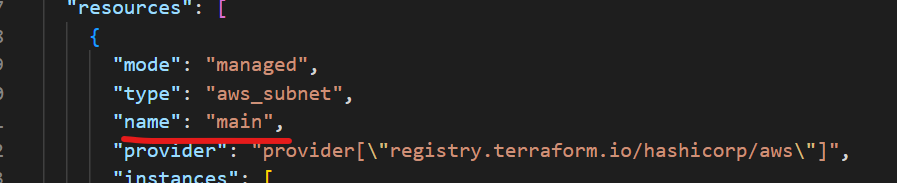
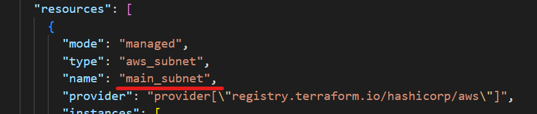

# Terraform - State

[Back](../index.md)

- [Terraform - State](#terraform---state)
  - [Terraform State](#terraform-state)
    - [Common Commands](#common-commands)
  - [Lab: Terraform State](#lab-terraform-state)
    - [Show state](#show-state)
    - [Rename State](#rename-state)
    - [Remove State](#remove-state)
  - [Lockfile](#lockfile)
    - [S3 Bucket Lock](#s3-bucket-lock)

---

## Terraform State

- `Terraform state`
  - the **data Terraform** uses to map the **configuration** to the **real-world resources** it manages.
  - keep **track of metadata**, it knows what exists and what needs to change.

- `terraform.tfstate`
  - a required **JSON file** that maps **Terraform configuration** to **real-world infrastructure**.
    - a json snapshot of terraform state.
  - acts as the **"source of truth,"** tracking metadata, resource IDs, and dependencies so Terraform can efficiently manage, update, or destroy existing infrastructure rather than recreating it every time.
  - created only when first apply `terraform apply`
  - use `terraform state`, `terraform import`, `terraform pull` command for modifications

---

### Common Commands

- State management

| Command                                            | Description                                                                     |
| -------------------------------------------------- | ------------------------------------------------------------------------------- |
| `terraform refresh`                                | synchronize state file with the actual infrastructure                           |
| `terraform show`                                   | Show the current state                                                          |
| `terraform state list`                             | Lists all resources in the Terraform state.                                     |
| `terraform state show <resource>`                  | Displays detailed information about a specific resource in the Terraform state. |
| `terraform state mv <old_resource> <new_resource>` | Moves/Rename an item in the Terraform state.                                    |
| `terraform state rm`                               | Removes items from the Terraform state.                                         |
| `terraform state replace-provider`                 | Updates the provider for a resource in the state.                               |
| `terraform state pull`                             | retrieve the state from the remote state                                        |
| `terraform state pull > backup.tfstate`            | backup remote state                                                             |
| `terraform state push`                             | write the state to the remote state.                                            |
| `terraform state push -force`                      | write the state to the remote state.                                            |

- Taint the resource and recreate in next apply

| Command                           | Description                                         |
| --------------------------------- | --------------------------------------------------- |
| `terraform taint resource_name`   | Mark a resource instance as not fully funciontal    |
| `terraform untaint resource_name` | Remove the 'tainted' state from a resource instance |

---

## Lab: Terraform State

### Show state

- `main.tf`

```hcl
resource "aws_vpc" "main" {
  cidr_block = "10.0.0.0/16"
}

resource "aws_subnet" "main" {
  vpc_id     = aws_vpc.main.id
  cidr_block = "10.0.1.0/24"
}

```

```sh
terraform apply

terraform state list
# aws_subnet.main
# aws_vpc.main

terraform show
# # aws_subnet.main:
# resource "aws_subnet" "main" {
#     arn                                            = "arn:aws:ec2:ca-central-1:099139718958:subnet/subnet-0dd8e689541b8932f"
#     assign_ipv6_address_on_creation                = false
#     availability_zone                              = "ca-central-1d"
#     availability_zone_id                           = "cac1-az4"
#     cidr_block                                     = "10.0.1.0/24"
#     customer_owned_ipv4_pool                       = null
#     enable_dns64                                   = false
#     enable_lni_at_device_index                     = 0
#     enable_resource_name_dns_a_record_on_launch    = false
#     enable_resource_name_dns_aaaa_record_on_launch = false
#     id                                             = "subnet-0dd8e689541b8932f"
#     ipv6_cidr_block                                = null
#     ipv6_cidr_block_association_id                 = null
#     ipv6_native                                    = false
#     map_customer_owned_ip_on_launch                = false
#     map_public_ip_on_launch                        = false
#     outpost_arn                                    = null
#     owner_id                                       = "099139718958"
#     private_dns_hostname_type_on_launch            = "ip-name"
#     region                                         = "ca-central-1"
#     tags_all                                       = {}
#     vpc_id                                         = "vpc-0990959cf08b033a0"
# }

# # aws_vpc.main:
# resource "aws_vpc" "main" {
#     arn                                  = "arn:aws:ec2:ca-central-1:099139718958:vpc/vpc-0990959cf08b033a0"
#     assign_generated_ipv6_cidr_block     = false
#     cidr_block                           = "10.0.0.0/16"
#     default_network_acl_id               = "acl-0154c16862eb0e3b8"
#     default_route_table_id               = "rtb-0f55d3f64d8c00841"
#     default_security_group_id            = "sg-044e2fc72add880ef"
#     dhcp_options_id                      = "dopt-077605ecfdd0f617f"
#     enable_dns_hostnames                 = false
#     enable_dns_support                   = true
#     enable_network_address_usage_metrics = false
#     id                                   = "vpc-0990959cf08b033a0"
#     instance_tenancy                     = "default"
#     ipv6_association_id                  = null
#     ipv6_cidr_block                      = null
#     ipv6_cidr_block_network_border_group = null
#     ipv6_ipam_pool_id                    = null
#     ipv6_netmask_length                  = 0
#     main_route_table_id                  = "rtb-0f55d3f64d8c00841"
#     owner_id                             = "099139718958"
#     region                               = "ca-central-1"
#     tags                                 = {}
#     tags_all                             = {}
# }

terraform state show aws_vpc.main
# # aws_vpc.main:
# resource "aws_vpc" "main" {
#     arn                                  = "arn:aws:ec2:ca-central-1:099139718958:vpc/vpc-0990959cf08b033a0"
#     assign_generated_ipv6_cidr_block     = false
#     cidr_block                           = "10.0.0.0/16"
#     default_network_acl_id               = "acl-0154c16862eb0e3b8"
#     default_route_table_id               = "rtb-0f55d3f64d8c00841"
#     default_security_group_id            = "sg-044e2fc72add880ef"
#     dhcp_options_id                      = "dopt-077605ecfdd0f617f"
#     enable_dns_hostnames                 = false
#     enable_dns_support                   = true
#     enable_network_address_usage_metrics = false
#     id                                   = "vpc-0990959cf08b033a0"
#     instance_tenancy                     = "default"
#     ipv6_association_id                  = null
#     ipv6_cidr_block                      = null
#     ipv6_cidr_block_network_border_group = null
#     ipv6_ipam_pool_id                    = null
#     ipv6_netmask_length                  = 0
#     main_route_table_id                  = "rtb-0f55d3f64d8c00841"
#     owner_id                             = "099139718958"
#     region                               = "ca-central-1"
#     tags                                 = {}
#     tags_all                             = {}
# }
```

- state file



---

### Rename State

- update resource name

```hcl
resource "aws_subnet" "main_subnet" {
  vpc_id     = aws_vpc.main.id
  cidr_block = "10.0.1.0/24"
}
```

- Rename resource state

```sh
# rename old_name new_name
terraform state mv aws_subnet.main aws_subnet.main_subnet
# Move "aws_subnet.main" to "aws_subnet.main_subnet"
# Successfully moved 1 object(s).

# confirm
terraform state list
# aws_subnet.main_subnet
# aws_vpc.main
```



---

### Remove State

```sh
# remove subnet
terraform state rm aws_subnet.main_subnet
# Removed aws_subnet.main_subnet
# Successfully removed 1 resource instance(s).

terraform state list
# aws_vpc.main
```

---

## Lockfile

- `lockfile`
  - a configuration file that **tracks** and "**locks" the exact versions and checksums** of the providers used in your project.

- `.terraform.lock.hcl`
  - Manages provider versions and security.
  - created when the command `terraform init` is issued.
  - updated when the provider is changed `terraform init -upgrade`
  - lockfile should be committed to git
    - the re-run of terraform will use the same provider/module, especially when terraform is ran by other members.

---

### S3 Bucket Lock

- `use_lockfile`:
  - Whether to use a lockfile for locking the state file.
  - Defaults to `false`.

```hcl
terraform {
 backend "s3" {
    bucket         = "your-terraform-state-bucket"
    key            = "path/to/your/statefile.tfstate"
    region         = "us-east-1"
    encrypt        = true
    use_lockfile   = true # Enables S3 native locking
  }
}
```

---

**Troubleshotting**

- sometime, when terraform crashes, or a users' internet connection breaks during terraform apply, the lock will stay.
- can use `terraform force-unlock state_id` to unlock the state.
  - it is safe, because it does not touch the state, just remove the lock file.
- option: `terraform apply -lock=false` to indicate tf not to use the lock file.
  - not recommanded, only used when the locking is not working.
