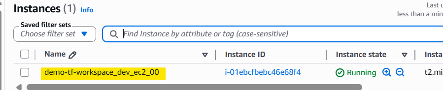
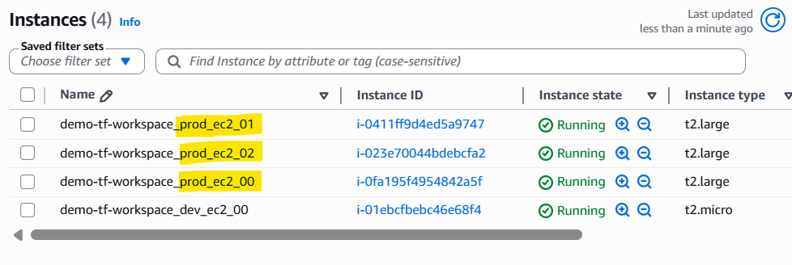
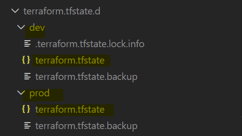
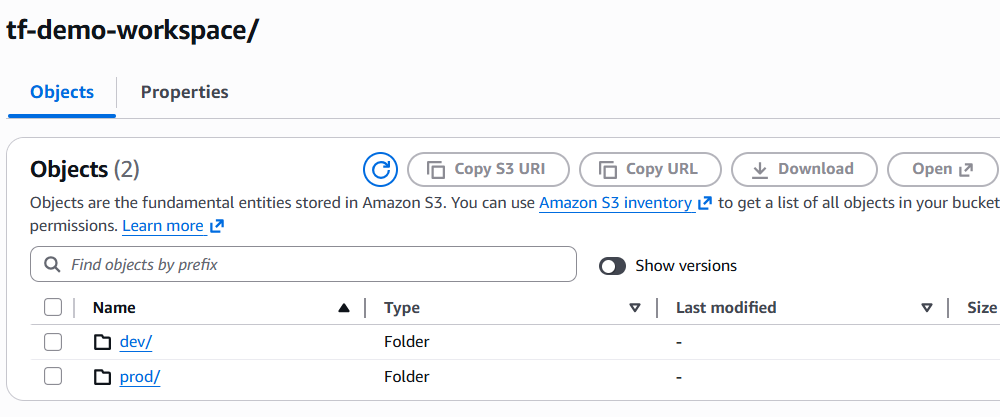

# Terraform - Workspace

[Back](../index.md)

- [Terraform - Workspace](#terraform---workspace)
  - [Terraform Workspace](#terraform-workspace)
    - [Common Commands](#common-commands)
  - [Lab: Local Workspace](#lab-local-workspace)

---

## Terraform Workspace

- `Terraform workspace`
  - a feature that manages **multiple isolated state files** within a **single configuration directory**.
  - used to deploy the **same infrastructure code** **multiple times** (e.g., for dev, staging, and prod) without duplicating your files.

- Features:
  - a built-in default workspace: `default`
  - Separates Terraform state within the same project directory
    - Each workspace has its own state file
    - local: `terraform.tfstate.d/<workspace_name>/terraform.tfstate`
    - remote:
      - `env:/<workspace_name>/terraform.tfstate`
      - `<workspace_key_prefix>/<workspace_name>/terraform.tfstate`
  - Allows the same configuration to be reused for multiple environments: Same code + different workspace = different state
  - reference in code: `"${terraform.workspace}"`

- Example:

```terraform
instance_type = terraform.workspace == "prod" ? "t3.medium" : "t3.micro"
```

- **Use Cases**
  - Small environment separation, such as dev, test, and prod
  - Temporary testing environments
  - Reusing the same Terraform code with separate state
  - Simple projects where environments are very similar

- Not ideal for:
  - Complex production environments
  - Projects requiring **separate credentials**
  - Projects requiring strong access control
  - Large infrastructure decomposition

---

### Common Commands

| Command                                     | Description                            |
| ------------------------------------------- | -------------------------------------- |
| `terraform workspace delete`                | Delete a workspace                     |
| `terraform workspace show`                  | Show the name of the current workspace |
| `terraform workspace list`                  | List Workspaces                        |
| `terraform workspace new workspace_name`    | Create a new workspace                 |
| `terraform workspace select workspace_name` | Select a workspace                     |

---

## Lab: Local Workspace

```hcl
terraform {
  required_providers {
    aws = {
      source  = "hashicorp/aws"
      version = "~> 5.0"
    }
  }

  backend "s3" {
    bucket               = ""
    region               = ""
    workspace_key_prefix = "tf-demo-workspace"
    key                  = "terraform.tfstate"
    encrypt              = true
    use_lockfile         = true
  }
}

provider "aws" {
  region = var.aws_region
}


# ##############################
# VPC
# ##############################
resource "aws_vpc" "main" {
  cidr_block           = var.vpc_cidr_block
  enable_dns_support   = true
  enable_dns_hostnames = true

  tags = {
    Name        = format("%s_%s_vpc", var.project_name, terraform.workspace)
    Environment = terraform.workspace
  }
}

resource "aws_subnet" "private" {
  vpc_id            = aws_vpc.main.id
  cidr_block        = var.subnet_cidr_block
  availability_zone = var.availability_zone

  tags = {
    Name        = format("%s_%s_private_subnet", var.project_name, terraform.workspace)
    Environment = terraform.workspace
  }
}

# ##############################
# ec2
# ##############################
resource "aws_instance" "app" {
  count = terraform.workspace == "prod" ? 3 : 1

  ami           = var.ami_id
  instance_type = terraform.workspace == "prod" ? "t2.large" : "t2.micro"
  subnet_id     = aws_subnet.private.id

  tags = {
    Name        = format("%s_%s_ec2_%02d", var.project_name, terraform.workspace, count.index)
    Environment = terraform.workspace
  }
}
```

---

```sh
cd infra
terraform init
terraform workspace new dev
terraform workspace new prod

# switch and apply
terraform workspace select dev
terraform apply -auto-approve
```



```hcl
terraform workspace select prod
terraform apply -auto-approve
```



---

- State separation: Local



- State separation: Remote


