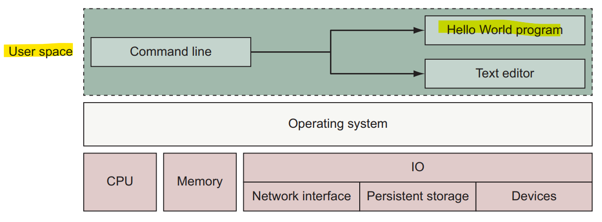
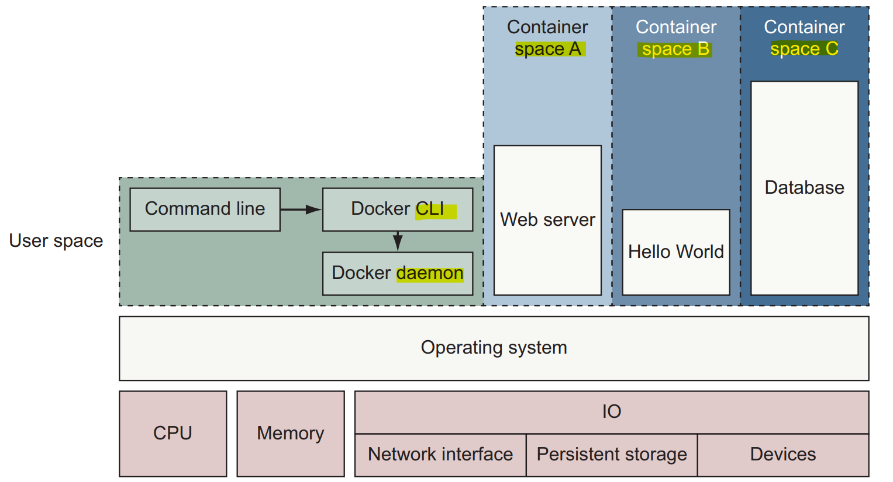

## What happens if `docker run`

When you execute `docker run`, `Docker` performs a sequence of actions:

1. **Check local image**
   Docker looks for the specified `image` on your local machine.
2. **Pull from registry (if needed)**
   If the `image` is not found locally, Docker downloads it from `Docker Hub` or another configured registry.
3. **Create a container**
   A new `container` is created from the `image` (each docker run creates a new container).
4. **Execute the default command**
   Docker runs the predefined command inside the container.
5. **Container lifecycle tied to process**
   If the process is **running** → container is **running**
   If the process **stops** → container **stops**
6. **Repeat behavior**
   Running the same command again:

- Reuses the local image (no download)
- Creates a new container instance

---

- **Example**

```sh
docker run dockerinaction/hello_world
```

**First run:**

1. Docker checks for `dockerinaction/hello_world` locally → not found
2. Downloads image from Docker Hub
3. Creates a container
4. Runs: `echo "hello world"`
5. Process exits → container stops

**Second run**:

1. Image already exists locally → no download
2. Docker creates another new container
3. Executes the same command → prints hello world again

---

## Isolation

vm vs container





Features used to build containers:

- `PID namespace`: **Process** identifiers and capabilities
- `IPC namespace`: **Process** communication over shared memory
- `UTS namespace`: **Host and domain** name
- `NET namespace`: **Network** access and structure
- `USR namespace`: **User names** and identifiers
- `MNT namespace`: **Filesystem** access and structure
- `chroot syscall`: Controls the location of the **filesystem root**
- `cgroups`: Resource protection
- `CAP drop`: Operating system feature restrictions
- `Security modules`: Mandatory access controls
