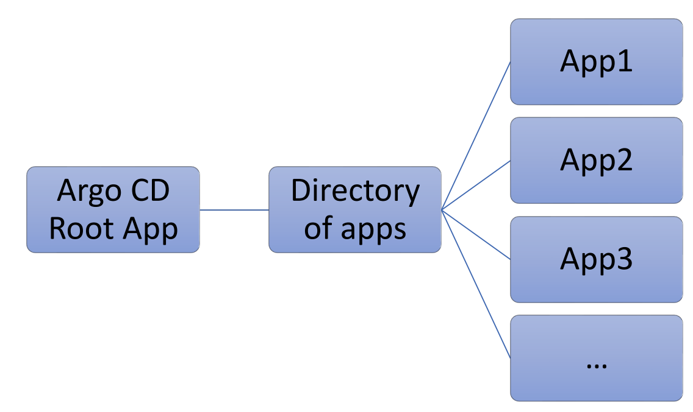
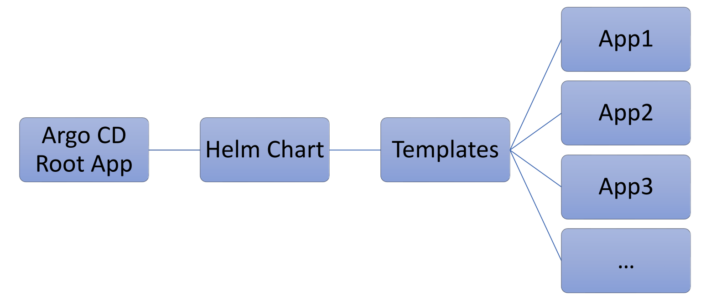

# Argocd: App of Apps

[Back](../index.md)

- [Argocd: App of Apps](#argocd-app-of-apps)
  - [App of Apps](#app-of-apps)
    - [vs `applicationset`](#vs-applicationset)

---

## App of Apps

- `App of Apps`
  - a hierarchical **GitOps approach** where a **single "root" or "parent" application** is used to declaratively **manage and deploy** multiple other **"child" Argo CD applications**.

- Options
  - use the `root app` to track the **directory** recursively that stores manifests of all other apps.
    - Any new app added to the `tracked directory` can be synced by ArgoCD directly.
  - use `root app` to track `helm chart` that include all other apps.
    - Adding new apps will be within the `helm chart` , then it can be synced by ArgoCD directly

---

- Example: directory of apps



```yaml
apiVersion: argoproj.io/v1alpha1
kind: Application
metadata:
  labels:
    app.kubernetes.io/name: root-app
    name: root-app
    namespace: argocd
spec:
  project: default
  destination:
    namespace: argocd
    server: https://kubernetes.default.svc
  source:
    path: app-of-apps
    repoURL: https://github.com/mabusaa/argocd-course-app-of-apps.git
    targetRevision: main
    directory:
      recurse: true # monitor recursively
  syncPolicy:
    automated: {}
```

---

- Example: helm chart



```yaml
apiVersion: argoproj.io/v1alpha1
kind: Application
metadata:
  labels:
    app.kubernetes.io/name: root-app-helm-approach
    name: root-app-helm-approach
    namespace: argocd
spec:
  project: default
  destination:
    namespace: argocd
    server: https://kubernetes.default.svc
  source:
    repoURL: https://github.com/mabusaa/argocd-course-app-of-apps.git
    targetRevision: main
    path: apps-helm-chart/apps
  syncPolicy:
    automated: {}
```

---

### vs `applicationset`

- Both are Argo CD patterns for **managing multiple applications**
  - `App-of-apps` is a **manual**, **declarative "parent-child" approach** good for fixed, complex structures
  - `ApplicationSet` is a **dynamic**, **automated controller** designed for **scaling across many clusters or repositories** using generators.

- Use `App-of-Apps`:
  - When need strict synchronization ordering (Sync Waves), **managing a small, fixed set of core infra apps**, or prefer a straightforward "YAML-only" approach.
- Use `ApplicationSet`:
  - When needs to manage **tens or hundreds of clusters**, need to automatically create apps based on Git directory structures, or require per-app configuration via templating.
- Combine Them:
  - Many organizations use `ApplicationSets` to manage multiple "App-of-apps" structures, providing the best of both worlds—dynamic generation with structured, ordered deployments.
