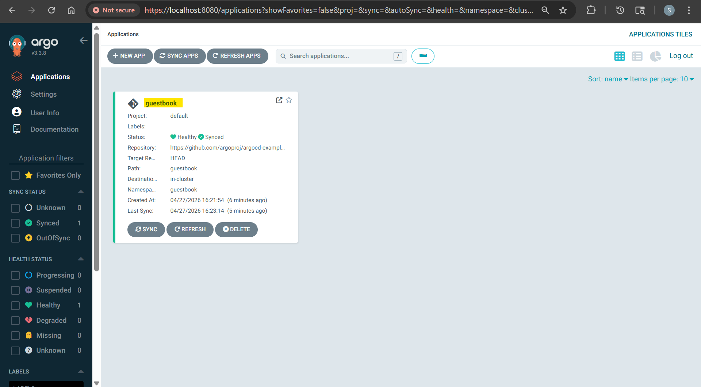
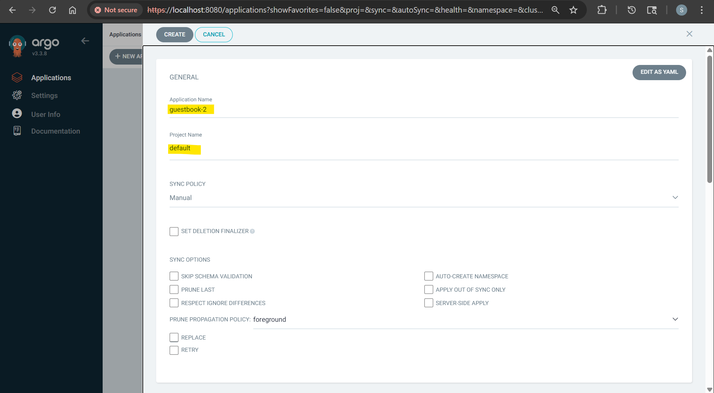
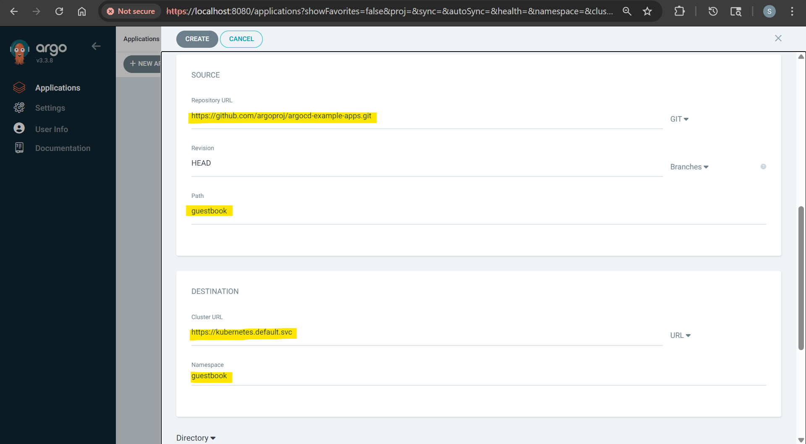
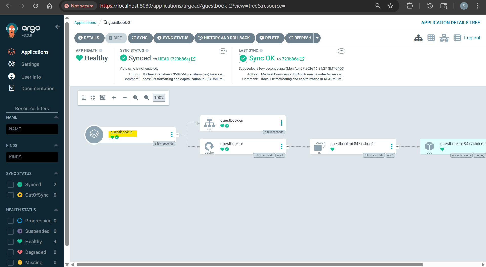
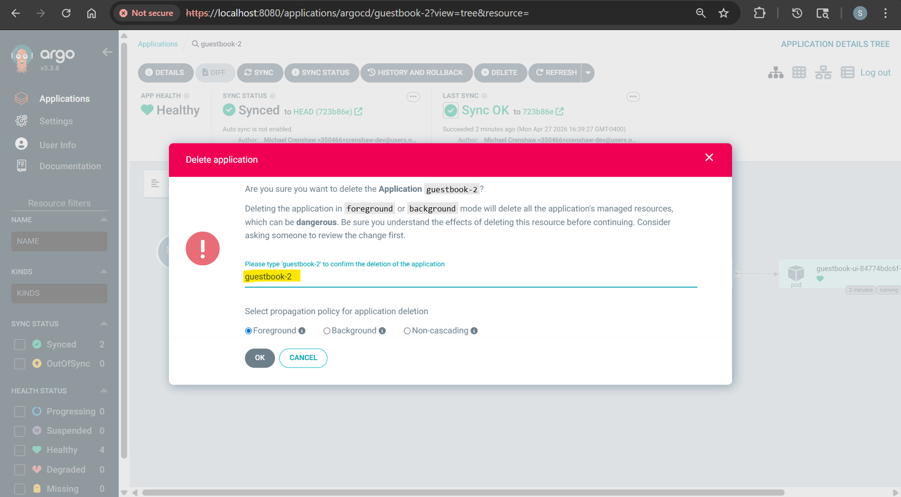

# ArgoCD - Application

[Back](../index.md)

- [ArgoCD - Application](#argocd---application)
  - [Application](#application)
    - [Supported Tools](#supported-tools)
  - [Common Commands](#common-commands)
  - [Lab: Create Application](#lab-create-application)
    - [Method: Ddeclarative](#method-ddeclarative)
    - [Method: CLI](#method-cli)
    - [Method: UI](#method-ui)
  - [Tools: Helm](#tools-helm)
    - [Common Options](#common-options)
    - [Lab: Create App with Helm](#lab-create-app-with-helm)
  - [Tools: Directory manifests](#tools-directory-manifests)
  - [Tools: Kustomize](#tools-kustomize)
    - [Lab: Create App with Kustomize](#lab-create-app-with-kustomize)
  - [Tools: Multiple Sources](#tools-multiple-sources)

---

## Application

- `Application`
  - a Kubernetes `Custom Resource Definition (CRD)` that defines the **desired state of an application** in a target cluster, **sourcing** its configuration (YAML, Helm, Kustomize) from a Git repository.
  - **the unit of deployment** and tracking, enabling GitOps by monitoring for differences between the Git repository and the cluster.

- two key pieces of information:
  - **Source**:
    - reference to the desired state in Git
    - e.g.,
      - Helm charts
      - Kustomize application
      - k8s manifests
      - jsonnet
  - **Destination**:
    - reference to the target cluster and namespace.

- Created by:
  - Declaratively “Yaml”. (Recommended)
  - Web UI
  - CL

---

### Supported Tools

- Helm charts
- Kustomize application
- Directory of Yaml files.
- Jsonnet

- **Auto Detected**
  - **Helm charts** : if there is a file as `Chart.yaml`
  - **Kustomize**: if there's a `kustomization.yaml`, `kustomization.yml`, or `Kustomization`
  - Otherwise it is assumed to be a plain **Yaml directory** application

---

## Common Commands

- Get app info

| Command                           | Description                                                  |
| --------------------------------- | ------------------------------------------------------------ |
| `argocd app list`                 | List all Argo CD applications.                               |
| `argocd app get <app_name>`       | Show detailed information about one application              |
| `argocd app logs <app_name>`      | Show logs from pods that belong to the application.          |
| `argocd app resources <app_name>` | Show Kubernetes resources managed by the application.        |
| `argocd app manifests <app_name>` | Show the rendered Kubernetes manifests generated by Argo CD. |

- Common operations

| Command                                       | Description                                                                                |
| --------------------------------------------- | ------------------------------------------------------------------------------------------ |
| `argocd app diff <app_name>`                  | Compare the desired state in Git with the live state in Kubernetes.                        |
| `argocd app sync <app_name>`                  | Manually sync the application from Git to the Kubernetes cluster.                          |
| `argocd app refresh <app_name>`               | Ask Argo CD to refresh the application state from Git and the cluster.                     |
| `argocd app set <app_name>`                   | Update application settings                                                                |
| `argocd app unset <app_name>`                 | Remove specific application parameters or settings.                                        |
| `argocd app history <app_name>`               | Show the deployment history of an application.                                             |
| `argocd app rollback <app_name> <history-id>` | Roll back the application to a previous deployment revision.                               |
| `argocd app wait <app_name>`                  | Wait until an application becomes synced, healthy, or degraded. Useful in CI/CD pipelines. |
| `argocd app actions list <app_name>`          | List available resource actions for the application.                                       |
| `argocd app actions run <app_name> <action>`  | Run an action against an application resource.                                             |
| `argocd app terminate-op <app_name>`          | Stop a running sync, rollback, or other application operation.                             |
| `argocd app delete <app_name>`                | Delete an Argo CD application.                                                             |

- Create App

| Command                                                                                                                                             | Description                        |
| --------------------------------------------------------------------------------------------------------------------------------------------------- | ---------------------------------- |
| `argocd app create <app_name> --repo <repo_url> --path <path> --dest-namespace <ns> --dest-server <k8s_server> --directory-recurse`                 | Create a directory app             |
| `argocd app create <app_name> --repo <repo_url> --path <helm_path> --dest-namespace <ns> --dest-server <dest_server> --helm-set replicaCount=2`     | Create a Helm app                  |
| `argocd app create <app_name> --repo <repo_url> --helm-chart <chart_name> --revision <revision> --dest-namespace <ns> --dest-server <dest_server>`  | Create a Helm app from a Helm repo |
| `argocd app create <app_name> --repo <repo_url> --path <manifest_path> --dest-namespace <ns> --dest-server <dest_server> --kustomize-image <image>` | Create a Kustomize app             |
| `argocd app create <app_name> --file <path-to-yaml-file>`                                                                                           | Create app from a yaml file        |

---

## Lab: Create Application

### Method: Ddeclarative

```yaml
# ArgoCD CRD
apiVersion: argoproj.io/v1alpha1
kind: Application
# meta data
metadata:
  name: guestbook
  namespace: argocd
spec:
  project: default

  # source of manifests
  source:
    repoURL: "https://github.com/argoproj/argocd-example-apps.git"
    targetRevision: HEAD
    path: guestbook

  # destination cluster
  destination:
    server: "https://kubernetes.default.svc"
    namespace: guestbook
```

```sh
kubectl create namespace guestbook
# namespace/guestbook created

kubectl apply -f demo_app.yaml
# application.argoproj.io/guestbook created
```

- Confirm



```sh
argocd app list
# NAME              CLUSTER                         NAMESPACE  PROJECT  STATUS     HEALTH   SYNCPOLICY  CONDITIONS  REPO                                                 PATH       TARGET
# argocd/guestbook  https://kubernetes.default.svc  guestbook  default  OutOfSync  Missing  Manual      <none>      https://github.com/argoproj/argocd-example-apps.git  guestbook  HEAD

argocd app get guestbook
# Name:               argocd/guestbook
# Project:            default
# Server:             https://kubernetes.default.svc
# Namespace:          guestbook
# URL:                https://argocd.example.com/applications/guestbook
# Source:
# - Repo:             https://github.com/argoproj/argocd-example-apps.git
#   Target:           HEAD
#   Path:             guestbook
# SyncWindow:         Sync Allowed
# Sync Policy:        Manual
# Sync Status:        OutOfSync from HEAD (723b86e)
# Health Status:      Missing

# GROUP  KIND        NAMESPACE  NAME          STATUS     HEALTH   HOOK  MESSAGE
#        Service     guestbook  guestbook-ui  OutOfSync  Missing
# apps   Deployment  guestbook  guestbook-ui  OutOfSync  Missing

argocd app sync guestbook
# TIMESTAMP                  GROUP        KIND   NAMESPACE                  NAME    STATUS    HEALTH        HOOK  MESSAGE
# 2026-04-27T16:23:14-04:00            Service   guestbook          guestbook-ui  OutOfSync  Missing
# 2026-04-27T16:23:14-04:00   apps  Deployment   guestbook          guestbook-ui  OutOfSync  Missing
# 2026-04-27T16:23:14-04:00            Service   guestbook          guestbook-ui  OutOfSync  Missing              service/guestbook-ui created
# 2026-04-27T16:23:14-04:00   apps  Deployment   guestbook          guestbook-ui  OutOfSync  Missing              deployment.apps/guestbook-ui created
# 2026-04-27T16:23:14-04:00            Service   guestbook          guestbook-ui    Synced  Healthy                  service/guestbook-ui created
# 2026-04-27T16:23:14-04:00   apps  Deployment   guestbook          guestbook-ui    Synced  Progressing              deployment.apps/guestbook-ui created

# Name:               argocd/guestbook
# Project:            default
# Server:             https://kubernetes.default.svc
# Namespace:          guestbook
# URL:                https://argocd.example.com/applications/guestbook
# Source:
# - Repo:             https://github.com/argoproj/argocd-example-apps.git
#   Target:           HEAD
#   Path:             guestbook
# SyncWindow:         Sync Allowed
# Sync Policy:        Manual
# Sync Status:        Synced to HEAD (723b86e)
# Health Status:      Progressing

# Operation:          Sync
# Sync Revision:      723b86e01bea11dcf72316cb172868fcbf05d69e
# Phase:              Succeeded
# Start:              2026-04-27 16:23:14 -0400 EDT
# Finished:           2026-04-27 16:23:14 -0400 EDT
# Duration:           0s
# Message:            successfully synced (all tasks run)

# GROUP  KIND        NAMESPACE  NAME          STATUS  HEALTH       HOOK  MESSAGE
#        Service     guestbook  guestbook-ui  Synced  Healthy            service/guestbook-ui created
# apps   Deployment  guestbook  guestbook-ui  Synced  Progressing        deployment.apps/guestbook-ui created

# wait for sync and health
argocd app wait guestbook --health --sync
# TIMESTAMP                  GROUP        KIND   NAMESPACE                  NAME    STATUS   HEALTH            HOOK  MESSAGE
# 2026-04-27T16:23:41-04:00            Service   guestbook          guestbook-ui    Synced  Healthy                  service/guestbook-ui created
# 2026-04-27T16:23:41-04:00   apps  Deployment   guestbook          guestbook-ui    Synced  Progressing              deployment.apps/guestbook-ui created

# Name:               argocd/guestbook
# Project:            default
# Server:             https://kubernetes.default.svc
# Namespace:          guestbook
# URL:                https://argocd.example.com/applications/guestbook
# Source:
# - Repo:             https://github.com/argoproj/argocd-example-apps.git
#   Target:           HEAD
#   Path:             guestbook
# SyncWindow:         Sync Allowed
# Sync Policy:        Manual
# Sync Status:        Synced to HEAD (723b86e)
# Health Status:      Healthy


# GROUP  KIND        NAMESPACE  NAME          STATUS  HEALTH   HOOK  MESSAGE
#        Service     guestbook  guestbook-ui  Synced  Healthy        service/guestbook-ui created
# apps   Deployment  guestbook  guestbook-ui  Synced  Healthy        deployment.apps/guestbook-ui created
```

- Delete

```sh
argocd app delete guestbook
# Are you sure you want to delete 'guestbook' and all its resources? [y/n] y
# application 'guestbook' deleted

argocd app list
# NAME  CLUSTER  NAMESPACE  PROJECT  STATUS  HEALTH  SYNCPOLICY  CONDITIONS  REPO  PATH  TARGET
```

---

### Method: CLI

```sh
argocd app list
# NAME  CLUSTER  NAMESPACE  PROJECT  STATUS  HEALTH  SYNCPOLICY  CONDITIONS  REPO  PATH  TARGET

argocd app create guestbook-1 \
  --project default     \
  --repo https://github.com/argoproj/argocd-example-apps.git \
  --path guestbook \
  --dest-server https://kubernetes.default.svc \
  --dest-namespace guestbook

# application 'guestbook-1' created
argocd app sync guestbook-1
argocd app get guestbook-1

argocd app delete guestbook-1
# Are you sure you want to delete 'guestbook-1' and all its resources? [y/n] y
# application 'guestbook-1' deleted
```

---

### Method: UI

- app name: guestbook-2
- Project Name: default
- SOURCE
  - url: https://github.com/argoproj/argocd-example-apps.git
  - Path: guestbook
- DESTINATION
  - Cluster URL: https://kubernetes.default.svc
  - Namespace: guestbook







- Delete



---

## Tools: Helm

- Supported helm source:
  - Git Repo.
  - Helm Repo.

---

- Example: git repo

```yaml
source:
  path: path_name
  repoURL: "git_url"
  targetRevision: HEAD
```

---

- Example: Helm Repo

```yaml
source:
  chart: chart_name
  repoURL: "helm_url"
  targetRevision: chart_version
```

---

### Common Options

- `source.helm.releaseName`: string, Release name
- `source.helm.valuesFiles`: list, Values files.
- `source.helm.parameters`: key-value list, Parameters.

  ```yaml
  helm:
    parameters:
      - name: "service.type"
        value: "LoadBalancer"
      - name: "image.tag"
        value: "v"
  ```

- `source.helm.fileParameters`: key-value list, File parameters.
  ```yaml
  helm:
  fileParameters: - name: config
  value: files/config.json
  ```
- `source.helm.values`: string, Values as block
  ```yaml
  helm:
    values: |
      ingress:
        enabled: true
        path: /
        hosts:
          - mydomain.example.com
  ```

---

### Lab: Create App with Helm

```yaml
apiVersion: argoproj.io/v1alpha1
kind: Application
metadata:
  name: helm-app
  namespace: argocd
spec:
  project: default
  destination:
    server: "https://kubernetes.default.svc"
    namespace: helm-app
  source:
    repoURL: "https://github.com/argoproj/argocd-example-apps.git"
    path: helm-guestbook
    targetRevision: master
    helm:
      # release name
      releaseName: helm-guestbook
  syncPolicy:
    syncOptions:
      - CreateNamespace=true
```

```sh
kubectl apply -f demo_app_helm.yaml
# application.argoproj.io/helm-app created

argocd app list
# NAME             CLUSTER                         NAMESPACE  PROJECT  STATUS     HEALTH   SYNCPOLICY  CONDITIONS  REPO                                                 PATH            TARGET
# argocd/helm-app  https://kubernetes.default.svc  helm-app   default  OutOfSync  Missing  Manual      <none>      https://github.com/argoproj/argocd-example-apps.git  helm-guestbook  master

argocd app delete helm-app
# Are you sure you want to delete 'helm-app' and all its resources? [y/n] y
# application 'helm-app' de
```

## Tools: Directory manifests

- Options:
  - `directory.recurse`:
    - `true`: Recursive, include all files in sub-directories.
  - `directory.jsonnet.extVars`:
    - External Vars : list of external variables for Jsonnet.
  - `directory.jsonnet.tlas`:
    - Top level Arguments

---

- example:

```yaml
apiVersion: argoproj.io/v1alpha1
kind: Application
metadata:
  name: dir-app
  namespace: argocd
spec:
  project: default
  destination:
    server: "https://kubernetes.default.svc"
    namespace: dir-app
  source:
    repoURL: "https://github.com/argoproj/argocd-example-apps.git"
    targetRevision: master
    path: apps
    # dir
    directory:
      recurse: true
  syncPolicy:
    syncOptions:
      - CreateNamespace=true
```

---

## Tools: Kustomize

- `kustomize`key:
  - `namePrefix`: overrides the namePrefix in the kustomization.yaml for Kustomize apps
  - `nameSuffix`: overrides the nameSuffix in the kustomization.yaml for Kustomize apps
  - `images`: a list of Kustomize image overrides
  - `replicas`: a list of Kustomize replica overrides
  - `commonLabels`: a string map of additional labels
  - `commonAnnotations`: string map of additional annotations
  - `version`: explicitly set kustomize version.

---

### Lab: Create App with Kustomize

```yaml
apiVersion: argoproj.io/v1alpha1
kind: Application
metadata:
  name: kustomize-app
  namespace: argocd
spec:
  project: default
  destination:
    server: "https://kubernetes.default.svc"
    namespace: kustomize-app
  source:
    repoURL: "https://github.com/argoproj/argocd-example-apps.git"
    targetRevision: master
    path: kustomize-guestbook
    # kustomize
    kustomize:
      namePrefix: staging-
      commonLabels:
        app: demo
  syncPolicy:
    syncOptions:
      - CreateNamespace=true
```

```sh
kubectl apply -f demo_kustomize.yaml
# application.argoproj.io/kustomize-app created
```

---

## Tools: Multiple Sources

- Craete application stored in multiple repositories

- Use cases:
  - remote helm chart + git-hosted values file
    - e.g., nginx helm chart from helm repo + values.yaml from git
