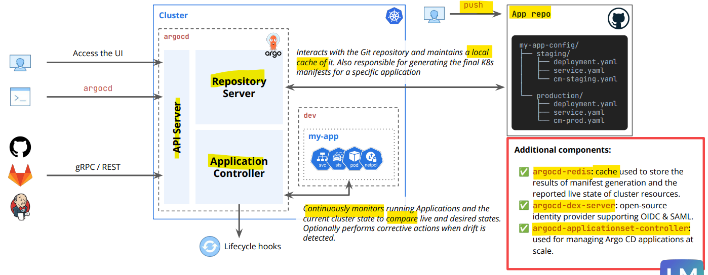
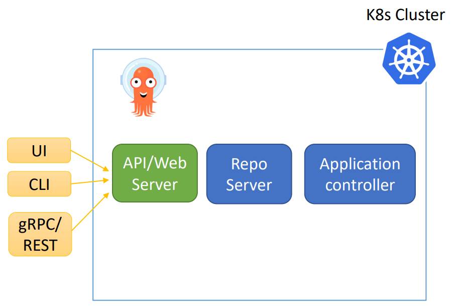
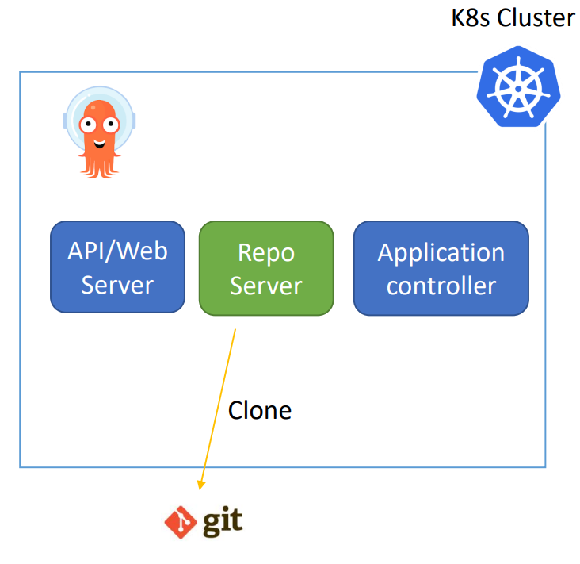
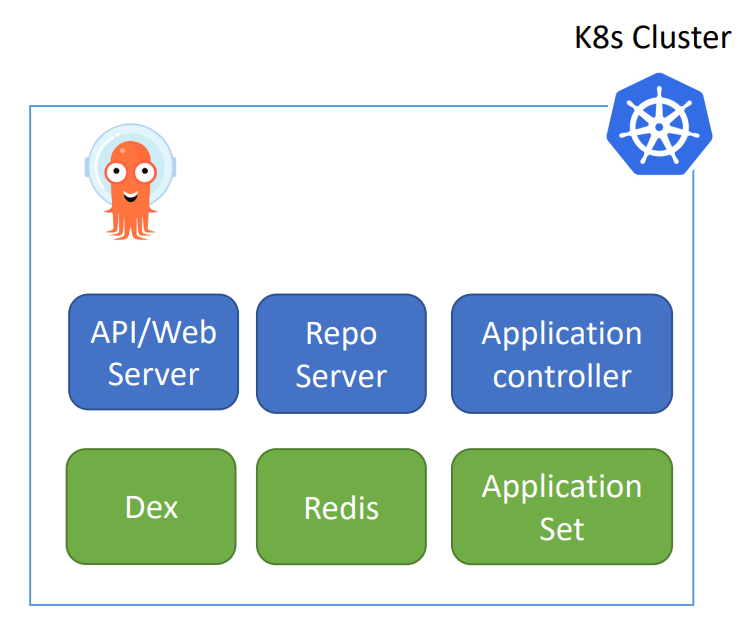

# ArgoCD - Architecture

[Back](../index.md)

- [ArgoCD - Architecture](#argocd---architecture)
  - [Architecture](#architecture)
    - [ArgoCD Server](#argocd-server)
    - [Repo Server](#repo-server)
    - [Application controller](#application-controller)
    - [Additional Components](#additional-components)

---

## Architecture

3 main components:

- ArgoCD Server (API + Web Server).
- ArgoCD Repo Server.
- ArgoCD Application Controller.

---

### ArgoCD Server

- Its a gRPC/REST server which **exposes the API** consumed by the **Web UI, CLI**.
  - Application management (Create, Update, Delete).
  - Application operations (ex: Sync, Rollback)
  - Repos and clusters management.
  - Authentication.

---

### Repo Server

- `Repo Server`
  - acts as the bridge between `Git repositories` and `Kubernetes`.
  - roles:
    - **Clones** and keeps Git repositories **up-to-date**.
    - **generates** Kubernetes manifests (via Helm, Kustomize, etc.),
    - and **caches** them

---

### Application controller

- `Application controller`
  - a Kubernetes controller which **continuously monitors** running applications and **compares** the current, live state against the desired target state.

- Roles:
  - Communicate with `Repo server` to get the generated manifests.
  - Communicate with `k8s API` to get actual cluster state.
  - **Deploy** apps manifests to destination clusters.
  - **Detects** OutofSync Apps and take corrective actions “If needed”.
  - Invoking **user-defined hooks** for lifecycle events (PreSync, Sync, PostSync).

- How it Works:
  - **Observes**:
    - It looks at the `Argo CD Application CRD` and the target cluster.
  - **Compares**:
    - It **fetches the desired manifests** from the repo server and **compares** them to the `actual state`.
  - **Acts**:
    - It **updates** the Application status and **synchronizes** the cluster if enabled.

---

### Additional Components

- `Redis`: used for caching.
- `Dex`: **identity service** to integrate with **external identity providers**.
- `ApplicationSet Controller`: It automates the **generation of Argo CD Applications**

---
